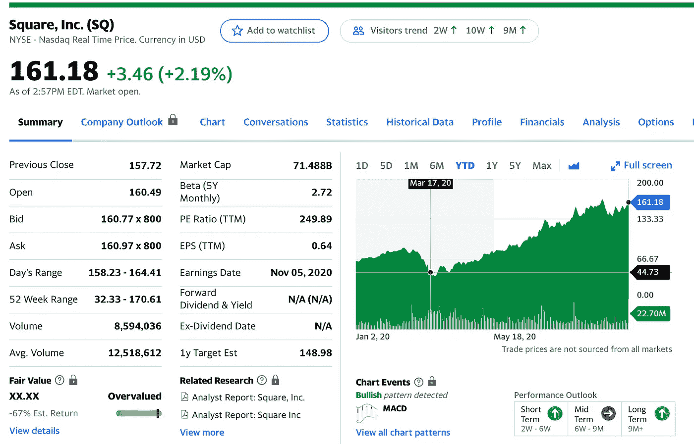
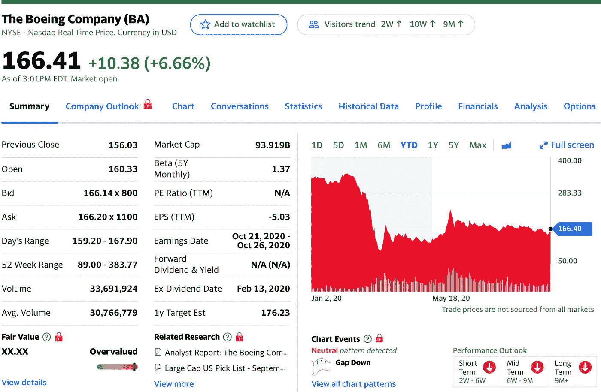
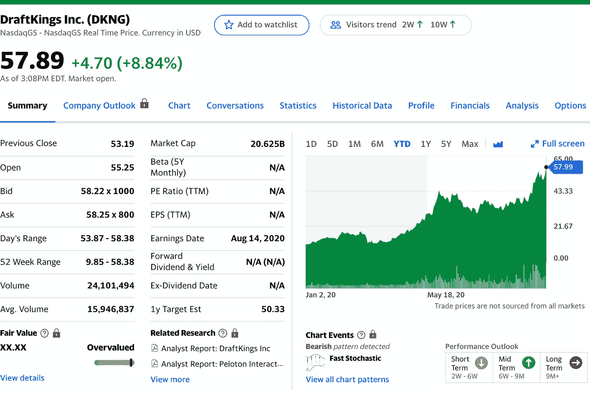
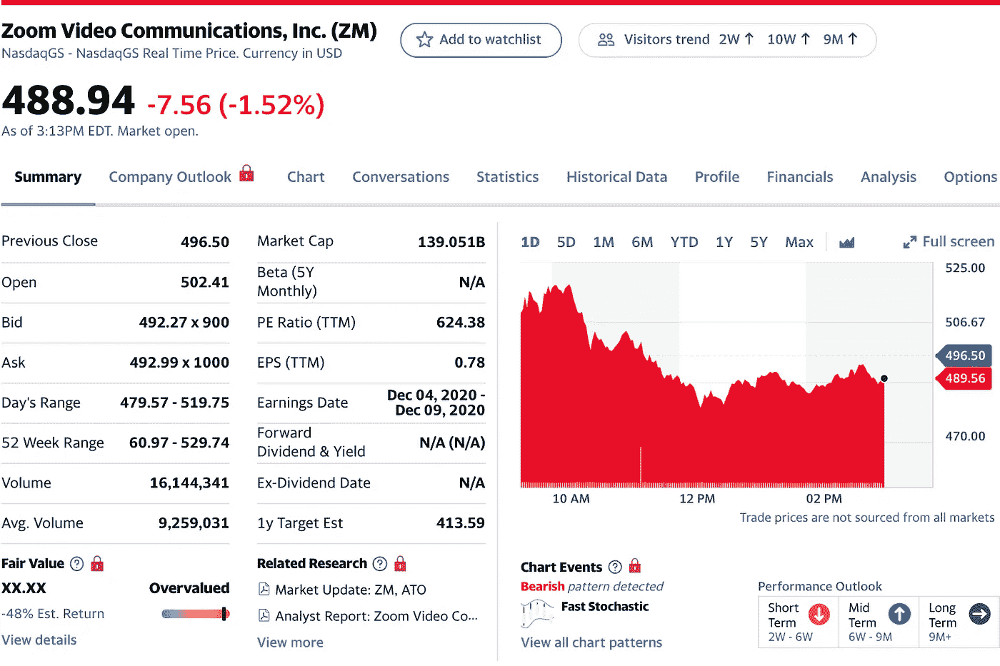
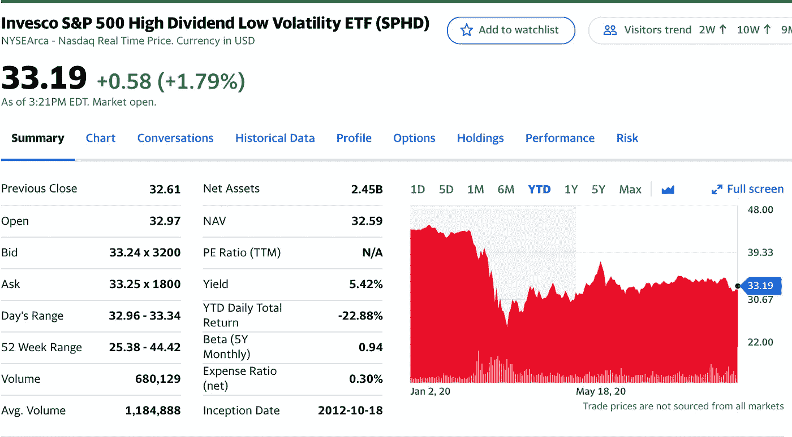

# 2020 年 10 月前 5 只股票

> 原文：<https://medium.datadriveninvestor.com/top-5-stocks-for-october-2020-3c489e5b1ae2?source=collection_archive---------4----------------------->

## 以下是我在 10 月份投资和交易时需要关注的五只股票

Photo by [Miguel Á. Padriñán](https://www.pexels.com/@padrinan?utm_content=attributionCopyText&utm_medium=referral&utm_source=pexels) from [Pexels](https://www.pexels.com/photo/close-up-photography-of-bicycle-chain-1061138/?utm_content=attributionCopyText&utm_medium=referral&utm_source=pexels)

九月真是过山车，不是吗？

9 月 3 日的大跌让我们所有人都回到了现实。每天仍有数百例新的 COVID 病例，失业仍是一个大问题。

现在再加上年底的选举，你将面临相当大的波动。玩秋千或做空看涨/看跌期权可能会令人兴奋，但每一天都是不可预测的。

## 我九月份的五大选择

1.  特斯拉——从 442 美元降至 420 美元
2.  苹果——从 124 美元降至 114 美元
3.  亚马逊——从 3400 美元跌至 3100 美元
4.  AMD —从 84 美元降至 67 美元
5.  大型商业——从 140 美元跌到 80 美元

市场总是起起落落，只要你持有，你会从每个头寸中获利。我希望你对这个月感到兴奋！

以下是我 10 月份的前五只股票！

# 1.平方(平方美元)

Yahoo Finance

Square，Inc .是一家美国金融服务、商业服务和移动支付公司，总部位于加利福尼亚州旧金山。该公司销售软件和硬件支付产品，并已扩展到小型企业服务。([维基百科](https://en.wikipedia.org/wiki/Square,_Inc.))

> 正如 Oppenheimer 所写，新冠肺炎疫情发起了“数字商务的巨大转变，要求商家迅速采用全渠道解决方案。”
> 
> 当然，在疫情之前，零售业向电子商务发展的趋势就已经很明显了，但疫情已经将这一趋势推向了超高速。(雅虎财经)

在过去的三个月里，我一直是 Square 的粉丝，因为他们有一个奇妙的商业模式。由于世界处于疫情，电子交易变得越来越普遍，这只股票只会从这里上涨。

他们帮助支持企业的移动支付交易，从这一点来看，这将是至关重要的。我很看好 Square。

 [## 收盘，但没有雪茄-股票市场目标在停滞的 COVID 救济中创新高|数据驱动…

### 专家聊天程序:一个协作市场，在这里人们可以和能够解决他们问题的专家聊天。是……

www.datadriveninvestor.com](https://www.datadriveninvestor.com/2020/08/18/close-but-no-cigar-stock-market-targets-record-highs-amidst-stalled-covid-relief/) 

# 2.波音公司

Yahoo Finance

迄今为止，波音公司的价格低得令人难以置信，我相信没有足够多的人在谈论它。关于旅行和飞机制造，现在不是最好的时候。

但是，当旅行开始回升，我们找到了治疗 COVID 的疫苗，越来越多的人将渴望旅行。

如果你有更多的顾客想要旅行，那么航空公司对飞机的需求就会增加。

> 今年以来，波音公司的股价下跌了 50%以上，受到了 737 MAX 和因新冠肺炎疫情而减少航班的双重打击。
> 
> 自 2019 年 3 月发生两起事故以来，MAX 已经停飞，波音公司在 2020 年上半年消耗了近 100 亿美元的现金，主要原因是与该飞机有关的费用。(《杂色傻瓜》)

如果你有资本，就买一些波音，你不会长期后悔的。

# 3.绘图仪(丹麦克朗)

Yahoo Finance

随着足球的回归，体育博彩正以前所未有的速度增长。人们一直渴望足球回来，现在他们有了足球，他们可以享受一些体育博彩娱乐。

NFL 赛季已经开始，似乎他们已经控制了 COVID 的传播。除非有突破性的消息说几个球员得了这种病，否则我不认为 Draftkings 会很快放缓牛市。

他们可能会长期持有或持有到足球赛季结束。迈克尔乔丹加入董事会和 ESPN 拿起 Draftkings 是不可思议的帮助，推动这一新的 2020 年股票。

> 我并不认为这家公司注定会成为下一个亚马逊——因为显然我不这么认为——但我确实相信它有巨大的潜力。坦率地说，随着时间的推移，我更有可能增加 DKNG 的股份，而不是卖掉我最初的 150 股。
> 
> 无论如何，DraftKings 就是赌博。我要找点乐子，享受旅程！([求阿尔法](https://seekingalpha.com/article/4376625-draftkings-winning-bet-and-maybe-funs-just-starting)

# 4.缩放(ZM)

Yahoo Finance

Zoom 经历了股票的过山车。它的波动性令人难以置信，但最终它非常有利可图，并继续以其反弹给我们带来惊喜。

世界各地的人们都在利用这种视频聊天服务来工作、学习以及与生活中的人交流。这种视频服务有很大的潜力，甚至可以比现在更上一层楼。

如果你在 Zoom，你可以获得一些不错的利润，或者坚持下去，看看会发生什么。对这家公司的需求以及将它融入学校教育和工作可能永远不会被取消。太方便了，现在大家都知道了。

> 虽然 Zoom 今天的股价上涨与公司的具体消息没有任何关系，但投资者对这家公司持乐观态度并没有错。
> 
> Zoom 的收入增长了 355%，在接下来的 12 个月中贡献超过 10 万美元的客户数量在第二季度跃升了 112%(8 月 31 日报道)。疫情看不到尽头，Zoom 的业务可能会继续增长。([杂色傻子](https://www.fool.com/investing/2020/09/25/why-zoom-video-stock-jumped-today/))

# 5.宝能标准普尔 500 高股息低波动 ETF(SPHD)

Yahoo Finance

如果你想挑选一只股息收益率高达 5.66%的股票，那么$SPHD 可能正是你想要的。每股的价格并不疯狂，但是随着时间的推移，拥有一堆这样的股票会让你受益匪浅。

这是一只 ETF，在未来有小幅稳定增长的空间，并以健康和持续的股息支付善待许多投资者。

随着时间的推移，拿起一些$SPHD，你不会失望。毕竟是低波动。如果你想控制血压，我会在 SPHD 持有至少价值 2000 美元的股票，并长期持有。

> 由于专注于高收益率，SPHD 似乎很有可能从美联储当前较低的长期利率环境中受益。ETF 是一种价值型、收益型和低波动性的投资品种，这三种投资风格最近已经失宠于市场。
> 
> 然而，这种情况可能即将改变。最近的股市调整已导致成长股和动量股的轮动，如果这种情况持续下去，人们对 SPHD 投资的那种成本较低、收益率较高的股票的情绪可能会有所改善。([求阿尔法](https://seekingalpha.com/article/4376422-sphd-be-time-to-rotate-low-volatility-high-yield-stocks-this-etf)

# 最后

我希望我的五大精选股票能让你对 10 月份感到兴奋！这可能是一个可怕的投资时期，如果你想消除失去所有钱的恐惧，就长期持有。

一切都会好的，如果你坚持很多年，你会很好的。我祝你在市场上一切顺利！记住，这不是赌场！计算你的风险，控制你的情绪，进行逻辑思考(如果可以的话)。

你的朋友，

约旦

如果你还没有看到我的其他五大股票帖子，我已经把它们链接在下面了！投资者和交易者们，请小心！

 [## 2020 年 6 月前五大股票

### 长期持有，我相信的公司。

medium.com](https://medium.com/datadriveninvestor/my-top-5-robinhood-stocks-june-2020-f4f9beca28f4)  [## 2020 年 7 月热门股票

### 值得关注的五大股票。

medium.com](https://medium.com/datadriveninvestor/hot-stocks-for-july-2020-a66c741f6c66)  [## 2020 年 8 月热门股票

### 5 要密切关注

medium.com](https://medium.com/datadriveninvestor/hot-stocks-for-august-2020-c0616292ed36)  [## 2020 年 9 月的热门股票

### 投资者应该密切关注这些股票

medium.com](https://medium.com/datadriveninvestor/top-stocks-for-september-2020-8ed187c864f6) 

## 获得专家观点— [订阅 DDI 英特尔](https://datadriveninvestor.com/ddi-intel)