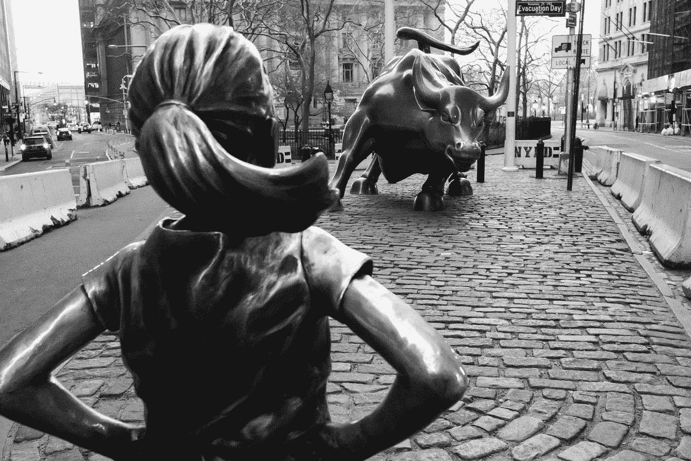

# 改善市场策略的五大交易书籍

> 原文：<https://medium.datadriveninvestor.com/top-5-trading-books-to-improve-market-strategies-76c318d90482?source=collection_archive---------7----------------------->

## 市场心理学书籍可以改善你的交易策略

Photo by [Lloyd Blunk](https://unsplash.com/@blunkorama?utm_source=medium&utm_medium=referral) on [Unsplash](https://unsplash.com?utm_source=medium&utm_medium=referral)

交易是关于心理的，也是关于制定一个可靠的策略的。如果没有坚持计划的精神毅力，世界上最伟大的战略也不会给你带来任何好处。成功的交易者不仅发展和掌握了一种策略，而且他们更熟悉自己的心理素质(如纪律和耐心)并加以发展，这使他们能够更有效地实施自己的策略。

各种各样的书可以帮助交易者从投资角度理解心理学。

# 1.区内贸易

马克·道格拉斯写的，这是任何努力在市场中获得一致性的人的必读之作。作者提供了克服许多交易问题的路线图。

这本书包括解决个人偏好，以探索捷径，容易被恐惧或贪婪控制，并得到分心。这些品质经常导致交易者不理性的行为，即使他们知道的更多。这本书用简单的语言解释了这些问题发生的原因和方式，以及如何处理它们以防止它们发生。

如果你想学习交易心理学，在阅读这本书之前，你应该开始理解交易实践、技术和术语，这样你就能完全理解书中的主题。

# 2.市场奇才

这可能是有史以来最受欢迎的交易书籍，许多成功的交易者推荐阅读。它包含了对一些世界上最成功的交易者的采访，他们在采访中分享了他们的经验——通常是从很少的资本中获得极大的利润。同样的交易者也分享他们的心态，目标，他们第一次开始时面临的斗争，这对每个有抱负的交易者都是一个鼓舞人心的读物。

杰克·施瓦格整理了两本非常受欢迎的交易书籍:“市场奇才”和“新市场奇才”这两本书都包含了对过去半个世纪中一些最成功的交易者的采访，比如都铎投资公司的亿万富翁创始人保罗·都铎·琼斯。

# 3.聪明的投资者

本杰明·格拉哈姆的《聪明的投资者》被认为是价值投资的经典文本，价值投资仍然是最受欢迎的基本投资策略之一，也是自格雷厄姆的书于 1949 年首次出版以来发展起来的数百种投资策略的基本原则。

这本书被著名投资家沃伦·巴菲特宣传为有史以来关于投资主题的最佳书籍，也是他自己学习股票交易的主要来源之一。在书中，格雷厄姆提出了他的核心投资哲学，即识别投资的基本价值，然后以低于该价值的价格买入。

# 4.摇摆:非理性行为不可抗拒的吸引力

由奥里和罗·布拉夫曼共同创作的《摇摆》是非小说体裁中少有的引人入胜的作品。

在这本书里，作者解决了许多交易者意识到却无力阻止的问题。它们包括为什么从亏损的交易中脱身如此之难——甚至调查人们为什么保持个人关系，把它与交易的尝试联系起来。

这本书探讨了交易者通常没有意识到的问题。作者研究了危险和风险如何影响决策过程以及它们在面对金融市场风险时的相关性。

该材料还阐述了一些概念，如诊断偏差——尽管有相反的证据，但无法超越最初的假设；以及变色龙效应——一个人习惯于接受赋予他们的品质。所有这些心理变化都会对交易者产生重大影响。

本书中的研究和轶事也可以教会读者关于驱动决策的隐藏动机，这反过来可以帮助他们作为交易者做出更明智的决定。

# 5.一个股票经纪人的回忆

即使是名著也能保持几代人的相关性。埃德温·勒夫尔的这本书于 1923 年首次出版，是根据传奇交易者杰西·利弗莫尔的作品改编的。结合丰富的故事讲述和对成功交易的深刻见解(以及可以毁掉交易者的行为)，这些材料可以反复阅读，每次当你熟悉这些主题时，都会提供新的或不同的见解。

如果你是一个经验丰富的交易者，已经看到了积极的结果，交易不好，或者刚刚开始你的交易之旅，这本书有你想要的。在这本书里，你将跟随一个终生交易者的交易生涯，他的经历可能就是你需要的洞察力，帮助你度过你正在面临的，或者还没有遇到的挣扎。

# 参考资料:

 [## 每个交易者必读的 6 本市场心理学书籍

### 马克·道格拉斯写的，这是任何努力在市场中获得一致性的人的必读之作。的…

www.thebalance.com](https://www.thebalance.com/essential-trading-psychology-books-1031445)  [## 有史以来十大交易书籍|学会交易

### 做交易者需要不断的学习和提高。跟上市场、趋势和…是很重要的

www.learntotrade.com.au](https://www.learntotrade.com.au/blog/news/top-10-trading-books-of-all-time/)  [## 初露头角的职业交易者的 5 本书

### 许多人想学习如何成为成功的交易者，无论是通过股票，商品，期权，外汇…

www.investopedia.com](https://www.investopedia.com/articles/personal-finance/090216/top-5-books-become-professional-trader.asp)