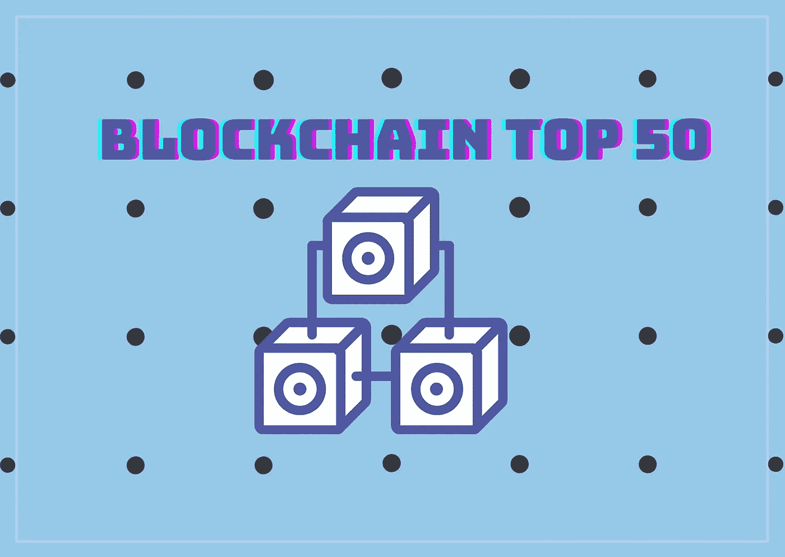
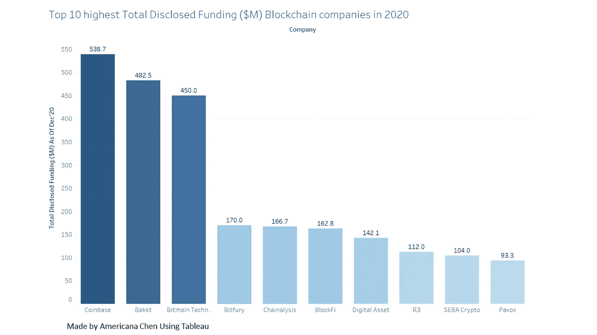
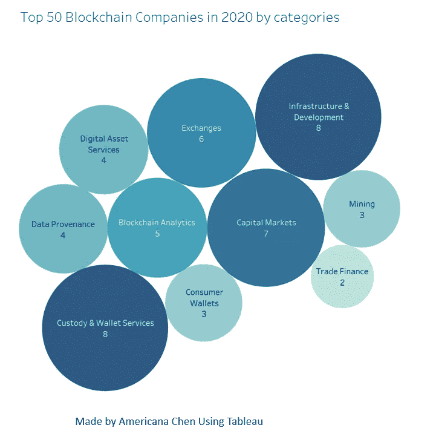
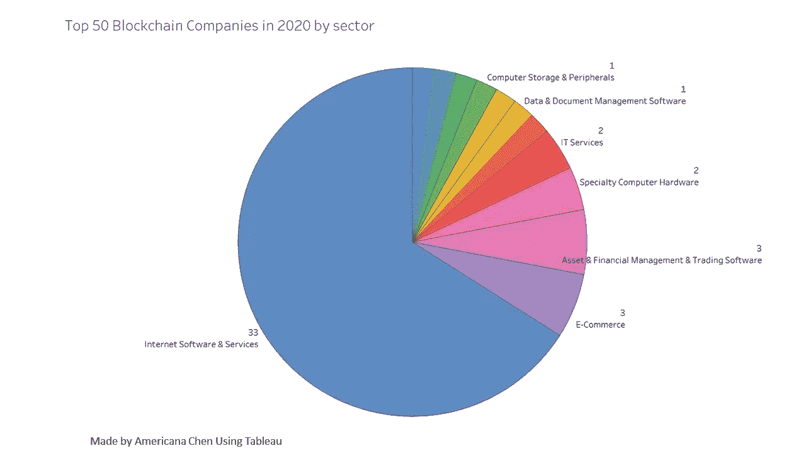
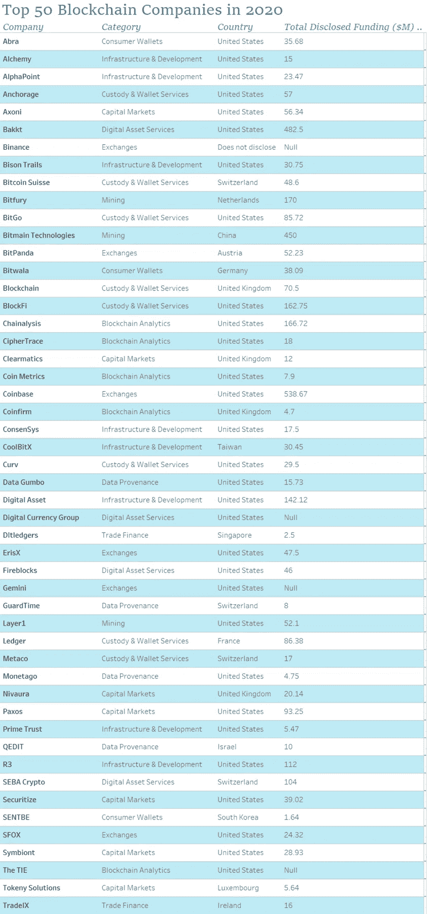

# 2020 年区块链公司 50 强

> 原文：<https://medium.datadriveninvestor.com/top-50-blockchain-companies-in-2020-86953ec85bca?source=collection_archive---------10----------------------->

2020 年 50 强区块链公司的可视化之旅

Image created by Americana Chen using Canva

B 锁链技术在 2020 年快速增长，全球区块链技术市场的规模从 2018 年的 12 亿美元扩大到 2020 年的**30 亿美元**。预计**年复合增长率(CAGR)将达到 67.3%，2025 年**将飙升至**397 亿美元**，开启技术创新的全新时代。

尽管人们一直怀疑这项技术是否真的值得投资，但各行各业的许多领先企业都在探索区块链技术的创新应用，以利用其关键优势——安全性、透明度和效率。**医疗保健行业、金融行业和电信行业的区块链用例**为当前的痛点提供了有效的解决方案，其价值正在被有影响力的从业者和商业领袖所认可。

商业分析平台 CB Insights 和全球数据库最近发布了一份关于使用区块链和 Cryto 技术转变行业的前 50 名创新者的报告[。该报告对推动区块链应用可能带来的行业智慧革命的前 50 家企业进行了排名。根据 CB Insights，该排名是从 2，700 家企业中选出的，基于各种指标，如**市场潜力、团队实力、投资者概况、竞争格局以及其他侧重于全面评估这些公司长期健康和潜力的衡量标准。**该排名涵盖了广阔的领域，包括探索用例的企业，如**支付、汇款、资产来源、合规性**等等。在这篇文章中，我将带你进入这些创新者和冒险家的世界。](https://www.cbinsights.com/research/report/blockchain-technology-companies/?utm_source=CB+Insights+Newsletter&utm_campaign=20a7a4296f-newsletter_general_Wed_20201216&utm_medium=email&utm_term=0_9dc0513989-20a7a4296f-94947346)

Top 10 blockchain companies with highest Total Disclosed Funding in 2020 (Image made by Americana Chen using Tableau)

在排名前 50 位的区块链公司中，资金最多的前十家公司截至 2020 年 12 月共筹集了**24.22 亿美元**的资金，而其他 40 家公司的资金总额为 10.65 亿美元。这意味着**前 10 家公司贡献了前 50 家公司总资金的 70%，**T21，仅**比特币基地就占了**美元中的 5.387 亿美元，与该领域的其他参与者相比，这是一个很大的数目。****

Category landscape (Image made by Americana Chen using Tableau)

就类别而言，竞争环境相当**均匀地分布在**各有不同侧重点的企业中。**钱包服务和交易**保持强劲，因为我们看到更多的金融服务提供商试图适应当前**金融科技**的趋势，挑战传统的大型现有银行。**基础设施和开发**也以 8 家公司的成绩领先于同类公司，其次是**资本市场**的 7 家公司。令人惊讶的是，**消费者钱包只拿走了馅饼**的 3/50，这进一步强调了我们应该以新的视角和新的观点来欣赏**区块链技术在加密货币和比特币世界之外的应用。**

Sector landscape (Image made by Americana Chen using Tableau)

扇形切片显示了与前一个强烈的对比。50 家公司中有 33 家，超过了 60%的公司在互联网软件和服务行业发展迅速，而其他行业最多只能派出 3 名候选人。互联网软件服务领域的主导地位展示了区块链在其“本土环境”中的巨大潜力。这在很大程度上是由于**人们对互联网证券**的认识和需求不断上升。互联网和软件用户越来越警惕在线用户信息泄露、数据和身份盗窃的危险，以及许多公司出售用户数据以获利的事实。

 [## 面向开发者的区块链；API 提供商的重要性|数据驱动的投资者

### 在过去的几年里，区块链突然成为这个领域最热门的新技术。每一个…

www.datadriveninvestor.com](https://www.datadriveninvestor.com/2020/11/25/blockchain-for-developers-the-importance-of-api-providers/) 

虽然公众仍在质疑区块链技术本身的安全问题，但区块链实际增强网络安全的**能力往往被忽视**。网络攻击变得越来越普遍和令人担忧，这为区块链技术释放其最大潜力提供了一个完美的舞台。**作为一种分散式分类账技术，其不变性特征使其能够检测到对已发生的交易进行更改和修改的任何企图，交易的来源总是可以追踪和追溯的。其数据加密技术还确保匿名性，并为用户身份提供更好的安全性。**

> 该技术提供了一种以安全、透明、高度抗中断、可审计和高效的方式记录交易或任何数字交互的方法
> 
> —德勤美国公司董事总经理 David Schatsky

下表包含按字母顺序列出的用于上述可视化的原始数据，CB Insight 的原始报告可在此处访问:“[区块链 50:使用区块链&加密技术改造行业的创新者](https://www.cbinsights.com/research/report/blockchain-technology-companies/?utm_source=CB+Insights+Newsletter&utm_campaign=20a7a4296f-newsletter_general_Wed_20201216&utm_medium=email&utm_term=0_9dc0513989-20a7a4296f-94947346)”

Raw data table ( data source: CB Insight, table made by Americana Chen)

随着我们看到更快的业务采用率，一个**正增长周期**可能会在未来几年出现。**区块链应用范围在更多行业**的扩大，如汽车、农业、交通和物流**将增加**投资者的信心，这将刺激更多**资金**支持此类创新，给予企业更多财务能力进行**进一步投资研发& D** 以推动技术进步。

在得出乐观前景的结论之前，不应忽视治理和监管的重要性。需要实施的法规仍存在不确定性，最具挑战性的部分是**政策需要针对不同部门的具体应用**，同时**政府仍不确定这些政策的有效性**。在区块链应用能够像互联网那样传播到每个商业领域之前，还有很长的路要走。企业不应该仅仅为了使用区块链而使用它，而是应该确定采用它的**可行性、适用性和盈利能力**，与使用传统数据库或交易系统相比。

在每一代人中，都会有突破性的技术慢慢扩散到每个行业、公共部门和我们的日常生活中。现在我们需要问自己的问题是:**区块链会是下一个技术吗？**

# 关注我/连接到:

领英:[美国陈](https://www.linkedin.com/in/americana-chen-94432219a/)

insta gram:[@ africccana](https://www.instagram.com/africcccana/)

美国陈

# 参考资料:

1.  “区块链和网络安全。”*德勤*，2017。
2.  CB Insights"区块链 50:利用区块链和加密技术改变行业的创新者." *CB Insights Research* ，CB Insights，2020 年 12 月 15 日，[www . CB Insights . com/Research/report/区块链-技术-公司/？utm_source=CB](http://www.cbinsights.com/research/report/blockchain-technology-companies/?utm_source=CB) 洞察简讯&UTM _ campaign = 20 a7a 4296 f-Newsletter _ general _ Wed _ 2020 12 16&UTM _ medium = email&UTM _ term = 0 _ 9dc 0513989–20 a7a 4296 f-94947346。

## 获得专家观点— [订阅 DDI 英特尔](https://datadriveninvestor.com/ddi-intel)