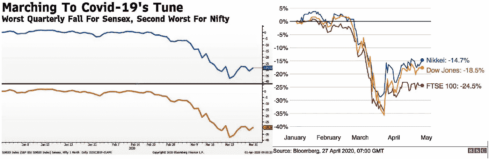
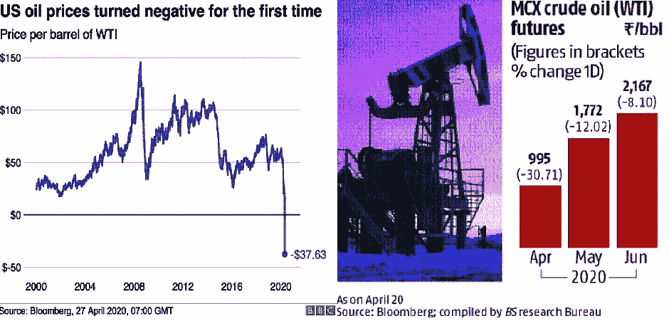
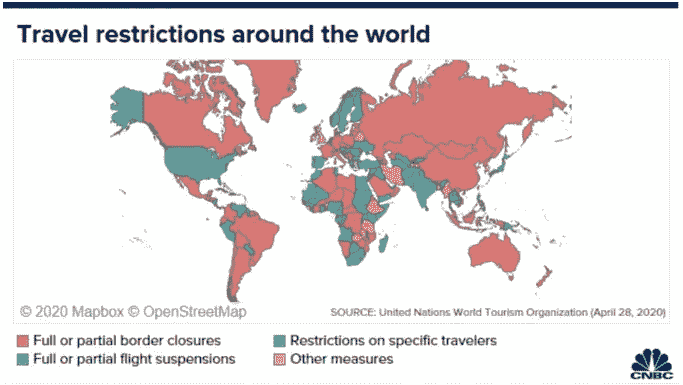

# 受新冠肺炎疫情影响最大的 6 个行业|第 1 部分

> 原文：<https://medium.datadriveninvestor.com/top-6-sectors-affected-due-to-covid-19-outbreak-part-1-1bdb9413fe1d?source=collection_archive---------9----------------------->

这是大衰退，也就是 2008 年的金融危机，我们 90 后的孩子再次目睹了一场类似的衰退危机。世界上的每一个人都知道一种独特的新出现的病毒是如何对人体的每一部分造成疾病的。现在不是指责任何经济体的时候，而是如何在这一新的挑战中生存下来的时候。

在我们的第一篇文章中，我们将谈论印度乃至全球受影响最大的三个行业。

> 每个经济体都有三个问题需要回答，这三个问题反映了其经济体系的实力，即生产什么、如何生产以及谁获得生产的产出。我们在 20 多岁时的经济课上学到了这一点:)要回答这个问题，当今世界的优势在于家庭隔离、及早向目标个人提供疫苗、社会距离、减少道德和对 [*医疗保健*](https://www.blogger.com/blog/post/edit/9149716472790565269/6713249396910834546?hl=en#) *需求的策略。如果任何经济体未能吸收这些，失败将是疫情的底线。*

**1。股票市场:**

从 2020 年 3 月开始，世界各地的每一只眼睛都见证了市场的高度波动。疫情的情况在全球投资者中传播了恐惧，担心它会破坏经济增长。

富时指数(英国)和道琼斯指数(美国)在第一季度出现了自 1987 年以来的最大季度跌幅，同时出现了不同的市场指数和股票下跌。

2020 年 3 月 23 日，印度见证了有史以来最高的单日跌幅，主要指数和股票下跌约 13%。此外，Nifty 和 Sensex 在早盘交易中下跌 10%，引发了 45 分钟的“[交易暂停](https://www.blogger.com/blog/post/edit/9149716472790565269/6713249396910834546?hl=en#)”。这是继 3 月 13 日之后，12 年来第二次停止交易。BSE Sensex 和 Nifty 50 分别经历了 1993 年 3 月 Nifty 50(下跌 19.6%)和 2001 年 BSE Sensex(下跌 15%)的最大跌幅 23%。

**2。原油行业:**

受 C-19 影响最大的行业之一，由于世界各地的封锁，对石油的需求已经枯竭。布伦特原油价格在 4 月份下跌了大约 20 美元(这是美国以外的世界上使用的价格), WTI 价格有史以来第一次转为负值。5 月到期的 WTI 期货合约在 2020 年 4 月在纽约商品交易所交易时下跌了 300%，其中 MCX 不得不以每桶 1 印度卢比结算，这表明它没有为国际市场的异常波动做好准备。

价格为负，因为没有消费和储存能力来储存石油。越来越多的市场参与者不愿意冒险进行实物交割，石油交易商认为原油价格将在未来反弹，这被称为期货溢价市场。因此，现货价格比期货价格有很大的折扣。

一个简短的例子——现在发达国家和发展中国家预测任何新病毒袭击未来没有区别——你明白吗？市场是情绪化的，消费者引领新的趋势，不确定性一直存在。

**3。旅游行业:**

为了限制 C-19 的传播，各国从暂停航班到关闭边境都采取了严格的限制措施。在 [UNWTO](https://www.blogger.com/blog/post/edit/9149716472790565269/6713249396910834546?hl=en#) 的报告中，各国施加的限制分为四大类，总共有 217 个国家被报告为

*97 个国家实施全部或部分边境关闭
65 个国家暂停全部或部分航班
39 个国家对特定目的地群体实施边境关闭
16 个国家实施其他措施*

在这种情况下，像马尔代夫这样以旅游业为经济支柱的国家将受到最大的影响。据世界银行预测，马尔代夫的国内生产总值将在 2020 年下降 8.5%至 13.5%。此外，财政部长称，预计总赤字约为 7.782 亿美元。2020 年 1 月，马尔代夫的总债务超过 33.6 亿美元，这将与收入赤字、失业等其他损失一起，给经济增加经济负担。今年 1 月至 3 月，赴马尔代夫的旅游预订取消了约 16.17 万次。

 [## 使用谷歌搜索趋势预测首次申请失业救济人数|数据驱动的投资者

### 几年来，我的重点一直是使用多种替代数据来预测宏观经济统计数据…

www.datadriveninvestor.com](https://www.datadriveninvestor.com/2020/03/25/using-google-search-trends-to-predict-initial-jobless-claims/) 

去年在印度，外国游客总数为 1090 万，外汇收入约为 210，971 亿卢比。但由于印度从 2020 年 3 月开始实行旅游限制和封锁，旅游业预计将受到严重的负面影响。

[FAITH(印度)](https://www.blogger.com/blog/post/edit/9149716472790565269/6713249396910834546?hl=en#)2020 年 5 月，与政府分享了约 100 万卢比的旅游业经济价值风险损失指南。为了印度旅游业和酒店业的生存。

**最后一行~**

没有使用机枪，我们看到主要部门的衰落。在我们接下来的文章中，我们将带来另外三个领域以及对我们生活的积极影响。关注我们，让我们知道你是否热衷于阅读这样的总结文章。

保持优雅！

本博客缩短了详细的主题以帮助读者，并且不发表任何意见。

*原载于 2020 年 6 月 10 日*[*【http://summarized4u.blogspot.com】*](http://summarized4u.blogspot.com/2020/04/finance-in-medicare-sector-digital-health-merger-acquisition-in-healthcare.html)*。*

**访问专家视图—** [**订阅 DDI 英特尔**](https://datadriveninvestor.com/ddi-intel)