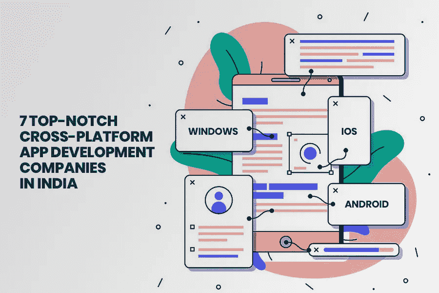

# 全球 7 大跨平台应用开发公司-2021 年更新调查

> 原文：<https://medium.datadriveninvestor.com/top-7-cross-platform-app-development-companies-in-all-across-the-globe-updated-survey-2021-5e0e73f9dda5?source=collection_archive---------16----------------------->

在当今数字化时代，为单一平台开发应用程序不再是一个有价值的决定。十年前，企业家必须决定他们的产品需要推出哪种移动操作系统。随着 Android 和 iOS 占据移动应用总市场份额的 98%；企业不能忽视这一事实。

现在问题依然存在——哪个平台是启动您的应用程序的最佳选择，可以帮助您拓展广阔的市场？

***这个问题的简单答案就是去配一个跨平台的 app 开发方案！***

选择跨平台应用程序的最大好处是，它允许用一个应用程序代码库覆盖多个操作平台。通过使用相同的代码库，一个 [**移动应用开发者**](https://www.appsted.com/hire-mobile-app-developers/) 可以定制各种应用，而不必雇佣另一个开发团队。关于跨平台框架，你需要知道的另一件事是，它允许为从初创公司到大公司的各种业务创建应用程序。

***然而，现在的问题是如何选择正确的跨平台框架来构建您的数字产品？***

在成千上万个 [**手机 app 开发公司**](https://www.appsted.com/services/mobile-app-development/) 的可用性下，在没有正确知识的情况下选择一个最好的就像在黑暗中射击一颗子弹。

因此，作为一名 13 年以上的 IT 顾问，并与一家领先的软件开发公司合作，我们了解市场不断变化的需求，并已成为 7 家顶尖的跨平台应用程序开发公司。

通过考虑详细的市场调查，我们列出了表现最佳的应用程序开发公司。每家公司都用下面提到的参数进行了深入评估:

*   *多元化的公司简介*
*   *项目的质量和成本*
*   *100%退款保证*
*   *项目满意度和客户反馈*
*   *在 Clutch、Goodfirms 等领先平台上对公司进行评级和评论*
*   *遵循保密协议，确保应用安全*
*   *领先框架、技术和工具的专业技能和知识*
*   *按时交付项目的投资组合和跟踪记录*

**也可阅读:** [**面向移动开发者的顶级跨平台 APP 开发框架**](http://www.appsted.com/blog/top-cross-platform-app-development-frameworks-for-mobile-developers/)

因此，现在你有了一个基本参数列表，可以继续列出 2021 年顶级跨平台应用开发公司:

1.  ****(领先且经过认证的跨平台应用开发公司)****

****成立于:2001 年****

****地点:美国****

****员工人数:200- 250+****

****每小时定价:15-25 美元/小时****

****评分:4.7****

****服务:** [**跨平台 app 开发**](https://www.appsted.com/services/cross-platform-app-development/) **解决方案，定制手机 app，原生 app 开发，Android App 开发，iPhone/iOS app 开发解决方案等等。****

**Appsted 是一家著名的跨平台移动应用开发公司，总部位于美国，致力于为各种类型的公司提供广泛的软件开发解决方案选择，从进步的 bootstrappers 到领先的行业品牌。Appsted 植根于移动应用程序开发服务，已经建立了一个由 250 多名程序员、编码人员、设计人员和开发人员组成的强大团队，在开发过程中利用成熟的方法和最新技术。**

**凭借 10 多年的运营经验，他们构建跨平台解决方案的能力超出了客户的预期和开发挑战。Appsted 致力于提供卓越的产品质量，并向 50 多个国家提供 5000 多种解决方案，已成为美国雇佣跨平台移动应用程序开发人员的知名平台。**

** [## 隐私指南，关于应用开发|数据驱动投资者

### 挪威隐私机构 DPA 对当地的一个现实处以 20 万欧元的罚款，原因是…

www.datadriveninvestor.com](https://www.datadriveninvestor.com/2020/04/29/privacy-guidelines-about-app-development/) 

2.[**Stfalcon**](https://stfalcon.com/)**(知名移动 App 开发公司聘请跨平台 App 开发者)**

**成立于:2009 年**

**地点:美国**

**员工人数:50–100+**

**每小时定价:30-50 美元/小时**

**评分:4.9**

**服务:跨平台应用开发解决方案、移动应用开发、定制应用开发解决方案等。**

Stfalcon 是一家软件开发公司，致力于为物流、旅游、医疗保健和电子商务等垂直行业提供创新、强大、可扩展的应用开发解决方案。通过利用业界最佳的跨平台应用开发框架，包括 Flutter、React Native、Ionic、Xamarin 等，他们可以定制能够完美满足您业务需求的应用。

他们的目标是实现 100%的客户满意度，他们遵循标准的沟通流程来保持与客户的项目透明度，并遵循保密协议来为他们的团队保守您的应用程序想法的秘密。

3. [**OpenXcell**](https://www.openxcell.com/) **(顶尖平台聘请跨平台 App 开发者)**

**成立于:2009 年**

**地点:美国、印度**

**员工人数:250–999+**

**每小时定价:25-50 美元/小时**

**评分:4.9**

**服务:跨平台应用开发解决方案、移动应用开发、定制应用开发解决方案等。**

作为一家 CMMI 3 级开发公司，OpenXcell 为全球 800 多家客户提供了 1000 多种解决方案，已经成为美国雇佣跨平台应用开发人员最值得信赖的平台之一。

OpenXcell 凭借其卓越的开发能力和世界级的移动应用设计和开发团队，成为应用领域最优秀的开发公司之一。凭借十年的行业经验，他们能够快速了解市场不断增长的需求，并确保您交付成功的应用战略和出色的应用设计。

4. [**隐藏的大脑**](https://www.hiddenbrains.com/) **(印度获奖软件开发公司)**

**成立于:2003 年**

**地点:美国、印度**

**员工人数:250–999+**

**每小时定价:25-50 美元/小时**

**评分:4.9**

**服务:app 开发解决方案、移动 App 开发、Web App 开发解决方案、跨平台应用开发等。**

Hidden Brains Infotech 是一家屡获殊荣的软件和移动应用程序开发公司，总部位于印度，在美国设有运营办公室。他们致力于提供从原生应用到跨平台应用开发的端到端应用开发解决方案。所有垂直行业和规模的企业都可以选择在 Hidden Brains 雇佣跨平台的应用开发者。他们由 999+的开发人员团队提供支持，可以轻松了解您的业务需求，并能够开发出一个可以为您的品牌增加竞争优势的解决方案。

在十多年的行业经验中，他们向 107 个国家的 2350 多个客户交付了 6000 多个项目，在 39 多个行业开展业务。

5.[**Ads N Url**](https://www.adsnurl.com/)**(App 开发领域公认的行业领导者)**

**成立于:2015 年**

**地点:美国、印度、英国、阿联酋**

**员工人数:150–200+**

**每小时定价:25-50 美元/小时**

**评分:4.9**

**服务:app 开发解决方案、移动 App 开发、Web App 开发解决方案、跨平台应用开发等。**

Ads n Url 是发展最快的跨平台应用程序开发公司，仅通过提供以结果为导向的解决方案就在市场上站稳了脚跟。基于 2015 年，他们已经成为跨平台应用开发公司的首选。他们的主要关注点是整合一套独特的成熟方法、技术和客户至上的方法，让他们的客户在竞争中立于不败之地。

6.****(印度知名移动应用开发公司)****

****成立于:2003 年****

****地点:印度****

****员工人数:100–150+****

****每小时定价:25-50 美元/小时****

****评分:4.5****

****服务:移动和 web 应用开发解决方案、云计算、物联网应用开发、可穿戴应用开发解决方案等。****

**Konstant Infosolutions 是一个一站式平台，用 min 雇佣跨平台移动应用开发者。5 年利用领先的跨平台应用程序开发框架的经验和专业知识。Konstant Infosolutions 的主要目标是为从初创公司到企业的所有类型的企业提供优质服务。致力于部署最新的开发方法，他们有能力在每个项目中革新和创新开发方式。**

**7. [**Spec India**](https://www.spec-india.com/) **(利用 Web 和移动开发服务的可信平台)****

****成立于:1987 年****

****地点:美国印度****

****员工人数:250–300+****

****每小时定价:25-50 美元/小时****

****评分:4.8****

****服务:定制软件开发、商业智能&分析、企业移动性、技术咨询等。****

**Spec India 是领先的 ISO/IEC 27001:2013 认证公司之一，在定制应用程序开发解决方案方面拥有 30 多年的经验和专业知识，始终牢记客户的预算和独特需求。由 300 多名技术高超、行业最佳的跨平台应用程序开发程序员提供支持，他们可以为所有级别的企业快速开发业务增长解决方案。**

****结论****

**随着这篇博客的结束，希望你已经得到了表现最好的跨平台应用程序开发公司的名单。无论你未来选择与哪家公司合作，每家公司都经过深入研究，并拥有所有资源支持，能够充分满足市场的现代应用开发需求。**

## **获得专家观点— [订阅 DDI 英特尔](https://datadriveninvestor.com/ddi-intel)****