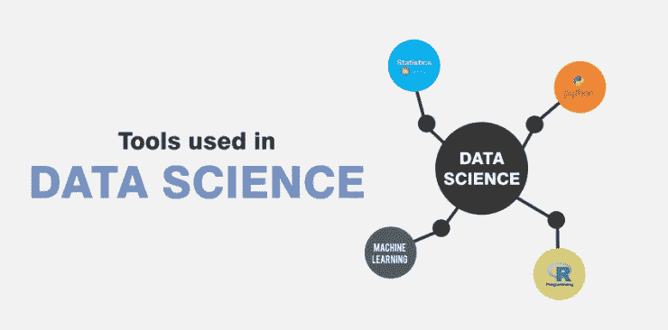
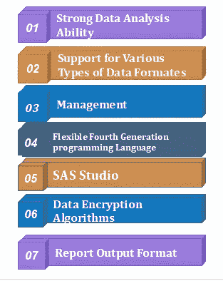
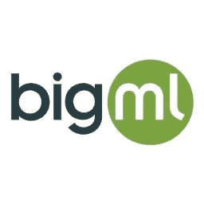
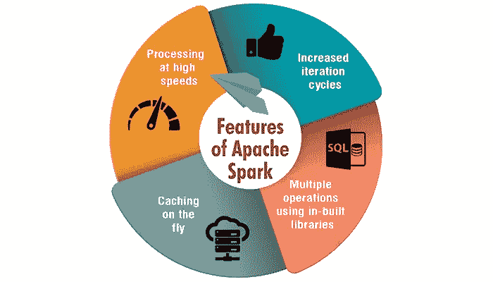

# 你必须知道的 7 大数据科学工具！

> 原文：<https://medium.datadriveninvestor.com/top-7-data-science-tools-that-you-must-know-507627c44e12?source=collection_archive---------4----------------------->

**数据科学&数据分析工具:**

说到数据科学工具，我们一般都会有疑问。**如此庞大数量的数据科学工具之间有什么区别？哪个更好？我应该学习哪一个？**

虽然这是一个普通的话题，但却意义非凡，我一直在努力寻求这个极端问题的答案。如果你去网上搜索周围有意义的主题，很难看到一个合理的观点。因为评估特定数据科学工具的评论员可能会从不同的角度出发，带有一些个人观点。

[***想成为一名数据科学家？开始学 Python 吧！***](https://techvidvan.com/tutorials/python-tutorial/)

今天，让我们抛开这些个人情绪。此外，我试图客观地与您谈论我自己对可用数据科学工具的看法，供您参考。

***我一共挑选了三种 7 件工具。接下来，我来分别介绍一下*** 。

## **1。Tableau** :

Tableau 实际上是 Excel 的数据透视表和数据透视图。人们倾向于说，Tableau 清楚地注意到了 Excel 的这些特性。它之前进入 BI 市场，并传递了这一核心价值。从发展历史和目前的市场反馈来看，Tableau 更擅长表现和可视化。我不认为这是因为它的图表有多酷，但是它的结构、颜色和用户界面给了我们一个基本的清晰的倾向。

 [## 成为数据科学家所需的 8 项技能|数据驱动型投资者

### 数字吓不倒你？没有什么比一张漂亮的 excel 表更令人满意的了？你会说几种语言…

www.datadriveninvestor.com](https://www.datadriveninvestor.com/2019/02/07/8-skills-you-need-to-become-a-data-scientist/) 

这肯定就像 Tableau 自己的宣传一样，贡献了大量的学术活力来思考人们喜欢什么样的图表，如何让用户明确参与操作和视觉。

正如 Tableau 所宣传的，他们的团队投入了大量的学术精力来研究人们喜欢什么样的图形，以及如何让用户明确参与到操作和视觉方面。

## **2。SAS** :

它是那些明确用于统计任务的数据科学工具之一。SAS 是一个封闭源代码的限制性软件，被许多组织用来分析数据。

SAS 利用基本的 SAS 编程语言来执行统计建模。它被从事可靠商业软件工作的专家和组织广泛使用。

SAS 提供了各种统计库和工具，作为数据科学家，您可以使用它们来演示和整理他们的数据。虽然 SAS 更可靠，并有组织的坚实帮助，但它非常昂贵，只是被更大的企业所利用。

Features of SAS

同样，SAS 也不能与一部分更现代的开源工具相提并论。此外，sa 中有一些库和包在基础包中是不可访问的，可能需要昂贵的升级。

## **3。Excel:**

具有各种惊人的功能，例如，表单创建、数据透视表、VBA 等等。，Excel 的框架是如此庞大，以至于没有任何分析工具可以超越它，保证人们可以根据自己的需要分析数据。

无论如何，可能有少数人认为自己有编程语言的能力，不屑于用 Excel 做工具，因为 Excel 处理不了大数据。但是，想想看，我们日常生活中使用的数据是否超越了大数据的极限？正如我所想，Excel 是一个多才多艺的球员。它最适合小数据，通过模块，它可以处理数百万的数据。

综上所述，鉴于 Excel 的惊人特性及其用户规模，我的看法是它是一个至关重要的工具。如果需要学习数据分析，Excel 是最好的选择。

## **4。BIGML** :

BigML，是另一个普遍使用的数据科学工具。它提供了一个完全可交互的、基于云的 GUI 环境，您可以使用它来处理机器学习算法。

BigML 利用云计算为行业需求提供制度化的软件。通过它，公司可以在公司的不同部门交叉使用机器学习算法。例如，它可以利用这一软件进行销售预测、风险分析和产品开发。

BigML 在预测建模方面有实践经验。它利用各种各样的机器学习算法，如聚类、分类、时间序列预测等。

## **5。Matlab** :

MATLAB 是一个用于处理科学数据的多范例数值注册环境。它是一个闭源软件，鼓励矩阵函数、算法实现和数据的统计建模。MATLAB 在几个科学学科中得到最广泛的应用。

在数据科学中，MATLAB 用于再现神经网络和模糊逻辑。利用 MATLAB 图形库，您可以进行强大的可视化。

MATLAB 同样用于图像和信号处理。这使得它成为数据科学家的一个适应性极强的工具，因为他们可以处理每一个问题，从数据清理和分析到进一步开发的深度学习算法。

## **6。阿帕奇火花**:

Apache Spark 或简称 Spark 是一个强大的分析引擎，也是使用率最高的数据科学工具。Spark 显然是用来处理批处理和流处理的。

[***下一代数据科学工具—“Apache Spark”***](https://techvidvan.com/tutorials/spark-tutorial/)

Features of Apache Spark

它伴随着许多 API，方便数据科学家重复访问数据以进行机器学习、存储在 SQL 中等等。这是对 Hadoop 的改进，执行速度比 MapReduce 快好几倍。Spark 附带了许多机器学习 API，可以帮助数据科学家利用给定的数据进行强大的预测。

## **7。朱庇特:**

Project Jupyter 是一个依赖于 IPython 的开源工具，用于帮助程序员制作开源软件，并遇到了交互式计算。

Jupyter 是许多语言的基础，如 Julia、Python 和 r。它是一个用于编写实时代码、表示和可视化的 web 应用程序工具。Jupyter 是一款非常著名的工具，旨在满足数据科学的需求。

这是一个棘手的环境，通过这个环境，数据科学家可以发挥他们的全部职责。此外，它还是叙述的有用资产，因为它提供了不同的演示功能。利用 Jupyter 笔记本电脑，人们可以执行数据清理，实际计算，可视化和预测 ML 模型。

## **尾注**:

数据科学需要大量的工具。数据科学的工具用于分析数据、数据清理、制作时尚的交互式可视化以及利用 ML 算法制作突破性的预测模型。

很大一部分数据科学工具在一个地方传达复杂的数据科学任务。这使得用户更容易实现数据科学的功能，而无需从头开始编写代码。此外，有一些不同的工具满足了数据科学的应用领域。