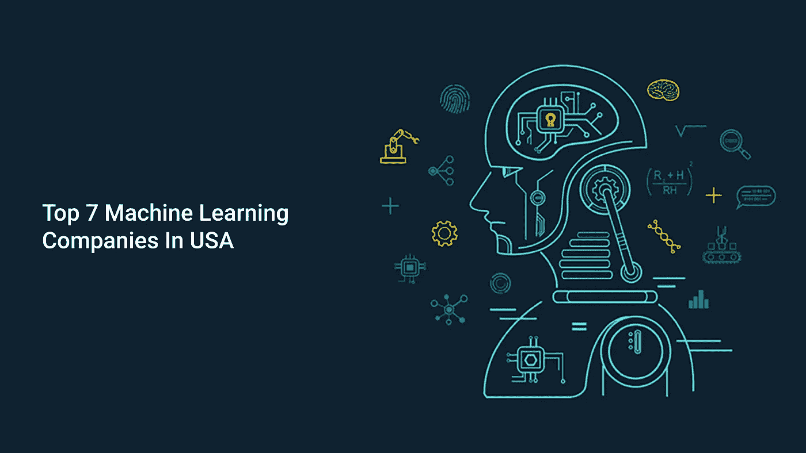

# 全世界顶尖的机器学习公司

> 原文：<https://medium.datadriveninvestor.com/top-7-machine-learning-companies-in-the-usa-705947fc0237?source=collection_archive---------4----------------------->

嗨，读者们，

你在为你的项目寻找顶尖的机器学习公司吗？

如你所知，机器学习是人工智能或人工智能的一个子集，它教会软件或机器在没有人类干预的情况下学习、探索和提供结果。

该技术正被用于各种领域，以改善流程并带来准确的结果。

这可能是世界各地的企业采用这项技术的众多原因之一。

 [## 认知计算——一套被广泛认为是……

### 作为它的用户，我们已经习惯了科技。这些天几乎没有什么是司空见惯的…

www.datadriveninvestor.com](https://www.datadriveninvestor.com/2020/02/19/cognitive-computing-a-skill-set-widely-considered-to-be-the-most-vital-manifestation-of-artificial-intelligence/) 

为了满足这种飙升的需求，许多公司向初创公司和财富 500 强公司提供机器学习开发服务。

在这些公司中选择一家，将 ML 整合到你现有的业务流程中，或者开发一个新的基于 ML 的移动应用程序，是一项艰巨的任务，需要大量的研究，也要耗费大量的时间。

为了帮助您处理这种混乱，我们提供了一份七家最受欢迎和最值得信赖的机器学习开发公司的列表。

在浏览这些公司的列表之前，让我们来了解一下机器学习的类型，这将有助于您获得正确的 **ML 开发服务**:

**机器学习有三种:**

*   监督学习(任务驱动)
*   无监督学习(数据驱动)
*   强化学习(从错误和经验中学习)

*让我们来详细了解一下:*

1.  **监督学习**

监督机器学习中使用的算法是在有标签的数据上训练的，这些数据需要被完美准确地命名。这种类型的学习中的 ML 算法具有从较大的数据集中提取的小的训练数据集。数据集帮助算法理解问题的主要思想、解决方案和要处理的数据点。

一旦训练完成，数据集就会知道数据是如何工作的，以及输入和输出数据之间的关系。然后将小数据集与最终数据集一起部署，以便它也可以根据训练工作。

**2。无监督学习**

这种类型的 ML 处理未标记的数据，它创建隐藏的结构，使算法通用。无监督学习中使用的算法可以通过对这些隐藏结构进行所需的改变来适应数据。

**3。强化学习**

在这种类型的学习中使用的算法使用试错法从错误和经验中自我改进。有价值的输出会得到加强，而不利的输出会被忽略。强化学习把一个算法放在一个有解释器和奖励系统的真实环境中。这个解释器在算法每次迭代后接收输出，并决定输出是否有用。

# 顶级机器学习开发公司

在这里，我们为您提到了一些顶级的机器学习开发公司。

## **1。** **Quytech:最好的机器学习开发公司**

Quytech 是顶尖的机器学习公司之一，拥有开发数百种基于 ML 和基于 AI 的应用程序的经验。

该公司遵循以客户为中心的方法，因此，为初创公司和企业提供定制的机器学习应用开发和机器学习咨询服务。

[高技能的 ML 开发人员](https://www.quytech.com/hire-ai-developers.php)，认证数据科学家，合格的设计师，以及经验丰富的支持专业人员是 Quytech 的中坚力量。

**服务:**数据建模、统计建模/分析、探索性数据分析、预测性分析、预测。

## **2。** **Icreon:机器学习公司**

Icreon 是一家公认的机器学习开发公司，为初创公司和企业提供 ML 应用开发以及人工智能开发服务。在开始开发过程之前，公司分析了市场和竞争对手。

然后，它遵循一个循序渐进的过程，从概念化、原型制作、设计、开发、测试、支持和维护，来构建一个可以设定基准并使您的业务更上一层楼的应用程序。

对于基于 ML 的应用程序的开发，Icreon 使用了 Clarifai、Caffe2、AWS 和 Azure 等非常先进的工具。

## **3。** **Abto 软件:ML 服务商**

作为值得关注的机器学习咨询公司之一，Abto Software 对用于机器学习应用程序开发的最新技术拥有强大的控制权。该公司拥有一支高素质、经验丰富的开发人员团队，他们竭尽全力满足客户的期望。

每一个基于 ML 和基于 AI 的应用程序，Abto 软件已经开发出了它的卓越和完美。为了开发可扩展和健壮的机器学习应用程序，该公司利用了最新的技术、工具、框架和语言。为了确保每一个开发的应用程序满足客户的要求，Abto 遵循一个系统的方法，并以一种易于理解的语言定期向客户发送进度报告。

## **4。****sigmoid:顶级 ML 公司**

Sigmoidal 是一家值得信赖的机器学习咨询公司，以集成机器学习和人工智能来扩大业务流程并确保其成功而闻名。该公司在交付端到端机器学习应用程序开发服务方面拥有丰富的经验。

它在整个开发阶段提供完整的支持，包括范围和架构设计、数据收集和探索、模型开发和应用程序开发。Sigmoidal 在开发和部署许多机器学习应用程序开发项目到金融、交易、旅游和其他商业垂直领域方面有着良好的记录。

## **5。** **HyperGiant: ML** **开发服务**

HyperGiant 是一家领先的机器学习公司，因向新兴和成熟的公司提供量身定制的机器学习应用程序开发服务而获得认可。凭借其经济高效的机器学习咨询和开发服务，它已经为娱乐、医疗保健、航空、国防、交通、卫星通信和其他行业的数百家客户提供了服务。

利用技术的力量，该公司向其客户保证提供定制的基于 ML 的应用程序，从而实现业务增长和成功。HyperGiant 开发的移动应用程序有可能模仿人类并像人类一样思考。

## **6。** **Xyonix**

Xyonix 机器学习服务提供了对数据的深刻见解，可以帮助您为企业的光明未来做出决策。这家公司的主要动机是在没有任何人工干预的情况下，通过理解和检查数据和统计数据，让企业利用人工智能和机器学习来简化他们的业务流程。

Xyonix 在为各种商业垂直领域的数百名客户开发机器学习应用程序方面拥有丰富的经验。这家机器学习咨询公司以通过其可扩展、强大和高性能的机器学习移动应用程序提供成本和质量的完美融合而闻名。

## **7。** **马赛克**

Mosaic 是另一家机器学习咨询公司，致力于为企业发展提供机器学习应用开发服务和基于 ML 的解决方案。该公司拥有一支由 ML 工程师、数据科学家和支持专业人员组成的专门团队，以确保每个交付的项目都符合客户的期望。通过利用其机器学习开发服务，客户可以将该技术集成到他们现有的业务流程中，或者根据他们的特定要求开发新的应用程序。

# 如何雇佣一个机器学习开发者

[雇佣机器学习开发人员](https://www.quytech.com/hire-ai-developers.php)有两种方式:通过自由职业网站或 ML 应用开发公司。然而，第二个是经常建议，因为好处较少。以下是雇佣 ML 开发人员的逐步指南:

#1: **需求分析**:首先，明确你的需求，找到最适合你的 ML 开发者。

#2: **资源选择**:检查 ML 开发者工作组合，确保他们获得了满足你的机器学习开发需求的最佳专业知识。

#3: **面试**:缩小分享简历范围后，可以进行面试，录用符合你要求的 ML 开发者。

#4: **定稿**:在你为你的开发公司找到合适的 ML 开发者之后，分享你的需求。

如果你像大多数企业一样，想要将机器学习集成到你的应用程序中，或者创建一个新的支持 ML 的应用程序，你必须寻找一个机器学习开发者。但是，在您这样做之前，请考虑以下步骤，以确保您选择的是一位能够创建满足您特定需求的应用程序的熟练开发人员。你雇佣的 ML 开发者应该具备以下技能:

**技术专长**

一个 ML 开发者应该在技术上是可靠的，但是记住这不是一个学术职位。然而，开发人员应该拥有软件工程学位以及丰富的数据科学经验。此外，他/她应该熟悉开发一个成功的 ML 应用程序所必需的编程语言、工具和软件。

**出色的沟通技巧**

您选择的开发人员必须具有主动的沟通技巧，以便与您和其他团队成员进行清晰简洁的沟通。大多数专业开发人员以有组织的方式运作，每周通过音频或视频电话与客户联系一次。确保你的开发者也在同一页上。

**杰出的认知能力**

一个 ML 开发者必须有足够的想象力来理解你的公司理念，并想出如何让你的应用脱颖而出。他/她应该提供新颖的想法，并构建一个描述您的目标的模型。检查开发者是否有能力创建一个既有创造性又以客户为中心的应用程序。

**渴望学习新技术**

不可否认，技术在不断进步。为了应对这些发展，开发人员必须热衷于学习、理解和集成新的 ML 技术。此外，他/她应该了解许多形式的机器学习和最新的进展。

**强势组合**

你想为你的项目雇佣的 ML 开发人员应该有为创业公司和企业创建基于 ML 的产品的经验。此外，他/她应该理解这项技术如何帮助各种企业增加收入和扩大运营。

**按时完成项目**

对于机器学习工程师来说，时间管理在任何时候都是至关重要的。他/她必须能够为特定的活动分配特定的时间。他们还必须创建一个包括任务描述和预定完成时间的计划。最重要的是，他们知道如何在现实世界中管理自己的时间。

**丰富的数据科学经验**

人工智能和机器学习强烈依赖数据。因此，您选择的开发人员应该具有丰富的数据科学经验。他/她应该熟悉用于结构化非结构化数据并使其对业务有价值的策略、程序、算法和系统。

既然你已经知道了选择一个有经验、有才华的机器学习开发人员时要考虑的所有关键因素，那就做出明智的决定吧。

# **结论**

这篇文章涵盖了美国最受信任和最知名的机器学习公司，这些公司以最具竞争力的价格提供高度先进的[机器学习应用程序开发](https://www.quytech.com/machine-learning-development-company.php?utm_campaign=MachineLearning&utm_medium=TopMLCompanies&utm_source=MediumBlog)服务。你可以在下一个机器学习开发项目或机器学习咨询服务中依赖它们中的任何一个。其中一些公司(如 Quytech)还提供按小时或按月雇佣机器学习开发人员的服务。明智地做出选择！