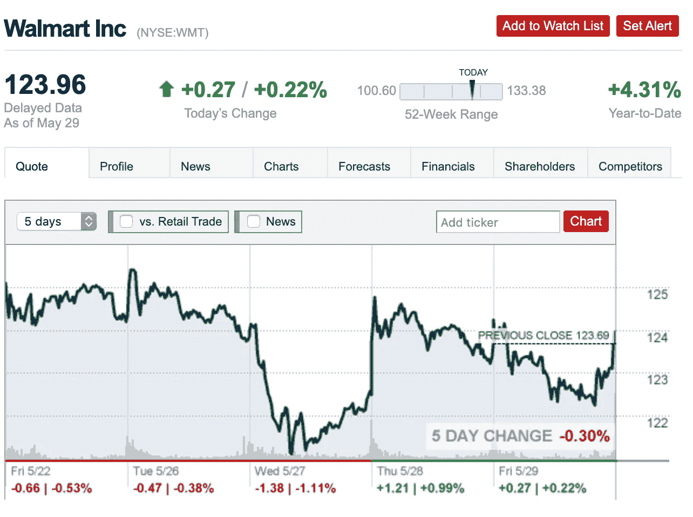
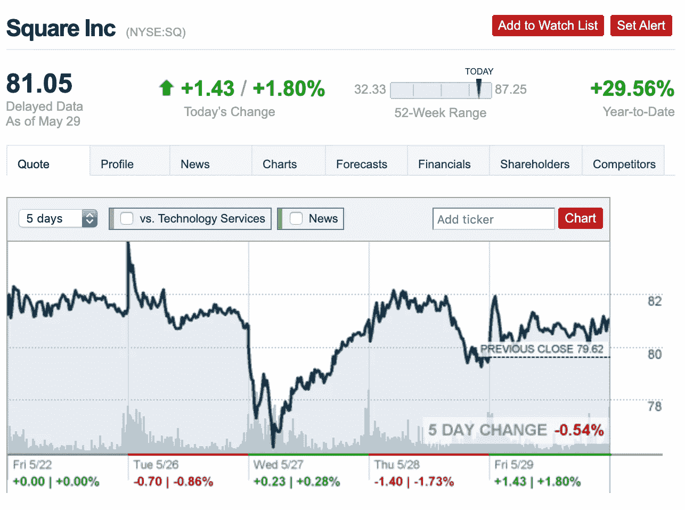
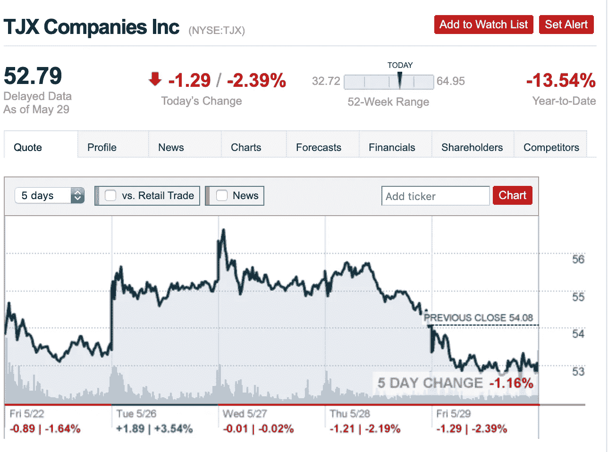
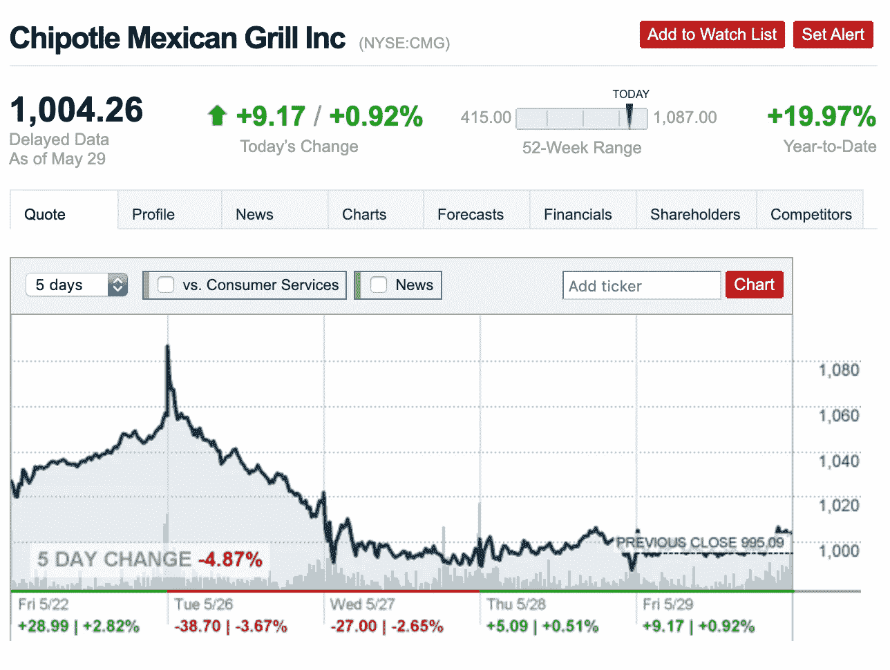
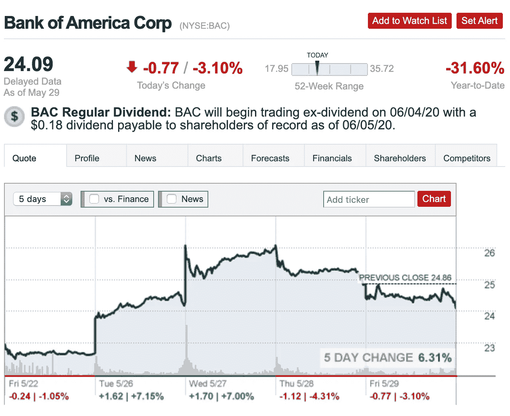
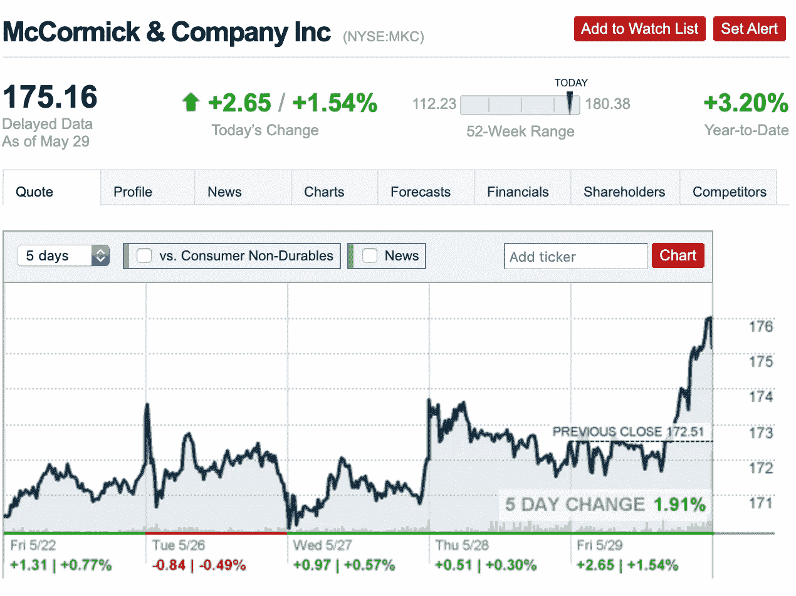
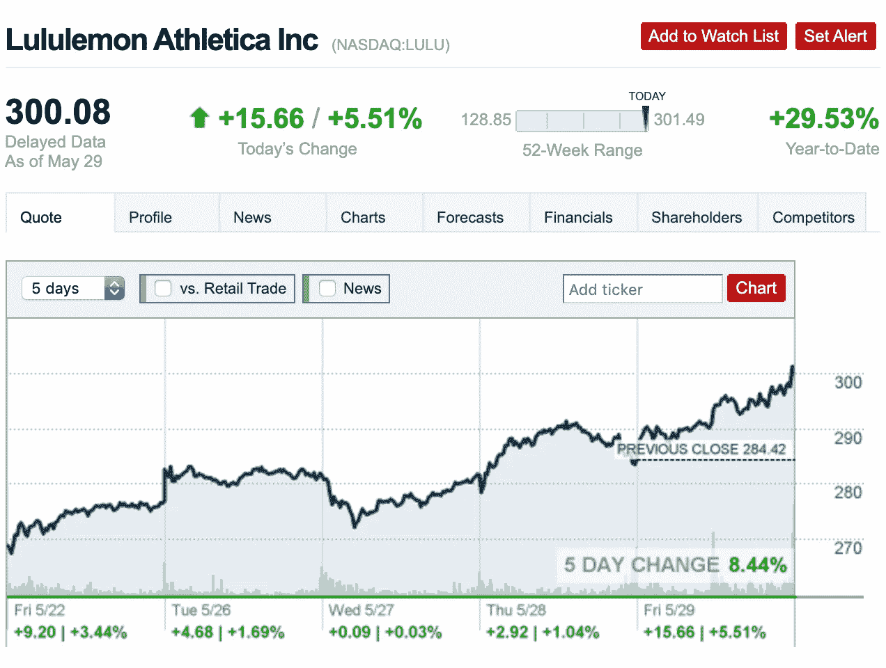

# 最值得购买的 7 只股票:2020 年 6 月

> 原文：<https://medium.datadriveninvestor.com/top-7-stocks-to-buy-june-2020-b6a7ed9f41f5?source=collection_archive---------8----------------------->

Photo by [Jason Briscoe](https://unsplash.com/@jsnbrsc?utm_source=unsplash&utm_medium=referral&utm_content=creditCopyText) on [Unsplash](https://unsplash.com/s/photos/stock?utm_source=unsplash&utm_medium=referral&utm_content=creditCopyText)

## 高增长股票加入你的投资组合

以下是顶级投资者认为 2020 年 6 月份投资的 7 只股票。如果你想了解这些股票是如何挑选的，请阅读到本文结束。

在这里领取您的免费股票[，在这里](https://join.robinhood.com/andyl8)领取[。估计价值在 12-1400 美元之间！](https://www.webull.com/activity?inviteCode=KT8D7wlKgLFg&source=invite_gw)

 [## 我如何通过脸书广告创造 50，000+销售线索

### 循序渐进的教程

medium.com](https://medium.com/better-marketing/how-i-generated-50-000-leads-with-facebook-ads-ca710e59e3cf) 

# 第一:沃尔玛

这个选择很明显。沃尔玛是一家美国零售公司，销售从杂货到服装的日常用品。由于商店出售必需品，该公司在冠状病毒封锁期间成了抢手货。 [MarketWatch](https://www.marketwatch.com/story/americans-spent-their-stimulus-checks-on-discretionary-goods-such-as-bikes-video-games-and-clothes-target-and-walmart-ceos-say-2020-05-20) 报道称，美国人用 1200 美元的刺激支票在沃尔玛及其竞争对手塔吉特百货大肆挥霍。沃尔玛的主要卖点是价格，这使它成为家庭和日常购物者非常受欢迎的目的地。该公司在店内和网上都表现强劲，这使得它成为许多顶级投资者看好的股票选择。

Photo from [CNN Money](https://money.cnn.com/quote/quote.html?symb=WMT) on May 30, 2020

# 快速统计

*   今年迄今，该公司的股票已经上涨了 4.31%
*   当前交易价格:123.96 美元
*   52 周低点:100.60 美元
*   52 周高点:133.38 美元
*   2019 年净收入:66.7 亿美元
*   CNN Money 预测该股在未来 12 个月内可能达到 150 美元(价值增长 21%)。

# #2:方形

Square 是一家美国金融服务公司，生产硬件和软件支付产品。销售点和金融产品是重要的，大型和小型企业都使用。正如 Motley Fool 所描述的，该公司一直在快速增长:“在其最近报告的季度中，收入同比增长 44%，达到 13.8 亿美元。”企业正在转向 Square，以帮助他们适应数字时代。Square 在一个不断增长的市场中的强势地位，使其成为投资者的可靠选择。

Photo from [CNN Money](https://money.cnn.com/quote/quote.html?symb=SQ) on May 30, 2020

# 快速统计

*   今年迄今，该公司的股票已经上涨了 29.56%
*   当前贸易价格:81.05 美元
*   52 周低点:32.33 美元
*   52 周高点:87.25 美元
*   2019 年净收入:37544.6 万美元
*   [CNN Money](https://money.cnn.com/quote/forecast/forecast.html?symb=SQ) 预测该股在未来 12 个月内可能达到 90 美元(价值增长 11%)。

 [## 作为一名作家，我每月挣 100 美元的 5 个策略

### 分享我的个人数据和建议

medium.com](https://medium.com/illumination/my-5-strategies-to-generating-100-month-as-a-writer-d4cff6551295) 

# #3: TJ Maxx

TJ Maxx 是一家受欢迎的美国百货连锁店，销售从服装到家居用品的各种产品。虽然商店在就地避难期间仍然关闭，但顾客仍然可以在 TJ Maxx 的网站上购买产品。商业内幕报道称，在 TJ Maxx 商店重新开业的各州，购物者蜂拥而至。对于重新开业的商店，销售额比去年有所上升。该公司预计大部分商店将于 6 月底开业。如果这种积极趋势持续到今年年底，这将使 TJ Maxx 成为一项有价值的投资。

Photo from [CNN Money](https://money.cnn.com/quote/quote.html?symb=tjx) on May 30, 2020

# 快速统计

*   今年迄今，该公司的股票已经下跌了 13.54%
*   当前交易价格:52.79 美元
*   52 周低点:32.72 美元
*   52 周高点:64.95 美元
*   2019 年净收入:305979.8 万美元
*   [CNN 财经](https://money.cnn.com/quote/forecast/forecast.html?symb=TJX)预测该股在未来 12 个月内可能达到 70 美元(价值增长 33%)。

# #4:墨西哥烤肉店

快餐休闲餐厅 Chiptole 继续主导着食品行业，尤其是在冠状病毒疫情期间。自从疫情开始以来，这家非常受欢迎的连锁餐厅的股票翻了一番。人们蜂拥到 Chiptole 去吃他们的墨西哥卷饼碗、墨西哥卷饼和墨西哥卷饼。快速的服务、高质量的食物和低廉的价格使它成为人们的一个有吸引力的选择。2020 年第一季度，该公司的收入增长了 7.8%(数字销售增长了 80%)，这表明该业务在很大程度上没有受到疫情的影响。虽然股票可能有点贵，但顶级投资者认为，随着 Chipotle 销售额继续向上发展，股票将继续上涨。

Photo from [CNN Money](https://money.cnn.com/quote/quote.html?symb=CMG) on May 30, 2020

# 快速统计

*   今年迄今，该公司的股票已经上涨了 19.97%
*   当前贸易价格:1004.26 美元
*   52 周低点:415.00 美元
*   52 周高点:1087 美元
*   2019 年净收入:35015.8 万美元
*   [CNN 财经](https://money.cnn.com/quote/forecast/forecast.html?symb=CMG)预测该股在未来 12 个月内可能达到 1150 美元(价值增长 15%)。

 [## 我 25 岁时的 8 种收入来源

### 千禧年生活:我如何赚钱和存钱

medium.com](https://medium.com/makingofamillionaire/my-8-sources-of-income-at-age-25-d574ff5d14ff) 

# 第五名:美国银行

美国银行是一家金融服务提供商和跨国投资银行，其中心遍布全球。该公司为大约 10%的美国银行存款提供服务。按收入计算，美国银行是美国第二大银行，世界第九大银行。该银行巨大的市场份额使其成为对长期投资者有吸引力的选择。与许多其他银行一样，该公司的股票目前处于历史低点，因此强烈买入。

Photo from [CNN Money](https://money.cnn.com/quote/quote.html?symb=bac) on May 30, 2020

# 快速统计

*   今年迄今，该公司的股票已经下跌了 31.60%
*   当前交易价格:24.09 美元
*   52 周低点:17.95 美元
*   52 周高点:35.72 美元
*   2019 年净收入:274.3 亿美元
*   [CNN Money](https://money.cnn.com/quote/forecast/forecast.html?symb=BAC) 预测该股在未来 12 个月内可能达到 37.00 美元(价值增长 54%)。

# 第六名:麦考密克公司

你可能已经拥有了一个麦考密克产品——看看你的橱柜就知道了。正式名称为 McCormick & Company，该公司生产和销售香料、混合调料、调味品和其他调味产品。走过当地杂货店的香料通道，你会发现一半的货架都是空的。随着避难所的建立，全国各地的人们开始烘焙和烹饪，导致对麦考密克产品的需求激增。投资者认为，烹饪和烘焙的趋势甚至会延续到新冠肺炎之后。这些原因使得麦考密克成为备受追捧的投资选择。

Photo from [CNN Money](https://money.cnn.com/quote/quote.html?symb=MKC) on May 30, 2020

# 快速统计

*   今年迄今，该公司的股票已经上涨了 3.2%
*   当前交易价格:175.16 美元
*   52 周低点:112.33 美元
*   52 周高点:180.38 美元
*   2019 年净收入:7.027 亿美元
*   [CNN 财经](https://money.cnn.com/quote/quote.html?symb=MKC)预测该股在未来 12 个月可能达到 187 美元(价值增长 6%)。

# #7: Lululemon Athletica

随着美国大多数人从 3 月份开始转变为在家工作，对休闲运动服装的需求激增。人们不再每天穿牛仔裤、卡其布裤子、连衣裙、短裙或连衣裙。Lululemon Athletica 是一家运动服装零售商，销售运动性能衬衫、短裤和裤子。投资者预计，随着越来越多的人购买和穿着休闲服装，销售额将会激增。 [Motley Fool](https://www.fool.com/investing/2020/04/30/is-lululemon-stock-a-buy.aspx) 报道称，Lululemon 拥有健康的资产负债表，没有债务，现金超过 10 亿美元。由于忠实的粉丝群，在线销售持续增长。这些原因使得 Lululemon Athletica 对投资者很有吸引力。

Photo from [CNN Money](https://money.cnn.com/quote/quote.html?symb=LULU) on May 30, 2020

# 快速统计

*   今年迄今，该公司的股票已经上涨了 29.53%
*   当前交易价格:300.08 美元
*   52 周低点:128.85 美元
*   52 周高点:301.49 美元
*   2019 年净收入:4.83801 亿美元
*   CNN Money 预测该股在未来 12 个月内可能达到 335 美元(价值增长 12%)。

# 我的策略:

找公司投资的时候，要考虑很多因素。首先，看看财务状况，确保公司每年都有正收入。然后看看公司每年消耗多少现金。净收入为正的公司是值得投资的。

 [## 利用股市相关性的最佳方式|数据驱动的投资者

### 当阿尔弗雷德·温斯洛·琼斯开创了世界上第一个“对冲”基金(后来“d”被去掉了)时，他让其他投资者大吃一惊…

www.datadriveninvestor.com](https://www.datadriveninvestor.com/2020/02/02/the-best-way-to-use-stock-market-correlations/) 

此外，搜索网络，看看公司是否每年都在增长。公司销售的产品和服务是否很抢手？人们在购买公司的产品和服务吗？这些也是影响公司寿命的重要因素。

许多顶级投资者推荐的另一条建议是 ***买入并长期持有*** 。

[Investopedia](https://www.investopedia.com/articles/investing/052216/4-benefits-holding-stocks-long-term.asp) 声明:

> 长期购买和持有股票的主要原因是，当投资者尝试和选择投资时机时，长期投资几乎总能跑赢市场。

确保在投资任何公司之前做好调查。

 [## 买入前 5 只股票:2020 年 5 月

### 高增长股票加入你的投资组合

medium.com](https://medium.com/makingofamillionaire/top-5-stocks-to-buy-may-2020-d150e6f5c07e) 

如果你喜欢阅读这样的内容，不要忘记鼓掌或留下回应！你也可以今天[**加入我的邮件列表**](https://docs.google.com/forms/u/1/d/e/1FAIpQLSezNt4o2S_v52T-kytvIsQgEuMi5CJpKSrOsIVP1lUQlqPKWw/viewform) **。**

感谢阅读！