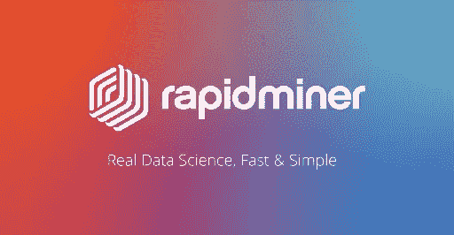
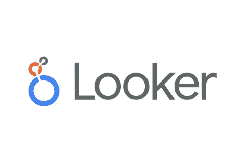
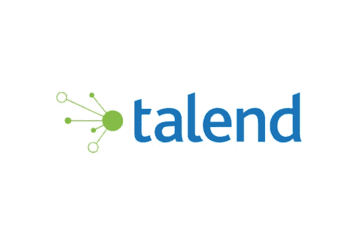

# 2021 年大数据分析师必须知道的 8 大数据分析工具

> 原文：<https://medium.datadriveninvestor.com/top-8-data-analysis-tools-a-big-data-analyst-must-know-in-2021-7146adc42c35?source=collection_archive---------6----------------------->

对于一名大数据分析师来说，在不了解工具和技术的情况下开始大数据职业生涯是一项挑战。因为没有一种工具能满足所有的需求，所以您需要具体地做出正确的选择。

Y 您正在寻找下一次旅行的最佳目的地。你寻找更好的旅游目的地，那里有大量的信息。也许你已经登录了你的社交媒体账户，你看到了什么？

你看到一个旅游目的地的广告出现在你的屏幕上了吗？你的答案是肯定的吗？如果是这样，你需要知道，智能数字助理已经在跟踪你的搜索，为你实现梦想提供最佳信息。

这是哪里🔗 [**大数据和数据分析工具**](https://www.dasca.org/world-of-big-data/article/7-best-big-data-hadoop-analytics-tools-in-2021) 来玩吧。这些工具帮助你用目标信息展现隐藏的世界。作为大数据专业人员，分析数据是一项至关重要的技能，尤其是在做出明智的业务决策时。为此，您将需要学习工具方面的专业知识，以协助数据驱动的决策过程。由于有多种数据分析工具，大数据专业人员选择正确的工具可能会面临挑战。以下是供您选择的八大工具:

# **1。KNIME**

KNIME 也称为 Konstanz Information Miner，是一个开源、免费、集成和报告数据分析平台。数据分析工具是一项必备的技能，对于那些希望在🔗 [**大数据职业**](https://www.dasca.org/data-science-certifications/careers-in-big-data) 。它是用户在开发数据科学应用程序时利用 Python 和 R 等脚本语言的理想工具。使用 KNIME 的最大优势包括多线程数据和内存处理。KNIME 的拖放 GUI 易于使用。作为初学者，您可以使用可视化编程轻松地对数据进行分析和建模。

# **2。** **RapidMiner**

RapidMiner 连续六年成为 Gartner 2019 年数据科学和机器学习魔力象限的领导者。

作为最受欢迎的数据科学平台之一，它现在被全球 40，000 多家组织使用。RapidMiner 不仅仅是一个数据清理工具。它的专业知识扩展到构建机器学习模型，同时还支持数据科学家或大数据工程师使用 R 和 Python 构建模型。

RapidMiner 提供了超过 1500 种算法和数据函数。除此之外，这个平台还为高级分析、与 R 和 Python 的集成以及第三方机器学习库提供了巨大的支持。

# **3。** **后续企业**

Sequentum enterprise 是用于高级数据提取的最佳工具之一，尤其适用于 web 爬行。

该工具在提取大规模数据的同时，方便了测试、开发和生产。Sequentum 是专门为完全依赖法律合规性和结构化 web 数据的组织设计的。因此，用户可以通过编写脚本或使用 VB.NET 和 C#来轻松调试和控制爬虫。

对于建立**大数据职业**的专业人士来说，关于最新工具和平台的深入知识是必备的。

由于该平台提供高级功能，建议用户具备广泛的编程和数据分析知识。

# **4。** **看客**

每个组织都在寻找实现云计算的新方法。Looker 提供了对多云策略的支持，最适合部署方法和多数据源的使用。该工具提供的最大优势是高级数据可视化、分析和管理以及商业智能等功能。Looker 可以轻松地与大量数据库以及亚马逊红移和雪花保持联系。

# **5。** **OpenRefine**

OpenRefine 是一个开源数据分析工具，以前称为 Google Refine。完成数据清理后，数据集将进一步扩展到外部 web 服务。OpenRefine 还支持用于导入和导出目的的多种文件格式。该工具可导入 XML、JSON、CSV、TSV 等文件，并进一步导出可读格式的数据，如 HTML 表格、Microsoft Excel、CSV 和 TSV。

# **6。** **词法分析**

称为 Lexalytics 的商业智能平台最适合于组织通过利用文本数据来更好地了解员工或客户对其产品或服务的体验。该平台有助于从多个帖子、评论、推文中收集信息，并帮助🔗 [**大数据分析师**](https://www.dasca.org/data-science-certifications/big-data-analyst) 推断最新洞察。该软件通过机器学习、自然语言处理和文本分析的组合特征来识别用户的感觉或态度。

# 7。 **NodeXL**

NodeXL 工具也被称为“网络的 MSPaint”这个工具由两个版本组成——NodeXL Basic 和 NodeXL Pro。

基本版是免费的，是一个开源工具。基础版还允许数据科学家在 excel 中分析和可视化网络图。而专业版的 NodeXL 提供了额外的功能，如情感分析和人工智能文本。

对于寻求导入数据、表示数据或进行图形可视化的分析师来说，NodeXL 可能是首选。

# **8。** **塔伦德**

Talend 允许专业人员和经理快速做出更明智的决策。该工具有助于探索数据并支持他们做出决策。简单地说，它是一个数据协作工具，非常适合清理、转换和可视化数据。

最好的特性之一包括保存并在新的数据集上重做之前的任务。这个特性是独一无二的，在其他工具中是找不到的。因此，允许自动发现并向用户提供智能建议，以促进数据分析。