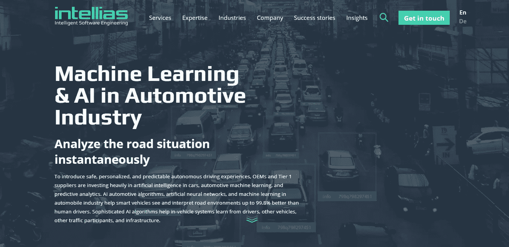
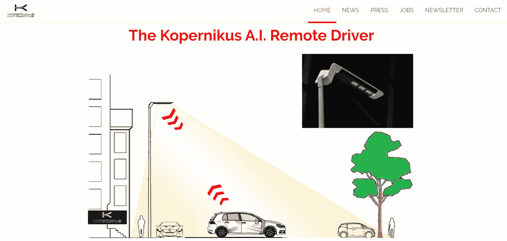
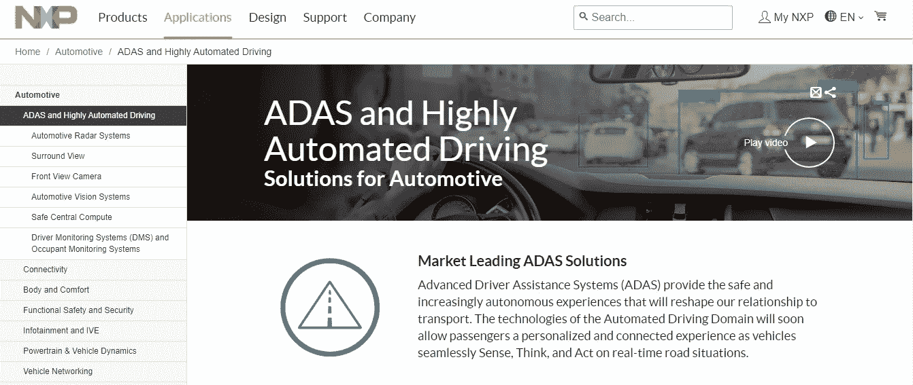
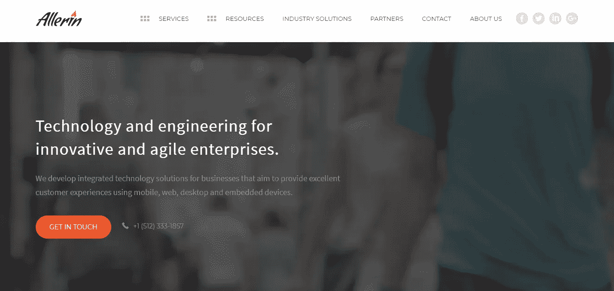
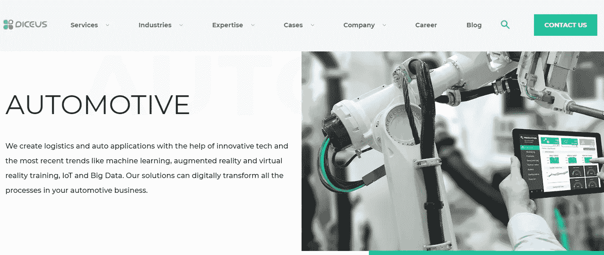
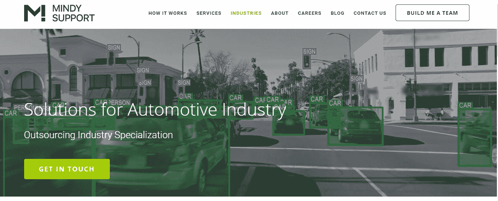

# 面向汽车行业的 8 大机器学习和人工智能软件开发公司

> 原文：<https://medium.datadriveninvestor.com/top-8-machine-learning-ai-software-development-companies-for-automotive-39d33a38ff9d?source=collection_archive---------3----------------------->

自动驾驶汽车仍在学习如何驾驶，但有一天它们会完全取代方向盘后面的司机。但要实现这一点，无人驾驶汽车将需要学习如何理解这个经常令人困惑的世界，并比人驾驶得更好。

汽车行业的机器学习和人工智能携手合作，为自动驾驶汽车构建先进的算法，以分析道路情况，做出即时准确的决策，并向其他交通参与者学习。来自顶级汽车机器学习和人工智能软件开发公司的开发人员面临着挑战，他们的目标是训练技术以适应快速变化的环境，并将车祸中的人为因素降至最低，从而提高安全性。

随着自动驾驶汽车的 ML 和 AI 软件成为关键的市场差异之一，顶级汽车品牌之间的竞争正在升温。一级供应商和原始设备制造商正在与 IT 服务供应商合作，以满足他们不断增长的工程需求。在为汽车行业寻找最佳机器学习开发公司时，科技巨头和初创公司应该留意这些人工智能和人工智能专家。

# **Intellias**

https://www.intellias.com/

**地点:**柏林(德国)；利沃夫、基辅、奥德萨、哈尔科夫和伊万诺-弗兰科夫斯克(乌克兰)；克拉科夫(波兰)

**成立于:** 2002 年

公司规模:1600 人

Intellias 是汽车行业公认的领先先驱，也是人工智能和机器学习开发外包领域的顶级品牌。该公司卓越的汽车软件专业知识和世界一流的交付团队帮助知名汽车制造商解决复杂的工程挑战。

Intellias 被 IAOP 评为全球外包 100 强，并被 Inc. 5000 评为欧洲发展最快的私营企业之一。

 [## 认知计算——一套被广泛认为是……

### 作为它的用户，我们已经习惯了科技。这些天几乎没有什么是司空见惯的…

www.datadriveninvestor.com](https://www.datadriveninvestor.com/2020/02/19/cognitive-computing-a-skill-set-widely-considered-to-be-the-most-vital-manifestation-of-artificial-intelligence/) 

**服务:**

该公司的机器学习和人工智能服务涵盖计算机视觉、智能导航、路线分析、POI 优化、车载智能、预测决策和预测维护。Intellias 擅长基于自己的 R&D 和计算机视觉神经网络构建汽车人工智能解决方案。

**主要客户:**西门子、微软、诺基亚、罗氏、RTL 集团、起亚

# **柯伯尼库斯汽车**

[https://www.kopernikusauto.com/](https://www.kopernikusauto.com/)

**地点:**柏林(德国)

**成立时间:** 2016 年

**公司规模:**11–50 人

Kopernikus Automotive 是一家年轻的软件开发公司，专注于汽车行业的人工智能和机器学习。该公司主要因其与保时捷的联合试点项目而获得认可，该项目旨在测试汽车如何自动驾驶到车间的举升平台。

**服务:**

该公司的旗舰产品 Kopernikus 改装套件是一种技术堆栈，可将批量生产的汽车转换为无人驾驶汽车，使普通消费者能够负担得起自动驾驶。Kopernikus Automotive 实施中间件，并为乘用车中部署的自主系统开发 AI 和 ML 组件。该系统允许汽车通过空中更新不断向自己的司机以及其他 Kopernikus 司机学习。

**主要客户:**保时捷

# **恩智浦**

[https://www.nxp.com](https://www.nxp.com/)

**地点:**埃因霍温(荷兰)

**成立:** 2006/1953(以前是皇家飞利浦电子的一个部门)

公司规模:45000 人

超过 60 年的市场经验和无与伦比的自动化汽车突破性人工智能解决方案组合，使恩智浦半导体成为汽车行业全球领先的人工智能创新者。该公司的产品基于其在汽车、安全、识别、ADAS、自动驾驶、连接和车联网领域的深厚专业知识。

**服务:**

该公司强调汽车应用的人工智能，其行业领先的人工智能和人工智能解决方案增强了自动汽车的智能，训练它们感知、思考和行动。恩智浦的核心技术旨在解决主要的全球移动挑战，称为“三个零”:零伤亡、零排放和零时间浪费。

**主要客户:**苹果、博世、大陆集团、爱立信、金雅拓、吉赛克+德夫列特、华为、现代、科纳、诺基亚通信、松下、三星、中兴

# Allerin

[https://www.allerin.com](https://www.allerin.com/)

**地点:**印度孟买

**成立于:** 2004 年

**公司规模:**201–500 人

二十多年来，Allerin 一直提供尖端、高质量的软件服务，并已成为任何企业的重要合作伙伴。与各种技术合作——包括 ML 和 AI——跨越一系列行业是 Allerin 与众不同的地方。

**服务:**

凭借在自然语言处理、机器感知、深度学习和人工智能方面令人印象深刻的产品以及丰富的汽车专业知识，Allerin 是汽车软件开发服务的领导者。该公司专注于满足客户特定需求的定制产品，为汽车制造提供人工智能解决方案，使汽车制造商能够微调汽车零部件，增强自动驾驶汽车的安全和性能。

**主要客户:** IBM、惠普企业、ThingWorx、Predix

# **点燃**

[https://igniteoutsourcing.com/](https://igniteoutsourcing.com/)

**地点:**内坦亚(以色列)

**成立:** 2006 年

**公司规模:**51–200 人

Ignite 是一家以色列-乌克兰软件开发公司，在东欧设有 R&D 中心和交付办公室，并拥有一支训练有素的开发人员和工程师团队。从初创公司到企业，Ignite 服务于世界各地的企业，在汽车、安全、金融科技和其他垂直领域提供独特的开发模式和丰富的知识。

**服务:**

凭借八个 R&D 实验室和一些最优秀的专家，Ignite 正在为汽车行业开拓突破性的创新，并且是一个成功的人工智能和机器学习开发外包服务提供商。

**主要客户:** NEX 集团、Credito、Medronic、Flipkart、ObserveIT、Waze、Plus500、Visonic

# **Diceus**

[https://diceus.com/](https://diceus.com/)

地点:基辅(乌克兰)

**成立于:** 2001 年

公司规模:100-250 人

Diceus 是一家开发公司，为 20 多个国家的大型企业提供端到端的企业级解决方案和定制软件。他们将机器学习和人工智能用于汽车应用，并帮助他们的客户分析、优化和迁移现有的汽车软件。

**服务:**

凭借成熟的方法和扎实的领域专业知识，Diceus 在企业软件开发、迁移维护重组、web 和移动开发、业务分析和咨询方面提供服务。

**主要客户:** Teambase、InsuBiz、Palmers、NextCom、BriteCore、SmartValor

# **明迪支持**

https://mindy-support.com/

**地点:**塞浦路斯利马索尔

**成立日期:** 2013 年

**公司规模:**1000–5000 人

Mindy Support 是一家国际外包公司，通过建立机器学习和数据训练解决方案的远程团队，为世界各地的企业提供支持。该公司帮助主要汽车行业参与者实现一些最复杂的自动驾驶项目。

**服务:**

认识到数据在机器学习和人工智能中日益增长的重要性，Mindy Support 提供了数据注释服务，如图像处理、文本、图像和视频注释、3D 点云注释、语音识别、文本处理、RBA 培训、情绪智能辅助和多语言聊天机器人培训。

**主要客户:**施泰因博克，科尔比直接

人工智能和机器学习开发外包很可能成为自动驾驶未来的必要成分之一。由于建立完全无人驾驶汽车的共同目标，自动驾驶汽车初创公司、一级供应商和原始设备制造商将越来越多地寻求顶级机器学习和人工智能软件开发公司为汽车提供的服务。