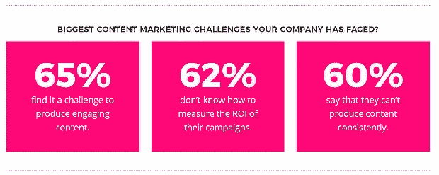
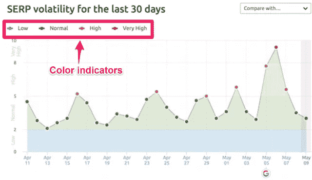

# SEO 内容策略失败的 9 大原因以及如何解决

> 原文：<https://medium.datadriveninvestor.com/top-9-causes-of-your-seo-content-strategy-failure-and-how-to-fix-it-5437145b8050?source=collection_archive---------11----------------------->

## 内容是最常用的数字营销资产形式

Photo by [Kaleidico](https://unsplash.com/@kaleidico?utm_source=medium&utm_medium=referral) on [Unsplash](https://unsplash.com?utm_source=medium&utm_medium=referral)

你的 SEO 内容写作为什么会失败？为什么你的博客文章没有出现在搜索引擎结果中？你熟悉这些问题吗？那么，你来对地方了！我们将解决这些问题，并提供博客和内容写作技巧来[提升你的 SEO 内容写作](https://www.mossmedia.biz/seo-content-writing-tips/)。

对于希望提高品牌知名度、转化率和在线销售的企业来说，内容营销变得越来越重要。营销内容大师[塞斯·戈丁](https://contentmarketinginstitute.com/2008/01/seth-godin-cont/h)曾经说过，“*内容是唯一剩下的营销形式*

同时，如果你没有一个坚实的 SEO 写作计划，你的内容策略将会失败。SEO 有助于让你的博客内容更容易被合适的人看到——增加流量，提高转化率。

如果你担心你的 [SEO 内容策略](https://mossmedia.biz/seo-techniques)游戏正在衰退，我们将看看可能的原因以及如何解决它们。但在我们进入这一部分之前，让我们考虑一下内容搜索引擎优化的创建，以及为什么它对你的数字营销战略至关重要。

 [## 为什么数字营销对企业很重要|数据驱动型投资者

### “学生仅仅坐在教室里听老师讲课、背事先准备好的作业，并不能学到很多东西……

www.datadriveninvestor.com](https://www.datadriveninvestor.com/2019/04/15/15-ways-to-fail-at-social-media-marketing/) 

# 什么是内容 SEO？

内容搜索引擎优化是内容材料的生产，帮助您的网页在谷歌和其他搜索引擎结果中排名更高。这种类型的写作包括您在内容创建过程中所做的一切，以提高其在搜索中的可见性。

为 SEO 创建内容时，您需要注意三个主要组件:

1.  关键词用法和位置
2.  网站结构，以及
3.  SEO 文案

这些 SEO 内容写作元素对你的网站在 SERPs 上排名至关重要。因此，没有这些成分的正确应用，你的目标读者将不会在搜索中找到你的博客文章。

# 为什么 SEO 写作很重要？

SEO 写作是必不可少的，因为谷歌和其他搜索引擎爬虫会抓取你的网页，阅读你的内容。如果搜索引擎机器人不能理解你的内容及其与用户搜索查询的相关性，你的帖子就不会排名。

换句话说，你使用的词汇和你组织材料的方式会影响你的文章在谷歌搜索结果中的排名。

除了设计好你的网站来改善用户界面，你发布的内容也应该提升用户体验。这就是为什么 SEO 写作是至关重要的。文章写作应该是最高质量的，使用正确的关键词(包括长尾和语义)。经过良好优化的高质量内容增加了你在谷歌搜索中出现不同关键词的机会。

## 你的 SEO 内容写作不成功的 9 个原因

既然你已经了解了什么是内容搜索引擎优化，以及为什么它很重要，那么让我们来探究一下为什么你没有出现在搜索中。你还将学习如何解决问题的内容写作或博客技巧。

相关帖子:

 [## 8 个 SEO 内容写作技巧将提高流量和搜索排名

### 你想学习史诗 SEO 内容写作技巧，将提高您的搜索排名吗？或者你想知道什么是…

www.mossmedia.biz](https://www.mossmedia.biz/seo-content-writing-tips/) 

## 1.你瞄准了错误的关键词

对于一个平衡的 SEO 内容策略，你需要同时针对短尾和长尾关键词。如果你的内容包含太多的短尾关键词，而没有足够的长尾关键词，反之亦然，你最终会失去搜索排名。

短尾关键词通常包含 1 到 2 个词，比如“数字营销”他们竞争激烈，很难在搜索中排名。然而，对于长期的 SEO 策略来说，它们仍然是必不可少的，因为它们最终会向谷歌精确地展示你的内容代表了什么。

同时，长尾关键词在短期内更容易排名。它们通常包含 3 个以上的词，如“最佳数字营销实践”但是它们没有短尾关键词有竞争力。

**亲温馨提示:**

在你的内容中有策略地使用短尾和语义关键词。此外，将它们纳入您的:

1.  标题
2.  元描述
3.  图像替代文本，和
4.  标题标签。

# 2.你没有针对多个关键词

你知道吗？一些网页内容在谷歌上针对多个关键词进行排名。如果你的内容不能在你的主要搜索词中排名，它会出现在其他关键词的搜索中。

但是内容营销者和内容创作者经常犯错误，没有针对不同的搜索词。为什么？内容通常集中在一个关键词上。尽管如此，这不是一个优秀的 SEO 写作实践。

你应该通过关注次要关键字来最大化内容写作 SEO。它们通常是长尾，有更多的 SEO 好处。如上所述，他们竞争力较弱，推动网络流量。

**亲提示**:

不要只关注一个目标关键词。相反，建立二级搜索术语的重点。这些搜索词将放大你的内容搜索引擎优化排名更高的 SERPs。用你最喜欢的[关键词研究工具](https://www.mossmedia.biz/best-free-keyword-research-tools/)找到合适的月搜索流量可观的长尾搜索词。

把它们作为你的第二重点关键词。然后应用第一节中相同的 [SEO 技术](https://www.mossmedia.biz/seo-techniques-boost-ranking/)，在你的博文中的关键位置加入这些目标术语。

# 3.你没有利用用户的搜索意图

每当你通过谷歌和其他搜索引擎平台搜索某样东西时，你脑海中都会有一个特定的意图。你在网上搜索东西的目的或意图就是用户意图。这就是*为什么*有人在搜索特定关键词的原因。

有四种类型的用户意图:

1.  **信息**:这个搜索目标是指正在搜索信息的用户。例如，一个“如何做”的内容块。
2.  **导航**:导航意图指向正在寻找特定网站或网页的用户。
3.  **交易型**:这里表示有心情购买产品或支付服务的用户
4.  **商业**:用户意图的商业面目，就是用户在做市场调研。例如，他希望比较两种不同的营销策略。

一旦你[理解了搜索查询背后的用户意图](https://www.entrepreneur.com/article/320539),你就可以建立一个针对正确人群的更强大的内容策略。记住，如果要成功，内容必须是相关的。

这一步至关重要，因为当有人在搜索“数字营销”，而你的内容是关于数字营销的，如果你没有理解他们的搜索意图，它仍然可能是错误的内容类型。

鉴于此，您的数字营销内容将不会出现在搜索结果页面上。如果用户在搜索你的网站，这将会增加你的跳出率，并对你的排名产生负面影响。为了找到更多关于用户为什么搜索特定关键词的信息，[使用分析工具](https://mossmedia.biz/use-google-analytics)。

**亲温馨提示:**

虽然关注多个关键词对于在各种搜索项上排名是非常好的，但是创建具有用户搜索意图的内容。定义你的读者可能想在网上搜索什么，并围绕这些搜索词创建博客文章。

## 4.你的内容对读者没有用处

在 2019 年及以后，谷歌希望你为读者提供非凡的价值。长格式的内容总是高于短格式的内容，因为它有深度，有价值，并能教育读者。这意味着，如果你的内容策略是关于不提供很多价值的简短内容，你会发现很难排名。

长篇内容通常至少包含 1，500 个单词。它是有价值的、信息丰富的、引人入胜的，并且通过给用户他们想要的东西来改善用户体验。然而，长篇内容听起来像是一大堆工作，毫不奇怪，65%的公司承认很难制作引人入胜的内容。

Source image: Optinmonster

但是，[一旦你知道如何创作素材，创作长篇内容](https://mossmedia.biz/long-form-content)就很容易了。重要的是确定你的用户群感兴趣的主题和问题。你可以使用像 [Buzzsumo](https://buzzsumo.com) 这样的工具来帮助你的博客和客户找到令人兴奋的内容创意。

Buzzsumo 的伟大之处在于，它向你展示了哪些内容已经在你的领域表现良好。你需要做的就是看一看这些内容，看看有没有什么弱点。

**亲小贴士:**

尝试识别:

*   少了什么？
*   你能补充些什么让你的读者受益？
*   您的内容将如何教育和改善客户的生活？

你可以做的另一件事是利用你已经存在的短格式内容并扩展它。但是在制作有价值的内容时，永远要把你的好处记在心里。

# 5.糟糕的技术搜索引擎优化

什么是什么？ [*技术* SEO](https://econsultancy.com/what-is-technical-seo-and-why-is-it-important/) ？

没错。为了让你的内容策略发挥作用，你需要精心设计你的技术搜索引擎优化。它是指任何潜在的代码问题，例如:

*   网站速度差。
*   巨大的爬行深度。
*   可怕的指数化。
*   移动无响应网页。

这些因素会对你的网站排名产生负面影响。他们也可能阻止谷歌机器人爬你的网站。所以修复它们来增加你提高搜索引擎优化活动的几率。

**亲小贴士:**

要解决这些问题，请对您的网站进行 SEO 审计。

*   确保您的网页能够响应移动设备。
*   升级网站速度
*   让你的网站更容易抓取和索引。

虽然*和*听起来也很复杂，但是简单地使用 [SEO 审计工具](https://mossmedia.biz/seo-website-audit-tools)来简化过程。然后，按照需要完成一个完整的技术搜索引擎优化审计的步骤。每三个月做一次，以便在竞争中保持领先。

 [## 决定网站成功的 8 个 SEO 技术因素

### 技术型 SEO 的哪些要素是一个成功网站的决定因素？自从争夺更高的排名…

medium.com](https://medium.com/datadriveninvestor/8-technical-seo-factors-that-decide-website-success-443b6006e35a) 

# 6.缺乏高质量的反向链接配置文件

为了让你的 SEO 内容策略发挥作用，你需要把内容发布到你的网站和其他人的网站上。首先，你需要将内容发布到相关的、权威的博客和带有入站链接的网站上。这种 SEO 最佳实践被称为反向链接，你拥有的高质量反向链接越多，你的排名就越高。

随着谷歌算法的定期变化，你的反向链接配置文件是至关重要的生存任何谷歌算法的更新。然而，如果你的反向链接质量很低——来自不相关或垃圾网站的链接，你会失去流量。

**那么，你如何才能创建一个高质量的反向链接配置文件？**

*   瞄准权威的、高流量的网站，这些网站有清晰的链接。
*   实施针对相关利基网站的博客推广活动
*   完善你的推销，为博客想出新颖独特的内容创意，让读者受益。
*   使用你的搜索引擎优化工具[监控你的反向链接](http://blog.nightwatch.io/backlink-monitoring)并在删除它们之前识别出你已经有的有害链接。
*   创建超链接，将你的目标读者吸引到你的博客
*   不要购买反向链接，因为谷歌可以识别你的搜索引擎优化链接建设策略和惩罚你。

然而，一旦你做了必要的修改，不要止步于此。继续寻找更多的反向链接，定期进行搜索引擎优化审计，并不断调整你的关键字搜索策略。

# 7.跟不上谷歌算法的更新

虽然为博客使用过时的 SEO 技巧可能是你 SEO 内容失败的原因，但不及时更新谷歌算法会损害你的 SEO 活动。搜索算法的频繁更新让包括搜索引擎优化策略师在内的一些营销人员陷入困境。怎么会？

许多人变得不知道如何提高排名。例如，几个月前的最后一次更新导致几个网站失去了排名。我还经历了流量下降，不知道发生了什么事？因此，如果你没有与谷歌算法看齐，你的 SEO 营销内容就会失败。

## 专业提示:

*   你不应该忽视算法更新会影响你的站点排名这一事实。
*   确保遵守谷歌算法核心更新。

到目前为止，2020 年，两个谷歌已经发布了两个核心更新——[2020 年 1 月核心更新](https://searchengineland.com/google-january-2020-core-update-begins-rolling-out-327501)和 2020 年 5 月核心更新。

 [## Twitter 发布

### 编辑描述

publish.twitter.com](https://publish.twitter.com/?query=https%3A%2F%2Ftwitter.com%2Fsearchliaison%2Fstatus%2F1257376879172038656&widget=Tweet) 

你知道吗？谷歌称之为“核心更新”，因为这是对谷歌算法的巨大改变，将影响全球几个网站。为了更好地了解谷歌算法变化的幅度，请看下图，看看 SERP 的动态变化。

Source via [SEMrush Sensor](https://www.semrush.com/sensor/)

SEMrush 传感器监控谷歌搜索结果的日常变化。根据图表，当它显示蓝色或绿色时，一切几乎正常。但是当颜色变成金色或红色时，它表明排名的不稳定性。因此，请确保您及时了解这些版本。

# 8.你的 SEO 内容策略已经过时了

你的 SEO 内容失败的另一个原因可能是你的 SEO 内容策略过时了。这意味着你应用的 SEO 最佳实践不再与当前趋势相关。你可能使用的一些过时的搜索引擎优化策略有:

1.  平面 URL 结构
2.  精确匹配域
3.  关键词填充
4.  链接和文章目录
5.  免费链接

你可以在这里找到更多过时的 SEO 技术。因此，如果你陷入这些陈旧的策略，停止并开始使用目前有效的策略。

**亲温馨提示:**

*   不要填充关键词，使用关键词变体，并关注多个搜索词。
*   避免互惠链接建设策略。
*   远离链接和文章目录。
*   创建一个可行的搜索引擎优化的网址结构，删除多余的不重要的措辞
*   在单个域和子域中组织你的内容，创建一个奇妙的网站架构。

此外，寻找这里没有提到的其他过时的指针并修复它们。

 [## 使用 Evernote 提高内容营销效率的 6 种简单方法

### 你在用 Evernote 来扩大你的营销组合吗？你想知道如何使用 Evernote 来提高生产力和…

medium.com](https://medium.com/datadriveninvestor/6-easy-ways-to-use-evernote-to-increase-your-content-marketing-productivity-76a45437c048) 

## 9.你的虚拟主机不耐用

上面提到的几点是 SEO 内容写作失败的唯一原因吗？不尽然！你的网站托管对于决定你的博客在谷歌上的表现和排名也有着至关重要的作用。如果你的主机提供商不可信或不持久，你的搜索排名会受到影响。

**亲小贴士:**

*   确保你的虚拟主机提供商是可靠的，并提供卓越的服务
*   如果你注意到任何形式的不可靠性，切换主机服务。
*   如果你还在考虑阶段，可以考虑使用 [Siteground](https://www.siteground.com/) 、 [BlueHost](https://www.bluehost.com/) 或者 [HostGator](https://www.hostgator.com/) 。

所以请留意它！因此，在付费之前，回顾一下你想使用的任何主机服务的特点和服务。这样，你的博客或网站将会得到最好的服务。

# 总结你的 SEO 内容策略失败的原因，以及如何修复它

在这里，我们概述了一些 SEO 内容策略，这些策略正在伤害你的 SEO 内容营销活动。我们还提供了帮助您解决问题的实用步骤。然而，你需要有耐心，因为你可能不会立即看到结果。

你的努力可能需要一段时间才会有回报。因此，如果你没有看到你期望的结果，要有耐心，继续应用和测试你的 SEO 最佳实践营销内容，如上所述。你最终会从你的活动中看到显著的积极因素。

我们还遗漏了哪些 SEO 内容策略技巧？请在评论中告诉我们！

*本文首发于*[*https://moss media . biz*](https://www.mossmedia.biz/seo-content-strategy/)

**访问专家视图—** [**订阅 DDI 英特尔**](https://datadriveninvestor.com/ddi-intel)