# 最佳计算机视觉人体姿势评估项目

> 原文：<https://medium.datadriveninvestor.com/top-and-best-computer-vision-human-pose-estimation-projects-186d04204dde?source=collection_archive---------2----------------------->

## 人体三维姿态估计是近年来乃至未来最热门的话题之一。**人体姿态估计**是**从单个典型的单目图像中估计**身体** ( **姿态**)的配置**的过程。背景。**人体姿态估计**是计算机视觉中的关键问题之一，已经被研究了超过 15 年。

在本帖中，你将发现 5 个最好的开源计算机视觉人体姿势估计项目。我们将回顾五个最好的开源 ***计算机视觉人体姿态估计*** 项目，这些项目可以在 ***Github*** 上找到，供有兴趣的人使用。

## 额外收获:作为额外收获，我提供了一个关于计算机视觉人体姿态估计的资源库的链接，其中包含论文、代码、文章、教程等等，对这些项目很有帮助。

## *[awesome-Human-Pose-estimation/CBS udux](https://github.com/cbsudux/awesome-human-pose-estimation)—人类姿势估计方面的 awesome 资源集合。

## *[awesome-Human-Pose-Estimation/wangzhallen](https://github.com/wangzheallen/awesome-human-pose-estimation)——人类姿态估计相关出版物的集合。

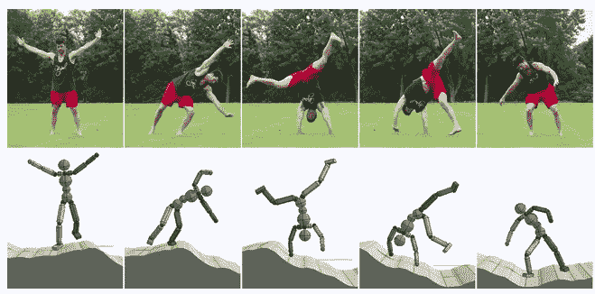

> 如果你喜欢读这篇文章，我相信我们有着相似的兴趣，并且现在/将来会从事相似的行业。那么我们就通过[***LinkedIn***](https://www.linkedin.com/in/mrinal-walia-b0981b158/)***和***[***Github***](https://github.com/abhiwalia15)***来连线吧。请不要犹豫发送联系请求！***

> 拥有良好的理论知识是惊人的，但在实时机器学习项目中用代码实现它们是完全不同的。基于其他问题和数据集，您可能会得到不同的意外结果。
> 
> 作为奖励，我还添加了各种课程的链接，这些链接在我学习数据科学和 ML 的过程中帮助了我很多。我个人是 [*DataCamp*](https://datacamp.pxf.io/x9nmvv) *的粉丝，我就是从它开始的，现在还在通过*[*data camp*](https://datacamp.pxf.io/x9nmvv)*学习，做新的课程。他们真的有一些令人兴奋的课程。一定要去看看。*
> 
> [*数据-科学家-python*](https://datacamp.pxf.io/LPDqQZ)
> 
> [*数据-科学家-与-r*](https://datacamp.pxf.io/MXQxrJ)
> 
> [*机器-学习-科学家-与-r*](https://datacamp.pxf.io/DVLg4j)
> 
> [*机器学习-科学家-python*](https://datacamp.pxf.io/9WePXW)
> 
> 
> 
> *[*数据科普*](https://datacamp.pxf.io/15bLmd)*
> 
> *[*数据工程师与 python*](https://datacamp.pxf.io/jW13ve)*
> 
> *[*数据分析师与 python*](https://datacamp.pxf.io/kjR3mz)*
> 
> *[*大数据-基础-via-pyspark*](https://datacamp.pxf.io/e4RM6r)*

# *回到主题:->*

# *1.开放姿势*

## *[Github 链接](https://github.com/CMU-Perceptual-Computing-Lab/openpose)*

## *[星星:19.6K |叉子:6K](https://github.com/CMU-Perceptual-Computing-Lab/openpose)*

## *[论文](https://arxiv.org/abs/1812.08008)*

*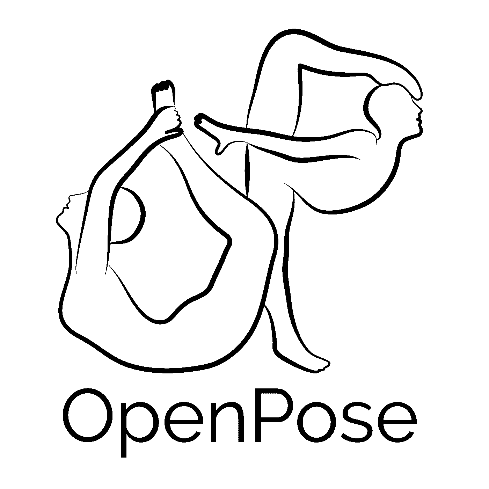*

*O[***pen pose***](https://github.com/CMU-Perceptual-Computing-Lab/openpose)代表了第一个*实时多人系统联合 ***检测单幅图像上的人体、手、面部、脚关键点(共 135 个关键点)。*****

## **Openpose 库的一些关键特性是:**

*   *****2D 实时多人关键点检测*****
*   *****3D 实时单人关键点检测*****
*   *****估计失真、内在和外在摄像机参数。*****
*   *****单人追踪，进一步加速或视觉平滑。*****
*   *****图像、视频、网络摄像头、Flir/Point Grey、IP 摄像头，并支持添加您的自定义输入源(如深度摄像头)。*****
*   *****基本图像+关键点显示/保存(PNG，JPG，AVI，…)，关键点保存(JSON，XML，YML，…)等。*****
*   *****自定义功能的 C++ API 和 Python API*****

**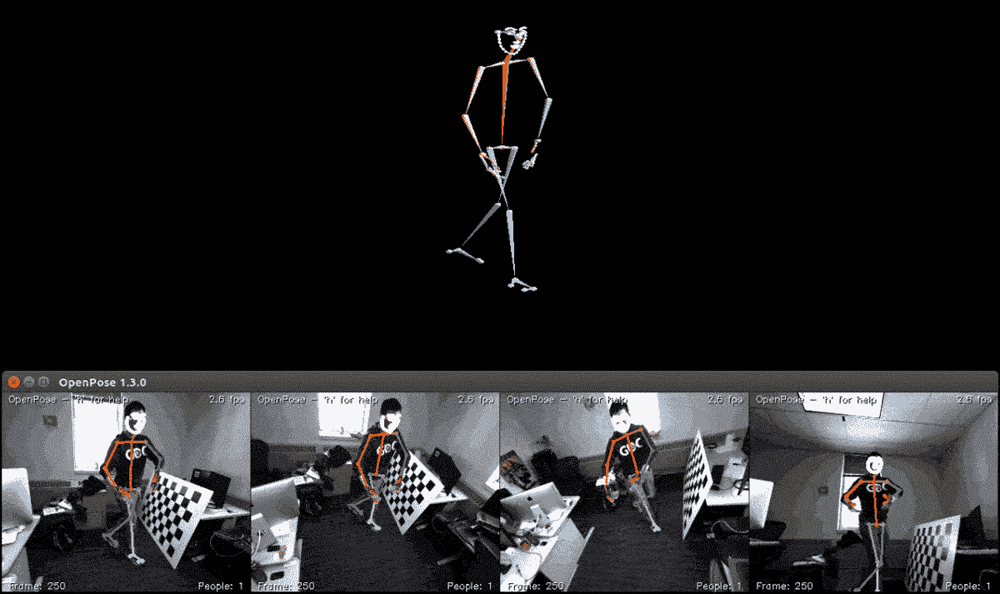****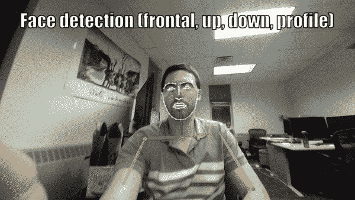****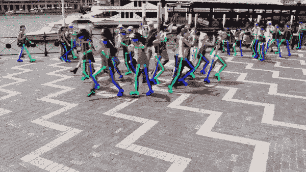****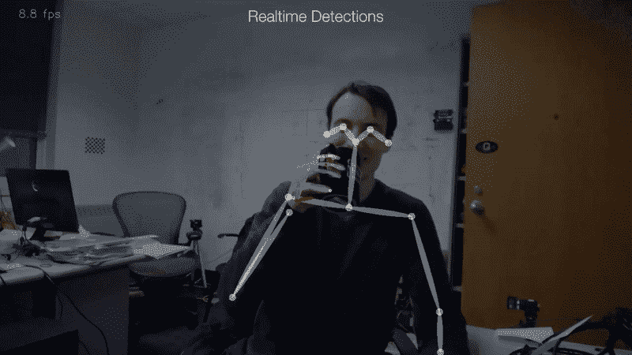**

# **2.AlphaPose**

## **[Github 链接](https://github.com/MVIG-SJTU/AlphaPose)**

## **[星星:4.7K |叉子:1.3K](https://github.com/MVIG-SJTU/AlphaPose)**

## **[官方文件](https://www.mvig.org/research/alphapose.html)**

**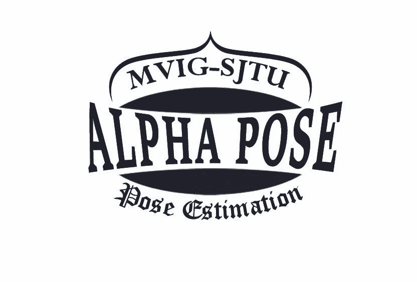**

**一个 [***lpha 姿态***](https://www.mvig.org/research/alphapose.html) 一个**非常精确的实时** ***多人姿态估计系统*** 。第一个开源系统可以在 *COCO 数据集*上实现***70+mAP(72.3 mAP)***，在 *MPII 数据集*上实现***80+mAP(82.1 mAP)***。**

** [## 在脑机接口中使用机器学习|数据驱动的投资者

### 神经技术是一个刚刚开始大步前进的前沿领域。有了所有的技术…

www.datadriveninvestor.com](https://www.datadriveninvestor.com/2020/07/31/using-machine-learning-in-brain-computer-interfaces/) 

跨帧关联指示同一个人的姿势还提供了一种高效的 ***在线姿势跟踪器，称为姿势流*** 。也是第一个开源的 ***在线姿态跟踪器*** 满足 ***60+地图(66.5 地图)******50+MOTA(58.3 MOTA)***在 *PoseTrack 挑战数据集上。*

[***alpha pose-py torch***](https://github.com/MVIG-SJTU/AlphaPose/tree/pytorch)在 *COCO* 验证集*上运行 ***20 fps*** 并达到 ***71 AP！****

*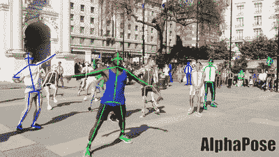****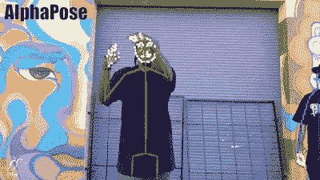*

## *主要特点:*

*   ****准确实时的多人关键点检测。****
*   ****输入:图像、视频、图像列表。****
*   ****输出:基本图像+关键点显示/保存(PNG，JPG，AVI，…)，关键点保存(JSON)，支持多种格式。****
*   ****可用:命令行演示、python 和 Lua 程序****
*   ****OS: Ubuntu****

# *3.实时多人姿态估计*

## *[Github 链接](https://github.com/ZheC/Realtime_Multi-Person_Pose_Estimation)*

## *[星星:4.5K |叉子:1.3K](https://github.com/ZheC/Realtime_Multi-Person_Pose_Estimation)*

## *[论文](https://arxiv.org/abs/1611.08050)*

*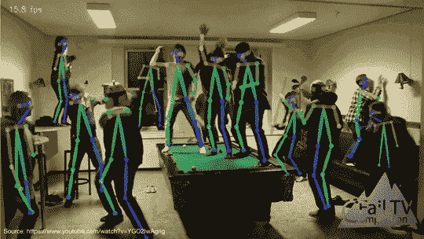**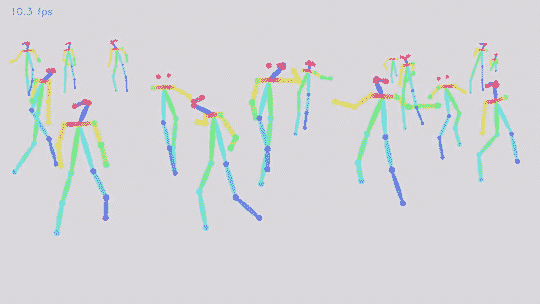*

*R [***实时多人姿态估计***](https://github.com/ZheC/Realtime_Multi-Person_Pose_Estimation) 提出了一种 ***自下而上的方法*** 用于 ***实时多人姿态估计*** 而不使用任何*人物检测器*。*

*该方法使用*非参数表示，我们称之为***【PAF】****来将身体部位与图像*中的个体相关联。**

**他们的方法在首届 **COCO 2016 关键点挑战赛中名列第一。它在 *MPII 多人基准*上，无论是 ***性能*** 还是 ***效率，都大幅超越了*** *之前的最新成果*。****

# **4.TF 姿态估计**

## **[Github 链接](https://github.com/ildoonet/tf-pose-estimation)**

## **[星星:3.8K |叉子:1.5K](https://github.com/ildoonet/tf-pose-estimation)**

## **[论文](https://arxiv.org/abs/1611.08050)**

**T [***F 姿态估计***](https://github.com/ildoonet/tf-pose-estimation) 是***【open Pose】***一种 ***人体姿态估计算法*** ，已经用 ***Tensorflow*** 实现。它还提供了几种变体，为 ***CPU*** 或 ***低功耗嵌入式设备上的*实时处理改变网络结构。******

**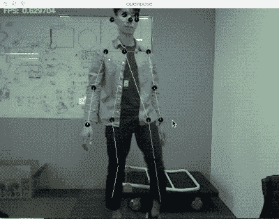****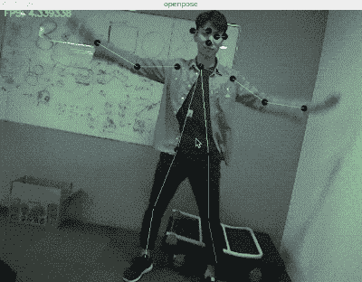****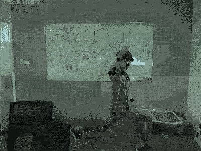**

**1\. CMU's Original Model
on Macbook Pro 15" | 2\. Mobilenet-thin
on Macbook Pro 15" | 3\. Mobilenet-thin
on Jetson TX2**

****要求:****

*   *****蟒 3*****
*   *****tensor flow 1 . 4 . 1+*****
*   *****opencv3，protobuf，python3-tk*****

# **5.OpenPifPaf**

## **[Github 链接](https://github.com/vita-epfl/openpifpaf)**

## **[星星:616 |叉子:124](https://github.com/vita-epfl/openpifpaf)**

## **[论文](https://arxiv.org/abs/1903.06593)**

**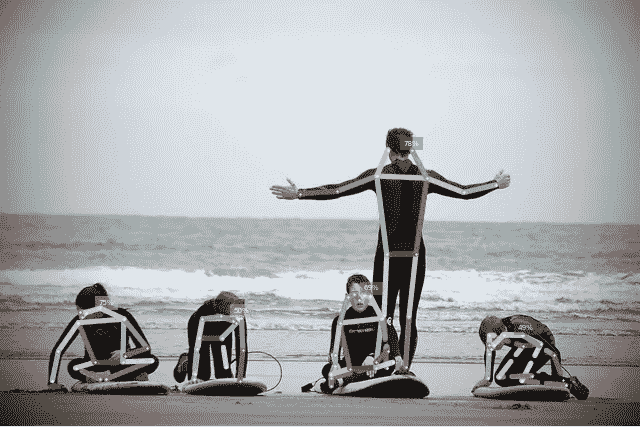**

**O**

**新方法 ***PifPaf*** 使用**部位强度场(PIF)** *来定位身体部位*和**部位关联场(PAF)** *来将身体部位*彼此关联以形成完整的*人体姿态。***

**论文[***“pif PAF:用于人体姿态估计的复合场”***](https://arxiv.org/abs/1903.06593) 是 *PyTorch* 中报告的正式实现。**** 

> ***如果你喜欢读这篇文章，我相信我们有着相似的兴趣，并且现在/将来会从事相似的行业。所以让我们通过 [LinkedIn](https://www.linkedin.com/in/mrinal-walia-b0981b158/) 和 [Github](https://github.com/abhiwalia15) 联系一下。请不要犹豫发送联系请求！***
> 
> ***如果你有兴趣阅读更多关于人体姿态估计的内容，我和我的同事发表了一篇关于“从单目 2d 图像恢复人体 3D 模型以检测姿态变形”的论文。希望对你有帮助。***