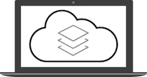
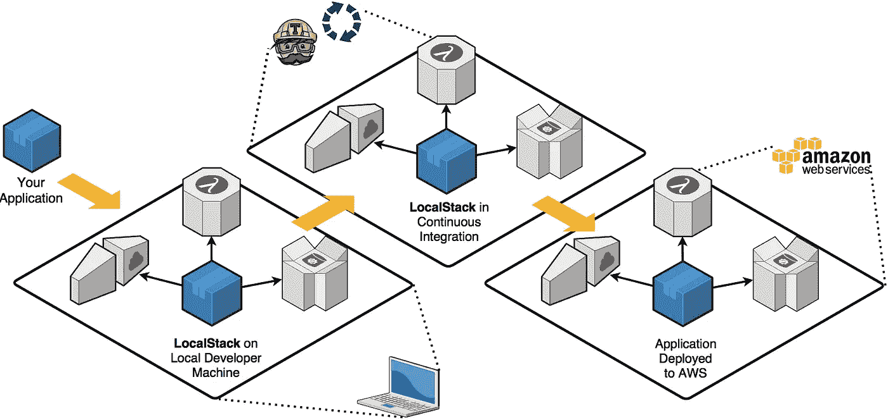
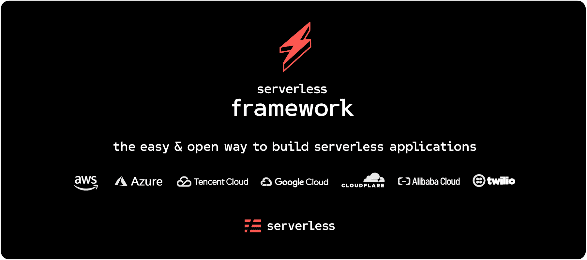
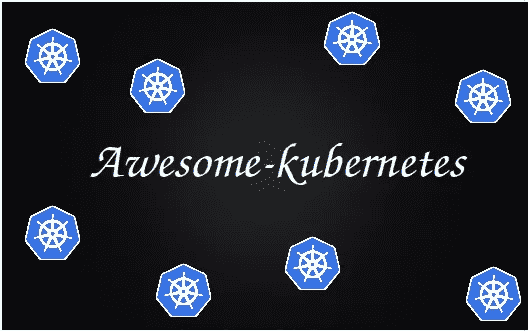

# 顶级且易于使用的开源 AWS(亚马逊网络服务)工具

> 原文：<https://medium.datadriveninvestor.com/top-and-easy-to-use-open-source-aws-amazon-web-services-tools-fcf91a96629c?source=collection_archive---------7----------------------->

## 亚马逊网络服务(Amazon Web Services)是亚马逊的一家子公司，以按量付费的方式向个人、公司和政府提供按需云计算平台和 API。[维基百科](https://en.wikipedia.org/wiki/Amazon_Web_Services)

A**mazon Web Services**(**AWS**)是世界上最全面、最广泛采用的云平台，提供来自全球数据中心的超过 175 种全功能服务。

> 一个**mazon Web Services**(**AWS**)**是 **IaaS** **(基础设施即服务)**和 **PaaS(平台即服务)**面向**云**生态系统的**市场领导者，这两者可以结合起来创建一个**可扩展的云应用**，而无需担心与计算、存储等基础设施供应相关的延迟

> 在今天的文章中，我们将讨论五种可用的开源 AWS(亚马逊网络服务)工具，你可以将它们包含在你的下一个项目中。
> 
> *注意:在这篇文章中，我们将讨论一些不太出名但是非常好的开源软件，你可以在你的项目中使用它们。要阅读更多关于它们的内容，我推荐你点击项目中给出的链接。*


> 学习不仅仅是为了更好地胜任工作，而且远不止于此。[***【data camp】***](https://datacamp.pxf.io/x9nmvv)*让我学无止境。*
> 
> [***data camp***](https://datacamp.pxf.io/x9nmvv)*为您提供所需的灵活性，让您可以利用自己的时间参加课程，学习向成功职业过渡所需的基本技能。*
> 
> [***【data camp】***](https://datacamp.pxf.io/x9nmvv)*教会了我快速获取新想法，并将其应用于现实世界的问题。当我还在学习阶段的时候，*[***data camp***](https://datacamp.pxf.io/x9nmvv)*让我对课程中发生的一切都着了迷，从课程内容和 TA 反馈到 meetups 活动和教授的 Twitter feeds。*
> 
> 这里有一些我最喜欢的课程，我强烈推荐你学习，只要它符合你的时间表和心情。你可以将从这些课程中学到的概念和技能直接应用到工作或大学中令人兴奋的新项目中。

1.  [使用 python 的数据科学家](https://datacamp.pxf.io/LPDqQZ)
2.  [数据科学家与 r](https://datacamp.pxf.io/MXQxrJ)
3.  [机器学习科学家与机器人](https://datacamp.pxf.io/DVLg4j)
4.  [使用 python 的机器学习科学家](https://datacamp.pxf.io/9WePXW)
5.  [面向所有人的机器学习](https://datacamp.pxf.io/kjR3mN)
6.  [人人共享的数据科学](https://datacamp.pxf.io/15bLmd)
7.  [使用 python 的数据工程师](https://datacamp.pxf.io/jW13ve)
8.  [使用 python 的数据分析师](https://datacamp.pxf.io/kjR3mz)
9.  [基于 pyspark 的大数据基础](https://datacamp.pxf.io/e4RM6r)

***回到正题-***

# 1.LocalStack — 27，447 颗恒星

## [Github](https://github.com/localstack/localstack) / [官方文档](https://localstack.cloud/)

L[**ocal stack**](https://localstack.cloud/)为开发*云应用提供了一个 ***易用的测试/模拟框架*** ，主要支持 ***AWS 云栈。****

*[***local stack***](https://localstack.cloud/)是一个全功能的本地 ***AWS 云栈*** 用来开发和测试你的 ***云&无服务器应用程序离线。****

**

*[***local stack***](https://localstack.cloud/)在您的本地机器上构建一个测试环境，提供与真正的 AWS 云环境相同的功能和***API。现在*** 您可以运行您的*****函数*****将数据存储到******表*** *，通过 Kinesis 流馈送事件，将您的应用程序置于 API 网关之后，以及在您的本地机器上执行更多操作*****

****

## **特点:**

****

*   *****启用高效开发&测试循环。几秒钟内在 Docker 本地部署您的应用程序。*****

****

*   *****为各种规模的开发团队节省大量成本。不需要云基础设施。*****

****

*   *****通过持续集成提高软件质量。停止推出未经测试的变更。*****

# **2.无服务器— 38，387 颗星**

## **[Github](https://github.com/serverless/serverless) / [官方文档](https://www.serverless.com/)**

**S [***无服务器***](https://github.com/serverless/serverless) 框架是一种 ***简单而自由的构建无服务器应用的方式。*** [***无服务器***](https://github.com/serverless/serverless) ***框架*** 允许您 ***使用 AWS Lambda、Azure Functions、Google CloudFunctions &等无服务器架构构建 web、移动和物联网应用。*****

****

**它是一个命令行工具，为开发和部署您的**无服务器** **架构**的**提供**脚手架**、**工作流自动化**和最佳实践。它还可以通过插件完全扩展。****

*****无服务器框架*** 由一个 ***开源 CLI*** 和一个托管仪表盘组成；此外，它们还为您提供全面的*无服务器应用生命周期管理*。 ***使用 ***无服务器框架，以极低的开销开发、部署、故障排除和保护您的无服务器应用*** 。*****

# *3.令人敬畏的库伯内特——10，818 颗星*

## *[Github](https://github.com/ramitsurana/awesome-kubernetes) / [官方文档](https://ramitsurana.github.io/awesome-kubernetes/)*

*一个[***we some Kubernetes***](https://github.com/ramitsurana/awesome-kubernetes)是一个 ***精选的令人敬畏的 Kubernetes 来源列表。Kubernetes 是一个开源系统，用于自动化部署、扩展和管理容器化的应用程序。*** 它将组成 ***应用程序的容器分组到逻辑单元中，以便于管理和发现。****

**

> *ubernetes 是一个用于自动化部署、扩展和管理容器化应用程序的开源系统。它将组成应用程序的容器分组到逻辑单元中，以便于管理和发现。*

## *它包括:*

*   ****文章****
*   ****案例分析****
*   ****项目多了****

# *4.AWS CLI — 10，400 颗星*

## *[Github](https://github.com/aws/aws-cli)*

*一个[***WS CLI***](https://github.com/aws/aws-cli)**是一个用于亚马逊 Web 服务的* ***通用命令行接口。***AWS-CLI 包在 Python 中工作。**

> **安装 AWS CLI 最安全的方法是在`virtualenv`中使用 [pip](https://pip.pypa.io/en/stable/) :**

```
*****$ python -m pip install awscli*****
```

****在使用 AWS CLI 之前，您需要配置您的 AWS 凭据。你可以通过几种方式做到这一点:****

*   ***配置命令***
*   ***环境变量***
*   ***共享凭证文件***
*   ***配置文件***
*   ***我的角色***

> **aws-cli 软件包包括一个用于类 Unix 系统的命令完成功能。此功能不会自动安装，因此您需要手动配置。要了解更多信息，请阅读 [AWS CLI 命令完成主题](https://docs.aws.amazon.com/cli/latest/userguide/cli-configure-completion.html)。**

# **5.令人惊叹的 AWS — 8，750 颗星**

## **[Github](https://github.com/donnemartin/awesome-aws)**

**A[***we some AWS***](https://github.com/donnemartin/awesome-aws)是一个令人敬畏的 AWS 库、开源库、指南、博客和其他资源的精选列表。**

****

## **它包含:**

*   *****SDK 和样本*****
*   *****命令行工具*****
*   *****IDE 工具包*****
*   *****开源回购*****
*   *****指南、书籍、文档和培训*****
*   *****社会*****
*   *****最新 KPI 和统计*****
*   *****核心服务附录*****

> **如果你喜欢读这篇文章，我相信我们有着相似的兴趣，并且现在/将来会从事相似的行业。那么我们就通过 [LinkedIn](https://www.linkedin.com/in/mrinal-walia-b0981b158/) 和 [Github](https://github.com/abhiwalia15) 来连线吧。请不要犹豫发送联系请求！**