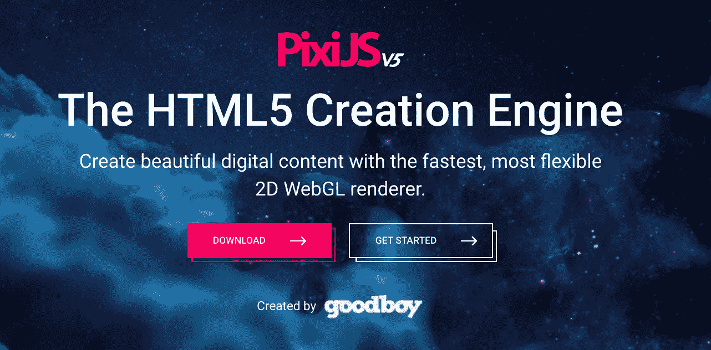
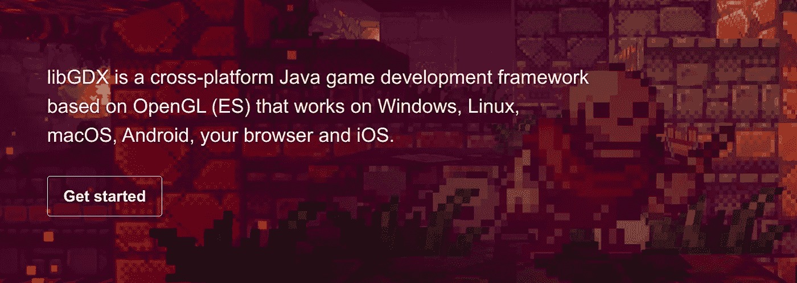
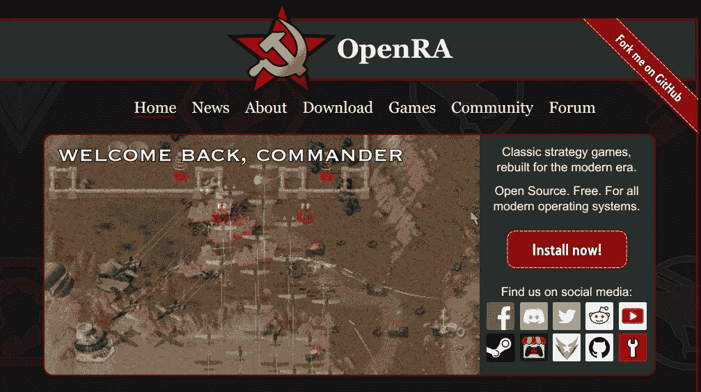
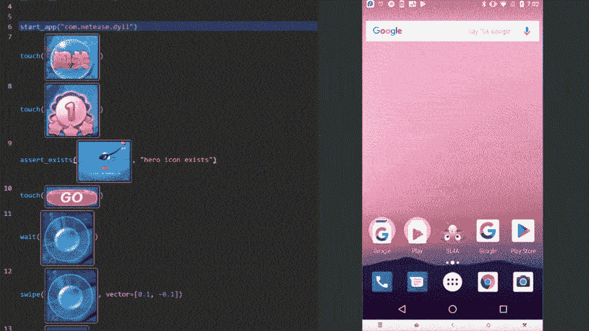
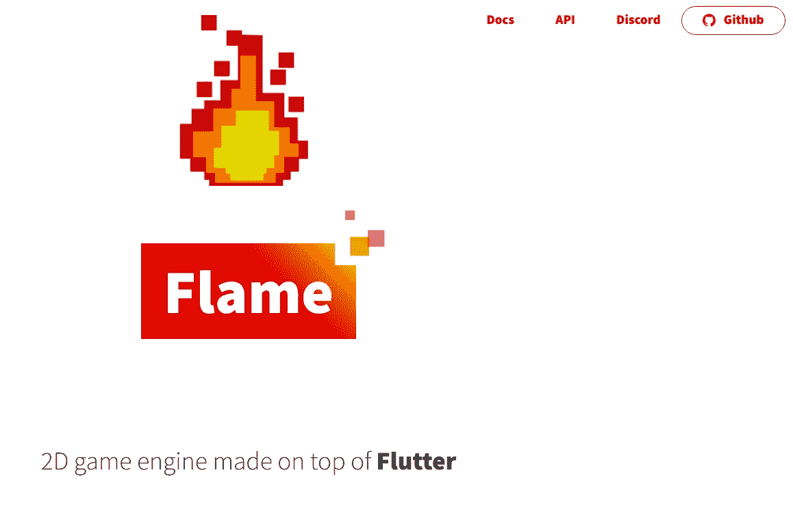

# 面向不同编程语言的顶级开源游戏开发框架和库

> 原文：<https://medium.datadriveninvestor.com/top-and-open-source-game-development-frameworks-and-libraries-for-different-programming-languages-30d71fe1d83d?source=collection_archive---------2----------------------->

> ***游戏开发是创造游戏的艺术，描述一款游戏的设计、开发和发布。它可能涉及概念生成、设计、构建、测试和发布。当你创建一个游戏时，考虑游戏机制、奖励、玩家参与和关卡设计*是很重要的。** [**freecodecamp**](https://www.freecodecamp.org/news/what-is-game-development/#:~:text=Game%20Development%20is%20the%20art,%2C%20build%2C%20test%20and%20release.&text=Game%20Development%20can%20be%20undertaken,or%20large%20as%20you%20like.)

## 在今天的文章中，我们将回顾 Github 上最好的免费和开源游戏开发框架和存储库的前五个选项。这篇文章是为那些想开始或者已经开始**游戏开发**的人准备的。高级开发人员也会发现这篇文章对他们的实践很有用。

**Source: unsplash.com**

> ***回到正题-***

# 1.Pixi.js — 30，880 颗星(针对 HTML5 用户)

P

你可以用它来创建 ***、丰富的、交互的图形、跨平台的应用和游戏*** ，而不用一头扎进 ***WebGL API*** 。它有完整的 WebGL 支持，如果需要的话，它可以无缝地回到 HTML5 的画布。

您可以将它用于您的 ***图形丰富的交互式网站、应用程序和 HTML5 游戏。***

> [Github 链接](https://github.com/pixijs/pixi.js) — [官方文档](https://www.pixijs.com/)

**Source:** [**https://www.pixijs.com/**](https://www.pixijs.com/)

# 2.LibGDX— 17，550 颗星(针对 Java 用户)

L[***ibgdx***](https://libgdx.com/)是一款*免费、开源、跨平台的* ***Java 游戏开发框架*** 基于 ***OpenGL，可在 Windows、Linux、macOS、Android、iOS 和您的浏览器上运行。***

它为快速原型和快速迭代提供了一个训练有素的健壮环境。 不仅是*开源，跨平台*也就是说它为你提供了 ***的功能，将相同的代码库发布到各种操作系统和平台，包括 Rasberry PI*** 。

 [## 新的健康技术如何让我们活过 100 岁？数据驱动的投资者

### 不久前，我们看了一台黑色电视，不得不带着天线跑遍整个公寓，以确保…

www.datadriveninvestor.com。](https://www.datadriveninvestor.com/2020/08/12/how-new-health-technology-makes-us-live-past-100-years/) 

这是一个超级快速、成熟可靠的框架，具有良好的基础和维护良好的文档，并得到了热情活跃的社区的大力支持。

> [Github 链接](https://github.com/libgdx/libgdx)——[官方文档](https://libgdx.com/)

**Source:** [**https://libgdx.com/**](https://libgdx.com/)

# 3.OpenRA — 8，680 颗星(针对 C#用户)

O[***penRA***](http://www.openra.net/)是一款*免费开源的* ***即时战略游戏引擎，用于早期的《命令与征服》等西林游戏。*** **OpenRA** 升级了 ***原版游戏标题，具有更高的保真度资产和 UI 改进*** ，同时将真实性优先于实际游戏体验。

***OpenRA 旨在为******重建和重新想象经典 2D 和 2.5D RTS 游戏提供一个通用平台。***

包括 ***对现代操作系统和屏幕分辨率的原生支持(包括 Windows 10、macOS 和大部分 Linux 发行版)***

> [Github 链接](https://github.com/OpenRA/OpenRA) — [官方文档](http://www.openra.net/)

**Source:** [**https://github.com/OpenRA/OpenRA**](https://github.com/OpenRA/OpenRA)

# 4.Airtest— 4，220 个统计数据(针对 Python 用户)

一个[***irtestProject***](http://airtest.netease.com/)是网易游戏 推出的一个 ***自动化测试框架。它提供了 ***跨平台 API******使用图像识别技术定位 UI 元素，以便您可以自动化游戏*** 。***

它是 ***完全可扩展的，*** 意味着它可以使用 ***命令行或 Python API*** 在大型设备群上*轻松运行*。**阿泰**附带了 ***AirtestIDE*** ，这是一个开箱即用的 ***GUI 工具，有助于以用户友好的方式创建和运行案例。***

[***Poco***](https://github.com/AirtestProject/Poco)增加了 ***跨主要平台和游戏引擎直接访问对象(UI 小部件)层次的能力。*** 它允许用 ***Python 编写指令来实现更高级的自动化。***

> [Github 链接](https://github.com/AirtestProject/Airtest) — [官方文档](http://airtest.netease.com/)

**Source:** [**http://airtest.netease.com/**](http://airtest.netease.com/)

# 5.火焰— 3 460 颗星(适用于 Flutter 用户)

F

***Flame*** 还支持与知名第三方和工具的 ***易用集成，像 Riveapp、box2d、tiled、Google Play 游戏、gamepad 支持等等。***

它提供了你在游戏中可能需要用到的工具:图像、精灵、精灵表、动画、音频、输入、组件/对象系统等。

> [Github 链接](https://github.com/flame-engine/flame)——[官方文档](https://flame-engine.org/)

**Source:** [**https://flame-engine.org/**](https://flame-engine.org/)

# 摘要

> ***在这篇文章中，你发现了一些在线免费开源*** *游戏开发框架和资源，可以帮助你开发下一款游戏。*
> 
> ***你有什么问题吗？
> 请在下面的评论中提出你的问题，或者通过我的社交媒体账户与我联系，我会尽力回答你的问题。***

> 也请在媒体上关注我，这激励我为你们写更多的内容
> 
> 如果您喜欢阅读这篇文章，我相信我们有着相似的兴趣，并且现在/将来会从事相似的行业。那么我们就通过[*LinkedIn*](https://www.linkedin.com/in/mrinal-walia-b0981b158/)*和*[*Github*](https://github.com/abhiwalia15)*来连线吧。请不要犹豫发送联系请求！*

## 访问专家视图— [订阅 DDI 英特尔](https://datadriveninvestor.com/ddi-intel)