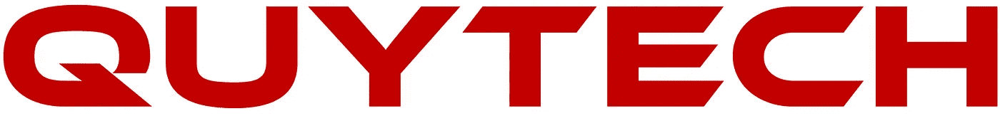
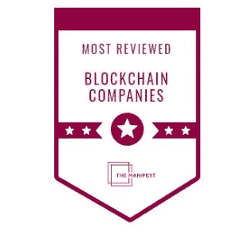
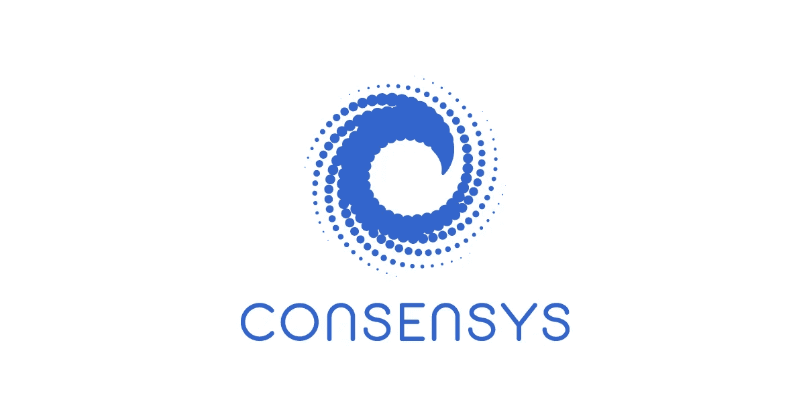
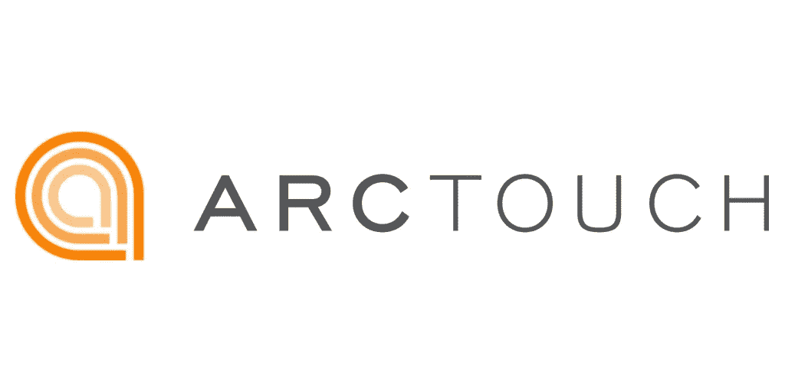
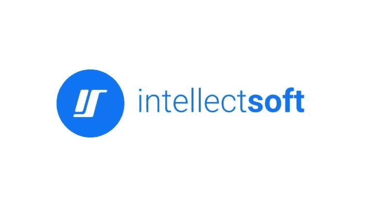
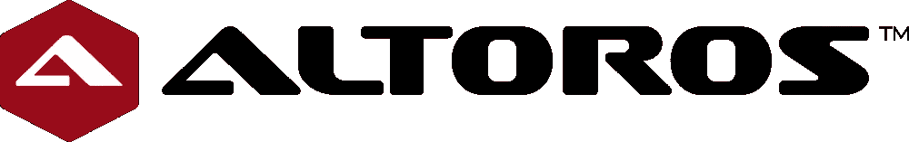
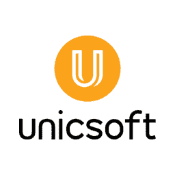
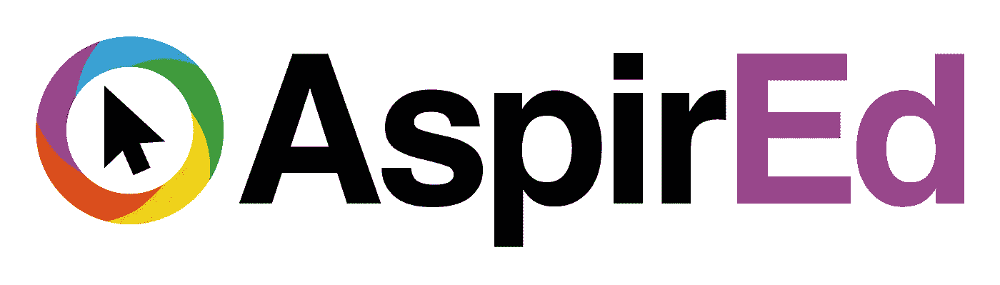
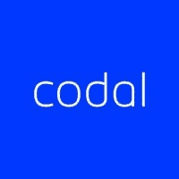

# 顶级区块链开发公司|为您的项目考虑的最佳区块链开发公司

> 原文：<https://medium.datadriveninvestor.com/top-blockchain-development-companies-in-usa-2020-4ed0e4cd159a?source=collection_archive---------4----------------------->

Best Blockchain Development Companies

嗨，读者们，

我知道你正在为你的生意寻找顶级的区块链发展公司！

因此，您可以提高您的业务和投资回报率。

正如你所知，在各种业务中，区块链技术被证明是一种严重的颠覆者。

这项技术显示出如此大的前景，以至于世界上最大的区块链技术公司 IBM 正在投资 2 亿多美元进行研发。

此外，几乎 90%的欧洲和美国银行都在寻找区块链技术的替代方案。

数百个行业可以被技术改造，包括政府、金融、保险和个人身份保护。

# 你在寻找最好的区块链发展公司吗？

区块链发展的概念是令人兴奋的，因为它是一个不可改变的数字记录数据的分布式分类账。

然而，作为一个不依赖于中央管理员的全球数据库，区块链技术最初仅限于金融交易的安全。

然而，随着新的案例研究的出现，区块链发展服务技术的应用已成为信息技术的一个新领域。因此，通过下面的列表，好的公司现在可以很容易地确定理想的区块链创业发展公司:

同样重要的是，你雇佣的区块链发展公司拥有丰富的经验和最新的技术和商业知识。

此外，如果你想聘请美国和印度的顶级区块链发展公司来做你的项目，你需要一个视野更开阔、有良好的 UI/UX 设计和分析技能的人。

以下要素可以帮助您选择最好的顶级区块链离岸应用程序开发公司:

*   研究一个移动应用程序开发服务提供商。
*   查看他们令人印象深刻的投资组合。
*   看看满意的顾客。
*   机密
*   找性价比高的代理。
*   询问维修和援助。

我们由经验丰富的分析师组成的团队已经梳理了最好的区块链开发公司，为您找到一个可以帮助您提高生产力和更好地管理交易的合作伙伴。

这里有一个顶级区块链开发公司的列表，包括经过验证的客户评论和评级，可以帮助你在美国和印度找到最可靠的离岸区块链应用程序开发者。

# **排名靠前的区块链开发公司列表如下:**

## **1。Quytech**

[Blockchain Development Company](https://www.quytech.com/blockchain-development-company.php)

Quytech 是区块链发展最好的公司之一，拥有多年的行业经验。从创意到设计和开发，我们最优秀的区块链开发人员凭借我们在区块链技术方面的实践经验，帮助您交付定制的区块链解决方案，包括以太坊、Hyperledger、EOS 和 Stellar 等框架。

Quytech -Most Trusted Blockchain Development Company

该服务提供商拥有区块链解决方案的实践经验，可为不同垂直业务领域的客户开发和部署定制的区块链应用。

为了向客户提供最物有所值的高度先进的区块链解决方案，我们是美国最受欢迎的 dapp 开发公司。

**关键事实:地点:**印度、美国、英国。，**团队规模:**150–200 人

**2。理事会**

**ConsenSys**

在所有最好的区块链开发公司中，ConsenSys 是领先的区块链开发公司。市场领先的区块链技术公司专注于区块链技术的收获，以推动下一代网络的发展。ConsenSys 的目标是通过构建应用程序、平台和 web 3.0 工具来进一步发展。区块链创业发展公司拥有世界领先的区块链专家，他们也可以与他人合作，使其成为区块链最好的发展公司之一。

**关键事实:地点:**加利福尼亚州旧金山，**团队规模:**250–999 人

**3。ArcTouch**

**ArcTouch**

ArcTouch 提供网络和移动应用/区块链开发服务已经有一段时间了，最近它开始涉足区块链开发。ArcTouch 是区块链顶级开发公司之一，这家离岸区块链开发公司还为物联网、定制 iOS、Android 和 Xamarin 应用以及亚马逊 Alexa 和 Facebook Messenger 等对话平台提供人工智能机器人解决方案。

**关键事实:地点:**印度、美国、英国。，**团队规模:**50–249 人

**4。智能软件**

**Intellectsoft**

Intellectsoft 的区块链编程实验室由顶级工程师、网络安全专业人士、顶级区块链开发专家和才华横溢的区块链开发人员管理，他们为区块链科技公司的快速增长做出了贡献。区块链开发公司对新兴技术的强烈关注是其在区块链架构中成功进行区块链开发的原因之一，它在最佳区块链开发公司中享有盛誉。

**关键事实:地点:**加州帕洛阿尔托，**团队规模:**251–1000 人

**5。加燃料**

**FUELED**

Fueled 是一家领先的区块链开发公司，其核心领域也是设计和开发各种平台上的移动应用程序，并满足从初创公司到大品牌的各种需求。该团队会考虑客户的所有要求，并相应地定制产品。此外，Fueled 还通过其区块链应用程序开发人员创建一些尖端产品，在区块链领域发挥了作用，因此被列入顶级区块链应用程序开发公司名单。

**关键事实:地点:****纽约市团队规模:**51–250 人

**6。阿尔托罗斯**

**Altoros**

Altoros 是一家区块链咨询和服务公司，协助将新想法转化为长期商品。

它是区块链最具活力的科技公司之一。它为新区块链技术、人工智能和云自动化提供完整的方法、新区块链技术构建模块、培训和端到端解决方案，以实现全面的开发流程。

**关键事实:地点:**加利福尼亚州桑尼维尔，**团队规模:**250–999 人

**7。Smartym Pro**

**Smartym Pro**

Smartym Pro 是一家全栈区块链应用程序开发公司，专门开发适合客户业务需求的在线和移动应用程序。

Smartym Pro 的员工保持着强大的开发文化，并保证使用区块链和其他尖端技术向业务提供创造性的解决方案。

**关键事实:地点:**英国，**团队规模:**50–249 人

**8。unisoft**

**Unicsoft**

Unicsoft 是一家将区块链的力量与机器学习的前沿技术结合在一个包中的公司。

作为一家软件应用和区块链开发公司，Unicsoft 在全球 IT 领域拥有近 12 年的经验。

这些年来，他们已经帮助无数的品牌和企业实现了他们的目标业务成果。

**关键事实:地点:**美国加利福尼亚州，**团队规模:**50–249 人

9。立志

**Aspired**

Aspired 通过精心挑选全球最优秀的人才，帮助其客户雇佣和建立一支远程自主敬业的员工队伍。我们的专家团队寻找新的和发展中的创新中心，并将我们的顶级工程师与致力于解决挑战性问题的公司相匹配。

**关键事实:地点:**美国，**团队规模:**50–249 人

10。Codal

**Codal**

Codal 通过软件开发帮助企业转变为精简、支持性和前瞻性的运营。我们的数据驱动、经过市场检验的敏捷流程证明了 Codal 的一个核心信念:不满足用户确切需求的解决方案不是解决方案。

**关键事实:**

*   地点:伊利诺伊州，芝加哥
*   团队规模:250–499 人

每个公司都是独一无二的，为市场提供一些特别的东西。每个区块链发展公司的 USP 都在展示其突出地位的专业中展出。您可以通过我们的电子邮件 id 直接联系我们，以更好地了解应用开发或 Android 应用公司，我们将尽最大努力尽快解决您的问题。你也可以参考我特别列出的最好的应用程序开发企业，这些企业是根据不断变化的技术趋势精心挑选的。

> **阅读还:** [**区块链在博彩业**](https://www.quytech.com/blog/blockchain-technology-in-game-development/)

一家顶级的区块链应用程序开发公司有哪些专长？

一般来说，一个区块链开发者致力于区块链系统的创建。

**主要任务包括:**

*   区块链协议的发展。
*   网络架构设计。
*   网络安全模式正在发展。
*   创建自定义应用程序框架和智能联系人以及更多功能

区块链开发者精通各种语言，包括 Python、Java、C++，具有很强的分析能力。

寻找最好的离岸区块链开发公司的最佳途径是什么？

*   在寻找区块链应用程序开发业务之前，确保你知道你想要实现什么。
*   考虑您的规格和您想要获得的最终结果。你的目标越具体，你就能越快地找到一个能实现这些目标的区块链开发团队。
*   最后，考虑区块链开发的成本，以及你可以在这项技术上投资多少钱。
*   然后，为了评估这些公司中的哪一个适合你的预算，向他们索取一份估价。

区块链的概念可以追溯到 20 世纪 90 年代。

**在雇佣区块链发展公司之前，先问下面这些问题:**

*   你能概述一下你在区块链的发展经历吗？
*   这项技术如何让我的公司受益？
*   它能保持什么样的记录？有什么我们需要知道的限制吗？
*   将使用哪些方法来分析和存储数据？
*   用什么方法保证数据安全？
*   你利用什么平台来创造定制的区块链产品
*   你对开发过程采取什么策略？
*   你用什么工具来管理你的项目？
*   哪些团队成员将参与我们的项目，我们应该多久交流一次？
*   你用什么方法来创建你的定价结构？我的项目成本是多少？

最美好的祝愿！

**包装**

上面的列表包括了一些美国最好的区块链发展公司。那些寻求区块链解决方案或区块链发展服务的人可以向他们提出具体的业务需求。在你最终确定之前，建议检查他们的投资组合，看看客户的推荐。