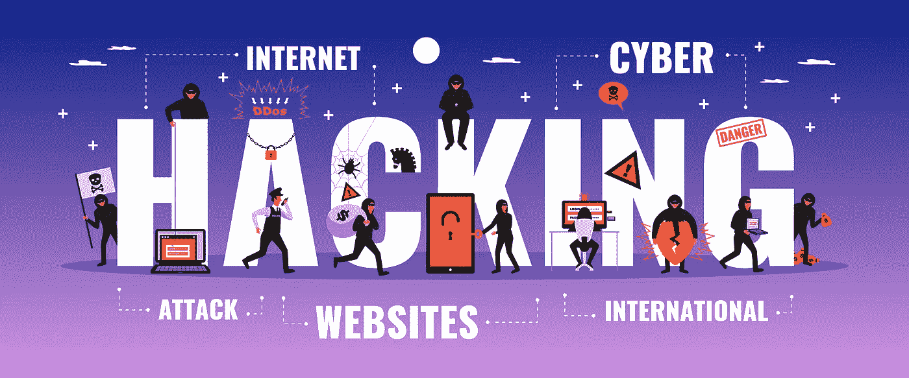
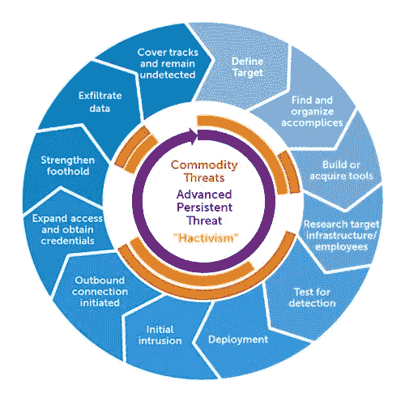
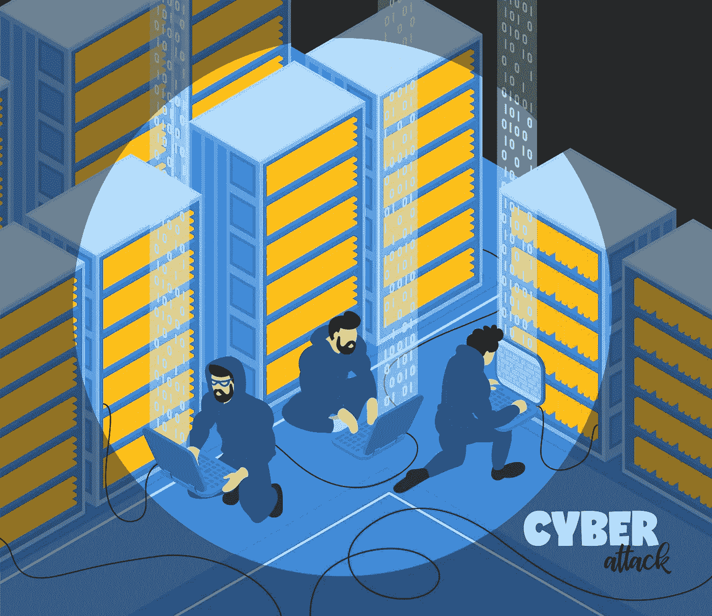
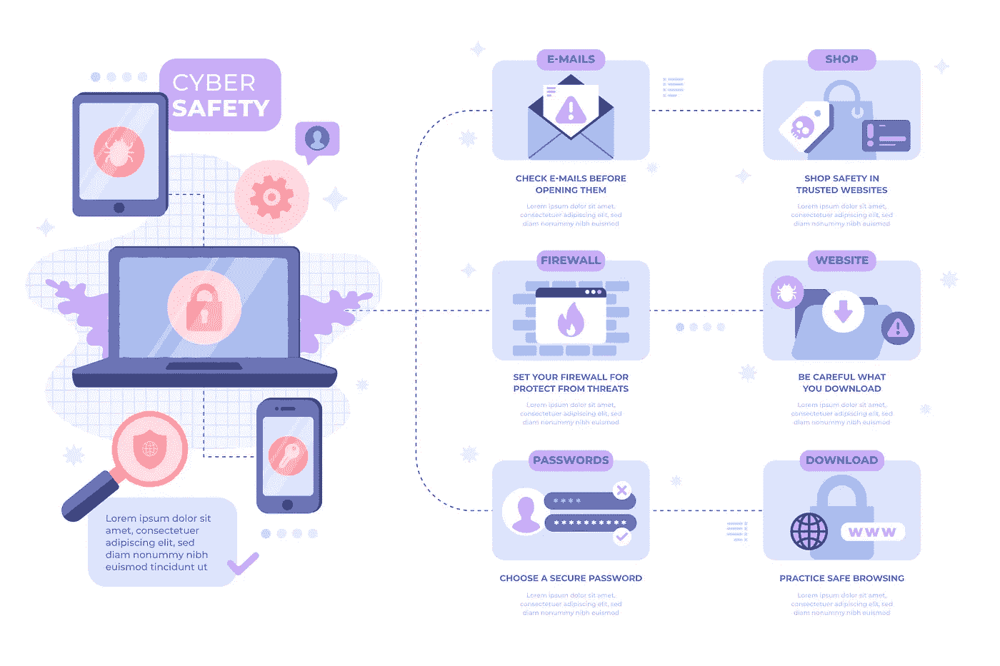

# ☠是最著名、最危险、最活跃的 APT 组织，他们能把生活变成☠的噩梦

> 原文：<https://medium.datadriveninvestor.com/top-famous-and-active-apt-groups-who-can-turn-life-to-a-nightmare-5d130168f43?source=collection_archive---------1----------------------->

## APT 小组利用这段时间来检测漏洞，并利用它们来获取对给定目标的访问权限。大多数 APT 团队通过使用先进而复杂的技术、战术和程序以及定制的恶意软件来躲避雷达。

## 什么是 APT？

APT(高级持续威胁)是一种复杂的长期恶意攻击，它似乎通过在成功突破网络之前对目标基础架构进行数月或数年的间谍活动来进行长期攻击。

— <’[https://www.freepik.com/vectors/design'](https://www.freepik.com/vectors/design')> Sale vector created by macrovector —

## APT 生命周期是什么意思？

APT 攻击是精心策划的，旨在渗透到某个特定的组织，绕过现有的安全措施，并在雷达下飞行。这是一种使用多个阶段和不同攻击技术的组合攻击。运行 APT 攻击需要结合组织的基础架构、安全策略和程序的高级知识，并使用复杂的策略。几乎所有的 APT 攻击都遵循如下图所示的 APT 生命周期。

Advanced Persistent Threat Life Cycle (Wikipedia)

**初始入侵**通过使用社交工程和鱼叉式网络钓鱼(使用零日病毒或在受害者可能访问的网站上植入恶意软件)来执行。**出站连接启动**是在受害者的网络中植入远程管理软件，创建网络后门和隧道，允许秘密访问其基础设施。**扩大权限和获取凭证**是升级特权。即利用漏洞获取受害者计算机的管理员权限，并可能扩展到域管理员帐户。**巩固立足点**正在将控制扩展到其他工作站、服务器和基础设施元素，并在其上执行数据采集。在**导出数据**之后，所有**轨道都被覆盖**以保持对未来计划的访问。

— <’[https://www.freepik.com/vectors/design'](https://www.freepik.com/vectors/design')> Design vector created by macrovector —

## **黑客团体和 APT 团体有什么区别？**

这些团伙与其他网络犯罪分子不同，他们倾向于适应防御措施，并可以在系统中保持数月甚至数年的存在。

大多数黑客攻击都是一种快速的破坏性攻击，但 apt 采取了一种不同的、更具战略性和隐蔽性的方法。攻击者通过特洛伊木马或网络钓鱼等传统恶意软件进入网络，但随后他们隐藏自己的踪迹，秘密地四处活动，并在整个网络中植入他们的攻击工具。

*   APT 组织发起的攻击比通常的黑客攻击更加老练和复杂。
*   APT 团队由具有深厚技术背景的高素质、有能力且难以捉摸的成员组成。
*   黑客组织背后的动机通常是财务或政治上的，而 APT 组织背后的动机大多是战略上的。
*   总的来说，APT 组织是一个民族国家或国家支持的组织，他们拥有更好更先进的设备，并且已经有了经济保障。

— <’[https://www.freepik.com/vectors/people'](https://www.freepik.com/vectors/people')> People vector created by pch.vector —

## **为什么 APT 攻击如此恐怖？**

因为 APT 就大不一样了。APT 攻击者训练有素，资金充足，并有长期目标。GhostNet、ShadowNet 和 Operation Aurora 是 APT 攻击的一些例子。APT 组织攻击这些组织，并使用先进的策略来感染和渗透他们的网络。袭击者没有毁坏任何东西。他们只是在不惊动任何人的情况下收集尽可能多的信息。

攻击者选择一个目标，评估其安全性，并使用特殊的技术、工具和程序。在 APT 网络环境中，大多数工具都是定制的，是专门为受害组织或实体定制的，这使得这些类型的攻击更加有害。

例如，2010 年 1 月，一次被安全专家称为“极光行动”的协同网络攻击针对至少 34 家公司，包括谷歌和 Adobe。黑客使用复杂的策略和爬行程序来渗透公司网络，并在搜索系统中被盗信息时隐藏自己的存在。

— <’[https://www.freepik.com/vectors/technology'](https://www.freepik.com/vectors/technology')>Technology vector created by vectorpouch —

## **谁是 APT 群体？**

APT 组织是典型的威胁行动者，他们接受民族国家的指导和支持，目标通常包括数据窃取、情报、破坏和破坏。APT 攻击的目标是处理高质量信息或情报的政府，包括军事行动、安全文件、高级军事技术文档等敏感信息。

几乎不可能列出每一个 APT 团体，因为他们是保密的，没有足够的信息；相反，我们为这篇文章列出了最著名和最活跃的公司。

## ☠ **APT1(解放军 61398 部队)**

APT1 是一个中国威胁集团，隶属于中国人民解放军(PLA)总参谋部第二局(GSD)第三部，通常以其军事单位代号(MUCD)61398 为单位。

**起源:**据称与中国有联系

**约定:**

*   幽灵网行动
*   极光行动
*   可疑老鼠行动

*Operation Aurora:* 此次攻击的目标是数十家其他组织，包括 Adobe Systems Akamai Technologies、Juniper Networks、Rackspace、雅虎、赛门铁克、诺斯罗普·格鲁曼、摩根士丹利、陶氏化学和黑莓。

**关联恶意软件:**木马。ECLTYS 后门。BARKIOFORK 后门。韦克米纳普，特洛伊。下机器人，后门。达尔博特，后门。瑞沃德特洛伊。BADNAME，BACKDOOR.WUALESS。

**别名:**行动“午睡”，第 3 组，上海组，棕狐，评论熊猫，评论组，行动“海盐”，行动“海盐”，解放军 61398 部队，评论机组，拜占庭坎多，沙迪拉特，拜占庭哈迪斯，TG-8223，棕狐，GIF89a。

**目标国家:**新加坡、加拿大、南非、美国、瑞士、挪威、中国台湾、以色列、卢森堡、阿联酋、英国、比利时、法国、印度、日本。

**目标行业:**建筑、能源、工程、食品和农业、研究、采矿、IT、教育、媒体、高科技、非营利组织、制造、政府、卫星、娱乐、交通、电信、医疗保健、私营部门、航空航天、金融、化工。

CVE 2020–11023，CVE 2019–11358，CVE 2020–11022，CVE 2015-9251。

## ☠ **APT41(双龙)**

APT41 是一个从事中国政府支持的间谍活动和经济活动的组织。APT41 早在 2012 年就已经开始活动。据观察，该组织针对 14 个国家的医疗保健、电信、技术和视频游戏行业。

**来源:**据称与中国有联系

**约定:**

*   2020 年 9 月，该组织被美国司法部(US Department of Justice)点名，指控 5 名中国人和 2 名马来西亚人涉嫌危害全球 100 多家公司。
*   观察到的 APT41 目标与中国将高端生产能力转移到研发(R&D)密集型领域的国家战略一致。这些计划在 2015 年公布的“中国制造 2025”中得到特别强调，该计划旨在将中国经济转向更高价值的产品和服务，包括制药、半导体和其他高科技产业。

**关联恶意软件:**至少使用了 46 种不同的代码家族和方法来观察 APT41。

**别名:**双龙，72 组，温提，72 组，APT 41，Axiom，APT 22，Tailgater 团队，Ragebeast，行动“SMN”，邪恶熊猫，副狗，Dogfish，邪恶蜘蛛，温提伞，钡，行动“影锤”，Pigfish，Blackfly，温提组，Tailgater，Suckfly，APT17。

**目标国家:**南非、中国、泰国、菲律宾、比利时、法国、波兰、德国、中国香港、俄罗斯、土耳其、秘鲁、芬兰、瑞士、中国台湾、墨西哥、马来西亚、意大利、瑞典、英国、美国、白俄罗斯、缅甸、荷兰、印度尼西亚、卡塔尔、阿联酋、日本、新加坡、加拿大、澳大利亚、韩国、越南、沙特阿拉伯、巴西、印度、丹麦。

**目标行业:**建筑、工业能源、在线视频游戏公司、石油和天然气、石化、教育、航运和物流、媒体、制药、高科技、制造、政府、技术、国防、零售、运输、娱乐、电信、医疗保健、私营部门、金融行业、航空航天。

**简历:**CVE-2018–0802，CVE-2017–11151，CVE-2019–19781，CVE-2019–16920，CVE-2019–11510，CVE-2019–1652，CVE-2019–1653，CVE-2019–16278，CVE-2020–10189。

## ☠ **APT35(迷人的小猫)**

APT35 是一个伊朗支持的威胁组织，主要在中东活动，最早可追溯到 2014 年。该运动背后的组织主要针对能源、政府和技术部门的组织，这些组织要么总部设在沙特阿拉伯，要么在沙特阿拉伯有商业利益。

**起源:**据称与伊朗有关联

**约定:**

*   藏红花玫瑰行动
*   切肉刀行动
*   HBO 网络攻击

藏红花玫瑰行动主要针对美国国防组织，最近对美国国防工业基地(DIB)公司进行了几次网络间谍行动。

**关联恶意软件:** POWBAT，POWRUNER，BONDUPDATER。

**初级攻击方式:**账号访问。

**别名:**魔犬，临时。Beanie，Tarh Andishan，TG-2889，Ghambar，第 41 组，Cleaver 操作，Rocket_Kitten，Cobalt Gypsy，Cutting Kitten，磷，Ajax Security，NewsBeef，Turk Black Hat。

**目标国家:**中国、以色列、巴基斯坦、法国、德国、科威特、土耳其、墨西哥、英国、美国、荷兰、卡塔尔、阿联酋、加拿大、韩国、沙特阿拉伯、印度。

**目标行业:**运输、公用事业、电信、能源、航空、教育、医疗保健、私营部门、政府、技术、航空航天、金融、石油和天然气、化工、国防。

## ☠ **APT33(小精灵战队)**

APT33 是一个可疑的伊朗威胁团体，至少自 2013 年以来一直在开展行动。该组织瞄准了美国、沙特阿拉伯和韩国多个行业的组织，尤其是航空和能源行业。

**来源:**据称与伊朗有联系

**约定:**

*   2018 年 2 月 12 日下午 4:45(所有时间均为当地时间)向广告公司发送了一封电子邮件，要求其全球供应商提供离岸工作。邮件中有恶意连接到 xxp:/mynetwork.ddns(DOT):880。接收者点击连接，开始安装嵌入的 iframe，打开了一个恶意的 HTML 可执行文件。插入到该文件中的代码还执行了 PowerShell 命令，该命令用于在服务器上导入和运行 chfeeds.vbe 的副本。
*   2018 年 12 月，Shamoon 的最新一波攻击将 Elfin 带到了聚光灯下。然而，赛门铁克没有发现额外的信息表明 Elfin 对这些攻击负有责任。

**关联恶意软件:** SHAPESHIFT，DROPSHOT，TURNEDUP，NANOCORE，NETWIRE，ALFA Shell。

**主要攻击方式:** Shamoon、Mimikatz、PowerSploit、Spyware。

**别名:**小精灵队，精炼小猫，镁铝，钬。

**目标国家:**沙特阿拉伯、韩国、美国。

**目标部门:**私营部门。

## ☠ **APT38(拉扎勒斯集团)**

APT38 是一个受朝鲜政权支持的以金钱为动机的威胁组织。该组织主要针对银行和金融机构，至少自 2014 年以来已针对至少 13 个国家的超过 16 个组织。

**来源:**据称与朝鲜有联系

**约定:**

*   特洛伊行动
*   2013 年韩国网络攻击
*   索尼影业黑客
*   重磅炸弹行动
*   恶意攻击
*   2017 年加密货币攻击
*   2019 年 9 月袭击

该组织攻击了索尼电影公司，大量数据遭到破坏并慢慢泄露。它要求索尼删除即将上映的电影《采访》，这是一部关于朝鲜领导人金正恩谋杀阴谋的喜剧。黑客们能够在电影上映前接触到电影、电子邮件以及大约 4000 名员工的敏感信息。

**关联恶意软件:**各种定制恶意软件家族，包括后门、隧道器、数据挖掘器和破坏性恶意软件。

**初级攻击方式:**勒索软件(WannaCry，MimiKatz)。

**别名:**行动“VANXATM”、锌、特洛伊行动、T-APT-15、“火焰”行动、“黑矿”行动、Appleworm、Hastati 集团、黑暗首尔行动、拉扎勒斯集团、“北极星”行动、“沙漠之狼”行动/第 3 期、“五月天”行动、“重磅炸弹”行动:索尼影视娱乐公司违约、黑暗首尔、“快速兑现”行动、“INITROY”/第 2 期、第 77 组、“在(ter)字幕中”行动、“害群之马”/第 3 期。、121 局、ATK 117、ITG03、APT-C-26、部门 A01、幽灵秘密行动、镍学院、APT38、新罗马网军小组、特洛伊行动、幽灵秘密行动、分组:Bluenoroff、安达利尔、星尘千里马、INITROY 行动/第一阶段、GoldenAxe 行动、Bluenoroff、无声千里马、十天雨行动/"黑暗首尔"、神枪手行动、121 单位、AppleJeus sequel 行动、行动

**目标国家:**中国、泰国、厄瓜多尔、菲律宾、以色列、法国、德国、波兰、香港、俄罗斯、台湾、墨西哥、英国、美国、智利、危地马拉、日本、孟加拉国、加拿大、澳大利亚、韩国、越南、巴西、印度。

**目标行业:**工程、私营部门、媒体、政府、技术、金融、航空航天。

## ☠ **APT37(跳弹千里马)**

APT37 是一个疑似朝鲜网络间谍组织，至少自 2012 年以来一直活跃。该组织主要针对韩国的受害者，但也有日本、越南、俄罗斯、尼泊尔、中国、印度、罗马尼亚、科威特和中东其他地区的受害者。

**起源:**据称与朝鲜有联系

**约定:**

*   黎明行动
*   Erebus 行动
*   黄金时间
*   邪恶的新年
*   你开心吗？
*   免费牛奶
*   朝鲜人权
*   邪恶新年 2018

**别名:**跳弹千里马

**目标国家:**中国、泰国、厄瓜多尔、菲律宾、以色列、法国、德国、波兰、香港、俄罗斯、台湾、墨西哥、英国、美国、智利、危地马拉、日本、孟加拉国、加拿大、澳大利亚、韩国、越南、巴西、印度。

## ☠ **APT28(花式熊)**

APT28 是一个威胁组织，根据 2018 年 7 月美国司法部的起诉书，该组织被归因于俄罗斯总参谋部的俄罗斯主要情报总局。据报道，这个团体在 2016 年妥协了希拉里·克林顿竞选团队、民主党全国委员会和民主党国会竞选委员会，企图干扰美国总统选举。APT28 至少自 2004 年以来一直活跃。

**来源:**据称与俄罗斯联邦有联系

**约定:**

*   对俄罗斯、美国、乌克兰、摩尔多瓦、波罗的海和其他地方著名记者的攻击
*   德国人的攻击
*   美国军人妻子的死亡威胁
*   法国电视黑客
*   root9B 报告
*   EFF 恶搞，白宫和北约攻击
*   荷兰安全委员会和 Bellingcat
*   民主党全国委员会黑客
*   乌克兰炮兵
*   Windows 零时差
*   荷兰各部
*   国际田径联合会协会
*   国际奥林匹克委员会
*   瑞典体育联合会
*   美国保守团体
*   普世牧首辖区和其他神职人员
*   2018 年起诉
*   2019 智库攻击事件
*   2019 战略性捷克机构
*   2020 年德国当局的逮捕令

2016 年第一季度，Fancy Bear 对 DNC 的电子邮件地址进行了鱼叉式网络钓鱼攻击。Hillaryclinton.com 的地址也遭到了攻击。五万封邮件被盗。

相关恶意软件:筷子，酸脸。

**主要攻击方式:**鱼叉式钓鱼、Mimikatz、Coreshell。

**别名:**钇、花式熊、SIG40、沙皇、ATK 5、行动“俄罗斯娃娃”、卒风暴、沙皇团队、公爵、行动“幽灵”、燕尾蝶、ATK 7、行动“交易者选择”、锶、行动“Komplex”、ITG05、铁暮光、行动“办公室猴子”、ITG11、TAG_0700、灰熊草原、74 组、铁毒芹、铁暮光、行动“卒风暴”、Sednit、行动“亲爱的 Joohn”、T-APT-12、APT _ 1

**目标国家:**乌克兰、南非、黎巴嫩、中国、挪威、蒙古、泰国、以色列、哈萨克斯坦、巴基斯坦、法国、阿富汗、德国、俄罗斯、波兰、黑山、立陶宛、土耳其、罗马尼亚、斯洛伐克、瑞士、墨西哥、马来西亚、西班牙、卢森堡、瑞典、英国、乌干达、克罗地亚、葡萄牙、欧盟委员会、美国、白俄罗斯、爱尔兰、塔吉克斯坦、拉脱维亚、智利、阿塞拜疆、荷兰、约旦、北约、亚美尼亚、车臣、亚太经合组织、伊拉克、伊朗、日本、格鲁吉亚、阿联酋、加拿大、澳大利亚、保加利亚、OSCE、吉尔吉斯斯坦、捷克共和国、新

**目标行业:**执法、建筑、工业能源、航空、工程、大使馆、石油和天然气、IT、教育、媒体、制药、智库、汽车、非政府组织、政府、国防、军事、交通、电信、医疗保健、金融、化工。

**简历:**CVE-2017–0213，CVE-2019–1458，CVE-2015–1701，CVE-2020–0796，CVE-2019–11510，CVE-2019–18935。

## ☠ **APT29(惬意的熊)**

APT29 是一个被认为是俄罗斯政府的威胁组织，至少从 2008 年开始运作。据报道，这个团体从 2015 年夏天开始危害民主党全国委员会。

**来源:**据称与俄罗斯联邦有联系

**约定:**

*   办公室猴子
*   五边形
*   民主党全国委员会
*   美国智库和非政府组织
*   挪威政府
*   荷兰各部
*   幽灵行动
*   新冠肺炎疫苗数据

舒适熊与针对五角大楼电子邮件系统的惊人网络攻击有关，该攻击在 2015 年 8 月调查期间关闭了所有联合工作人员。

**关联恶意软件:** HAMMERTOSS，TDISCOVER，UPLOADER。

**别名:** Dukes，100 组，Cozy Duke，EuroAPT，CozyBear，CozyCar，Cozer，Office Monkeys，Office Monkeys，Cozy Bear，The Dukes，Minidionis，SeaDuke，Hammer Toss，钇铁铁杉，灰熊草原。

**目标国家:**比利时、巴西、中国、格鲁吉亚、印度、日本、哈萨克斯坦、墨西哥、新西兰、葡萄牙、罗马尼亚、韩国、土耳其、乌克兰、美国。

**目标部门:**政府和私营部门。

**CVEs:**CVE-2019-17026，CVE-2020-0674，CVE-2019-9670，CVE-2018-13379，CVE-2019-19781，CVE-2019-11510。

## ☠ **方程式集团**

卡巴斯基的研究人员记录了方程式集团在至少 42 个国家的 500 例感染病例，其中伊朗、俄罗斯、巴基斯坦、阿富汗、印度、叙利亚和马里高居榜首。由于恶意软件内置了自毁机制，研究人员怀疑这只是总数的很小一部分；受害者的实际人数可能达到数万人。一长串近乎超人的技术专长彰显了方程式集团非凡的技能、艰辛的工作和无限的资源。

**原产地:**指称与美国有联系

**交战:**

*   使用虚拟文件系统，这一特性也存在于高度复杂的 Regin 恶意软件中。爱德华斯诺登最近提供的文件显示，NSA 利用 Regin 感染了部分国有的比利时公司 Belgacom。
*   恶意文件隐藏在受感染计算机注册表的多个分支中。通过加密所有恶意文件并将它们存储在计算机 Windows 注册表的多个分支中，使用防病毒软件无法检测到感染。
*   将发送给 iPhone 用户的重定向到独特的漏洞利用网页。此外，向 Equation Group 命令服务器报告的受感染计算机将自己标识为 Macs，这表明该组已成功危及 iOS 和 OS X 设备的安全。
*   使用 300 多个互联网域和 100 台服务器来承载庞大的指挥和控制基础架构。
*   一种基于 u 盘的侦察恶意软件，用于测绘有漏洞的网络，这些网络非常敏感，无法连接到互联网。Stuxnet 和相关的 fire 恶意软件平台也有能力弥补漏洞。
*   这是一种不寻常但并非真正新颖的方法，可以绕过现代 Windows 版本中的代码签名限制，这些限制要求与操作系统内核接口的所有第三方软件都由公认的证书颁发机构进行数字签名。为了规避此限制，Equation Group 恶意软件利用已签名的 CloneCD 驱动程序中的已知漏洞来实现内核级代码执行。综上所述，这些成就让卡巴斯基研究人员得出结论，Equation Group 可能是世界上最复杂的计算机攻击团体，其技术技能和资源可以与“奥林匹克运动会行动”中开发 Stuxnet 和 fire 间谍软件的团体相媲美。美国国家安全局其他公开曝光的重大 APT 活动包括从 PRISM 等项目以及与“GCHQ”和 INCENSER 一起在全球范围内进行大规模间谍活动，在这些项目中，各种国际互联网中继线被窃听。

**相关恶意软件:Stuxnet 和 Flame。**

**主要攻击方式:**零日攻击，间谍软件。

**别名:** Tilded Team，Stuxnet，Flame，LNK 漏洞，IRATEMONK。

**目标国家:**阿富汗、孟加拉国、比利时、巴西、厄瓜多尔、法国、德国、中国香港、印度、伊朗、伊拉克、以色列、哈萨克斯坦、黎巴嫩、利比亚、马来西亚、马里、墨西哥、尼日利亚、巴基斯坦、巴勒斯坦、菲律宾、卡塔尔、俄罗斯、新加坡、索马里、南非、苏丹、瑞士、叙利亚、阿联酋、英国、美国、也门。

**目标行业:**航空航天、国防、能源、政府、媒体、石油和天然气、电信、交通。

—<’[https://www.freepik.com/vectors/infographic'](https://www.freepik.com/vectors/infographic')>Infographic vector created by pikisuperstar —

## **针对 APT 攻击可以做些什么？**

保护组织免受 APT 攻击非常困难，导致数以千万计的恶意软件变种。虽然 APT 操作具有弹性且难以检测，但 APT 网络流量管理和控制可以使用网络层的高级方法进行检测。来自多个来源的深度测井分析和测井相关性在识别 APT 活动中用处不大。从实际交通中辨别噪音是困难的。在识别或避免 apt 时，传统的防御系统和方法是不成功的。有效的网络安全提高了在跟踪和对手追踪网络威胁情报的背景下寻找和追踪 apt 的效率。

## **引用来源**

*   [https://content.fireeye.com/apt-41/rpt-apt41](https://content.fireeye.com/apt-41/rpt-apt41)
*   [https://en.wikipedia.org/wiki/Advanced_persistent_threat](https://en.wikipedia.org/wiki/Advanced_persistent_threat)
*   [https://www . research gate . net/publication/334274476 _ 战略动机 _ 高级 _ 持续 _ 威胁 _ 定义 _ 过程 _ 战术 _ 和 _ 假情报 _ 反击模型](https://www.researchgate.net/publication/334274476_Strategically-Motivated_Advanced_Persistent_Threat_Definition_Process_Tactics_and_a_Disinformation_Model_of_Counterattack)
*   [http://network enhancers . blogspot . com/2011/02/whats-so-terrible-about-apt . html？m=1](http://networkenhancers.blogspot.com/2011/02/whats-so-scary-about-apt.html?m=1)
*   [https://en . Wikipedia . org/wiki/Double _ Dragon _(hacking _ organization)](https://en.wikipedia.org/wiki/Double_Dragon_(hacking_organization))
*   曼迪昂特。(未注明)。APT1 揭露中国的一个网络间谍单位。
*   火眼实验室。解放军和上午 8:00-下午 5:00 工作日:火眼证实了 DOJ 对 APT1 入侵活动的调查结果。
*   曼迪昂特。(未注明)。附录 C(数字)—恶意软件武器库。
*   “海洋盐行动”(Operation Oceansalt)用来自中国黑客组织源代码攻击韩国、美国和加拿大。
*   Crowdstrike 全球情报团队。CrowdStrike 情报报告:帕特熊猫。
*   [https://en.wikipedia.org/wiki/PLA_Unit_61398](https://en.wikipedia.org/wiki/PLA_Unit_61398)
*   https://en.wikipedia.org/wiki/PLA_Unit_61486
*   洞察伊朗网络间谍活动:APT33 针对航空航天和能源部门，并与破坏性恶意软件有联系。
*   Davis s .和 Carr n . apt 33:对伊朗网络间谍组织的新认识。
*   安全响应攻击调查组。埃尔芬:无情的间谍组织瞄准沙特阿拉伯和美国的多个组织
*   驳回:包含一个潜在的破坏性对手。
*   【https://en.wikipedia.org/wiki/Elfin_Team 
*   [https://en.wikipedia.org/wiki/Charming_Kitten](https://en.wikipedia.org/wiki/Charming_Kitten)
*   李，b .和法尔科内，r .魔法猎犬运动攻击沙特目标。
*   Mandiant M-Trends 2018。
*   反威胁小组研究小组。Mia Ash 的奇怪案例:假角色引诱中东目标。
*   检查点软件技术。火箭小猫:有九条命的战役。
*   反威胁小组研究小组。伊朗 PupyRAT 咬中东组织。
*   ClearSky 网络安全公司。可爱的小猫。
*   火眼。APT38:不寻常的嫌疑人。
*   美国证书。警报(TA17–164 a)隐藏的眼镜蛇—朝鲜的 DDoS 僵尸网络基础设施。
*   太好了。引擎盖下的拉扎勒斯。
*   [https://en.wikipedia.org/wiki/Lazarus_Group](https://en.wikipedia.org/wiki/Lazarus_Group)
*   火眼。APT37(死神):被忽视的朝鲜演员。
*   Raiu，c .和 Ivanov,《黎明行动》。
*   默瑟，w，拉斯卡涅里斯，朝鲜在十字路口。
*   美国证书。警报(TA17–164 a)隐藏的眼镜蛇—朝鲜的 DDoS 僵尸网络基础设施。
*   太好了。ScarCruft 继续发展，推出蓝牙收割机。
*   纳夫拉特利用美朝峰会作为在韩国发动袭击的诱饵。
*   Grunzweig，J. NOKKI 几乎与 DOGCALL 喜结连理:Reaper Group 使用新的恶意软件部署 RAT。
*   加拉格尔，他们是如何做到的(可能会再次尝试):GRU 黑客与美国选举。
*   《中间的熊:侵入民主党全国委员会》。
*   火眼。APT28:俄罗斯网络间谍活动的窗口？
*   SecureWorks 反威胁单位威胁情报。威胁组-4127 目标希拉里克林顿总统竞选。
*   火眼 iSIGHT 智能。APT28:在风暴的中心。
*   国土安全部和联邦调查局。灰熊草原——俄罗斯恶意网络活动。
*   Sofacy 利用 DealersChoice 瞄准欧洲政府机构。
*   Lee，b .，Falcone，R. Sofacy 集团的平行攻击。
*   赛门铁克安全响应中心。APT28:新的间谍活动以军事和政府组织为目标。
*   ESET 研究。泽布罗西之旅。
*   微软安全情报报告第 19 卷。
*   Bitdefender。(2015 年，12 月)。范围下的 APT28。
*   第四十二单元。第 42 单元剧本浏览器。
*   威胁组织 APT28 将 Office 恶意软件插入文档，引用纽约恐怖袭击。
*   Paganini，p .观察到与俄罗斯有关联的 APT28 组使用 DDE 攻击发送恶意软件。
*   真实网络冲突中使用的“网络冲突”诱饵文件。
*   对德国议会的数字攻击:联邦议院左翼党基础设施遭黑客攻击的调查报告。
*   Lee，B .等人(2018 年 2 月 28 日)。Sofacy 攻击多个政府实体。
*   卡巴斯基实验室的全球研究和分析团队。2017 年 Sofacy 活动的一个片段。
*   进化中的威胁:剖析网络间谍攻击。
*   APT28 瞄准酒店行业，对旅行者构成威胁。
*   火眼实验室。俄罗斯的 APT28 可能利用 Adobe 和 Windows 零日漏洞进行高度针对性的攻击。
*   两年的典当风暴:审视一个日益相关的威胁。
*   MSRC 队。(2019 年 8 月 5 日)。企业物联网——入侵之路。
*   Falcone，RLee，B. Sofacy 继续全球攻击并推出新的“Cannon”特洛伊木马。
*   微软。Microsoft 安全公告 MS17–010-严重。
*   技术演练:在最近的安全攻击中使用的 Office 测试持久性方法。
*   亲爱的约翰:Sofacy 集团的全球运动
*   Pawn Storm 在高级社会工程攻击中滥用开放认证。
*   卡巴斯基实验室的全球研究和分析团队。Sofacy APT 通过更新的工具集实现高姿态目标。
*   罗伯特·法尔科内。XAgentOSX: Sofacy 的 Xagent macOS 工具。
*   丹妮·克劳斯，泰勒·半波普，罗伯特·法尔科内。Sofacy 的“Komplex”OS X 木马。
*   布莱恩·李和罗布·唐斯。透视 Fysbis: Sofacy 的 Linux 后门。
*   CrowdStrike 全球情报团队。使用花式熊机器人恶意软件跟踪乌克兰野战炮兵部队。
*   安全实验室。公爵:7 年的俄罗斯网络间谍活动。
*   国土安全部和联邦调查局。灰熊草原——俄罗斯恶意网络活动。
*   《中间的熊:侵入民主党全国委员会》。
*   m .邓伍迪和 N .卡尔..不容易突破 DerbyCon 2016。
*   赛门铁克安全响应中心。“forkmeiam faminous”:sea Duke，杜克军械库的最新武器。
*   Dunwoody，M. APT29 域前面有 TOR。
*   邓伍迪等人的《不那么惬意:对疑似 APT29 网络钓鱼活动的不舒服的检查》。
*   王茂林，S. PowerDuke:针对智囊团和非政府组织的广泛的选举后鱼叉式网络钓鱼运动。
*   Dunwoody，m .剖析 APT29 的一个无文件 WMI 和 PowerShell 后门。
*   微软防御者研究团队。分析身份不明的攻击者对美国智库、非营利组织和公共部门的网络攻击。
*   网络间谍依然存在:APT32 和对全球公司的威胁。
*   海洋莲花盛开:针对东盟、亚洲国家、媒体、人权组织和公民社会的大规模数字监控和攻击。
*   t .福尔坦(2018 年 3 月 13 日)。OceanLotus 船舶新的后门使用旧的伎俩。
*   达汗大学(2017 年)。钴猫行动。
*   杜蒙河(2019 年 3 月 20 日)。假或假:跟上海莲花诱饵。
*   美国达汗(2017 年 5 月 24 日)。海洋莲花集团在亚洲开展的大规模 APT。
*   杜蒙河..(2019 年 4 月 9 日)。OceanLotus: macOS 恶意软件更新。
*   博汉南 D..(2017 年 3 月 13 日)。调用模糊处理— PowerShell 模糊处理程序。
*   北卡罗来纳州卡尔(2017 年 12 月 22 日)。这真的是尼克状态更新。
*   北卡罗来纳州卡尔(2017 年 12 月 26 日)。尼克卡尔状态更新。
*   穆奇河(2014 年 7 月 14 日)。github maltable-C2-Profiles 安全浏览. profile
*   Horejsi，J. (2018 年 4 月 04 日)。发现与 OceanLotus 关联的新 MacOS 后门。
*   [https://www . fire eye . com/content/dam/fire eye-www/global/en/current-threats/pdf/RPT-operation-saffron-rose . pdf](https://www.fireeye.com/content/dam/fireeye-www/global/en/current-threats/pdfs/rpt-operation-saffron-rose.pdf)
*   [https://Symantec-enterprise-blogs . security . com/blogs/threat-intelligence/elfin-apt 33-sp 谍](https://symantec-enterprise-blogs.security.com/blogs/threat-intelligence/elfin-apt33-espionage)
*   【https://securelist.com/apt-trends-report-q1-2020/96826/ 
*   [https://www.varonis.com/blog/apt-groups/](https://www.varonis.com/blog/apt-groups/)