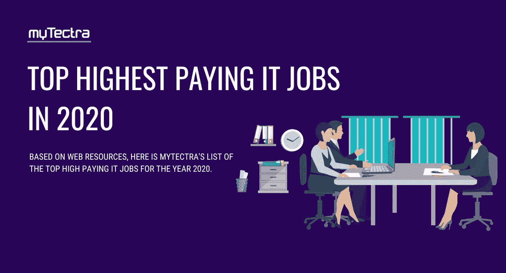
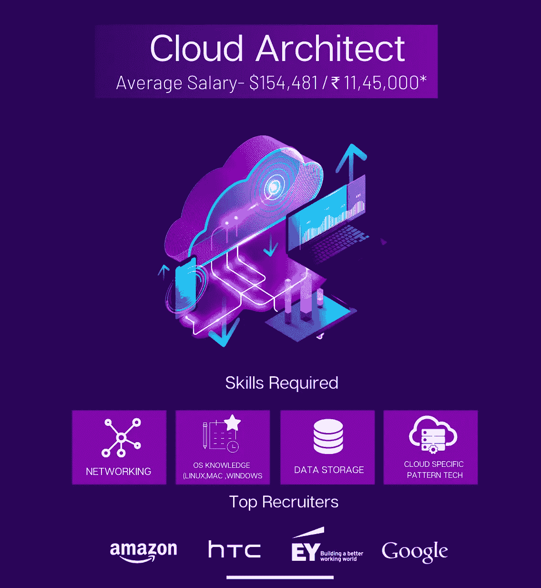
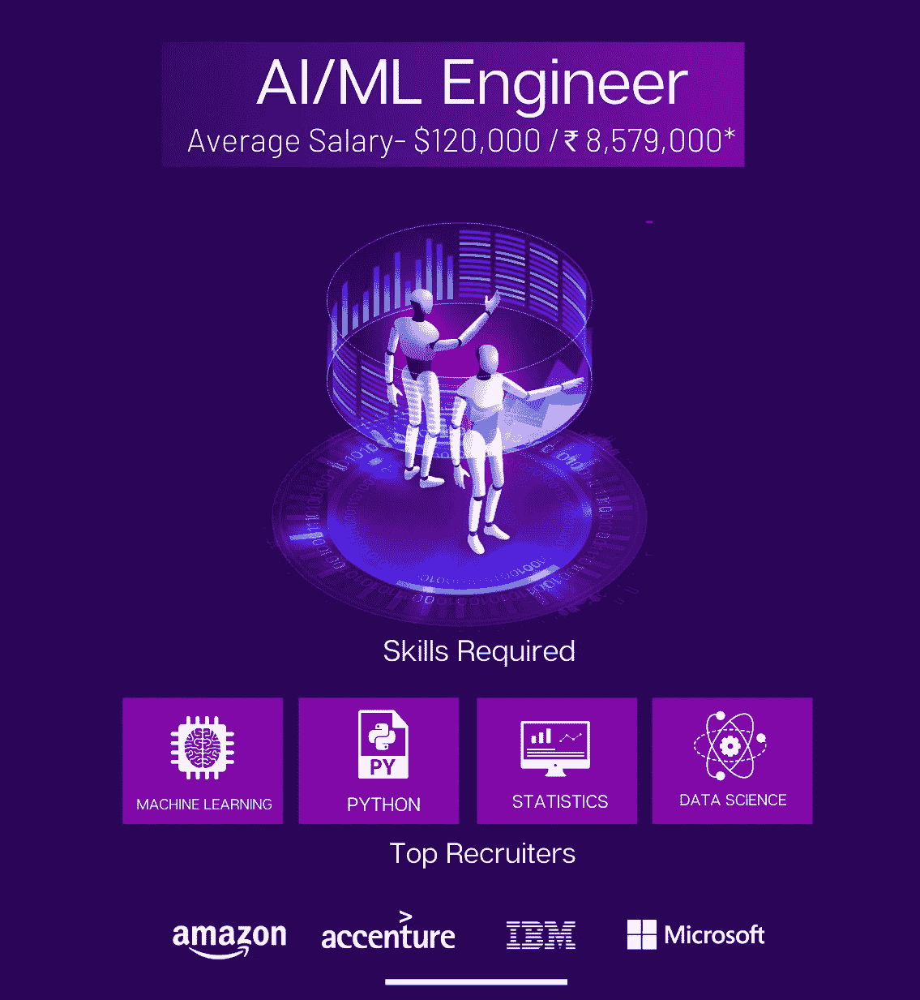
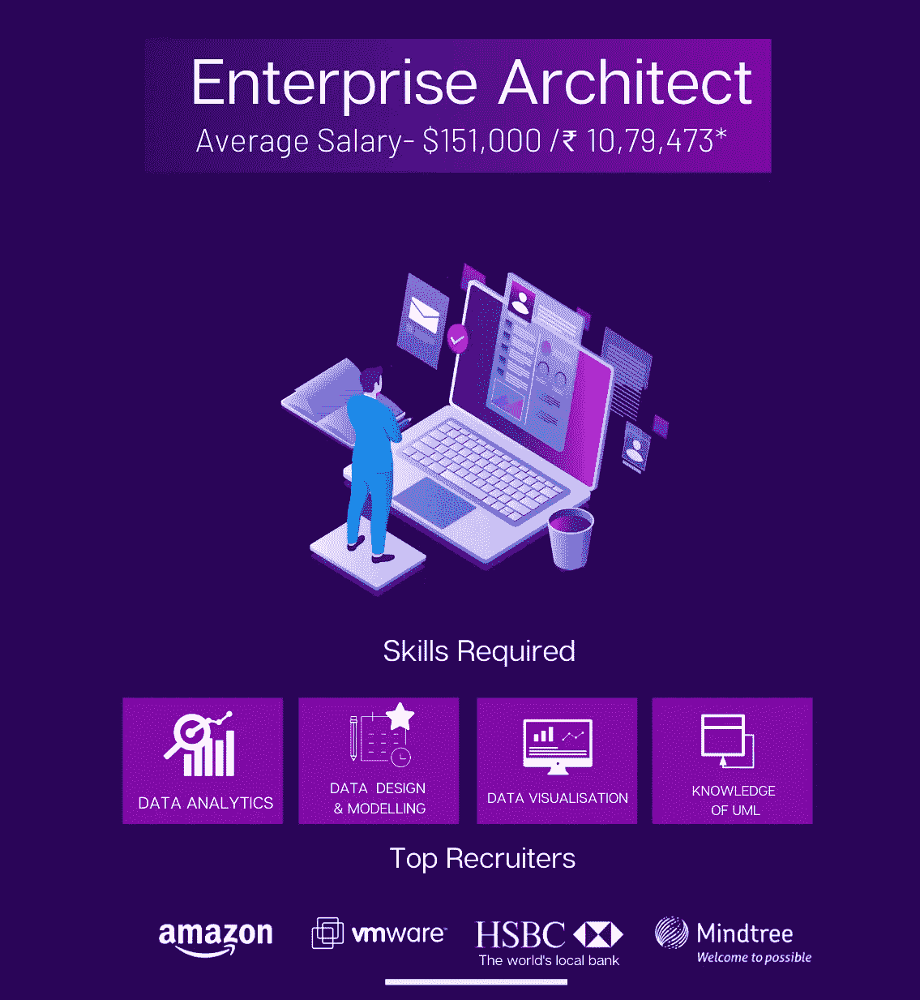
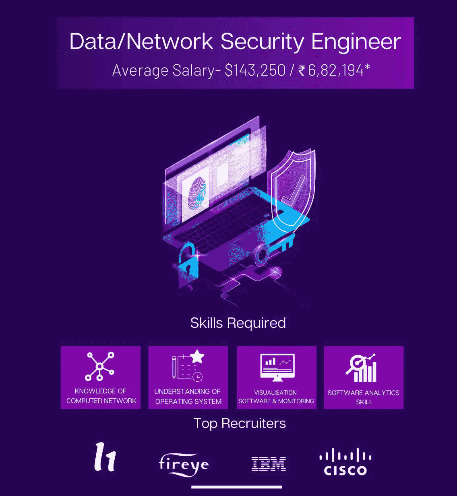
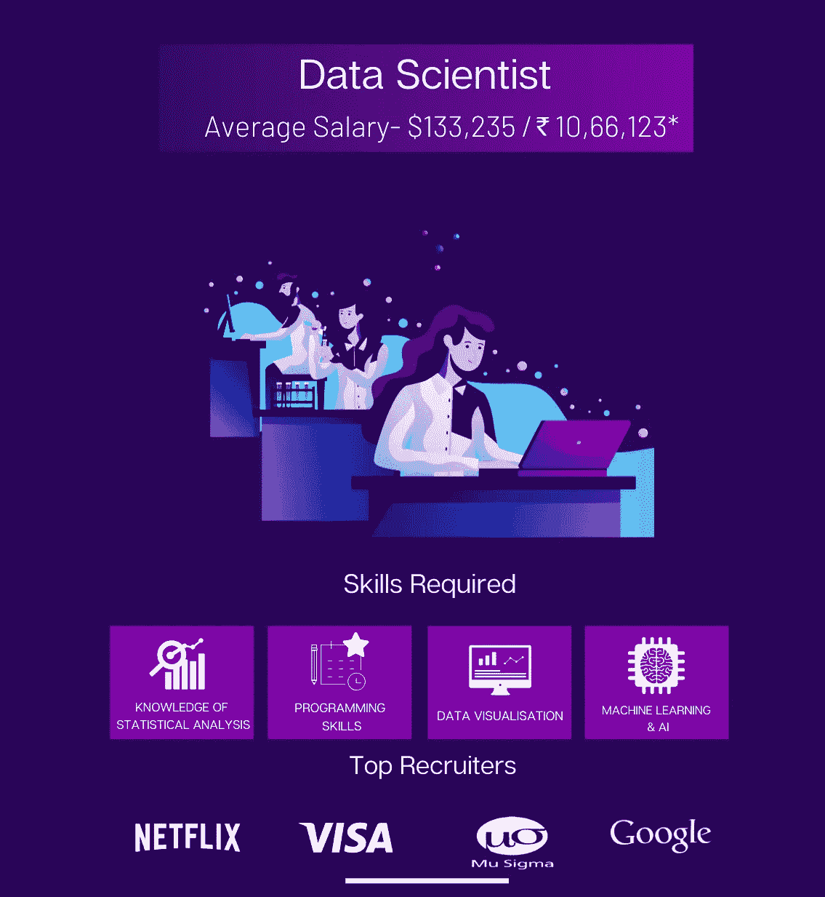

# 2020 年薪酬最高的 IT 工作

> 原文：<https://medium.datadriveninvestor.com/top-highest-paying-it-jobs-in-2020-554493c4d9c8?source=collection_archive---------8----------------------->

所有行业的工资永远取决于员工的经验、培训和知识。你在这些领域得分越多，你得到的报酬就越多。如果你的目标是印度最好的工作之一，薪水不是唯一的一部分。职业发展、工作保障和尊重会让你的职业充满吸引力。而且各个行业给出的‘最高’工资也不一样。因此，将信息技术部门的注册会计师的工资与 BFSI 地区的注册会计师的工资进行比较是很低的。

过去的一年即将过去，我们已经观察到 IT 领域的一些重大改善。仅今年一年，IT 部门与前几年相比就增长了 8%以上，收入飙升至 1670 亿美元。这难道不令人震惊吗？这就是该行业如何保持其拥有领先就业生态系统的声誉。也就是说，我确信所有的技术追随者都渴望知道 2020 年薪酬最高的 IT 工作是什么。

 [## 信息图:云之旅|数据驱动的投资者

### 聪明的企业领导者了解利用云的价值。随着数据存储需求的增长，他们已经…

www.datadriveninvestor.com](https://www.datadriveninvestor.com/2018/09/22/infographic-journey-to-the-clouds/) 

如果你正在寻找一份好的 IT 职业，或者你正在计划提升技能，或者仍然对自己下一步的职业发展感到困惑，那么你来对地方了。为了给你提供最新的信息，我们收集了一份 2020 年薪酬最高的 IT 工作名单。让我们看看文章中的这张**信息图。**

**从该网站获取剩余的 10 份有趣的高薪 IT 工作**

[https://www . mytectra . com/blog/top-2020 年薪酬最高的工作岗位/](https://www.mytectra.com/blog/top-highest-paying-it-jobs-in-2020/)

到目前为止，我们已经到达了 2020 年薪酬最高的 IT 工作名单的末尾。我们相信这份清单可以帮助你选择你想要的职业道路，不管你的经验水平如何。所以，现在就开始你的学习之旅吧！做好 2020 年的技能准备！

你也可以看看我们的[区块链科技将如何改变世界](https://www.mytectra.com/blog/How-is-blockchain-technology-going-to-change-the-world/)？。

帮我们回答了一个问题？请在这个“2020 年薪酬最高的 it 工作”的评论部分进行讨论。

*最初发表于*[*https://www.mytectra.com*](https://www.mytectra.com/blog/top-highest-paying-it-jobs-in-2020/)*。*