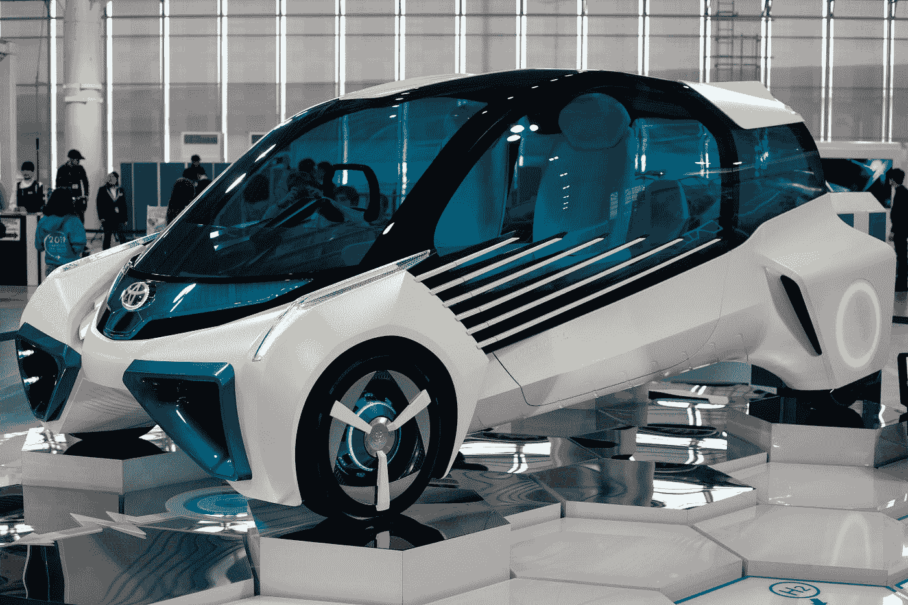
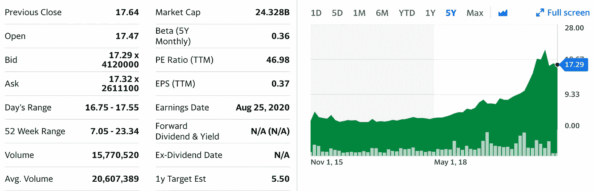
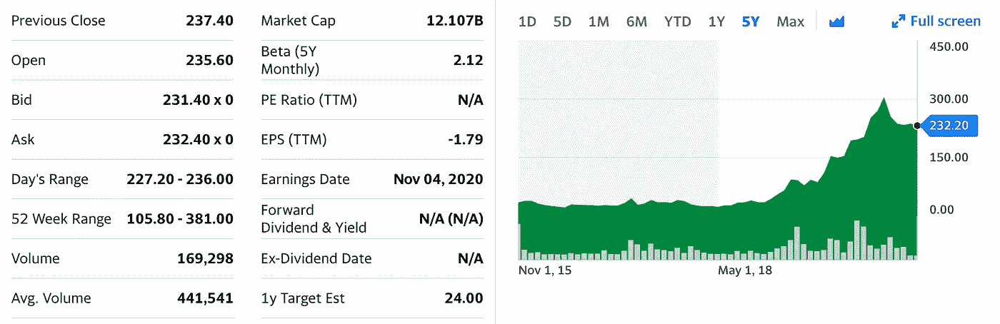
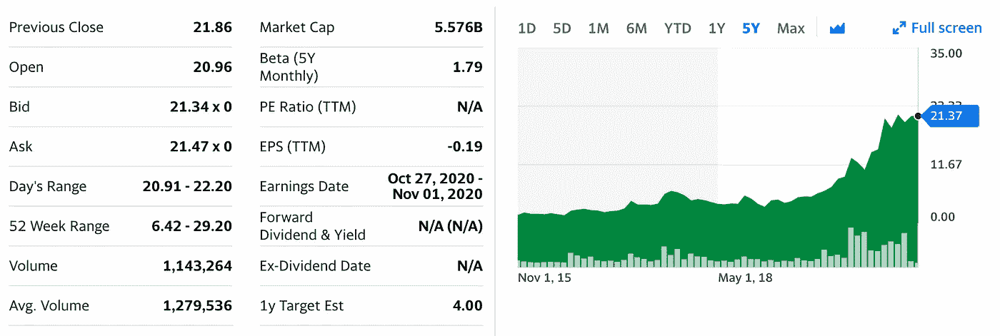

# 值得关注的顶级氢气股

> 原文：<https://medium.datadriveninvestor.com/top-hydrogen-stocks-to-watch-38d27dd67d81?source=collection_archive---------1----------------------->

## 能源转型正在敲响我们的大门



Photo by [Darren Halstead](https://unsplash.com/@darren1303?utm_source=medium&utm_medium=referral) on [Unsplash](https://unsplash.com?utm_source=medium&utm_medium=referral)

```
**Disclaimer**: The content of this story is for entertainment purposes only. It is not a professional or legal advice. Ask a professional before taking any major financial decision.
```

绿色氢项目和政策正在世界各地扩展，给清洁气体带来了前所未有的经济和政治动力。

欧盟在 2020 年夏天公布了绿色氢政策。欧盟紧随其他国家的脚步，制定了绿色氢政策和未来几年的计划。

为了在人类的清洁能源转型中使用氢，氢应该用于运输、发电、重工业和供热等一系列行业，以实现其隐藏的潜力。

在过去的几年里，国际上对氢能 R&D 项目的投资有所增加，主要集中在交通运输方面。

氢可以从化石燃料、生物质和水中提取。目前可获得的大部分氢是从天然气和煤中提取的。

借助由可再生能源供电的大型电解槽从水中提取的氢被称为绿色氢。这种类型的氢气目前不到世界氢气供应量的 0.1%，而且它将获得巨大的推动。绿色氢将在能源转型中发挥重要作用，而太阳能光伏和风能等可再生能源发电成本的降低，将提升人们对电解氢的兴趣。

阅读更多关于绿色氢及其对未来能源的重要性的文章。

[](https://medium.com/the-innovation/green-hydrogen-the-energy-of-the-future-e5472af8e19c) [## 绿色氢:未来的能源

### 氢气是一种无色气体，人们用非常丰富多彩的术语来描述它

medium.com](https://medium.com/the-innovation/green-hydrogen-the-energy-of-the-future-e5472af8e19c) 

## 氢气市场机会

替代燃料引起了投资者的关注，他们正在讨论在即将到来的能源转型中赚钱的最佳方式。由于氢是目前最清洁的燃料，燃烧后只释放水蒸气，所以它引领了一批替代燃料的选择。

对清洁能源和清洁燃料的需求日益增长，使得氢能股成为投资者关注的焦点。该行业目前的趋势是扩大绿色氢气的生产规模，生产更大、更节能的电解槽，并建立必要的基础设施来运输氢气并促进其在不同工业部门的使用。

[](https://www.datadriveninvestor.com/2020/08/03/stock-donations-what-to-know/) [## 股票捐赠:知道什么|数据驱动的投资者

### 有很多交易者和投资者也分别试图找出捐赠他们的…

www.datadriveninvestor.com](https://www.datadriveninvestor.com/2020/08/03/stock-donations-what-to-know/) 

## 值得关注的氢股

**NEL (NEL。OL)**

NEL 公司是一家挪威公司，专门提供各种解决方案，在全球范围内生产、储存和分配来自可再生能源的氢气。它在三个市场领域运营:NEL 氢燃料公司、NEL 氢解决方案公司和 NEL 氢电解公司。该公司生产 H2Station 氢燃料站，用于燃料电池电动汽车，如轿车、公共汽车、卡车、叉车等。



Screenshot by the author on Oct. 4th, 2020 — Source: finance.yahoo.com (Currency: NOK)

PowerCell 瑞典公司。ST)

Powercell 瑞典公司在瑞典和国际上生产和开发用于车辆、船舶和固定应用的燃料电池和燃料电池系统。它为电信应用中的备用发电提供解决方案，并作为 PowerCell S2 公司电动汽车的增程器。动力电池 S3 用于储存在氢气中的可再生能源发电，并用于船舶或越野设备的推进。该公司提供更多用于多种应用的 PowerCell 设备。此外，它还提供零排放解决方案。



Screenshot by the author on Oct. 4th, 2020 — Source: finance.yahoo.com (Currency: SEK)

**巴拉德电力系统公司(BLDP。来)**

这家加拿大公司从事质子交换膜燃料电池产品的设计、开发、制造、销售和服务。它提供重型模块、燃料电池堆、备用电源系统、便携式电源/无人机(UAV)和物料搬运产品。该公司在中国、德国、美国、比利时、英国、日本、丹麦、加拿大和国际市场销售其产品。



Screenshot by the author on Oct. 4th, 2020 — Source: finance.yahoo.com (Currency: CAD)


*瓦利德·阿尔·奥泰比——WAO——是游戏领域的顶级作家。他在德国一家可再生能源工程公司工作。他来自多元文化背景，自 2003 年起定居德国。他写的是阿拉伯文化、多元文化、金融和流行话题。*

## 访问专家视图— [订阅 DDI 英特尔](https://datadriveninvestor.com/ddi-intel)