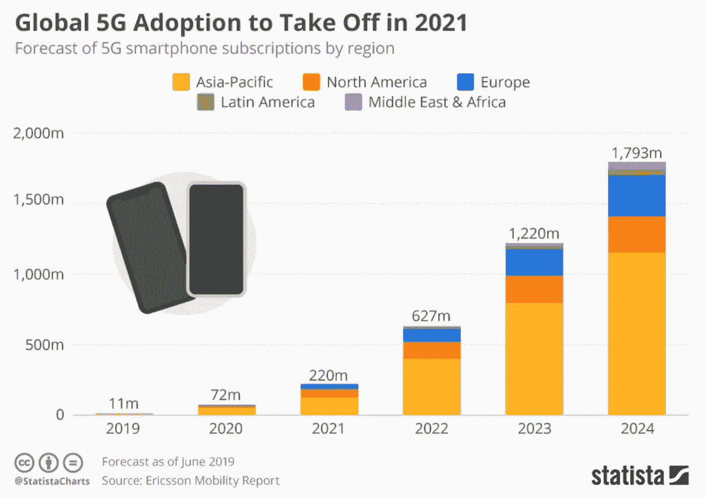
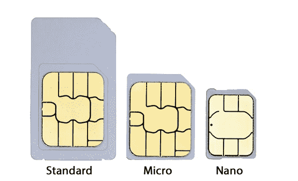
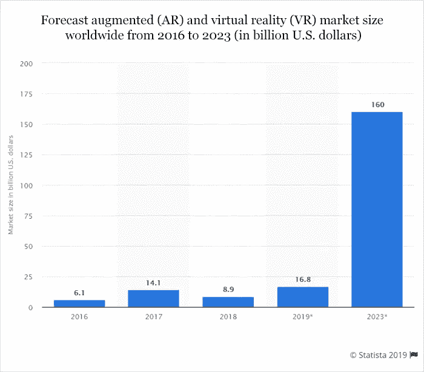
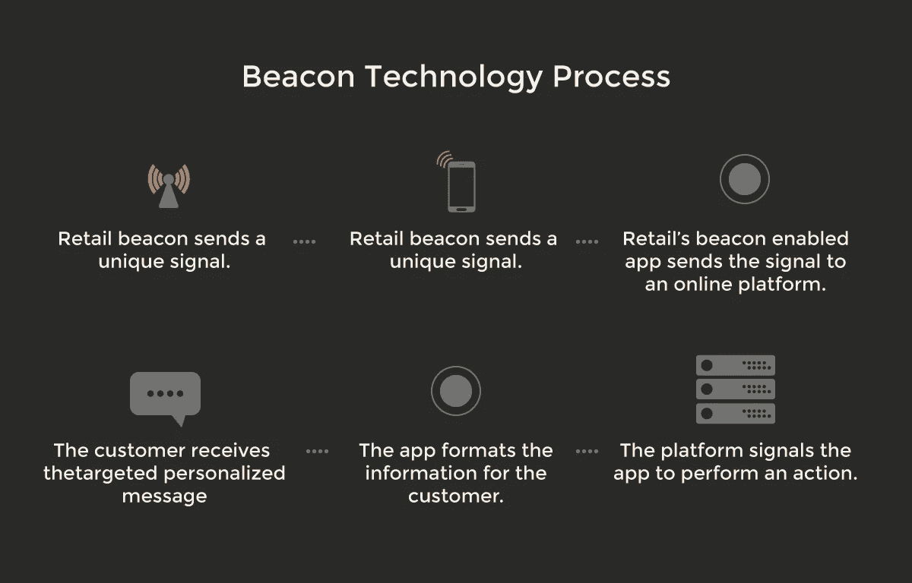
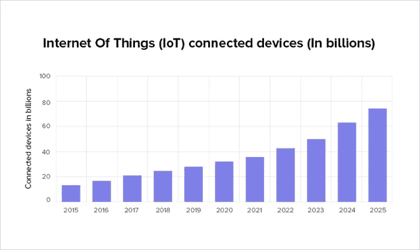
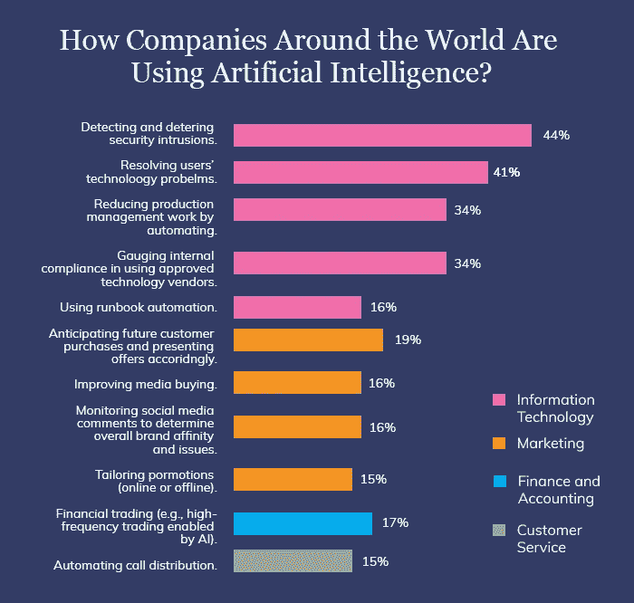
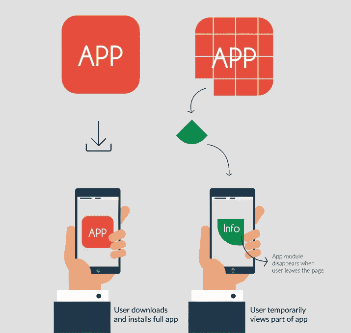
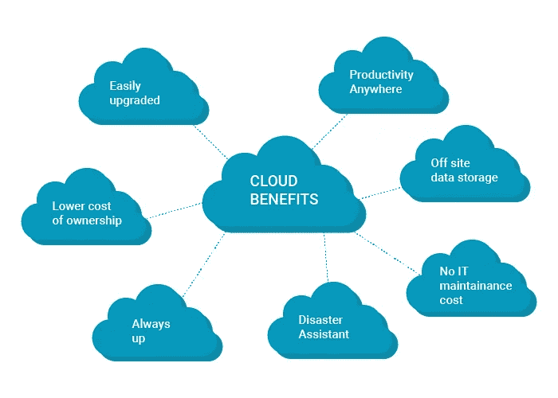
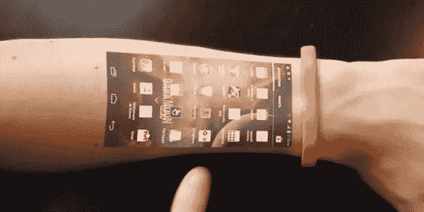
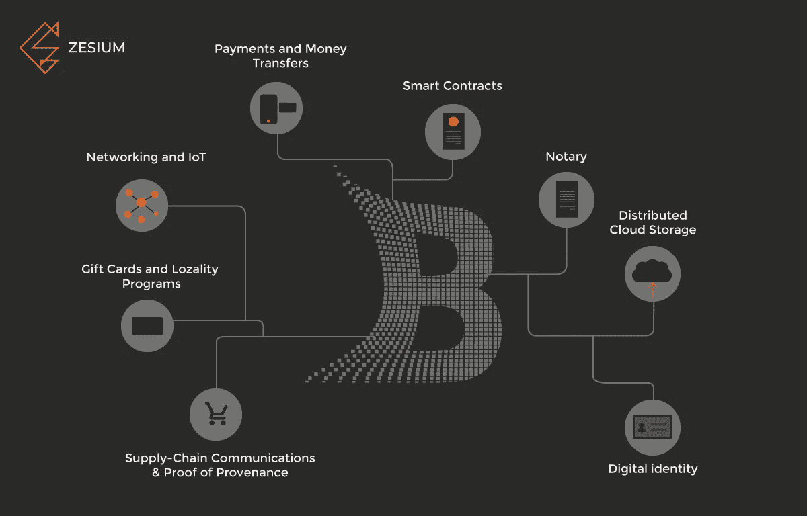

# 2020 年的顶级移动趋势

> 原文：<https://medium.datadriveninvestor.com/top-mobile-trends-for-2020-faee3ed40028?source=collection_archive---------6----------------------->

Source: techgurucomputers.in

技术最令人印象深刻的一点是它总是在不断发展——当今最明显的趋势之一是手机的使用越来越多。

使用移动设备的人越来越多是事实——美国成年人平均每天花在移动设备上的时间[略多于 3.5 小时](https://www.bondcap.com/report/itr19/#view/41)。

无可辩驳的事实是，人们比以往任何时候都更频繁地使用移动设备。

由于移动设备定义了我们生活的时代，让我们来看看 2020 年移动技术的主要趋势:

# 5G

无线连接的下一次变革即将到来:5G。

根据 Statista 的说法，在接下来的几年里，一个*的“采用爆炸*”即将到来。一些智能手机制造商，如三星等。已经在 2019 年发布了他们的第一款 5G 耳机，苹果等其他公司也报告说，他们将在 2020 年将 5G 纳入他们的高端 iPhones。

5G 技术意味着更快更可靠的手机连接，以及物联网([物联网](https://www.wired.co.uk/article/internet-of-things-what-is-explained-iot))的大规模升级，因为它使用移动设备。设备的交叉连接已经成为一种新的规范。

 [## 2019 年移动应用开发之路|数据驱动的投资者

### 任何在移动应用程序开发行业工作的人，无论他们是专注于在伦敦开发 iOS 应用程序还是…

www.datadriveninvestor.com](https://www.datadriveninvestor.com/2019/01/15/the-path-of-mobile-app-development-in-2019/) 

与 4G 相比，5G 不仅速度快 100 倍，还将提高数据安全性、增强现实(AR)和 3D 游戏。尽管 5G 面临一些挑战，如监管变化，但主要焦点是 5G 及其连接可能性。

考虑到 5G 的应用范围，开发人员应该相应地设计应用程序，以使用户能够体验到增强的性能。

Source: statista.com

# eSIM

SIM 卡早在 1991 年就推出了，大小和信用卡差不多。

从那以后，SIM 卡经历了许多改进，变得越来越小。

Source: kwikboost.com

今天，SIM 卡正在走向未来，推出了下一个版本的 SIM 卡，因为它将完全是虚拟的，所以不可能手持。

新的趋势将是 eSIM:一种电子(或嵌入式)SIM 卡。取代物理卡，SIM 技术将被直接内置到你的手机中——基本上，它是一个小芯片，用于向你的电信运营商认证你的身份。

eSIM 技术的优势在于，直接从手机切换运营商要容易得多。如果你是双卡用户，eSIM 技术将有所帮助，因为它支持多个帐户。第一批支持 eSIM 技术的手机之一是谷歌 Pixel 2 和商店里管理 eSIM 卡的应用程序。

尽管 eSIM 很方便，但它面临着潜在的安全问题风险——它仍在开发中，这些风险将在开发过程中得到解决，但就目前而言，如果没有更好的网络防御，将您的凭据和数据存储到设备的操作系统中可能不太实际。

考虑到更多的手机设备支持 eSIM，观察未来会带来什么肯定会很有趣。

# AR 和 VR

今天，Brends 使用这些技术来实现他们对客户的方法的新颖性。

几年前，我们有机会看到痴迷的游戏趋势，如口袋妖怪 go，恐龙迷航等。有许多应用程序(例如“宜家”)已经使用 AR 技术来提升用户体验，一些[流行的社交媒体应用程序，如 Snapchat 和 Instagram](https://www.mobileappdaily.com/best-social-media-apps) 已经使用这种技术有一段时间了。

今年早些时候，谷歌宣布将增强现实(ar)引入他们的搜索——用户可以查看并放置特定的 3D 对象到他们周围的空间。这种技术已经和 NASA、沃尔沃、Target 等机构合作。

2020 年，AR 将是移动行业最重要的步骤之一-一些即将到来的 AR/VR 趋势可能是:

*   不同行业的 AR，如医疗保健、营销和广告、制造等。
*   移动 AR 颠覆

虽然 AR 和 VR 已经使用了一段时间，但这些技术已经获得了巨大的推动，它们的未来似乎很有希望。

Source: statista.com

# 信标技术

信标技术对未来至关重要——它在定位技术和近距离营销中非常有用，而且由于它易于使用，任何普通用户都可以很快熟悉它。

信标是使用蓝牙技术发送信号的无线发射器。这对销售的信息交流有很大帮助。

Beacon 技术是首批移动发展趋势之一，很快被博物馆、酒店、医疗保健等所接受。尤其是如果与物联网合并，可以从 beacon 技术中大大受益的行业之一是零售业。

信标技术可以在 2020 年找到它的用途:

*   移动支付信标；
*   支持人工智能的芯片；
*   自动机器学习(ML)；

# 物联网集成

物联网(IoT)在移动应用领域已经很久了，其多样化的应用将它列为未来的趋势。

借助物联网，人们可以通过遥控器或应用程序控制非 IT 设备。随着便利已经成为用户生活中必不可少的一部分，[物联网随着时间的推移而演变](https://towardsdatascience.com/top-14-iot-mobile-app-development-trends-to-expect-in-2020-7fd7718155dc)成为一个产业。

开发人员应牢记保持其应用程序的物联网友好性，因为统计数据有利于物联网，见下文:

Source: businessinsider.com

如果开发人员希望在移动应用中使用物联网，他们需要选择一个可行的平台，一些流行的平台包括:

*   [Android Ubidots](https://ubidots.com/docs/devices/android.html) :它可以很容易地连接到 Ubidots，这将使开发者能够在设备上推送应用程序。
*   Xively :为应用程序开发项目提供类似物联网的功能。
*   Thingworx :附带一套先进的工具来推广移动应用。

# 人工智能和聊天机器人

人工智能(AI)在移动技术领域实现了重大突破。人工智能和移动应用程序技术的集成不仅带来了更智能的应用程序，还为移动应用程序开发人员节省了大量时间和金钱。

人工智能增强移动技术的一些例子[可以是虚拟个人助理(VPAs)、智能应用、网络安全和物联网——每个技术领域都将在其流程中使用人工智能功能。](http://zesium.com/ai-and-the-powerful-impact-on-mobile-technology/)

聊天机器人的兴起也被认为是 2020 年的趋势之一，支持它的例子是[Google Duplex](https://www.digitaltrends.com/home/what-is-google-duplex/)——一个可以代表人类打电话安排与当地企业约会的人工智能程序。它清楚地显示了人工智能是如何快速进化的。

Source: youtube.com

2020 年，机器人的适应性将升级到一个巨大的水平，而且，提供在线购物、食品配送和/或出租车服务等服务的移动应用程序已经在努力将聊天机器人集成到他们的应用程序中——这将帮助用户解决他们最频繁的查询，而无需呼叫客户支持。

苹果的 Siri 和谷歌助手将在 2020 年变得更加智能，提供新的功能，通过帮助人们完成日常任务来简化他们的生活。这类应用通过聊天机器人和学习用户行为模式来利用技术，实现个性化体验。

下图显示了公司和行业如何接受人工智能创新:

Source: emarketer.com

正如你所看到的，IT 行业处于领先地位，其次是营销行业，但更多的行业将在他们的应用程序中接受人工智能，如金融，会计，客户服务，医疗保健等。

2020 年人工智能的一些未来趋势:

*   AI 通过 AIOps 实现自动化开发
*   人工智能芯片
*   自动机器学习
*   神经网络之间的互操作性

# 移动支付

电子商务和网上银行的巨大发展为用户的在线支付选择增加了巨大的增长空间。

早些时候，现金被塑料取代，现在是塑料货币消失的时候了。移动钱包趋势的兴起是由于互联网支付系统的扩张，这需要更快更安全的货币交易渠道。甚至区块链也进入了移动支付领域，为应用程序提供了更安全的交易选项。像三星这样的科技巨头已经在研究一种增强的 ***扫描支付*** 技术，使用户的资金交易更加方便。苹果公司也在致力于通过 Apple Pay 实现点对点支付系统。

Source: philretailers.com

有许多支付网关可以集成到一个应用程序中，你的开发团队会帮助你决定哪一个最适合你。

除了这些选项，2020 年将会有更多的移动支付选项:

*   超过 20 亿移动钱包用户；
*   更安全的手机钱包；
*   非接触式支付。

# 加速移动页面(AMP)

为了提高移动页面的加载速度，谷歌在 2015 年与 Twitter 合作推出了 AMP。

后来，谷歌正式将 AMP 列表整合到其移动搜索结果中，并帮助开发者减少网页的加载时间。他们还宣布了一个移动搜索框，将使用户能够发现手机友好的网站。

AMP 是 HTML 的精简版，旨在加快移动网页的速度——它使开发人员能够在所有移动设备上创建加载速度更快、跳出率更低、性能更高的复杂网页。

Source: searchengineland.com

有了一个好的 AMP 分数，你可以获得更好的转化率，最大化的用户保持率，并且可以很好的提升用户体验。

凭借这些选项，AMP 将在移动应用行业引发一场重大变革。

# 即时应用

人们认为即时应用是移动应用发展的下一步。

即时应用基本上是像网站一样运行的原生应用，但你不需要在手机上安装它们。即时应用程序通过消除任何下载或安装的需要，无疑模糊了应用程序和用户之间的界限。

谷歌在 2016 年首次推出了[即时应用](https://developer.android.com/topic/google-play-instant)，让开发者和用户都更加方便。

Source: clevertap.com

即时应用的最大优势是:

*   尺寸较小；
*   具备网站的功能；
*   优秀的用户体验；
*   不使用设备内存。

Play Store 中的用户可以使用谷歌即时应用程序来即时访问应用程序——目前，即时应用程序的数量有限。

Play Store 中提供的一些带有“*立即试用*按钮的 Android 应用程序有:

*   [霍拉尔](https://www.hollar.com/)
*   Skyscanner
*   《纽约时报》的填字游戏
*   [Buzzfeed](https://www.buzzfeed.com/?utm_term=.me909ryW3X#.wy7b7aOw1B)
*   [Onefootball 实况足球比分](https://www.onefootball.com/)
*   [红牛电视](https://www.redbull.tv/)
*   [点循环](https://www.dotloop.com/)
*   [分享主题](https://sharethemeal.org/en/index.html)

Hollar 和纽约时报建议，他们可以通过引入即时移动应用程序，将转化率从 20%提高到 27%。

此外，Android Studio 的最新版本允许开发人员将应用程序模块化，因此用户只能使用应用程序的一部分。

# 安培和 EMM

应用性能管理(APM)和企业移动管理(EMM)是企业移动应用开发流程的[元素。](https://www.wired.com/insights/2013/07/smart-tips-for-enterprise-mobile-app-development/)

APM 是 2016 年整合到谷歌的移动指标，原因是消除了往往会降低应用性能的缺点-总的来说，AMP 有助于提高整体性能。

另一方面，企业移动管理(EMM)是一个平台，允许组织安全地启用员工使用的移动设备，并通过帮助移动计算进一步简化业务。EMM 不仅提升了安全结构，还通过支持员工在移动设备上交换数据来帮助他们提高工作效率。

AMP 和 EMM 带来了以下好处:

*   App 安全；
*   理财；
*   维护应用程序。

# 云移动应用

与常规移动应用不同，基于云的移动应用“活”在服务器上，可以通过网络浏览器访问。如果你想让你的应用程序跨多个平台无缝运行，你应该把重点放在用于移动应用程序开发的云技术上。

[云技术对移动应用开发的好处](https://buildfire.com/cloud-mobile-apps/)是:

*   简化操作；
*   降低成本和花费的时间
*   托管减少；
*   增强应用程序的存储容量；
*   提高协作和生产力。

当“生活”在云上时，它可以帮助移动应用高效地存储大量数据，执行复杂的任务，并提高应用的可靠性、速度、处理能力和安全性。

Source: epcgroup.net

我们可能在 2020 年看到的云移动应用趋势:

*   量子计算
*   混合云解决方案
*   云服务和解决方案的演变

像 [Dropbox](https://www.dropbox.com/) 、 [AWS](https://aws.amazon.com/) 和 SlideRocket 这样的云存储平台使得直接在云上运行应用成为可能。

# 移动健康

由于我们生活在一个快速和动态的环境中，我们喜欢跟踪我们的健康和我们的状况。这就是移动医疗的由来。

目前市场上有超过 300，000 个健康应用程序，尽管几年前有所减少，Fitbit，Garmin，Apple Watch 等。继续茁壮成长。

移动医疗最重要的部分之一当然是可穿戴设备。

Source: colocationamerica.com

可穿戴设备在市场上并不新鲜——我们已经见证了智能手表、健身带、追踪器等。这些改变了我们与智能设备互动的方式。

根据 Business Insider 的报告，可穿戴设备在未来几年仍将实现收入增长:

Source: businessinsider.com

由于可穿戴设备的潜力巨大，移动应用应该支持可穿戴技术。每个可穿戴设备都需要一个平台来运行——Apple Watch 需要 watchOS，而 Android 智能手表需要与 WearOS 同步。这些数字有利于可穿戴设备，开发者应该根据应用的性质，保留将其应用与可穿戴设备集成的选项。

2020 年可穿戴设备的潜在趋势:

*   健身追踪器使用的增加。
*   减少对智能手机的依赖。

随着可穿戴技术的到来，我们应该关注每个行业的最新趋势和最常见的用法。到 2020 年底，移动医疗市场的价值预计将达到[310 亿美元，这一趋势将持续一段时间。](https://research2guidance.com/the-mhealth-app-market-reaches-31-billion-by-2020/)

# 区块链

区块链是一个共享的、不可更改的账本，用于记录以区块列出的公司信息。它可以是交易的历史，也可以是比特币，如果不改变网络的所有后续模块，任何一项都无法改变。

[区块链](https://thenextscoop.com/blockchain-technology-disrupting-mobile-app-development-process/)增加透明度，增强 app 安全性，减少欺诈交易。

通过使用区块链，开发者很有可能设计出一个分散的移动应用。这类应用被称为[分散式移动应用](https://en.wikipedia.org/wiki/Decentralized_application)或 DApp。它不能被单一实体所拥有，也不能被任何外力所关闭。

区块链可以无缝集成多个领域——它管理数字交易流程，并处理用户移动应用程序中的点对点交易。此外，区块链可以通过其低成本的解决方案流程转变现有的业务模式，并减少手动工作的时间。

区块链肯定会扰乱所有需要数字交易过程安全的行业，如房地产、医疗机构等。

区块链技术的一些预期趋势将有助于未来的移动应用开发:

*   资产令牌化
*   区块链即服务
*   在加密货币交易所交易
*   加密空间和游戏

# 最后的

移动应用每年都在发生革命性的变化——所有这些移动应用的发展趋势都将促使应用行业继续快速扩张。

开发者之间的竞争将在 2020 年加剧，因此在开始开发应用程序之前，了解这些趋势至关重要。

我们知道移动应用开发中的每项新技术都有其局限性，但是有了[优秀的开发合作伙伴](http://zesium.com/)在身边，您总能为您的下一个移动应用确定正确的移动应用趋势。

> **现在我们知道了移动的主要趋势，让我们来看看这些趋势在 2020 年的演变！**

点击下面的链接，安排与 [**玛娅·达基奇**](https://app.ddichat.com/experts/maja-dakic) 的 DDIChat 会话。

 [## 马贾达基奇-迪迪恰特

### 技术行业(软件、移动应用、物联网、人工智能等)的资深作家。)以及在…

app.ddichat.com](https://app.ddichat.com/experts/maja-dakic)