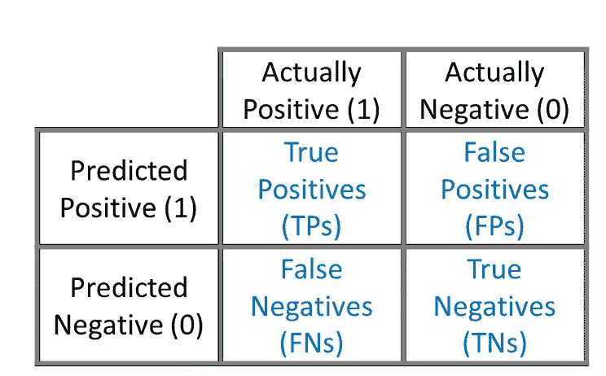
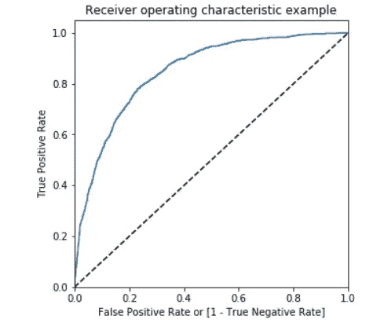

# 机器学习中的顶级模型评估度量

> 原文：<https://medium.datadriveninvestor.com/top-model-evaluation-metrics-in-machine-learning-51fcc11d7b7d?source=collection_archive---------19----------------------->


Photo by [Patrick Tomasso](https://unsplash.com/@impatrickt) on [Unsplash](https://unsplash.com)

如何比较机器学习模型，决定哪个模型表现好？预测模型基于建设性响应原则。评估指标描述了模型的性能。评估指标的一个重要方面是它们在模型结果中的区别性潜力。让我们更深入地了解一些有助于您做出正确决策的指标！！

# 混淆矩阵

混淆矩阵是一个(n×n)矩阵，其中 n 是被预测的类别的数量。一个常见的概念是计算归类为 b 类的 A 类案件的数量。

**真阳性**:数据点的实际类别为 1(真)，预测类别也为 1(真)的情况。*为真*是因为模型做出了正确的预测*为正*是因为类为正 1。

**真阴性**:数据点的实际类别为 0(假)而预测类别也为 0(假)的情况。*真*是因为模型做出了正确的预测，而*负*是因为类是负一(0)。

**假阳性**:数据点的实际类别为 0(假)而预测类别为 1(真)的情况。*假*是因为模型做出了不正确的预测，而*正*是因为预测的类是正的(1)。

**假阴性**:数据点的实际类别为 1(真)而预测类别为 0(假)的情况。*假*是因为模型做出了不正确的预测，而*负*是因为预测的类是负 1(0)。



Confusion Matrix; Image by author

# 准确(性)

它是模型对所有类型的预测做出的正确预测的数量。

```
Accuracy = (TP+TN)/(TP+FP+FN+TN)
```

当目标变量中的类接近平衡或均匀分布时，精确度是一个很好的度量。当数据中的目标变量类别严重不平衡且大多数属于一个单一类别时，不应将其用作评估指标。

[](https://www.datadriveninvestor.com/2020/11/19/how-machine-learning-and-artificial-intelligence-changing-the-face-of-ecommerce/) [## 机器学习和人工智能如何改变电子商务的面貌？|数据驱动…

### 电子商务开发公司，现在，整合先进的客户体验到一个新的水平…

www.datadriveninvestor.com](https://www.datadriveninvestor.com/2020/11/19/how-machine-learning-and-artificial-intelligence-changing-the-face-of-ecommerce/) 

# 精确

它是被正确识别的阳性病例的比例。获得完美精度的一个简单方法是进行一次正面预测，并确保它是正确的(精度= 1/1 = 100%)。这不是很有用，因为模型会忽略除了一个正面实例之外的所有实例。所以 precision 通常与另一个叫做 *recall* 的指标一起使用。

```
Precision = TP/(TP+FP)
```

# 敏感性或回忆

这是被正确识别的实际阳性病例的比例。它也被称为*真阳性率*:被分类器正确检测到的阳性实例的比率。

```
Recall = TP/(TP+FN)
```

**>什么时候用精确，什么时候用回忆？**

回忆给我们关于分类器在假阴性方面性能的信息(我们错过了多少)，而精确给我们关于它在假阳性方面性能的信息(我们抓住了多少)。**精准**就是要精准。因此，即使我们设法只捕获了一个“欺诈”案例，并且我们正确地捕获了它，那么我们也是 100%精确的。**回忆一下**与其说是正确捕获案例，不如说是捕获所有答案为“欺诈”的案例。因此，如果我们总是简单地说每一个案例都是“欺诈”，我们将有 100%的召回率。

> 当假阳性的成本高时，精确度是一个很好的度量，而当与假阴性相关联的成本高时，应该使用召回。

# 特征

正确识别的是实际阴性病例的比例。这是一个衡量标准，它告诉我们，没有欺诈的交易中，有多少被模型预测为非欺诈交易。

```
Specificity = TN/(TN+FP)
```

# F1 分数

将精确度和召回率结合成一个被称为 F1 分数的评估指标通常是方便的。这是精确和回忆的调和平均值。常规平均值对所有值一视同仁，而调和平均值对较低的值给予更大的权重。因此，只有当精确度和召回率都很高时，分类器才会获得好的 F1 分数。

```
F1 score = 2*[P*R/(P+R)]
```

# AUC-ROC 曲线

*接收器操作特性* (ROC)曲线是在二元分类器的情况下用于评估模型的另一种常用工具。ROC 曲线是*真阳性率* *和* *假阳性率之间的曲线图。**FPR 是被模型错误分类为阳性的阴性病例的比率。* FPR 等于从真实负比率中减去 1，真实负比率是被正确分类为负的负实例的比率。*TNR 又称特异性*。因此，我们可以说 ROC 曲线描绘了*灵敏度(回忆)对 1 特异性*。一个好的分类器应该尽可能远离左上角的那条线。区分分类器的一种方法是测量它们在曲线下的*面积(AUC)。完美模型的 ROC AUC 等于 1，另一方面，完全随机的分类器的 ROC-AUC 等于 0.5。*

Python code for ROC score and Plotting ROC Curve by Author



ROC Curve; Image by author

# 绝对平均误差

它测量每个基本事实和预测之间的平均绝对差异。

```
MAE = (1/n)* **Σ** |Y*original* — Y*predicted|*
```

# 均方根误差

它测量预测值和真实值之间的平均平方差的平方根，或者简单地计算模型预测误差的标准偏差。RMSE 对异常值更敏感。

```
RMSE =[ **Σ** (Y*original* — Y*predicted*)**²** / n ]^(0.5)
```

# r 平方系数

它意味着独立变量“解释”模型中方差的程度。R 平方的一个缺陷是，随着变量数量的增加，它总是会提高，这可能会完全误导人。

```
R² = 1 — (RSS/TSS)
Where, RSS = Sum of squares of residuals
       TSS = Total sum of sqaures
```

# 调整后的 R 平方系数

它修正了 R 平方的上述缺点。它告诉我们仅由影响因变量的自变量解释的变化的百分比。调整后的 R 系数将减去添加不符合模型的独立变量的惩罚分数。

```
Adjusted R² = 1 — [(1-R²)*(n-1)/(n-k-1)]
Where, n = Total number of observations
       k = Total number of variables in the model
```

**进入专家视角—** [**订阅 DDI 英特尔**](https://datadriveninvestor.com/ddi-intel)