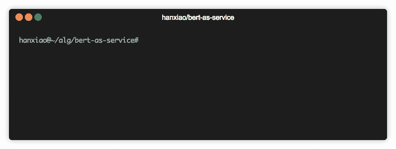
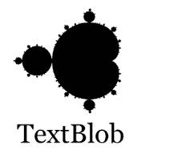
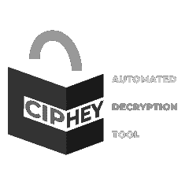
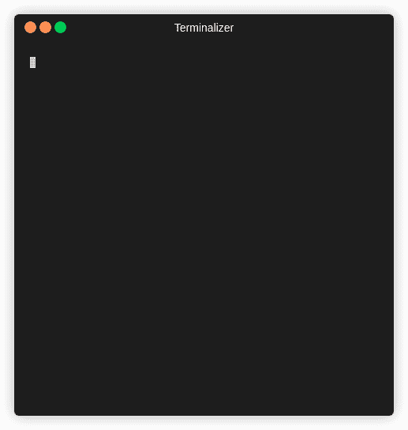
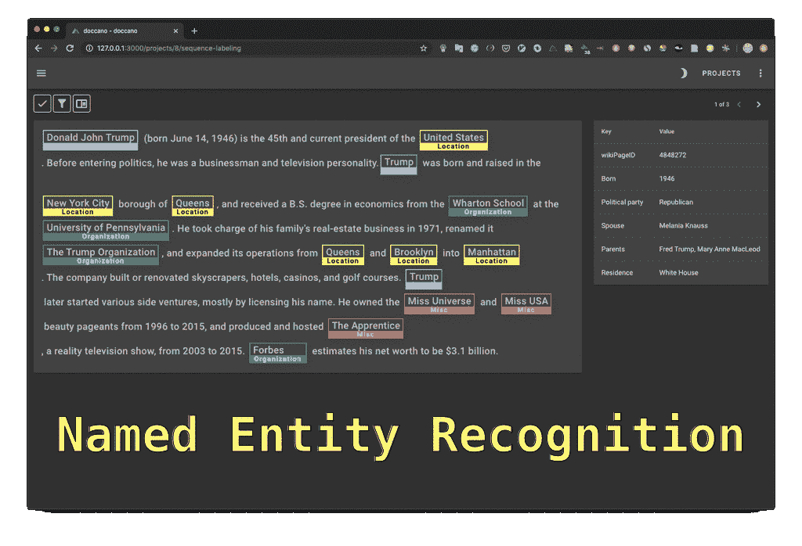

# 使用 Python 的顶级 NLP(自然语言处理)项目(包括 Github 上资源库的链接)

> 原文：<https://medium.datadriveninvestor.com/top-nlp-natural-language-processing-projects-using-python-includes-links-to-repository-on-github-ef860bcce857?source=collection_archive---------0----------------------->

## 自然语言处理是语言学、计算机科学和人工智能的一个分支，涉及计算机和人类语言之间的交互，特别是如何对计算机进行编程以处理和分析大量自然语言数据。[维基百科](https://en.wikipedia.org/wiki/Natural_language_processing)

**自然语言处理**解释说，在 **NLP** 中，机器被教导像人类一样阅读和解释文本。NLP 被认为是“文本分析和语音识别应用的推动者”人类解释文本的能力在分析大量文本数据时非常方便。该技术可以准确提取文档中包含的信息和见解，并对文档本身进行分类和组织。

> ***在今天的文章中，我们将谈论 NLP 项目中的五个，以增强您在数据科学和图像处理领域的技能。***
> 
> *注意:在本文中，我们将讨论一些“低级”但非常好的开源 NLP 项目，您可以在您的项目中使用它们。要阅读更多关于它们的内容，我推荐你点击项目中给出的链接。*

> ***奖金***
> 
> ***数据集:*** 为 ML 模型提供现成的 NLP 数据集的最大枢纽，具有快速、易用和高效的数据操作工具。

> [***Github 库***](https://github.com/huggingface/datasets)
> 
> [***文档***](https://huggingface.co/docs/datasets/)

> 学习不仅仅是为了更好地胜任工作，而且远不止于此。[***【data camp】***](https://datacamp.pxf.io/x9nmvv)*让我学无止境。*
> 
> [***【data camp】***](https://datacamp.pxf.io/x9nmvv)*为您提供所需的灵活性，让您可以利用自己的时间参加课程，并学习向成功职业过渡所需的基本技能。*
> 
> [***数据营***](https://datacamp.pxf.io/x9nmvv) *教会了我如何快速获取新想法，并将其应用于现实世界的问题。当我还在学习阶段的时候，*[***data camp***](https://datacamp.pxf.io/x9nmvv)*让我对课程中发生的一切都着了迷，从课程内容和 TA 反馈到 meetups 活动和教授的 Twitter feeds。*
> 
> 这里有一些我最喜欢的课程，我强烈推荐你学习，只要它符合你的时间表和心情。你可以将从这些课程中学到的概念和技能直接应用到工作或大学中令人兴奋的新项目中。

1.  [数据科学家与 python](https://datacamp.pxf.io/LPDqQZ)
2.  [数据科学家与 r](https://datacamp.pxf.io/MXQxrJ)
3.  [机器学习科学家与机器人](https://datacamp.pxf.io/DVLg4j)
4.  [使用 python 的机器学习科学家](https://datacamp.pxf.io/9WePXW)
5.  面向所有人的机器学习
6.  [人人共享的数据科学](https://datacamp.pxf.io/15bLmd)
7.  [使用 python 的数据工程师](https://datacamp.pxf.io/jW13ve)
8.  [使用 python 的数据分析师](https://datacamp.pxf.io/kjR3mz)
9.  [基于 pyspark 的大数据基础](https://datacamp.pxf.io/e4RM6r)

***回到正题-***

# 1.伯特服务

> [Github](https://github.com/hanxiao/bert-as-service)
> 
> [官方文件](https://bert-as-service.readthedocs.io/en/latest/)

B[***ear as service***](https://bert-as-service.readthedocs.io/en/latest/)*是为 Python 用户提供的将变长句子映射成定长向量的句子编码服务。*

**

> ***BERT** 是 Google 开发的 **NLP 模型** [，用于**预训练**语言表示。它利用网上公开的大量纯文本数据，并以无人监督的方式进行训练。**预培训**BERT 模型**对于每种语言来说都是一个相当昂贵的一次性程序。幸运的是，谷歌发布了几个预训练模型，你可以从这里下载**](https://github.com/google-research/bert)******。*******

******句子编码/嵌入*** 是很多**自然语言处理**应用中需要的上游任务，例如*情感分析、文本分类*。目标是将一个可变长度的句子表示成一个固定长度的向量，例如`***hello world***`到`***[0.1, 0.3, 0.9]***`。向量的每个元素都应该"**编码**原句的一些语义。***

***最后，`***bert-as-service***`使用 **BERT** 作为句子*编码器*，并通过 *ZeroMQ* 将其托管为服务，允许您仅用两行代码将句子映射为固定长度的表示。***

## ***它有什么特别之处？***

*   ****最新技术水平****
*   ****易于使用****
*   ****快速****
*   ****可扩展****
*   ****可靠****

# ***2.文本 blob***

> ***[Github](https://github.com/sloria/TextBlob)***
> 
> ***[官方文件](https://textblob.readthedocs.io/en/dev/)***

***T[***ext blob****是一个 ***Python (2 和 3)*** 库，用于处理**文本数据**。它提供了一个*简单的 API* 来执行普通的***【NLP】***任务。*](https://textblob.readthedocs.io/en/dev/)***

********

## ****简单，Pythonic 化，文本处理库" ***Textblob*** "以:****

*   *****情绪分析，*****
*   *****词性标注，*****
*   *****名词短语提取，*****
*   *****译，*****
*   *****还有更多。*****

> ****TextBlob 站在 [**NLTK**](http://nltk.org/) 和 [**模式**](https://github.com/clips/pattern/) 的巨肩上，与两者都玩得很好。****

## ****它提供的功能:****

*   *****名词短语提取*****
*   *****词性标注*****
*   *****情绪分析*****
*   *****分类(朴素贝叶斯，决策树)*****
*   *****标记化(将文本拆分成单词和句子)*****
*   *****单词和短语频率*****
*   *****解析*****
*   *****n-grams*****
*   *****单词变形(复数和单数)和词条变形*****
*   *****拼写纠正*****
*   *****通过扩展添加新的模型或语言*****
*   *****WordNet 整合*****

# ****3.Ciphey****

> ****[Github](https://github.com/Ciphey/Ciphey)****

****C[***iphey***](https://github.com/Ciphey/Ciphey)*是一个在不知道*密钥或密码**的情况下自动 ***解密加密*** ，*解码编码*，*并破解哈希的库。*******

******

***它是一个 f *全自动的* ***解密/解码/破解工具*** 其中 u *输入加密文本，并使用 ***自然语言处理*** & ***人工智能*** 连同一些常识一起得到解密后的文本返回*。***

> *****可能会出现什么类型的加密的问题？*****
> 
> ***这才是重点。你不知道，你只知道它可能被加密了。 **Ciphey** 会帮你弄清楚。 **Ciphey** 能在**3**秒或更短时间内解决大部分事情。***

******

******Ciphey*** 的目标是成为一个自动化许多 ***解密&解码*** 的工具，例如*多基编码、经典密码、散列或更高级的加密技术。****

***如果你对*密码学*了解不多，或者想在自己动手之前快速查看*密文*， ***Ciphey*** 适合你。***

## ***为什么是 Ciphey？***

*   ****50 多种加密/编码****
*   ****带有增强搜索的定制人工智能(AuSearch)用于回答“使用了什么加密技术？”****
*   ****定制的自然语言处理模块****
*   ****多语言支持****
*   ****支持加密和哈希****

# ***4.多卡诺***

> ***[Github](https://github.com/doccano/doccano)***
> 
> ***[官方文件](https://doccano.herokuapp.com/)***

***D [***奥卡诺***](https://doccano.herokuapp.com/)*是一款面向机器学习从业者的开源 ***文本标注工具*** 。****

********

****为 ***文本分类、序列标注和序列到序列任务提供*注释特性*。*** 所以，你可以创建 ***标注数据*** 用于*情感分析、命名实体识别、文本摘要等等*。只需创建一个项目，上传数据并开始注释。你可以在几个小时内建立一个数据集。****

******

## ***特征***

*   ****协同标注****
*   ****多语言支持****
*   ****移动支架****
*   ****表情符号支持****
*   ****黑暗主题****
*   ****RESTful API****

# ***5.LazyNLP***

> ***[Github](https://github.com/chiphuyen/lazynlp)***

***L[***azyNLP***](https://github.com/chiphuyen/lazynlp)*是一个开源库，用于抓取和清理网页，创建海量数据集。****

****一个简单的库，允许您抓取、清理和删除重复网页，以创建大规模的单语数据集。使用这个库，您应该能够创建比 OpenAI 用于 GPT-2 的数据集更大的数据集。****

****这个库使用 Python 3，并通过抓取使用网页的 URL 来下载数据集。****

# ****6.Textract****

> ****[Github](https://github.com/deanmalmgren/textract)****
> 
> ****[官方文件](https://textract.readthedocs.io/en/stable/)****

****T[***extract***](https://textract.readthedocs.io/en/stable/)*是一个开源库，能够从*中提取 ***文本*** 任何文档**无任何杂乱或繁琐。这个包提供了从任何类型的文件中提取内容的单一接口，没有任何不相关的标记。********

> ****如果你喜欢读这篇文章，我相信我们有着相似的兴趣，并且现在/将来会从事相似的行业。那么我们就通过 [LinkedIn](https://www.linkedin.com/in/mrinal-walia-b0981b158/) 和 [Github](https://github.com/abhiwalia15) 来连线吧。请不要犹豫发送联系请求！****