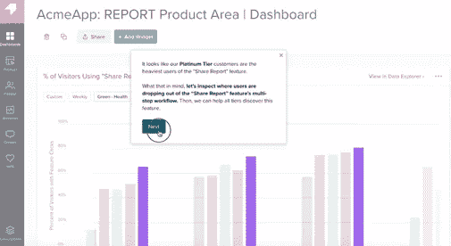
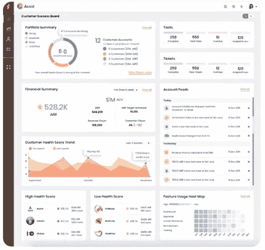
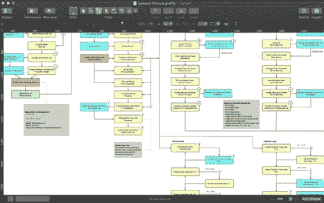
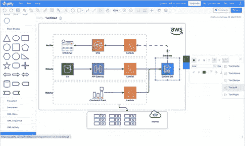
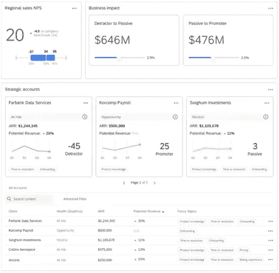
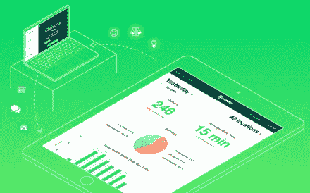
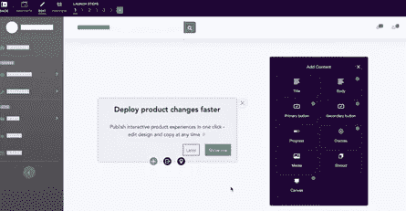
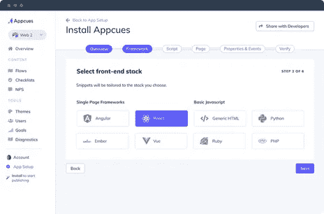
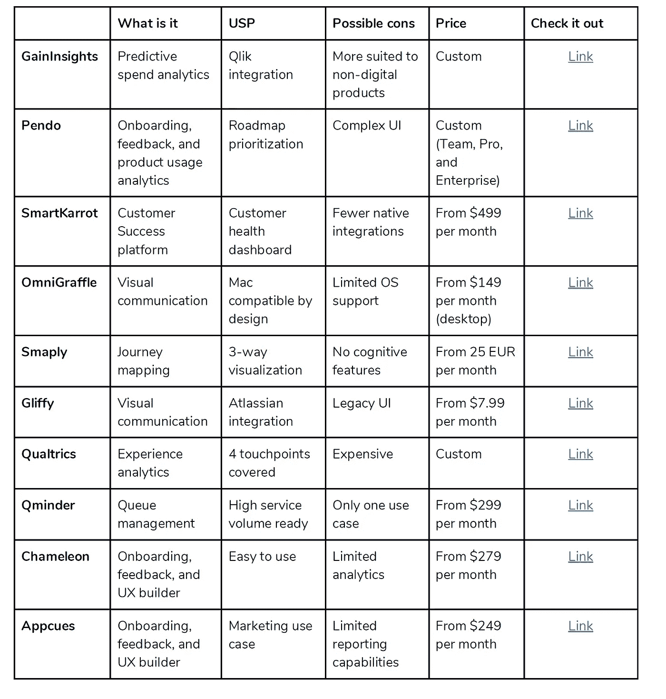

# 2020 年客户体验(CX)技术的最佳选择

> 原文：<https://medium.datadriveninvestor.com/top-picks-for-customer-experience-cx-technology-in-2020-12e82e4c0400?source=collection_archive---------8----------------------->

客户体验(CX)在 2019 年已经是一个蓬勃发展的市场，疫情已经将它带到了一个临界点。IDC 最新研究发现，欧洲 90%的产品公司 **将 CX 视为重中之重**。这是中期计划中的第一项，在公司的长期数字化转型路线图中超过了其他技术类别。

但是公司的投资方向正确吗？

答案并不那么简单。另一项[调查](https://360magazine.com/2020/02/19/pega-cx-survey-organizations-falling/)发现，大多数**公司正转向 IT 和分析来关注客户体验的质量**。

企业领导者没有提供有价值的具体用例，而是错误地投资于一般的数据源和分析，而没有一个有针对性的决策平台。

这没有太大意义。

CX 至关重要，尤其是在新冠肺炎。然而，公司对购买特定用例的 CX 软件犹豫不决。与此同时， **CX 科技市场有很多选择，去年估值为****65 亿美元。**

**为了将 CX 发展为一个战略杠杆，公司必须投资于正确的技术堆栈，包括客户成功软件、旅程映射工具、入职/采用促成因素以及其他有针对性的解决方案。以下是我挑选的当今最有前途的 CX 技术，代表了市场的现状和发展方向。**

# **1.gain insights——基于人工智能的预测营销洞察**

**GainInsights 回答了一个至关重要的用例:你如何实现营销技术的完美组合以获得最大回报？**

**使用 GainInsights，您可以从 Qlik、Tableau、PowereBI 等第三方平台收集数据。，并实时模拟不同的消费场景。它的人工智能聊天机器人 Ginie 将带你浏览数据，或发送自动警报以进行实时决策。**

**GainInsights 与 Qlik 紧密集成，是 Qlik 用户的完美 CX 解决方案。**

****

**[链接](https://gain-insights.com/)**

# **2.Pendo —面向产品公司的 360 度客户智能**

**Pendo 的旗舰解决方案 Pendo 产品云集成了各种分析级别，包括客户反馈收集、活动洞察和情感分析。这些数据会反馈到应用内的用户指南中，或者也可以向上游流动，告知你的产品优先级。**

**简而言之，Pendo 关注客户对您产品的参与度，突出任何体验不达标的地方。**

**Pendo 也可以应用于客户采用用例，尽管这不是它的主要价值主张。**

****

**[链接](https://www.pendo.io/)**

# **3.SmartKarrot —一个包含营销活动、调查和自动化的客户成功平台**

**SmartKarrot 是一个强大的客户成功平台(它声称是唯一的一个)，它在一个屋檐下结合了常规分析、采用帮助和客户服务管理。它的目标用户是产品公司的客户成功团队，这个角色在 SaaS 世界很受欢迎。然而，SmartKarrot 发现 61%的 CS 团队手头没有专用平台。**

**您可以使用该平台查看客户帐户摘要、监控财务状况、评估帐户的健康状况、查看未完成的任务(例如功能请求)以及分析不同产品功能的使用率。**

**SmartKarrot 还有一个早期预警系统，每当 CS 指标超过异常阈值时，该系统就会发送自动警报。**

****

**[链接](https://www.smartkarrot.com/?utm_source=google&utm_medium=cpc&utm_campaign=brand&gclid=Cj0KCQjwqfz6BRD8ARIsAIXQCf1TnmNHOdRfn9NJMfc-abVyz3D1E2MJ5c9UmKKeci9nLDL-rF8em-saAlLkEALw_wcB)**

# **4.OmniGraffle —一个数据可视化和事件映射工具**

**这一条并不是专门针对客户体验的，但当试图描绘出客户旅程中的关键时刻、您的产品如何影响它们以及每一点的优化需求时，它会派上用场。OmniGraffle 是为 Mac 系统设计的——它也有一个 iOS 版本，用于移动办公。**

** [## 导致颠覆性趋势的客户行为|数据驱动的投资者

### 随着世界从第四次工业革命中获益，颠覆性技术也在演变成…

www.datadriveninvestor.com](https://www.datadriveninvestor.com/2020/09/04/customer-behavior-leading-to-disruptive-trends/) 

OmniGraffle 是微软 Visio 的直接竞争对手。

如果你是一个 CX/市场/销售专业人员，希望通过强大的图表可视化关键的相互关系，OmniGraffle 是你的工具。每个商业领袖都可以使用 OmniGraffle 来解释复杂的想法，并进行快速原型制作，跨越垂直行业。

[链接](https://www.omnigroup.com/omnigraffle/)

# 5.smaply——一款客户角色和旅程映射软件

Smaply 有助于确定客户体验中的关键利益相关者，以及他们如何相互影响。它支持三种地图——旅程、客户角色和内部 CX 利益相关者。你可以将不同的想法串联起来，丰富顾客的旅程。客户数据反馈到准确的人物角色和个人资料中。最后，利益相关者映射绘制了客户角色和内部利益相关者之间的关系，揭示了摩擦和机会。

您可以将 Smaply 数据导出为 PDF、PPT、PNG 或 XLS 文件，以支持其他平台上的决策。

Smaply 是全渠道产品销售人员必备的 CX 工具。你可以把它作为一个单一的事实来源，上传文件，发表评论，并进行实时协作。

[链接](https://www.smaply.com/features/overview)

# 6.gliffy——用于 Atlassian 和其他平台的图形软件

Gliffy 是 OmniGraffle 的替代品，但它的工作方式非常不同。本质上，它用一个可以创建流程图、构建线框或支持高级图表的在线平台取代了传统的白板。Gliffy 最大的 USP 是其 Atlassian 应用程序套件，与 Confluence 或吉拉进行了本机集成。

客户成功团队出于各种目的，无论是规划完美的客户之旅还是快速原型功能升级。该平台的可视化工具和 Atlassian 中的轻松集成使其易于使用。

该产品有一个在线版本，您可以将其与 G-suite 集成。

[链接](https://www.gliffy.com/?ads_cmpid=905433073&ads_adid=47834200929&ads_matchtype=e&ads_network=g&ads_creative=246956577562&utm_term=gliffy&ads_targetid=kwd-323899706775&utm_campaign=&utm_source=adwords&utm_medium=ppc&ttv=2&gclid=Cj0KCQjwqfz6BRD8ARIsAIXQCf2zKFDreGXocLIU6Xm38ua9tEoxEwjNPBRXUDfAixlDn7v4MDRWZygaAuRmEALw_wcB)

# 7.qual trics——以分析为导向的客户体验管理工具

Qualtrics 是一家体验分析公司，涵盖客户、品牌、产品和员工使用案例。Qualtrics iQ 的核心是为分析提供动力，包括用于非结构化数据的文本 iQ、用于统计的驱动 iQ、用于数据建模的统计 iQ 以及用于生成可操作洞察的预测 iQ。

与您最相关的 Qualtrics 产品可能是客户体验管理(CustomerXM)，但您也可以从其 ProductXM 和 BrandXM 产品中获益。

CustomerXM 获取整个组织的基本指标及其对业务的影响。它可以让你通过社交媒体和在线渠道获得更深入的反馈，预测留住客户的最佳策略。然后，您可以通过 Salesforce、Slack、吉拉和其他集成平台直接分享这些见解。

[链接](https://www.qualtrics.com/au/customer-experience/)

# 8.Qminder —无接触客户体验的队列管理

在之前，我已经谈到过[低触摸经济，它的一个关键组成部分是无触摸技术。它 a)减少了打破社交距离协议的需要，b)增加了客户的便利性。Qminder 为您配备了无接触式客户服务堆栈，包括远程登记亭、通过短信更新服务和全面的服务管理仪表板。](https://www.linkedin.com/pulse/how-build-low-touch-process-high-experience-post-covid19-mehrotra/)

除了拥有客户支持队列的产品公司，服务公司也可以从 Qminder 的编排和自助服务功能中获益。

Qminder 不仅仅是一个运营平台，它还与您的 CRM 相集成，以释放分析洞察力。

[链接](https://www.qminder.com/)

# 9.变色龙——客户入职反馈和支持系统

Chameleon 增加了产品元素，如微调查、启动器、游览和工具提示，以简化新客户对产品的使用。可以配置这些元素来收集反馈，发现功能需求，并从平台内部提供自助服务支持。变色龙的白标功能意味着你可以使用自己的字体，定制 CSS，并配置布局。

变色龙对于任何寻求降低采用曲线的产品公司来说都是一个有用的解决方案。在拥挤的 SaaS，没有人愿意花数小时学习新软件，这正是自助入职发挥作用的地方。

其目标用例是功能参与/反馈、用户入职和自助服务支持。

[链接](https://www.trychameleon.com/home)

# 10.Appcues —自动化和个性化的客户入职培训

Appcues 是变色龙的直接竞争对手。但除了入职、反馈和自助服务，它还集成了营销活动，以及内置的分析功能。Appcues 不是促进采用(这是变色龙的主要目标)，而是把你的产品变成营销和增长杠杆。

您可以启动应用内成长实验，为客户完美优化产品体验。对于那些希望在最初试用之后从用户身上赚钱的免费增值公司来说，这是一个很好的选择。

像这个列表中的大多数 CX 技术一样，你可以将 Appcues 与 Salesforce、Hubspot、Google Analytics 和其他一些技术集成。

[链接](https://www.appcues.com/)

# 包装它

以下是 2020 年客户体验技术的十大选择:

让我留给你最后一个想法: ***人多力量大*** 。

不要把这一切都留给 it 和您自己开发的应用程序环境，尝试使用 CX 工具的组合来完成(非常具体的)工作。您可以将 Appcues 等 onboarding 工具与 OmniGraffle 一起用于图表绘制、Smaply 上的客户旅程，以及 SmartKarrot/GainInsights 用于支出优化——因此结果远不止这些部分的总和。

如果你试用过这些工具，或者将来有兴趣这样做，请发电子邮件到 Arvind@AM-PMAssociates.com 给我。我很乐意收到你的来信。

## 获得专家观点— [订阅 DDI 英特尔](https://datadriveninvestor.com/ddi-intel)**