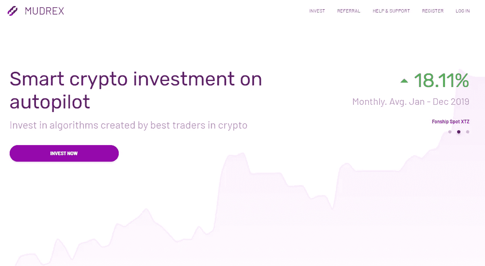
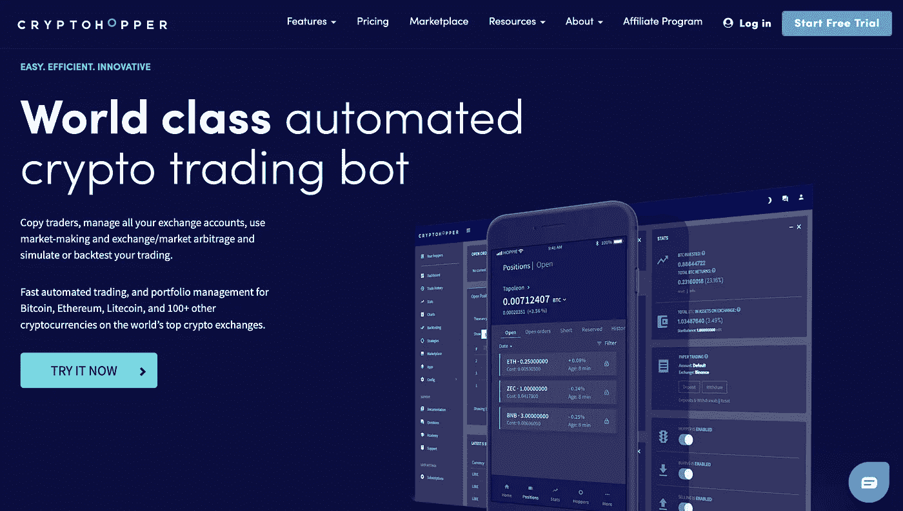
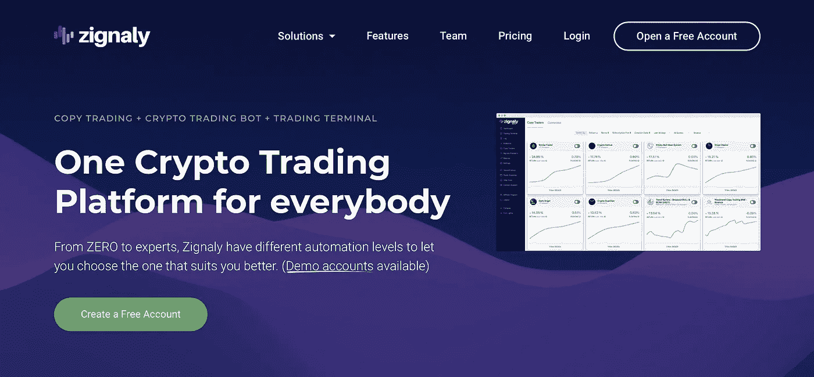
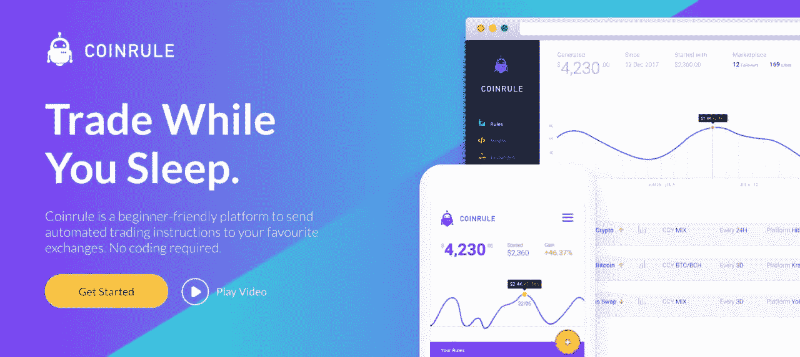

# 2021 年交易机器人的首选

> 原文：<https://medium.datadriveninvestor.com/top-picks-for-trading-bots-in-2021-2a3bf1e9d687?source=collection_archive---------1----------------------->

## 理解为什么你应该考虑使用交易机器人？

简单地说，你应该选择一个机器人来进行交易，因为这是你唯一可以持续赚钱的方法！

从市场中赚钱真的真的很难。96%的散户亏钱。在花了无数时间在图表前试图寻找“好的切入点”后，我可以证明这一点。这个问题在加密领域被进一步放大，因为有 100 个交易所，1000 个加密市场，每个市场都是 24*7 的。确保你的交易是正确的真的很难！

不是每个人都注定要成为交易者，也不是每个人都应该去尝试。这就是为什么我认为我们大多数人应该专注于投资，而算法和机器人是存放你的钱的最好地方之一。

# 存在什么样的机器人？

大体上有两类机器人

*   定向机器人

这些机器人进行交易，因为他们认为市场会朝着一个特定的方向发展。他们持有多头和空头头寸，试图在多个市场周期中跑赢市场。自然，这些机器人的长期回报要高得多，但同时也有亏损的机会。这就是风险管理和获利回吐变得非常重要的地方。

*   市场中立的机器人

这些机器人纯粹根据价格在短期内的变化做出短期交易决定。他们的目标是低稳定回报，但很多时候受到费用的沉重打击。

大多数机器人平台提供两者的混合。定向机器人和大多数人都有很多种选择

# 我如何选择适合我的？

在选择要投资的机器人之前，有 3 件事是需要考虑的。

1.  平台安全可靠好用吗？

任何平台都可能有很棒的交易机器人，但比机器人更重要的是看平台本身好不好。考虑以下事项很重要:

*   平台归谁所有？
*   他们有社区吗？
*   它们存在多久了？
*   bug 和用户问题是否被快速解决？

2.机器人有多好？

令人惊讶的是，即使在 2020 年，加密市场也充满了骗局，效率低下，跟踪信号组和狗信号市场很痛苦。这也是为什么判断 bot 本身的好坏也很重要的原因。在决定投资之前，需要注意以下几点

*   信息透明度
*   稳定可预测的回报
*   过往记录
*   风险管理
*   相对于预期回报，费用成本较低

3.您在找什么？

这也许是最重要的问题。成功投资的关键不是获得最高的回报，而是获得符合你预期的回报。有 100 多个加密机器人。他们中的一些人会在短期内给出疯狂的回报，然后将一切归零。其他种类的机器人会几个月不做任何事情，然后有一天给你一个惊人的信号进入。另一种是给你持续的低回报，没有任何风险。所以在你跳进去之前，你需要知道

*   你愿意承担的风险是什么，能获得的回报是什么？
*   你打算投资多久？
*   你打算在这些机器人上投入多少资金？

# 十大加密交易机器人

在创建我们的排名时，我们查看了 100 个机器人平台和 1000 个单独的机器人，并基于 3 件事创建了一个简单的评分方法:

*   **平台可靠性:**我们给每个平台打了一个 0 到 5 分的分数，5 分是最好的，分数的依据是平台的创建者、支持的机器人类型、存在的时间等。
*   **Bot 质量:**每个平台都有自己的 USP。有的只支持定向机器人，有的只支持信号群等。我们根据可用机器人的质量和多样性创建了一个从 0 到 5 的评级，这样您就可以随时找到机器人
*   **易用性:**使用平台不是小事。其中一些非常复杂，而另一些只有简单的一键投资设置。我们对每个平台进行了排名，从 0 到 5，5 是最好的，根据其入门的难易程度。

> ***在我们进入排名之前，这里有一个折扣***
> 
> *获得 25 美元的信用，当你加入* [*Mudrex*](https://mudrex.com/signup?referral_code=MUDR3436) 时，你可以用这些信用来支付费用

# [#1。Mudrex:自动驾驶仪上的智能加密投资](https://mudrex.com/signup?referral_code=MUDR3436)

> *平台可靠性—****4/5****，Bot 质量—****4.5/5****，易用性—* ***4.5/5***

Y-combinator 支持的 Mudrex 一枝独秀！

Mudrex 让投资加密机器人就像投资共同基金一样简单。他们对自己的信息非常透明，拥有基于我们风险偏好的各种各样的机器人，以及迄今为止我们见过的最好的定价模型。

Mudrex 拥有超过 7000 名用户，交易金额超过 4 亿美元。他们得到了知名风投和天使投资者的支持，并拥有一个非常活跃和积极参与的社区。他们与 8 家顶级交易所有联系，也是名单上为数不多的能够支持美国客户的公司之一。

Mudrex 不开发自己的机器人，而是有一个由专业交易者创建的机器人市场。这个平台最好的一点是，所有关于机器人性能的信息都是公开的，用户很容易理解。

如果你正在寻找一个可以投资你的密码的平台，那么 [Mudrex](https://mudrex.com/) 可能就是它！

你也可以在这里阅读关于 Mudrex 的深度[评论。](https://medium.com/coinmonks/mudrex-invest-an-easy-way-to-invest-in-a-crypto-670dd4deb2b3)

# #2.3Commas:智能交易终端和汽车交易机器人

> *平台可靠性—****4.5/5****、Bot 质量—****4/5****、易用性— 3* ***.5/5***

3Commas 是最著名的加密交易机器人之一。我把它放在列表的第二位，因为它更适合专业交易者。随着他们的用户越来越专业，他们将产品开发转向专业用户。

3Commas 拥有超过 33，000 名活跃用户。该平台可通过桌面或移动应用程序访问，并提供一个链接到领先加密交易所的仪表板。用户可以使用该平台的 SmartTrade 终端执行交易，该终端允许用户设置跟踪止损和利润目标。

# #3.quad ency——一种更智能的交易和管理密码的方式

> *平台可靠性—****4/5****，Bot 质量—****3.5/5****，易用性—* ***4/5***

Quadency 最好的部分是回溯测试功能，通过它你可以根据数据和数字来做，而不是在黑暗中摸索。这也是加密交易机器人最重要的功能；在使用加密交易机器人之前，了解历史数据的表现总是好的。另一个有这种支持的平台是 [Mudrex](https://mudrex.com/) 。除了 Quadency，他们有最好的回溯测试设置。

# #4.cryptohopper——世界级自动化加密交易机器人

> *平台可靠性—* ***4/5*** *、Bot 质量—****4.5/5****、易用性—* ***3/5***

Cryptohopper 是一个付费的加密交易机器人。但在成为付费会员之前，你可以在 Cryptohopper 免费试用 7 天。

Cryptohopper 上比较知名的交易机器人之一就是做市机器人。它类似于 Pionex 中的网格机器人，但它更专注于从订单簿上的价差中获利。

# #5.HaasOnline——最先进的自动化加密交易机器人

> *平台可靠性—****4.5/5****，Bot 质量—****4/5****，易用性—* ***2/5***

HaasOnline 是一个强大的自动化加密资产交易平台。与大多数基于云的平台不同，HaasOnline 交易服务器(HTS)必须下载并安装在用户的电脑上。该平台设计用于在 Windows 上运行，但也可以在 MacOS 和 Linux 上运行。下载和安装公司的加密交易平台需要高度的信任。

# #6. [Pionex](https://www.pionex.com/) —交易所内的加密交易机器人

> *平台可靠性—****4/5****，Bot 质量—****2/5****，易用性—* ***3.5/5***

[Pionex](https://www.pionex.com/) 是内置加密交易机器人的交易所。这是我自 2017 年以来见过的最好的加密货币交易机器人平台之一。它聚合了币安和火币的流动性，并在此基础上提供了一个免费的交易机器人。Pionex 提供专为网格交易设计的机器人，这是一种伪市场中立的交易策略。

[Pionex](https://www.pionex.com/) 是安全的，已经获得新加坡的 MAS 和 MBS 许可证，美国 [Pionex](https://www.pionex.com/) 是我名单中的第一个加密交易机器人。

阅读 [Pionex 评论](https://blog.coincodecap.com/pionex-review-exchange-with-crypto-trading-bot)

# #7.zig naly——一个面向所有人的加密交易平台

> *平台可靠性—* ***3.5/5*** *、Bot 质量—****3.5/5****、易用性—* ***3/5***

Zignaly 是加密货币日内交易者的一个工具，他们希望自动化他们的交易策略。制定您的交易策略 View 外包 it Zignaly 为您在币安、Bittrex、Poloniex、KuCoin、BitMex 等五大密码交易所进行交易。

Zignaly 在其网站上向公众提供其实时数据。根据他们的数据，他们在加密交易机器人行业中属于中小型企业。

你可以在 Zignaly 中选择不同的计划，这是他们为不同水平的交易者建立的。

# #8.coin rule——睡觉时交易

> *平台可靠性—****3.5/5****，Bot 质量—****2.5/5****，易用性—* ***3/5***

Coinrule 是初学者的终极加密交易平台。“如果-这个-那么-那个”规则逻辑允许不太先进的交易者在一分钟内建立他们的交易策略。用户友好的界面指导用户一步一步地构建交易机器人。

模板库包括超过 150 个预设的规则，帮助初学者运行符合他们需要的交易系统。该平台允许不同的交易策略，包括止损、止盈，并整合了主要技术指标。Coinrule 允许的交易策略列表是无限的，该公司定期在平台的[知识库](https://coinrule.io/help?fp_ref=coincodecap)中发布新想法。

Coinrule 的评分会更高，但是它们提供的许多功能由 Mudrex 更好地实现。

# #9.TradeSanta —简化自动加密交易

> *平台可靠性—****3.5/5****，Bot 质量—****2/5****，易用性—* ***3/5***

你可以在币安、Bittrex、HitBTC、Bitfinex 等八个主要交易所使用 TradeSanta，帮助你同时在这些交易所进行交易。

根据你的套餐，你需要每月支付 14 到 70 美元。

我尝试过的 TradeSanta 交易机器人的功能之一是网格机器人。Pionex、Bitsgap 和 BitUniverse 已经免费提供了相同的功能，所以如果你是为了 grid bot 而来，我认为没有必要购买该软件包。

# #10.Bitsgap —自动加密交易

> *平台可靠性—* ***3/5*** *、Bot 质量—* ***2/5*** *、易用性—* ***3/5***

Bitsgap 以其独特的自动化交易机器人而闻名。成千上万拥有不同经验和技能的交易者每天都在使用 Bitsgap，通过自动化交易来实现回报最大化。

Bitsgap 实现的算法基于一种简单有效的技术，称为网格。它在交易者预先定义的交易范围内按比例分配投资。这类似于 Pionex 和 TradeSanta 提供的设置。

*免责声明:内容来源于 Edul Patel 博客。这不是财务建议。本文不提升/降级任何公司/机器人。本信息或其他媒体中的观点、陈述、估计和预测仅属于作者个人。*

**获取专家观点—** [**订阅 DDI 英特尔**](https://datadriveninvestor.com/ddi-intel)