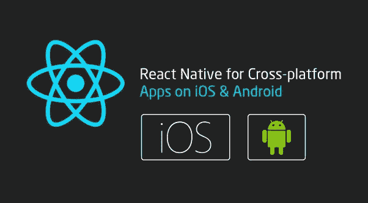

# 顶级 React 原生应用开发公司

> 原文：<https://medium.datadriveninvestor.com/top-react-native-development-companies-in-the-usa-1d0395f54f05?source=collection_archive---------6----------------------->

嗨，读者们，

你在寻找顶尖的 react 原生应用开发公司吗？

你来对地方了！

众所周知，React Native 是一个流行的跨平台移动应用程序开发框架，用于使用单一代码库为 Android 和 iOS 平台开发移动应用程序。

使用 React Native 和 JavaScript 语言，开发人员不需要从头开始为两个不同的平台开发相同的应用程序。代码一旦开发出来，就可以在手机和网络上重复使用。

react native for cross-plateform development

此外，如果您正在寻找开发一个适合 Android、Web、iOS 和 UWP 的可伸缩、健壮和高性能的移动应用程序，并且符合您的预算，那么请查看本文中列出的 7 家可靠和最受欢迎的 react 原生应用程序开发公司。

**最佳本土应用开发公司:**

1.Quytech -Top React 原生 app 开发公司(推荐)

2.头脑风暴

3.柳树

4.根带

5.BHW 集团

6.棱镜的

7.全栈实验室

8.Chopdawg

# 让我们来详细了解一下:

# Quytech

[Quytech](https://www.quytech.com/) 是一家值得关注的 react 应用开发公司，擅长开发 React 本地移动应用。

你可以盲目地相信该公司会为你的初创公司或企业开发一个可扩展的、健壮的 React 原生移动应用。

**两种招聘模式:**

1.  雇佣专门的 React 本地应用程序开发人员
2.  远程 React 本地应用开发者

**Quytech 的 React 原生 App 开发服务:**

*   React 交互式用户界面开发
*   React 本地咨询
*   反应本地团队增强
*   应用迁移和集成
*   对本地应用支持和维护做出反应
*   React 前端应用程序开发
*   React 插件开发

**结账工作及联系方式:**[https://bit.ly/3wbJAJX](https://bit.ly/3wbJAJX)

**除了 React Native，该公司还致力于其他热门技术，如:**
Reactjs、Nodejs、区块链、全栈等。

# **MindGrub**

MindGrub 是一家屡获殊荣的巴尔的摩公司，专门从事自定义 react 本机开发。该公司拥有使用 React Native 以及其他流行的开发技术和框架开发数百个应用程序的广泛组合。

 [## 2020 年移动应用发展趋势|数据驱动的投资者

### 不可否认的事实是，智能手机正在改变运营模式、商业模式和市场…

www.datadriveninvestor.com](https://www.datadriveninvestor.com/2020/01/15/mobile-app-development-trends-to-follow-in-2020/) 

自 2002 年成立以来，MindGrub 一直为其医疗保健、金融、旅游和其他行业的客户提供高科技服务和解决方案。除了 React Native，该公司多才多艺的熟练开发团队还在增强现实、虚拟现实、可穿戴技术、游戏、机器人和其他新兴技术方面拥有实践经验。

# **柳树**

WillowTree 成立于 2007 年，是一家著名的移动应用程序开发公司，以向各种商业垂直领域的客户提供移动和 web 开发服务而闻名。该公司利用 React Native、Xamarin 和其他顶级技术来提供移动应用程序开发服务。你可以信任该公司为你的下一个反应原生移动应用程序开发项目。

# **根带**

Rootstrap 是一家公认的移动和网络开发公司，拥有为初创公司、上市公司和公众人物开发数百个应用程序的记录。通过其 React 本地开发服务，Rootstrap 帮助公司扩大其业务流程并触及其目标受众，而无需在移动应用程序的开发上花费太多。Rootstrap 用于开发的技术和语言有 Swift、Objective-C、Android、React Native 和 Ionic。

# **BHW 集团**

BHW 集团是另一家受欢迎的移动和网络开发公司，为各种规模的企业提供服务。利用 React Native framework，该公司已经向其来自金融、医疗保健、旅游和其他垂直行业的客户交付了许多跨平台移动应用。除了 React 原生应用开发，BHW 集团还提供企业应用开发、业务流程自动化、Android 应用开发和其他服务。

# **棱镜**

Prismetric 是一家领先的移动应用程序开发公司，致力于开发卓越的移动和 web 应用程序，以满足客户的业务目标和要求。这家公司提供的服务包括 React 原生应用开发、虚拟现实应用开发、AR 应用开发、跨平台应用开发等。Prismetric 以可靠的解决方案、交互式设计、清晰的沟通、准时交付、预算友好的计划和服务质量而闻名。您可以联系他们开发一个使用 React Native 开发的高性能跨平台应用程序。

# **全栈实验室**

如果你正在寻找一个口袋友好的 React 本地应用程序开发服务，那么 FullStack Labs 是一个完美的选择。该公司由一个经验丰富的 React 原生应用程序开发人员团队提供支持，以编写在 Android 和 iOS 平台上实现 100%成功率的应用程序。FullStack Labs 在 React Native、Angular.js、Python、Ruby on Rails、Ember.js、Node.js 和其他新兴开发技术方面拥有实践经验。

# **Chopdawg**

Chopdawg 是一家公认的 React 原生应用程序开发公司，遵循“客户至上”的方法，为多个平台开发高度先进和可扩展的应用程序。这家总部位于费城的公司成立于 2009 年，拥有一支经验丰富、精通 React 原生应用开发的庞大团队，以满足创业公司和企业的特定应用开发需求。除了提供 React 原生应用开发服务，该公司还为您的项目提供“雇佣 React 原生开发者”的选项。

在该公司工作的 React 原生应用程序开发人员团队相信，开发下一代跨平台应用程序可以利用 React 原生的潜力。Chopdawg 拥有为医疗保健、旅游、电子学习和各种其他商业垂直领域开发数百个应用程序的良好记录。

# 雇佣一名 React 本地开发人员:你应该寻找什么？

如果你正在[招聘一名 React 本地开发人员](https://www.quytech.com/hire-react-native-developers.php)，这里有一些你应该寻找的技能。

# **技术技能**

虽然您已经准备好将一名 React 本地开发人员引入您的团队，但确定他的技术技能是至关重要的。因此，检查候选人是否具备以下技能-

*   很好地理解 React 的基本原理，如组件生命周期、虚拟 DOM 等。
*   精通 JavaScript 和其他函数式编程语言
*   了解类型检查和单元测试
*   具有状态管理库、调试移动应用程序和大型代码库的经验
*   了解 Java、Swift 和 Objective-C 等移动编程语言者优先
*   编写本机模块和 npm 包的经验

但是，这可能会因您所从事的项目而略有不同。

同样，你必须考察候选人的软技能。

# **软技能**

*   **沟通:**检查开发人员的沟通方式——他熟悉的渠道，以及他是否能够轻松地与团队成员传达想法和问题。
*   时间管理:对大多数组织来说，这是头等大事。在雇佣 React 本地开发人员时，不要忘记确定他管理时间的能力。
*   **解决问题:**当你从事不同的项目时，很可能会出现问题。在这种情况下，开发人员能够自己解决问题吗？他能拿出强有力的解决方案吗？如果答案是肯定的，那么你的招聘漏斗中就有一个好的候选人。
*   **适应性:**对于你的 React 本地开发者来说，适应不同的项目环境是必不可少的。因此，分析候选人的能力和意愿，为途中出现的任何事情做好准备。

在你坐下来面试一位 React 本地开发者之前，准备一份包含这些要点的清单。如果候选人符合其中的大部分条件，你就可以在你的组织中给他一个职位。招聘时要明智。

# **结束**

本文涵盖了初创公司和企业在移动应用开发方面首选的顶级 React 原生应用开发公司。你可以浏览他们的投资组合或检查他们客户的评论，以了解他们的工作和开发的应用程序。选择一个适合你的 [**React 原生移动应用开发**](https://www.quytech.com/mobile-application-development/react-native-app-development.php?utm_source=MediumBlog&utm_medium=ReactNative) 需求并且符合你预算的。

## 访问专家视图— [订阅 DDI 英特尔](https://datadriveninvestor.com/ddi-intel)