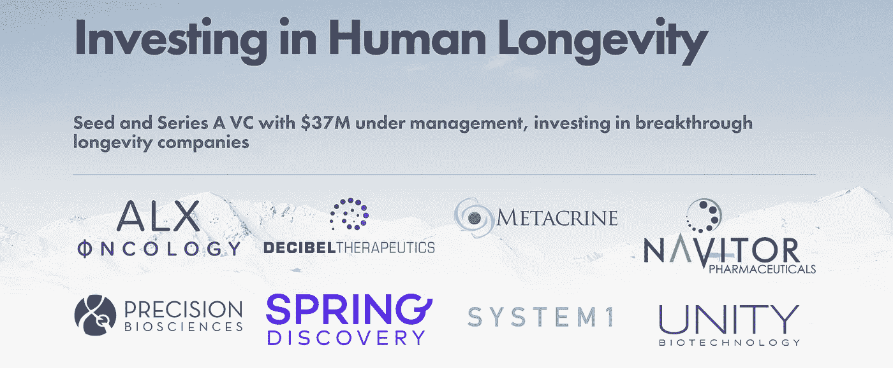
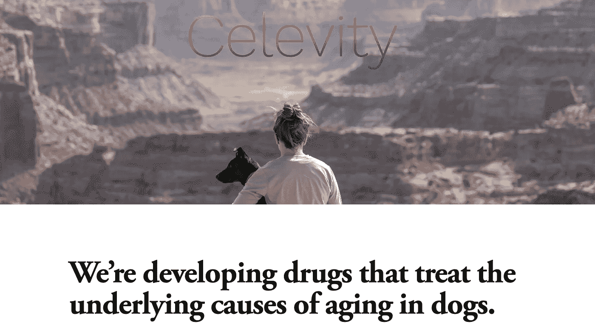

# 致力于实现不朽的顶级创业公司

> 原文：<https://medium.datadriveninvestor.com/top-startups-working-towards-immortality-c87a8a9f34ae?source=collection_archive---------0----------------------->

## 未来派创业公司

## 这些资金充裕的公司正在寻找有才华的人来实现不可思议的目标——永生。

Photo by [Zoltan Tasi](https://unsplash.com/@zoltantasi?utm_source=medium&utm_medium=referral) on [Unsplash](https://unsplash.com?utm_source=medium&utm_medium=referral)

在 20 世纪之前，延长人类寿命被认为是一个缓慢的过程，而且有一个上限。从那以后，科学发生了根本性的变化。科学不是唯一需要改变的东西。

 [## 这位 23 岁的女士刚刚关闭了她的第二只基金——专注于老龄化——2200 万美元…

### 劳拉·戴明不是典型的风险投资家。话说回来，她在很多方面都不典型。首先……

techcrunch.com](https://techcrunch.com/2017/08/22/this-23-year-old-just-closed-her-second-fund-which-is-focused-on-aging-with-22-million/) 

投资者的态度也开始改变。由于 17 岁的劳拉·戴明富有远见的努力和勇气，以及彼得·泰尔奖学金 10 万美元的资助，一个旨在延长人类寿命的基金成立了。

劳拉·戴明在她的博客中详细介绍了长寿的方法。我将深入研究其背后的科学，但大体上这些都是可以努力的方向。

*   消除致命的疾病
*   减缓细胞死亡
*   暂停让你变老的机制
*   改善你细胞的垃圾处理，当你变老时，你的细胞会变坏

尽管如此，有如此多的新领域需要覆盖，受到了很多关注，劳拉·戴明很快开始工作，并设法为她的第一轮资金筹集了 400 万美元。总共投资了 5 家公司。

从那时起已经过去了很长时间，2017 年长寿基金又筹集了 2200 万美元。看到他们投资组合中的所有公司以及他们正在做的工作是非常有趣的。

 [## 金融科技初创公司正在颠覆全球银行业|数据驱动的投资者

### 传统的实体银行从未真正从金融危机后遭受的重大挫折中恢复过来…

www.datadriveninvestor.com](https://www.datadriveninvestor.com/2018/10/20/fintech-startups-are-disrupting-the-banking-industry-around-the-world/) 

longevity.vc portfolio

这些公司现在资金充裕，正在积极寻找有才能的人，他们有动力实现不可思议的目标——永生。

让我们来看看这些公司在做什么，以及有哪些工作机会

# 治疗狗的衰老

**地点:三藩市|工作:商业运营，运营主管&科学家 I**

Celevity 是一家超早期公司，试图确定并解决狗衰老的原因。Celevity 总部设在旧金山，正在寻找有才能的人在寿命研究方面取得进展。 [Celine Halioua](https://medium.com/u/65bf8b3fa950?source=post_page-----c87a8a9f34ae--------------------------------) 是首席执行官，可以在 twitter 上关注其最新动态。

celevity.co

# 统一生物技术公司

**地点:旧金山|职位:主任(生物统计)，研究助理**

Unity biotechnology 是长寿基金最早的公司之一。它试图通过减缓、阻止或逆转衰老疾病来延长人类的健康寿命。它的重点是创造"**衰老"**药物，有选择地消除旧细胞，从而治疗与年龄有关的疾病，如骨关节炎、眼疾等。

# 春天的发现

**地点:圣卡洛斯|职位:高级数据科学家，ML 工程师**

 [## 本·卡门斯的春季发现:抗衰老创业公司筹集了数百万美元

### 对于一个 35 岁的硅谷创业公司创始人和前可汗学院工程师本·卡门斯有一个相当亲密的…

www.joshloe.com](https://www.joshloe.com/2018/12/15/ben-kamens-spring-discovery-antiaging-startup-raises-millions/) 

尽管衰老研究有着巨大的前景，但进行实验仍然需要太长的时间。这大大减缓了寻找有朝一日能减少心血管疾病、神经退行性疾病等疾病的疗法的速度。

Spring Discovery 建立了一个机器学习平台，以加速发现这种疗法的实验，为世界上最重要的问题之一带来了一种新的计算方法:与衰老及其疾病作斗争。

# 戈登生物技术公司

**地点:三藩市|工作:基因治疗工程师**

Gordion 是一个药物发现平台，用于治疗复杂的衰老疾病。他们正在寻找一名基因治疗工程师，通过内包生产和开发新的递送策略来改进 Gordian 的递送载体。这项工作包括学习和优化最常见的基因治疗载体的生产方法。

# 油藏神经科学

工作地点:伯克利|工作:基因治疗工程师

开发了世界上第一种治愈血脑屏障的疗法。他们正在寻找一位有才华的科学家来领导体外药物发现平台的开发，该平台将用于发现和验证新的药物靶点。成功的候选人将成为第三名全职员工。

同一个基金还有很多其他人。请访问他们的网站了解更多信息。

*   分贝疗法(波士顿)——内耳研究顶级公司为听力和平衡提供改变人生的药物
*   精密生物科学(达勒姆)-基因组编辑，以消除癌症，遗传疾病和创造更好的食物。
*   鲁贝多生命科学公司(桑尼维尔)——治疗老年痴呆症、糖尿病等与年龄相关的疾病。
*   System1 Biosciences(旧金山)-神经治疗公司，为癫痫、自闭症和精神分裂症开发药物。