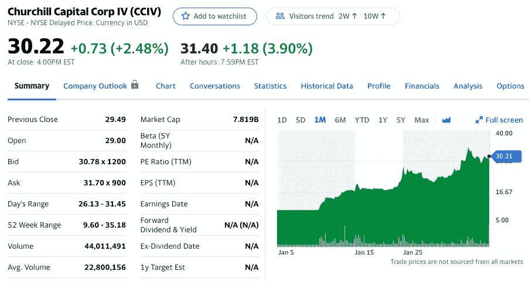

# 2021 年 2 月最佳股票选择

> 原文：<https://medium.datadriveninvestor.com/top-stock-picks-for-february-2021-ef2a6f59ec71?source=collection_archive---------7----------------------->

## 以下是我在 2 月份投资和交易选择时需要关注的五只股票

Photo by [Corinne Kutz](https://unsplash.com/@corinnekutz?utm_source=unsplash&utm_medium=referral&utm_content=creditCopyText) on [Unsplash](https://unsplash.com/s/photos/list?utm_source=unsplash&utm_medium=referral&utm_content=creditCopyText)

免责声明:这不是专业的财务建议，你应该对我所有的选股持保留态度。

市场终于找到了稳步上涨的道路。市场波动很大，但随着 COVID 数字的下降和收益季节的全面影响，现在是玩市场的好时机。

让我们用这五大精选股票赚点钱吧！

 [## 2021 年 1 月前 5 只股票

### 以下是我在 12 月份投资和交易时需要关注的五只股票

medium.com](https://medium.com/datadriveninvestor/top-5-stocks-for-january-2021-b75034553865) 

# 一月份精选的股票表现如何

1.  A10 网络公司——10 美元至 11 美元
2.  Jumia 技术公司(JMIA)——46-64 美元
3.  Riot Blockchain，Inc .(RIOT)——14-22 美元
4.  ETF 系列解决方案——美国全球喷气机 ETF(喷气机)——22-23 美元
5.  NIO unlimited(NIO)——47 美元至 57 美元

一月份的选秀权都有稳定的增长，但 JMIA 和里奥绝对表现出色。当我叫他们出来的时候，祝贺所有进来的人！

# 二月份精选的股票

1.  斯基尔茨
2.  ETFMG 替代收获(兆焦耳)
3.  生物纳米基因组学
4.  丘吉尔首都(CCIV)
5.  微视(MVIS)

我将我的选股多样化，选择了娱乐行业、大麻行业、基因组行业、电动汽车行业和技术/人工智能行业的股票。希望你觉得这有用！

 [## 股票市场日内交易者的日常工作

### 一些日内交易的注意事项可以让你的日内交易更加愉快

medium.com](https://medium.com/datadriveninvestor/the-routine-of-a-stock-market-day-trader-d8a4e4c2da50) 

# 1.斯基尔茨

Yahoo Finance

Skillz，Inc .致力于开发移动游戏平台，将玩家连接到公平、有趣和有意义的竞争中。它通过在游戏中实现社交竞争，帮助开发者建立数百万美元的特许经营权。

在这只股票 20 出头的时候，我一直非常看好它，因为在 COVID 期间，游戏世界蓬勃发展，现在通过玩电子竞技游戏来增加博彩是一个新的维度，将与体育博彩股票一起蓬勃发展。

斯基尔兹终于引起了市场的注意，这可能是因为所有其他体育博彩股票，如 Penn 和 Draftkings，在超级碗比赛前表现良好。不管怎样，我都非常看好 Skilz，一定会关注它的动向。

 [## 沃伦·巴菲特的三句名言，能让你更好地理财

### 有史以来最著名的投资者之一的建议

medium.com](https://medium.com/long-term-perspective/3-quotes-from-warren-buffett-that-will-make-you-better-with-money-e8890cd6ed4b) 

# 2.ETFMG 替代收获(兆焦耳)

Yahoo Finance

MJ 跟踪从事大麻、大麻素或烟草产品的合法种植、生产、营销或分销的全球公司的市值加权指数。

随着大麻在美国合法化的可能性越来越大，这只 MJ ETF 长期表现良好的希望非常高。

与其选择一两只大麻股票，为什么不选择几只呢？选择范围广泛的 MJ 股票更容易，因为只要它变得合法化，你就不必担心某个特定公司做得好是对还是错。

## 美赞臣控股包括以下内容:

MJ ETF holdings

# 3.生物纳米基因组学

Yahoo Finance

Bionano Genomics，Inc .普通股，也称为 Bionano Genomics，是一家生命科学仪器公司，专注于基因组分析领域。

该公司从事 Saphyr 系统的开发和营销，这是一个用于超敏感和超特异性结构变异检测的平台，使研究人员和临床医生能够加快寻找新的诊断和治疗靶点，并简化细胞遗传学。

基因组学部门今年一直在蓬勃发展，方舟投资公司拥有非常强大的基因组学投资组合，如果他们增加 BNGO 的头寸，将这只股票送上月球，我不会感到惊讶。

# 4.丘吉尔首都(CCIV)

Yahoo Finance

Churchill Capital Corp. IV 经营空白支票公司。公司的成立是为了实现与一个或多个企业的合并、股本交换、资产收购、股票购买、重组或类似的企业合并。

这是一部特殊目的收购公司戏剧，将在不久的将来并入 Lucid Motors。只要交易成功，我们就能看到它大卖。

它将成为 Lucid Motors，一家由一些前特斯拉员工运营的电动汽车公司。如果这还不足以让你兴奋，那我就不知道什么才是了。

我们现在都知道，围绕电动汽车股票的炒作正在升温。各种各样的公司都计划开始生产电动汽车，Lucid Motors 无疑是一个很有前途的公司。

# 5.微视(MVIS)

Yahoo Finance

微视公司从事激光束扫描技术的开发。它以 PicoP 品牌提供产品。

PicoP 扫描技术满足了以下细分市场的需求:交互式和非交互式投影显示、用于消费电子产品的 3D 感知激光雷达传感、用于汽车主动防撞的增强/混合现实(AR/MR)和 3D 感知激光雷达传感。

微视处于两大技术创新的前沿——激光雷达和 ar 技术。到今年年底，这只股票应该会轻松达到 20 美元。肯定是长期持有。

技术没有停止，一年前 MVIS 的价值还不到 25 美分。任何早期买入的人今天肯定会得到回报。在 Microvion 起飞并达到新的高点之前，还不算太晚。

# 最后的想法

我希望下面的选股对你有吸引力。只要市场继续发挥作用，它们应该会在接下来的几个月里为你带来稳定的增长。

随着财报季过半，我们已经看到了一大堆成功的故事，比如网飞、Paypal 和 Pinterest。看看接下来的一周会怎样将会很有趣！

记住，收益就是赌博。你应该准备好第二天看到你的期权归零。玩收益从来没有保证，即使公司碾压收益。

我的大部分选股来自于阅读大量文章、观看 YouTube 视频以及关注趋势。一如既往的感谢大家！我很自豪地说，我挑选的股票每个月都有大约 1000 次浏览。

长期，短期，无所谓。我相信所有这些股票都会上涨。

保重，注意安全，祝你在股市好运！

这不是专业的财务建议，你应该对我所有的选股持保留态度。

*如果你喜欢这本书，并想看看我以前的选股，我在下面链接了其他文章！*

 [## 2021 年 1 月前 5 只股票

### 以下是我在 12 月份投资和交易时需要关注的五只股票

medium.com](https://medium.com/datadriveninvestor/top-5-stocks-for-january-2021-b75034553865)  [## 2020 年 12 月前五大股票

### 以下是我在 12 月份投资和交易时需要关注的五只股票

medium.com](https://medium.com/datadriveninvestor/top-5-stocks-for-december-2020-991dcb692749)  [## 2020 年 11 月五大精选股票

### 以下是我在 10 月份投资和交易时需要关注的五只股票

medium.com](https://medium.com/datadriveninvestor/top-5-stock-picks-for-november-2020-e1e9eb539d87)