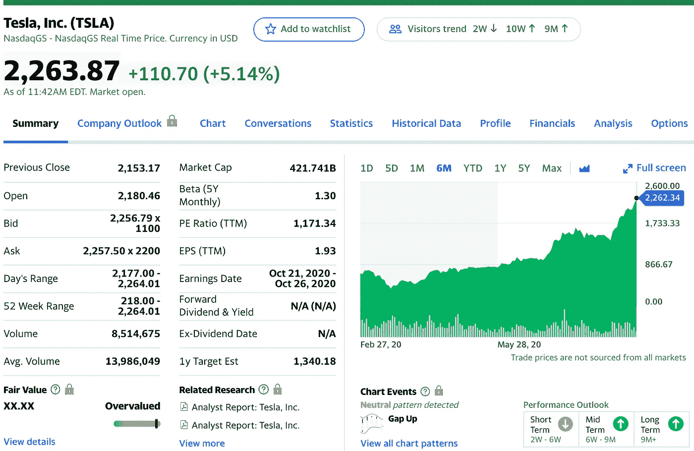
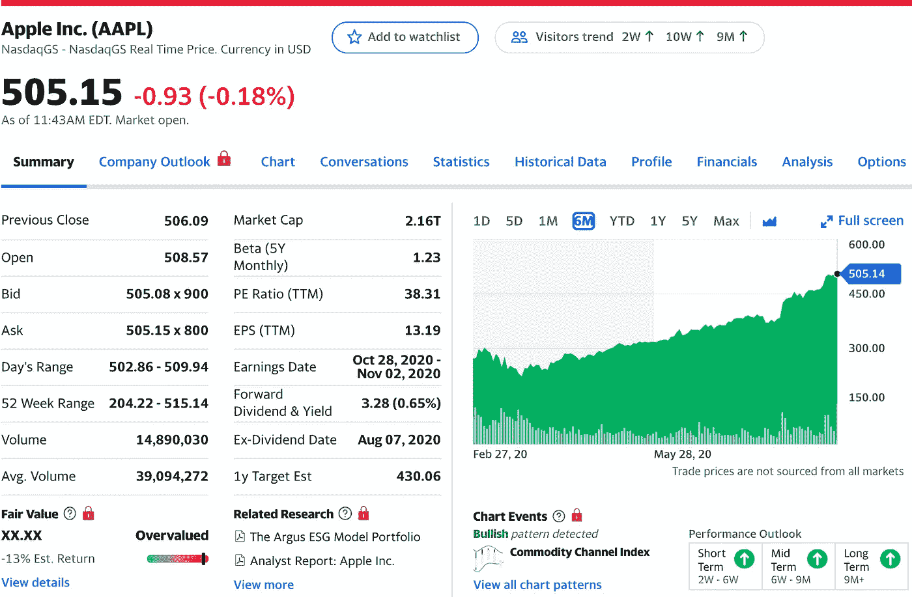
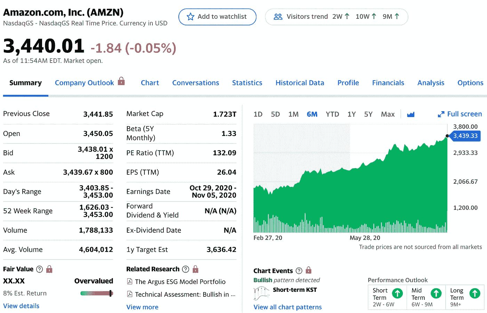
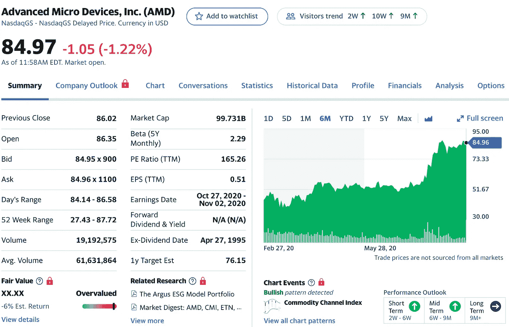
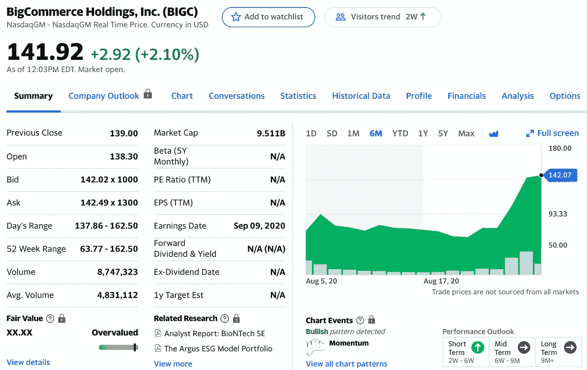

# 2020 年 9 月的热门股票

> 原文：<https://medium.datadriveninvestor.com/top-stocks-for-september-2020-8ed187c864f6?source=collection_archive---------2----------------------->

## 投资者应该密切关注这些股票

Photo by [Precondo CA](https://unsplash.com/@precondo?utm_source=unsplash&utm_medium=referral&utm_content=creditCopyText) on [Unsplash](https://unsplash.com/s/photos/growth-money?utm_source=unsplash&utm_medium=referral&utm_content=creditCopyText)

2020 年是股市狂飙的一年。市场最近非常看涨，有很多股票真的在上涨！

对于 2020 年 9 月，有很多我正在关注的大盘股。

如果你没有足够的资本进行投资，那么你可以购买零股，并支付价值一美元的股票，而不是支付整个股价。

我的 8 月选股表现很好，如果你选股并从中受益，祝贺你的巨大收益！

*   [**我六月份的前五名**](https://medium.com/datadriveninvestor/my-top-5-robinhood-stocks-june-2020-f4f9beca28f4)
*   [**我的 7 月前 5 名**](https://medium.com/datadriveninvestor/hot-stocks-for-july-2020-a66c741f6c66)

## [**我 8 月份的 5 大精选**](https://medium.com/datadriveninvestor/hot-stocks-for-august-2020-c0616292ed36)

*   转移 4 支付(28%的收益)—长期持有
*   辉瑞公司(Pfizer)(亏损 0.72)——没有盈利也没有亏损。
*   景顺(-7%的损失)——持有时间长一点。
*   联合航空公司(11%的收益)——长期持有
*   AMD (18%的收益)——长期持有

**以下是我 2020 年 9 月的 5 大选股！**

# 1.特斯拉(TSLA)

Yahoo Finance

> 据[路透社](https://www.reuters.com/companies/TSLA.O)报道，特斯拉公司，前身为特斯拉汽车公司，设计、开发、制造和销售全电动汽车和**储能**系统，以及安装、运营和维护太阳能和**储能**产品。该公司通过两个部门运营:汽车、能源、发电和存储。

我们都知道，特斯拉在 8 月 31 日宣布其**5–1 股票分割**是一个大新闻。

随着股价跌至每股约 500 美元，更多的投资者将能够买到这只乐观的股票。拆分后，价格最终会被推高，你会很高兴自己提前进入了。

 [## 开始投资股票的 12 条简单规则|数据驱动型投资者

### 如何投资而不亏本呢？问题是从未投资的人害怕投资。它可能…

www.datadriveninvestor.com](https://www.datadriveninvestor.com/2019/10/17/12-simple-rules-to-start-investing-in-stocks/) 

特斯拉 Model S 和 Model X 的销量一直相当稳定，这对投资者来说是个好消息。首席执行官埃隆·马斯克是个天才，他对未来有很多宏伟的计划，包括太空、电动汽车等等。

如果你能得到一些股票，甚至是零股，并长期持有，你会看到一些不错的收益。

# 2.苹果公司(APPL)

Yahoo Finance

苹果一直是我最喜欢的股票之一。

他们的前景令人难以置信，因为人们会因为他们建立的品牌忠诚度和出色的营销策略而持续购买他们的产品。

> 根据摩根大通分析师 Samik Chatterjee 的说法，[苹果](https://www.cnet.com/news/iphone-12-pro-max-2020-rumors-apple-may-announce-it-on-sept-10-launch-phone-in-october-stovetop/)将在 2020 年秋季发布四款新的 iPhone 12 机型:一款 5.4 英寸的机型，两款 6.1 英寸的手机，以及一款 6.7 英寸的手机。他们都将有有机发光二极管显示器。

他们宣布在 8 月 31 日进行 **4 比 1 的股票分割**，这让资金较少的投资者垂涎苹果的兴奋。很高兴你在分割发生前购买了股票。大约 130 美元的新价格将允许更多的投资者投入资金，推动价格上涨。

# 3.亚马逊(Amazon)

Yahoo Finance

到目前为止，亚马逊一直是我最喜欢的成长股之一，因为我每天都在使用他们的服务，而杰夫·贝索斯知道如何满足他的客户。

他们在商业的许多不同领域，这是他们统治商业世界的原因。

在未来，我预见到股票分割。所以如果你现在至少进了一股，以后可能会有 4、5 股左右的回报。这只股票是长期持有的，不支付股息，毫无疑问将会存在很长一段时间。

> “谈到电子商务市场的主导地位，亚马逊位于食物链的顶端**。…即使是世界上其他一些最大的零售巨头也很难与亚马逊竞争。尼尔·帕特尔说:“像沃尔玛、苹果、梅西百货和好市多这样的公司仍然无法与亚马逊这样的庞然大物抗衡。”**

# **4.AMD —高级微设备公司(AMD)**

****

**Yahoo Finance**

**AMD 是我在疫情开始时投资的第一批股票之一。从那以后，它们的价值几乎翻了一番。**

> **基于 [Wallet Investor 的](https://walletinvestor.com/stock-forecast/amd-stock-prediction)预测，预计长期上涨，2025 年 8 月 20 日的“AMD”股价预测为 175.492 美元。投资 5 年，预期收益在+104.64%左右。你现在的 100 美元投资，到 2025 年可能会涨到 204.64 美元。**

**我不是一个很懂技术的人，但是我有一大堆朋友，他们都相信 AMD 会在未来有一个巨大的飞跃。他们制造的芯片的质量正在提高，他们在技术世界中为自己赢得了声誉。**

**这只股票是长期持有的，不支付股息，我预计它们未来的价格将与英伟达(NVIDIA)类似(500 美元)。**

# **5.大商业**

****

**Yahoo Finance**

> **据 TechCrunch 报道， [**BigCommerce，**](https://crunchbase.com/organization/bigcommerce) 类似于大众市场的宠儿 Shopify，为商家提供电子商务服务。鉴于公众投资者对其加拿大竞争对手如此着迷，BigCommerce 上市的时机完全不令人意外，而且从表面上看是明智的。**

**自从我以 67 美元的价格进入以来，大商业公司的表现令人难以置信的好。它在过去的一周里翻了一番，我预见到这家电子商务公司的光明前景。**

**自从疫情以来，电子商务的世界已经爆炸式增长，我相信大型商业可以成为下一个 Shopify。其他涨幅可观的电商股票有 Etsy、阿里巴巴、易贝、Chewy 等。**

**如果你相信电子商务有一个光明的未来，那么现在是时候得到一些 BIGC 股票了。**

# **2020 年 9 月的最后阶段**

**我对 2020 年 9 月的选股比 8 月和 7 月的选股更贵。制药公司不断地上下波动，我宁愿设定它并忘记它。**

**有了这些股票，你可以设置它，忘记它，十年后返回，并为你将看到的可观的增长感到高兴。**

**投资 2020 年是一场狂野之旅，但只要你在做研究，并且坚信你投资的公司，你就会赚很多钱。**

****访问专家视图—** [**订阅 DDI 英特尔**](https://datadriveninvestor.com/ddi-intel)**