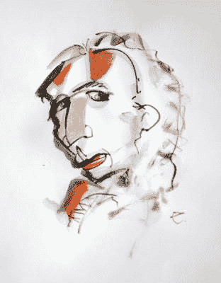

# 自由的火炬:利用宣传让更多女性使用烟草

> 原文：<https://medium.datadriveninvestor.com/torches-of-freedom-the-use-of-propaganda-to-get-more-women-using-tobacco-428be5d73cfe?source=collection_archive---------10----------------------->

## 纺纱工

## “摧毁人民的最有效方式是否认和抹杀他们自己对自己历史的理解。”—乔治·奥威尔

Thanks to [JJ Jordan](https://unsplash.com/@see2believe) for sharing their work on Unsplash.

我相信是广告人克劳德·霍普金斯用一个词大幅提高了洗发水的销量。他在说明书的“冲洗”一词后面加上了“重复”一词不是每个人都洗两次头发，但是很多人肯定会洗。我们被指示按照指示去做。

 [## 不要杀死一个人形机器人:机器值得拥有权利吗？数据驱动的投资者

### 7 月下旬，全世界都知道 Neuralink 公司即将把人脑与计算机集成在一起…

www.datadriveninvestor.com](https://www.datadriveninvestor.com/2020/07/09/dont-kill-a-humanoid-do-machines-deserve-to-have-rights/) 

我们受媒体的影响远远超过我们意识到的。在过去的一周里，我读了一篇关于女性如何走上街头抗议以获得吸烟权的文章。写这篇文章的人并没有意识到这是一个妇女在复活节游行中公开吸烟的事件。

Illustration by the author.

营销人员爱德华·伯奈斯是这场“妇女解放”运动背后的设计师，这场运动的主题是在公共场所吸烟的权利。我年轻的时候，伯奈斯没有被一些人称为“棺材钉”，而是宣扬他们是“自由的火炬”。维基百科账户是这样开始的:

**“自由的火炬”是二十世纪初美国第一波女权运动中一个利用女性对美好生活的渴望来鼓励女性吸烟的短语。香烟被描述为解放和与男人平等的象征。**

**这个特别的维基百科故事称伯奈斯为“公共关系之父”,但在那个时候它并不被称为 PR。他的书被命名为*宣传*，这个术语在纳粹给它起了个坏名字后不得不被放弃。**

**今天我们被旋转轰炸。文化战争的一个主要战场是媒体。正如奥威尔所说，“谁控制了过去，谁就控制了未来；谁控制了现在，谁就控制了过去。”因此，历史不断被改写。昨天的英雄变成了今天的敌人。(今年有多少哥伦布雕像倒下了？明天被称为土著民族日。)**

**在我的营销生涯中，我一直是公关专业的学生。这一经历让你大开眼界。学的越多，越是摇头和翻白眼。正如《传道书》的作者所写，“智慧多，忧愁多。”**

**以下是我关于这个主题的一篇文章: [**控制叙事的人就控制了人民**](https://medium.com/@ennyman/he-who-controls-the-narrative-controls-the-people-700118aadb3?source=friends_link&sk=f6cf42f139ecb4051b93a90629b1bf54) 。**

**这里还有我评论雅克·埃吕尔的卷， [**宣传:男人态度的形成**](https://medium.com/@ennyman/jacques-elluls-propaganda-the-formation-of-men-s-attitudes-a9372bd4fd65?source=friends_link&sk=7d65e2135709c7b3666fc0fde0951f26) 。**

**在维基百科的自由火炬账户中，我们发现伯奈斯有一个非常明确的目标:消除与吸烟相关的社会禁忌。美国烟草公司很高兴以这种方式将他们的潜在市场扩大一倍。**

****底线**:你所相信的，尤其是关于当前事件的，有多少是别人编造的？接下来的问题是:谁？为了什么目的？我们街上现在发生的事情有多少是由幕后的其他人策划的？为了什么目的？**

***原载于*[*https://pioneerproductions.blogspot.com*](https://pioneerproductions.blogspot.com/2020/10/torches-of-freedom-use-of-propaganda-to.html)*。***

## **访问专家视图— [订阅 DDI 英特尔](https://datadriveninvestor.com/ddi-intel)**