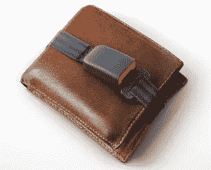

# 艰难的经济时期不会持续，坚强的人会

> 原文：<https://medium.datadriveninvestor.com/tough-economic-times-never-last-tough-people-do-2c0174588a24?source=collection_archive---------29----------------------->

Photo credit: Street Smarts

***作者尤利·马萨巴***

这篇文章很长(我道歉)。但还是那句话，如果读到一半，就会错过重点。

投资有风险。在困难时期投资风险更大，尤其是如果你不确定投资是否会产生你想要或期望的回报，或者你是否能设法看到你的投资通过第一年。但还是那句话，完全不投资是最危险的。

但这一切都归结于信息的可用性和可访问性。数据支持的投资决策，即使在困难时期，至少总有一些成功的机会。我知道你们中的许多人会说‘在这种时候你不可能投资’。也许是真的，也许不是。情况总有例外。

任何事情都有两面性，在这种情况下，我指的是由新型冠状病毒(nCoV-19)引起的衰退和/或抑郁(或者是它)。但是在我们进一步讨论之前，我希望我们能区分一下衰退和萧条。

经济衰退是指经济中国内生产总值逐渐或急剧下降的时期，通常持续连续两个季度；除此之外，就是别的了。

另一方面，萧条是指经济活动严重或长期全面下降或减少的时期；一般来说，生产下降，消费减少，收入减少，工资下降，人们失业，通货膨胀飙升，等等。

在衰退中，生产可能下降，但工资保持不变，但收入下降，很少有人会失业，通货膨胀可能保持稳定，但消费可能相当稳定，甚至上升。

 [## 危机？风投适应的 3 种方式|数据驱动的投资者

### 当我写这篇文章的时候，一场全球性的危机正在发生。这不是第一次，也不会是最后一次。很多事情已经…

www.datadriveninvestor.com](https://www.datadriveninvestor.com/2020/03/22/crisis-3-ways-vcs-adapt/) 

因此，正如我们在 2020 年第一季度所做的那样，许多人都预测，Covid 疫情可能会在未来三个月或更长时间内推动局势保持现状，目前我们正处于轻度衰退中，这是由于迷你锁定造成的。

但你会意识到生产仍在继续，尽管速度很慢，工厂在生产，村里的农民在种植，不让雨水白白浪费。交货在进行，消费在继续。但我们也可以说，总体商业活动有所下降。一些企业已经倒闭，顾客也没有那么多购买，但一旦他们这么做了，那就是在膨胀。

上周，总统下令关闭电子产品、服装、零部件等非必要业务。只允许食品市场、食品配送、垃圾收集、银行、公用事业服务提供商和机构办公。

但它也敲响了警钟，给了我们一个警告。它教会了我们个人财务纪律，如何确保个人卫生，如何不管距离远近都不把我们所爱的人视为理所当然，以及如何保持活力和更接近上帝的需要。他们说，只有当麻烦来临时，人类才会想起上帝。

除此之外，对于企业家和关注投资的人来说，这是审视环境和发现机会的时候了。那些以人性为中心的人会把任何一种思想称为“资本主义”。但是，最好用批判的眼光来看待这个杯子，确定它是半空的还是半满的。

因此，这篇文章将帮助我提出这个问题:作为个人，你对 Covid 时代的机遇准备好了吗？你/我们是哀叹还是利用这段时间做点什么来提升自己？你会利用你发现有利可图的机会吗？你会只消费不生产吗？你会只拿一份收入/工资而不去储蓄和投资吗？

我知道你们中的许多人会说‘我现在不能浪费我的钱去投资，这非常危险’。但我之前说过，不尝试是最危险的。

好吧，让我带你回到历史。

在 1929 年和 1930 年的大萧条期间，有人投资。他们要么动用部分积蓄，要么冒险向 3F 家族(家人、朋友和傻瓜)借钱；傻瓜是那些有钱却不知道去哪里投资的人，他们会抓住任何人告诉他们的有利可图的机会。

其次，那段时间确实有生意兴隆。其中之一是宝洁公司(P&G)。它在 1929 年初经历了一段艰难时期，但设法利用了这一形势。当其他前台杂货店正在削减库存数量和水平时，P&G 意识到人们会非常需要肥皂(就像现在的乌干达)，他们知道人们肯定会向他们购买。

他们没有削减广告支出预算，而是冒险进入新的营销渠道，包括商业电台广播，赞助每日电台节目，制作广告等。并开始赞助它的其他产品。

1939 年，P&G 制作了第一部“肥皂剧”，1940 年和 1950 年，它开始了自己的电视肥皂剧制作部门，其第一部连续剧名为“第一个百年”。它最终就这样转移到了新的市场，你能想象吗！

这还不是全部。另一个案例是一位名叫弗洛伊德·奥德伦(Floyd Odlum)的绅士——一位美国公司律师，他在公用事业上市股票上投资了 3 万多美元，不喜欢市场结束的方式——市场即将崩溃，他看到了这一点。

他减少了股票购买，积累了一些资金——手头的现金。无论你是不是投资者，如果你碰巧有大量可获得的现金，这将让你在一个现金匮乏的市场中成为令人羡慕的奇观。

因此，当股票市场最终崩溃时，弗洛伊德跳了进来，开始以令人羡慕的低价收购失败的公司，然后合并或巩固他们的资产以获得更多现金。这太疯狂了，但就像闭着眼睛击中靶心一样，这让他成为“他那个时代美国最富有的人”之一，他们说。

我知道你们中的一些人会说“这就是美国”。但这是一个很好的教训。让我们回到非洲，特别是乌干达。

我们/你不能让目前的情况打击你，就这样走了。所以，我想给你一点提示，告诉你此时可以投资的一些事情，抓住机会赚一些合法的、非投机性的先令，而不是等待局势正常化；因为，现在是最好的时机。

**1 —购买股票**

有机会就投资股票。我的意思是当你发现有股票出售时。与你的经纪人保持联系(如果你有的话)。如果你不知道，那就去看看日报上的股票交易专栏。

这是长期投资的途径之一——当然前提是股市不崩盘。当然，如你所知，许多东非股票市场相当不活跃，股价下跌或不变。

例如，两周前，在卢旺达证券交易所上市的所有公司的股价都保持不变，而在内罗毕证券交易所，肯尼亚的股价逐渐下跌了约 3%。

在坦桑尼亚，达累斯萨拉姆的上市股票价格也下跌或保持不变；对于乌干达证券交易所来说，所有上市公司的股价都下跌了，只有 Cipla-QC 的股价上涨了 2%,从每股 100 乌干达先令上涨到 102 乌干达先令。

此外，Jubilee Holdings 和 Uchumi 的股价分别从 10，978 美元和 10.14 美元上涨了 0.6%和 4.11%。有了上述数据，现在投资 Cipla、Jubilee 或 Uchumi 股票岂不是明智之举？

这样做是最好的，因为当经济经历一些动荡时，往往会有一些行业继续前进，仍然提供服务和产品，仍然为投资者提供稳定的回报。

因此，如果你想在经济衰退或萧条期间部分投资股票，可以考虑投资医疗保健、公用事业和消费品行业。不管经济状况如何，人们仍然会在医疗保健、家庭用品、电力、水和食品上花钱。

因此，这些股票往往在萧条时期表现良好(而在繁荣时期表现不佳)。事实上，肯尼亚 AIB 资本公司的分析师暗示，投资者应该利用较低的价格购买价值股票，这些股票目前的交易价格低于其公允价值。可能是你。

**2 —债券&国库券**

这些是政府为控制经济或作为货币政策工具而发行的金融工具或票据。它们通过各自的中央银行向公众和公司发行。由于乌干达(和东非)价格下跌，投资者抛售上市股票，次佳选择是购买债券和 TBs。我也在这里写了关于他们的文章。

许多人总是低估债券和 TBs 的魔力，然而随着股票等高风险投资收益的下降，它们(债券和 TBs)获得了价值。如果你有疑问，我给你举个例子。

两周前，卢旺达债券市场在七(7)笔交易中总共达到 4.59 亿卢旺达法郎(476，757 美元)。在肯尼亚，债券交易从 91 笔增加到 98 笔，从 38 亿肯尼亚先令(3800 万美元)增加到 60 亿肯尼亚先令(5500 万美元)。

在乌干达，乌干达银行上周就 TBs 拍卖发布新闻声明，承诺 91 天、182 天和 364 天到期的利率分别为 9.02%、10.20%和 12.29%。见[此处](https://bit.ly/2UKHtdw)。如果你看看这些债券的到期收益率(YTDs ),它将远高于现在的水平。

**3 —房地产**

乌干达住房、土地和城市规划部和行业专家一直提醒你，乌干达存在严重的住房危机，对那些有兴趣投资的人来说，这是一个应对螺旋上升的需求的机会。住房缺口超过 250 万套，预计到 2040 年将达到 800 万套。

现在是投资房地产的最佳时机——房屋、出租、店面、土地等等。2008 年，乌干达像该地区其他国家一样受到全球经济危机的打击，当时的问题是“乌干达受到房地产泡沫的打击了吗”。

你的猜测和我的一样好。租金很高，一飞冲天，市中心的许多商场和中央商务区(CBD)的办公楼都是空的。很艰难。但这是从那些感到艰难的业主手中购买房屋和土地的最佳时机。

在美国，2008 年房地产市场崩溃对房主来说是末日，但后来证明是一种祝福，是房地产投资者的繁荣。要知道，当经济衰退来袭，房屋、建筑和土地价格下跌时，这可能是投资房地产的买入机会。

如果你能把房产出租给一个可靠的租户，你将有稳定的收入来源，同时安然度过经济衰退。当房地产价值开始再次上升时，你可以出售获利。

**4 —农产品交易**

食物是基本需求。否则，如果被禁止进入食品或杂货市场，你会看到饥饿和愤怒的人在坎帕拉街头抗议。

如果你住在 Kamwokya，Kawaala，Kalerwe，Mpererwe，Kireka 等地区。如果现在的初始投资只有 1200 万美元，你就可以获得超过 30%的投资回报率，按照当地的行业投资标准来看，这已经不错了。

用大约 900 万 ush 的营运资金购买期初或起始库存:3 袋大米、3 袋花生、2 袋豆子(nambaale)、2 袋大豆、2 袋玉米和 2 袋芝麻，您可以实现大约 1050 万 ush 的销售额。

扣除你的福利、装卸和运输成本，你可以剩下大约 100 万先令(这还不错)。进一步扣除房租，你的工资能留给你 50 万左右。如果你这样做了六个月甚至一年，情况恰好恢复正常，你将获得大约 400 万到 600 万美元的净利润。

这是因为，现在需求太高了，未来 3、6 个月也可能如此。如果你个人商业种植一些主食干粮，并在内地散装，现在是时候把它们运到坎帕拉了。

开始可能会很艰难，但一旦你有了可靠的联系供应商/农民，你就可以租一辆卡车，把你的产品运到你的商店，并通过手机支付；也就是说，如果你已经与司机和卖家建立了信任，或者你认识他们。

**5 —后院蔬菜种植**

总是需要新鲜的食物或食品杂货。你认为那些放在你的爪哇咖啡馆、肯德基、爪哇屋或辣椒订单上的沙拉、蔬菜是从哪里来的？有个人，农民种植并供应给他们。你认为这些打车送货初创公司从哪里获得股票？来自同一个种植者。

种植先熟的蔬菜，如羽衣甘蓝、菠菜、芹菜、甜菜根、胡萝卜、莴苣、秋葵、苋菜、nakati 等。在经济不景气时(或景气时)是一个可靠的收入来源，现在是做后院农业的机会。你们中的许多人称之为城市农业。

现在还不晚，材料和市场都有。即使你这个月开始种植它们，如果经济衰退继续或者情况正常化(因为你的植物还在花园里)，你仍然会在六月、七月等收获并出售它们。

留意 3 个月或更短时间内成熟的蔬菜。利用现在的雨水。市场总是有的，尤其是现在。你可以直接向餐馆或家庭/宅地销售——做口碑营销、推荐和社交媒体。你也可以向市场上的供应商供货。

到 2050 年或未来四十年，世界人口预计将增长近三分之一，达到 90 亿以上，其中 70%将生活在城市地区。我们必须加强粮食生产并使其多样化。

**6 —最后一公里交付/物流**

日益增长的城市化导致了住房、人员和车辆交通的拥堵。大多数时候，运输可能很困难。像坎帕拉这样的城市就是如此。随之而来的是对快速、灵活和便于携带的递送服务的需求，因此最后一英里递送部门的投资时机已经成熟。

在坎帕拉，市场上有 Aramex、Couriermate、GoDel、Daks Couriers、DHL、FedEx 和其他以快餐为中心的公司，如 SimbaFoods、KFC、SafeBoda 等。目前最可取的方式是使用摩托车。

然而，在高端，你可以使用小型卡车或货车来运送货物和食品。这是一个非常有吸引力的商业概念，可以创新地执行，而不是重新发明轮子。

**7 —投资自己**

在这段 Covid 时间或衰退期间，如果你被解雇了，你可以通过投资自己来重振旗鼓。你可以回到学校参加一个短期的在线证书课程(当然现在是不可能的),以获得额外的知识和技能，这可以帮助你找到一份更好的工作，或者改变职业，甚至是自主创业。

例如，你可以通过参加在线速成班或在线私人教练来提高你的技术知识和技能，如编码/编程或软件开发。如果你从未读过，你也可以读一两本书，或者补上一本你忽略的书

就我个人而言，我正在读韩、奥拉和安娜·罗斯林的《真实》。我还在浏览沃伦巴菲特 2020 年 2 月致伯克希尔哈撒韦股东的信，他在信中按时间顺序比较了伯克希尔哈撒韦和标准普尔 500 的表现，虽然很短，但数据翔实。都是投资圈的一个哥们发给我的。

如果你没有跳过台词，请允许我因为时间关系就此打住，但我可以继续说下去。但是如果你做了，并且觉得你需要更多的关于上述的信息或解释，或者想要对它们中的任何一个采取行动，我们可以在个人层面上取得联系。欢迎访问“联系我”页面并发表评论。我会等着。

注意:这篇文章最初出现在 WordPress 上，作者是同一个人。点击[这里](https://consultmasaba.com/tough-economic-times-never-last-tough-people-do/)

***关于作家***

朱利叶斯·马萨巴是一名私人投资研究员和商业顾问。他还是 Ablestate、[*https://app.ablestate.org/*](https://app.ablestate.org/)*的业务开发主管，也是一名关于创业、创业、商业和金融的 WordPress 作家/博客作者。他热爱科技。*