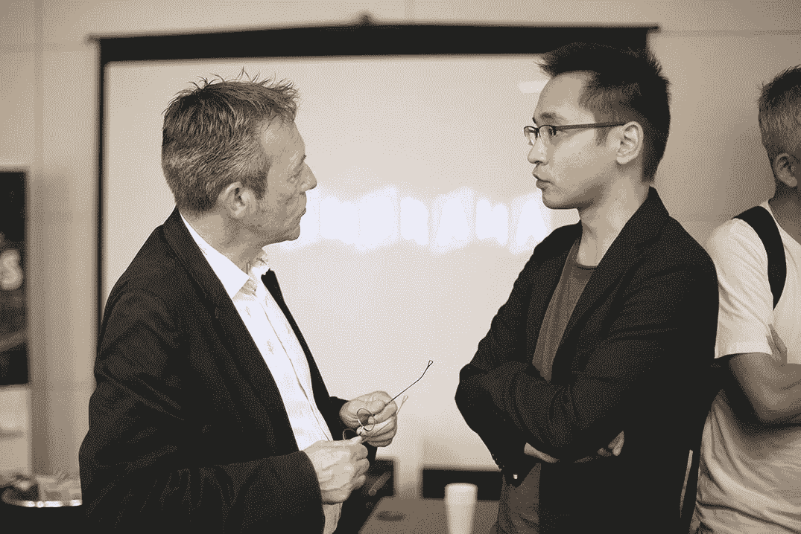

# 走向人工生命:奥拉夫·维特科夫斯基访谈

> 原文：<https://medium.datadriveninvestor.com/towards-artificial-life-an-interview-with-olaf-witkowski-cross-labs-f826d8f5ac3b?source=collection_archive---------20----------------------->

## 奥拉夫·维特科夫斯基是跨实验室**的首席科学家，该实验室旨在弥合智能科学和人工智能技术之间的鸿沟。**

**

*作为人工生命的研究人员，维特科夫斯基从探索通过机器复制人类语言开始了他的人工智能事业。他在 2007 年创建了 Commentag，并在 2009 年搬到日本继续研究，在那里他第一次对人工生命产生了兴趣。*

*用维特科夫斯基自己的话来说，“人工智能意味着你试图尽可能地复制人类智能。人工生命说，好吧，那很好，但是让我们试着理解人类的智能，并从我们已经获得的基础知识中重新创造它。更有建设性。这有点像理查德·费曼的名言:我不能创造的，我不理解。” *在这次采访中，我们与维特科夫斯基谈论了他在人工生命方面的工作，它将如何推进技术，以及为什么他认为深度学习已经死亡。**

# *我知道你的重点是人工生命，但你能告诉我们你在人工智能领域的工作范围吗？*

*我与一家名为 Cross Compass 的人工智能公司合作，该公司是 Cross Labs 的一部分。过去三年，我在日本和很多人工智能公司谈过。我想对人工生命做更多的研究，于是 Cross Compass 成立了一个由我领导的研究中心。*

*在克罗斯实验室，我们涵盖三个主要领域:智能神经科学、代理和学习理论以及集体人工智能。*

# *在过去几年里，你注意到了人工智能和机器学习的哪些趋势？*

*所以问题是，我很有偏见。我真的喜欢开放式的东西。例如，创造复杂性的事物，或者模拟大脑新部分的事物。我非常喜欢基于注意力的算法；不像对人类的注意，而是神经网络中的注意机制。*

*动机一直很有趣。卡尔·弗里斯顿的自由能原理的基础真的很吸引人。重视惊喜和你想要惊喜的想法。这个想法已经存在，但弗里斯顿翻译了它，他模拟了预测和结果之间的误差和差异。这叫预测编码，用在机器学习上。我并不喜欢它的一切，但在一天结束时，它是有效的。*

*我喜欢从生命系统中提取一些小原理，并把它们转化成一个编码系统。*

**

# *你是否注意到了更多的复杂性和开放式方法？*

*是啊。所以我注意到的趋势并不新鲜。人们一直在研究它们。但是我认为甘是超级好的。我可以用很长时间来谈论甘斯，因为它是两个模型相互对抗来创造复杂性和做出新发现的例子。*

*我们有一个学生在用 GANs 做细胞自动机，试图看看你是否能发现新的规则，创造更多的复杂性。部分灵感来自于[这项研究](https://distill.pub/2020/growing-ca/)。你马上就能看到它的应用，对吗？如何才能自动创建系统？能免费创造更多发现的元算法是什么？所以它是关于试图发现更多东西的算法。*

# *我知道发现是你研究人工生命的一个重要部分。你是哪一年进入这个领域的？*

*我想是 2010 年吧？鉴于我对语言本质的兴趣，尝试用人工智能再造语言是很自然的。为了正确地重建它，人们必须理解生命系统中的什么原则是使这种交流发生所必需的。这恰好是人工生命中一个重要的研究问题。这是一个相当小的领域，但真的很有创造性和前景，在日本有很多关键的研究人员。2018 年，我们在东京组织了一次大型会议，明年 9 月应该还会有一次。人工智能领域本身超级有趣，它将保持增长，但深度学习——也就是人们常说的人工智能——已经死了。*

*我的意思是，这是一个古老的想法。它是在 60 年代发明的，尽管第一个模型没有做任何学习。学习的第一次尝试是在更晚的时候，甚至在反向传播存在之前。我们最近通过卷积和其他技巧使神经学习工作得非常好，因为我们也有了以前没有的大量计算。这很酷，我们已经在这些架构中与 backprop 进行了这种结合，现在我们正在将这项研究应用到许多应用领域。但是深度学习方面的研究其实是死的。*

# *你说的死，是指有个天花板，我们碰到了吗？*

*我们在高原上。在我们发现完全不同的学习原则之前，我们会一直停留在那个平台上。只要我们花时间调整当前的范式，我们就不会专注于搜索其他不同的人工智能算法。在人工智能领域，研究人员正在慢慢开始探索新的想法，但 ALife(人工生命)已经做了几十年。这就是为什么我觉得 ALife 是大领域的自然下一步。当然，这不是唯一的一个，但它是一个非常有前途的。*

# *你对人工生命的哪些领域感兴趣？*

*ALife 研究如何自下而上地再现生命。生命中有一个子领域叫做开放式进化，这是我特别感兴趣的领域。它着眼于能够永远自己创造新奇事物的机制。*

*所以，想想地球。它是孤立的，但它不断创造更多的多样性。我们有不同的物种，我们像人类一样创造和再造定理；那么，为什么我们会有如此多的多样性和丰富性呢？把地球想象成一个盒子；为什么当你摇晃它，并等待足够长的时间，突然你得到了人类？然后你有了技术，然后你有了机器人，然后你有了杀死所有人类的机器人…*

*好吧，好吧，最后一个是个笑话，但你会得到所有令人兴奋的东西。*

*在我们对开放式进化的研究中，我们试图理解智能出现时的相变:为什么如果你摇动一盒东西，它会变成更有趣的东西？原子是如何随着时间自然进化成智能机器的？基本上，我将这些原则应用于机器学习。你应用这个想法来创造算法，不断地创造，在这个过程中，你有了目标的发明，或者说是目标的出现。*

*像内在动机这样的概念就是一个很好的例子。这个想法是获得智能行为，而不需要硬编码，也不需要给机器任何数据。相反，从内部目标出发，代理将试图[发现解决方案](https://www.goodai.com/task-representation-for-badger/)，新的解决方案。我们希望避免将规则硬编码到机器人中，或者只是向它提供大量数据。相反，我们希望它们是完全涌现的，通过使用智能的基本原理，例如最大化它们对整个系统的“授权”，或者它们对相关信息的获取。我们希望代理自己发现目标，推动其找到更好的解决方案，并不断改进它们。例如，我们希望机器人实现好奇心，以及所有使婴儿成为优秀学习者的技能。我们想在机器人体内植入创造类似驱动的机制。如果有效，这是获得内在动力的更好方法。*

**

# *我想在看待生活的过程中，你会有更小的目标，比如什么是智力，什么是好奇心，什么是动力。从你的角度来看，你认为这类研究有什么样的实际解决方案或用例？*

*所以我认为，如果你现在正试图解决问题，那可以在一段时间内推动你，但这与环境是一样的。我的意思是，当你试图在一至四年的时间窗口内解决一个问题时，是的，你可以修复或修补它，但它会在几年后再次出现。所以我认为 ALife 是长期研究。它本身不会解决问题；它将解决问题，这是更好地理解自然的副作用。*

# *就构建你的实验而言，你如何定义你在寻找什么？*

*当然还有一个大问题:什么是生活？什么是智能？所以这是我的大问题。智能系统的本质是什么？智能系统和这杯咖啡有什么区别？人们说杯子没有智能，因为它们只是物体，但实际上我们也是物体；我们只是更复杂。我们也有其他的自由度，但是即使一个杯子也有启示；抓住它的方法，等等。从某种意义上说，它具有智能，因为它的形状是根据文化进化经过许多代人的选择而制成的。这对所有物体都一样，这是一种智慧。*

*所以这里有我们可以测量的东西，但是我们还没有测量它的理论。所以试图理解这是这个领域的目的，也是我感兴趣的领域的一部分。*

# *你认为 AI 和 ALife 下一步会走向何方？*

*所以我们知道 backprop 真的很快，但我们需要调整人工智能或找到另一种范式。另一个范例需要时间，所以现在我们可以添加一些调整使它更有趣。*

*人工智能的例子是注意力机制，使它们具有对抗性，或者使它们进行交流，这一点没有被谈论太多。这实际上是我的大量研究。集体 AI。所以 GANs 是关于冲突的，对吗？但是我相信在自然界中，你也有寄生和合作互惠，这实际上很容易转化为数学；基本上是网络帮助网络，双方都从互动中获益。*

*我们用两个网络做了这个实验，基本的系统是由一个老师和一个学生组成的，你试着传递知识。如果他们有不同的任务，这是非常棘手的，但也许他们仍然有知识可以互相转移。*

*知识的传递是一回事，但还有合作；也许你的系统可以一起发现他们无法单独发现的新解决方案。我们就此写了一篇[论文](https://www.mitpressjournals.org/doi/abs/10.1162/artl_a_00288)，这是一个令人兴奋的研究方向。它的工作原理是，曲解信息可能有一种内在的价值，导致如果没有学习主体之间的社会关系就不会发生的那种学习。基本上是基于通信的人工智能。*

*通过在[推特](https://twitter.com/okw?lang=en)上关注维特科夫斯基和克罗斯实验室，与他保持同步。*

*要获得更多机器学习采访、指南和新闻，请查看下面的相关资源，不要忘记[订阅我们的时事通讯。](https://lionbridge.ai/ai-newsletter-subscription/)*

**原载于*[*https://lionbridge . ai*](https://lionbridge.ai/articles/deep-learning-is-dead-towards-artificial-life-with-olaf-witkowski/)*