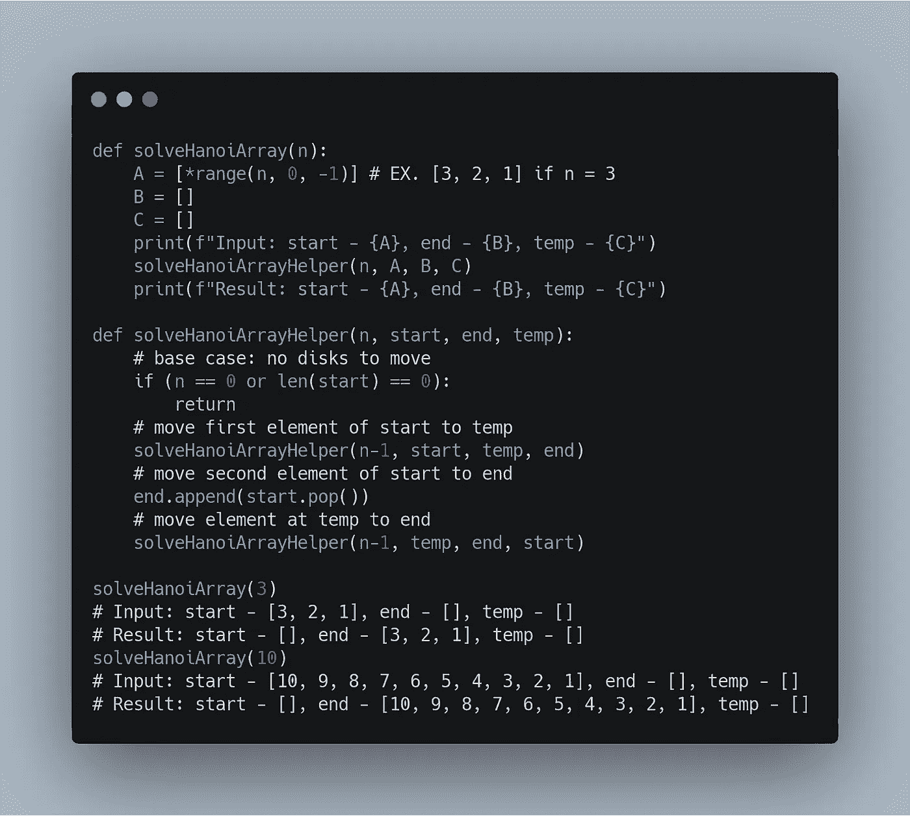
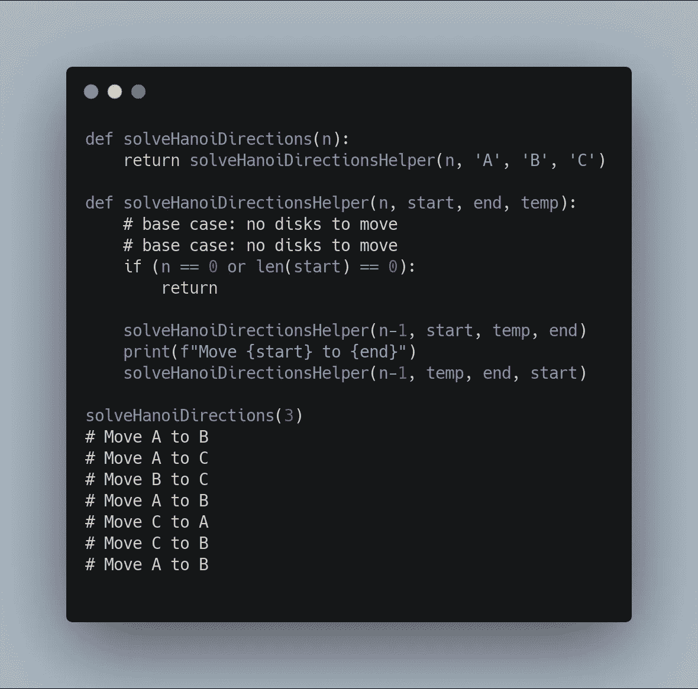
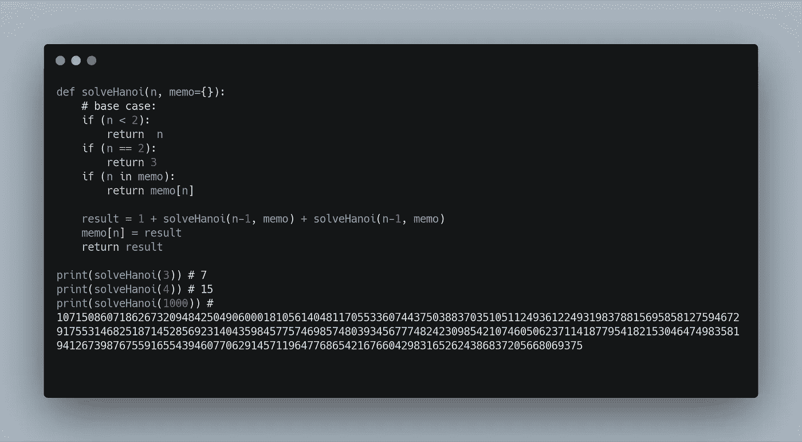

# 汉诺塔:记忆化求解与优化

> 原文：<https://medium.datadriveninvestor.com/tower-of-hanoi-solve-and-optimize-with-memoization-f215a1bd201f?source=collection_archive---------1----------------------->

[汉诺塔](https://en.wikipedia.org/wiki/Tower_of_Hanoi)，一个数学游戏，经常被用作常见的递归和优化问题。这是:

*给定 3 个 peg(A、B、C)和 n 个磁盘，其中每个磁盘的大小不同，并且磁盘最初是按照大小递减的顺序(从下到上)放在 peg A 上，按照规则将所有磁盘以相同的顺序移动到 peg B:*

*   *一次只能移动一个磁盘。*
*   没有磁盘可以放在更小的磁盘上。为了前任。如果磁盘 3 在一个挂钩上，磁盘 3 下面的所有磁盘的数字必须大于 3。

如果我们手工做几次，我们会发现有一个模式。

假设给了我们 3 个磁盘。然后:

1.  我们把上面的圆盘从 A 移到 B
2.  我们将下一个顶部磁盘从 A 移动到 C
3.  我们把磁盘从 B 移到 C
4.  我们将剩余的磁盘从 A 移动到 B
5.  我们将顶部的磁盘从 C 移到 A
6.  我们将剩余的磁盘从 C 移到 B
7.  我们把最后一个磁盘从 A 移到 B

然后*瞧*，我们已经将所有磁盘按照它们在 a 上的顺序移动到了 B 上。下面是模式:

```
1\. Shift 'n-1' disks from 'A' to 'B'.
2\. Shift last disk from 'A' to 'C'.
3\. Shift 'n-1' disks from 'B' to 'C'
4\. repeat[*source*](https://www.geeksforgeeks.org/c-program-for-tower-of-hanoi/)
```

## 我将实现三个解决方案，最后一个是最有效的。

# 具有视觉表现的简单缓慢的解决方案

时间和空间效率低下，但这提供了一个很好的视觉效果，可以看到我们的算法逻辑地工作。我们将使用数组输入作为我们的磁盘，看看我们是否可以使用给定的规则和参数来移动它们。

[](https://www.datadriveninvestor.com/2020/02/22/algorithms-for-fairness/) [## 公平算法|数据驱动的投资者

### 许多人都有算法偏见。软件工程师关心算法偏差，因为我们关心…

www.datadriveninvestor.com](https://www.datadriveninvestor.com/2020/02/22/algorithms-for-fairness/) 

利用递归，我们可以对这个问题进行逆向工程。在第一次递归调用时，我们将告诉我们的算法将除最后一个元素之外的所有元素移动到我们的 temp ('C') peg，然后将最后一个元素移动到我们的 end peg ('B ')，因为最后一个元素将是最大的，然后我们将告诉我们的下一次递归调用将所有元素从我们的 temp ('C ')移动到(' B ')，并假设我们的递归调用将保持相同的顺序。



# 简单缓慢的解决方案，包括步骤说明

时间效率低，但空间效率高。

这是一个和上面类似的解决方案，但是我们不使用数组，而是传入 peg 名‘A’、‘B’和‘C’，并打印我们的每一步/移动。



# 该是我们优化解决方案的时候了。这样就能算出解决河内需要多少步。

时间效率低而空间效率高。

这是一个与上面类似的解决方案，但是我们没有使用数组或字符串，我们只是传入磁盘的数量，然后返回移动磁盘需要多少步。我们将记住这个解决方案，这样就不用花很多年来解决(相信我，否则会的。如果你不相信我，你可以试试没有记忆)。



只用了一秒钟就解决了这个问题。然而，您不能在我们以前的解决方案中使用输入 1000，因为它们将永远无法完成。

# 感谢阅读！我希望这很有趣。

让我知道你的想法，并在下面自由提问。尽情享受吧！