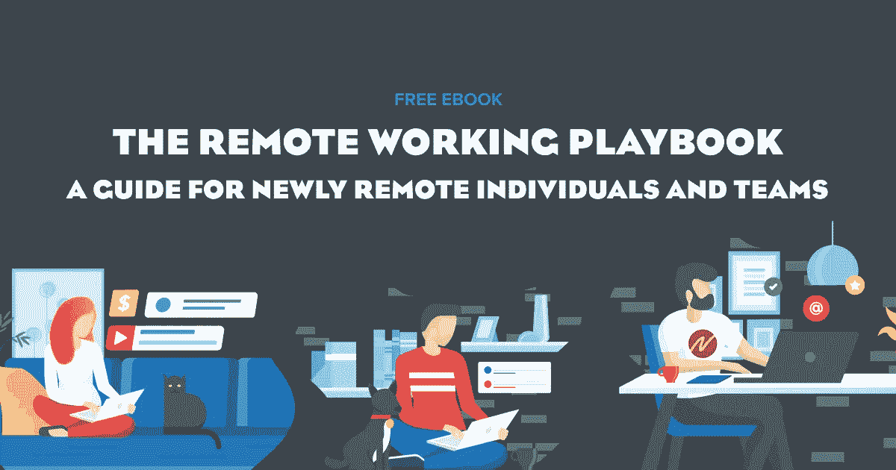

# 远程工作世界中的有害沟通——以及如何战胜它。

> 原文：<https://medium.datadriveninvestor.com/toxic-communication-in-a-remote-work-world-and-how-to-beat-it-7fc0a7c12c8?source=collection_archive---------7----------------------->

远程工作革命迫使各种信仰的大型组织最终接受了这项技术，十多年来，这项技术已经让少数初创公司、个体企业家和流浪者实现了远程工作。

但是像大多数事情一样，远程工作也有不同的复杂程度。下载 **Zoom** 并使用 **Slack** 或**微软团队**与你的团队交流是一个很好的开始，但任何工具都取决于你如何使用它。

大多数组织都处于**马特·莫楞威格**，automatic 的创始人，该公司运营 Wordpress 并有效地为 30%的互联网提供动力，在他的[远程工作的五个层次](https://medium.com/swlh/the-five-levels-of-remote-work-and-why-youre-probably-at-level-2-ccaf05a25b9c)路线图中称之为第二层次。他们只是在网上重建办公室。这伴随着办公室的所有缺点——想想漫长的多人会议和无数的干扰，只有通过上述工具才能实现。

正如科廷大学的莎伦·帕克为《哈佛商业评论》所写的那样，对于许多倾向于将在场与生产力混为一谈的管理者来说，信任也成了一个问题。

这种将在场与生产率混为一谈的趋势，本质上相当于向工业革命时期的算法现场工作的倒退。如果你在传送带上，你正在把小部件放进盒子里，但当涉及到认知知识工作时，更多的时间不一定意味着更多的产出。工作已经超过了过去的一个世纪，它的认知更加复杂，任务范围更加广泛。

人类的最佳生理状态是心理学家米哈里·契克森米哈称之为 T2 的心流状态。**麦肯锡**研究人员发现，当处于心流状态时，我们的工作效率是[的五倍](https://hbr.org/2014/05/create-a-work-environment-that-fosters-flow#:~:text=In%20a%2010%2Dyear%20study,peers%20do%20in%20a%20week.)。但问题是——心流的上限是一天大约四个小时，每次我们被打断或转换任务时，平均需要 [23 分钟](https://hbr.org/2019/03/stop-letting-push-notifications-ruin-your-productivity)才能回到心流。鉴于普通高管每天会被打断 50 到 60 次，而且日程安排满满的都是会议，如果我们能花点时间进入心流状态，我们大多数人都是幸运的。

渗透到许多远程工作操作中的有害通信确保了这一点，即使我们在家工作也是如此。

 [## 领导力。赢得|数据驱动型投资者需要更广阔的视角

### 不管他们愿不愿意，领导者都是快速运转的机器中的齿轮，这就要求他们夹住自己的爪子…

www.datadriveninvestor.com](https://www.datadriveninvestor.com/2020/02/07/leadership-it-takes-a-wider-perspective-to-win/) 

***那么这在远程工作环境下是什么样子的呢？***

突兀和不明确的信息会造成反复沟通，甚至更糟，导致工作不符合预期，从而导致组织负债

写得不好的即时消息和电子邮件，缺乏语言交流和肢体语言带来的人性和细微差别，可能会被误解，导致团队成员之间信任和尊重的消失

通过即时通讯和不断的电话进行的零星的实时干扰，期望我们会快速响应，抑制了我们集中注意力和进入心流的能力

偶尔聊天，并通过 Slack 或团队分享一整天的各种 Giphys

所有这一切不仅会影响生产力，造成组织债务，还会严重影响员工的积极性和幸福感，因为这意味着员工整天都在忙碌，从事浅层次的工作，但在一天结束时却没有什么可展示的。

事实上，正如**心流基因组项目**的 **Steven Kotler** 所说，当我们花时间在心流状态下做深度工作时，我们的大脑被一种神经化学物质的混合物所淹没，包括[多巴胺、血清素和内啡肽](https://www.stevenkotler.com/rabbit-hole/introduction-to-the-optimized-brain)。不仅如此，通过花时间在心流中，我们更有可能做好工作并交付成果，所有这些都是有益和满足的。

那么这种有害交流的解药是什么呢？

围绕异步通信而不是实时中断构建的文化有助于解决远程工作中的许多通信问题。

“我会在它适合我的时候去做”是异步通信的本质，它使组织能够推进项目，而不需要项目涉众的实时可用性。这是关于从通过出席或在线来表现生产力，转向关注重要的事情——结果。

这里有十个关于如何在远程工作环境中实践异步通信的快速提示。

1.  当实时沟通被最小化时，清晰和具体的书面沟通是关键——获取足够的背景细节、行动项目、预期结果、截止日期和求助途径。
2.  使用任务管理工具，如吉拉、Asana 或 Trello，支持异步监控、通信和任务可见性，减少“签到”需求
3.  使用电子邮件或即时消息来交流单向信息，而不是像电话或会议那样被打断
4.  关闭桌面和移动通知，以便您可以花更多时间在该区域
5.  划出一天中进行深度工作的时段，一次专注于一项任务
6.  让会议成为规则的例外，而不是默认选项
7.  如果没有口头交流的语气和肢体语言，你的信息可能会被如何解读，要有意识地做出相应的调整
8.  在可能的情况下使用视觉来让人们达成共识，因为人类在文字或语言成为事物之前很久就已经进化到能看东西了
9.  虽然我们不应该默认拿起电话，但如果事情很明显可以通过 5 分钟的电话而不是持续的短信交流迅速解决，那么打电话是值得的。
10.  在特定的时间段内就特定的事情进行批量对话，而不是一天中断断续续的聊天

真正实践异步通信的公司不再像在工厂车间那样关心通过在场来表示生产力，而是关注真正重要的东西——性能。

— -

史蒂夫·格拉夫斯基是《时间丰富:做你最好的工作，过你最好的生活》(Wiley)的作者，该书将于 2020 年 10 月出版。读者可以在【www.timerichbook.com】*免费下载该书的第一章*

## *访问专家视图— [订阅 DDI 英特尔](https://datadriveninvestor.com/ddi-intel)*