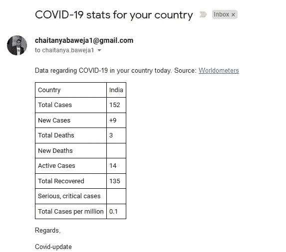
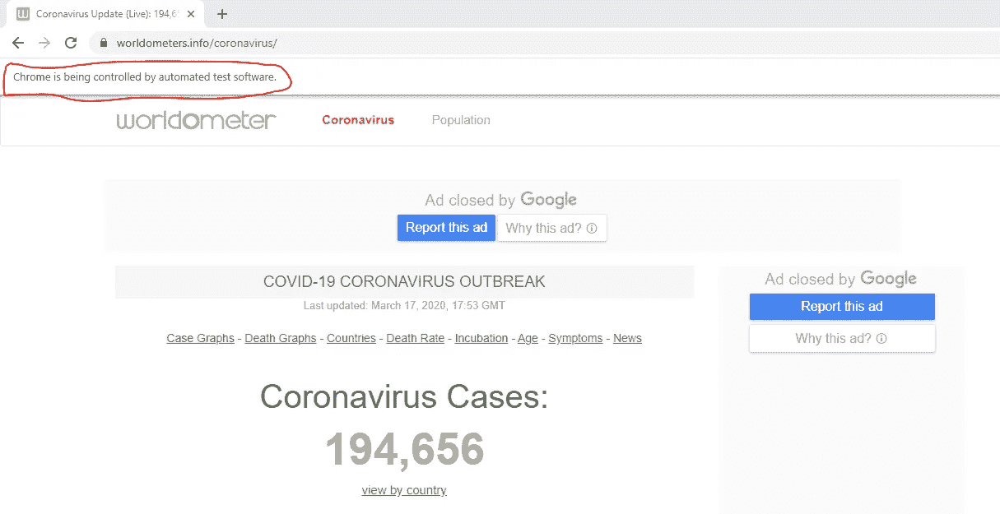
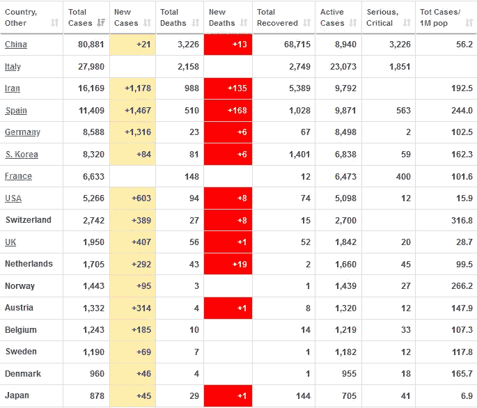
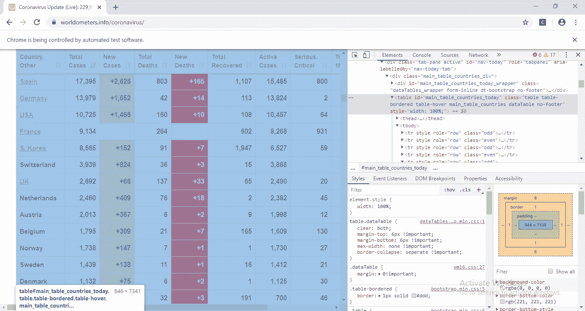
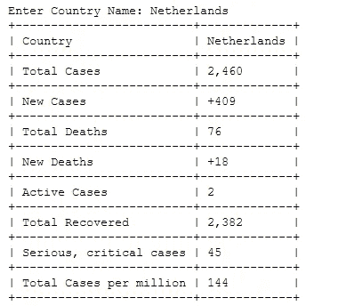
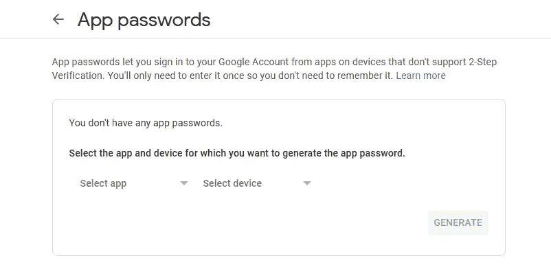

# 使用 Python 在智能手机上追踪电晕

> 原文：<https://medium.datadriveninvestor.com/tracking-corona-on-your-smartphone-using-python-b217118b6015?source=collection_archive---------3----------------------->

## 使用网络抓取获取关于新冠肺炎的每日更新


Photo by [CDC](https://unsplash.com/@cdc?utm_source=medium&utm_medium=referral) on [Unsplash](https://unsplash.com?utm_source=medium&utm_medium=referral)

3 月 11 日，世界卫生组织(T2)宣布迅速传播的冠状病毒爆发为疫情。在写这篇文章的时候，新冠肺炎(冠状病毒疾病)已经在世界范围内杀死了超过 7000 人(来源:[世卫组织](https://www.who.int/health-topics/coronavirus))。许多来自不同国家的同事目前都生活在自我隔离状态中。

作为一个患有焦虑症的人，我每天早上在 twitter 上发布消息的习惯越来越有害。

为了保持理智，我决定编写一个 python 脚本，每天早上通过电子邮件向我发送我国疫情统计的简明更新。这封邮件看起来是这样的:



Email update sent. Final Output. Source: Author

在本教程中，我将解释如何用 Python 编写这些电子邮件更新。如果你只需要代码，可以在这里获得:[新冠肺炎 Github Repo](https://github.com/ChaitanyaBaweja/COVID-19) 。

# 设置

本教程中使用的代码是在装有 [Python 3.6.9](https://www.python.org/downloads/release/python-369/) 的 Ubuntu 系统上测试的。

我强烈建议预先建立一个[虚拟环境](https://realpython.com/python-virtual-environments-a-primer/)和所有需要的库。下面是如何在终端上实现这一点。

```
$ mkdir covid_track
$ cd covid_track
$ virtualenv covid_python
$ source ./covid_python/bin/activate
$ pip3 install tabulate selenium schedule
```

一旦完成，我们需要安装 [**ChromeDriver**](https://sites.google.com/a/chromium.org/chromedriver/getting-started) 。它是一个独立的可执行文件，将帮助我们控制 [Chrome 浏览器](https://www.google.co.in/chrome/)。

一旦你下载完 [ChromeDriver，](https://sites.google.com/a/chromium.org/chromedriver/downloads)把它解压到我们刚刚创建的同一个目录中:`covid_track`。

> 注意:你可以将 ChromeDriver 保存在任何文件夹中。但是，您需要在我们的代码中添加它的位置。将它添加到同一个文件夹中只是为了方便。

# 收集数据

在我们开始编写程序之前，我们需要收集数据。

假新闻、诈骗和网络钓鱼是我们这个时代的瘟疫。越来越难确定哪些网站提供的是真实信息。

经过大量研究，我决定用[](https://www.worldometers.info/coronavirus/)**。它已经确立了自己作为一个可信的，真实的来源。它被超过 [10，000 本出版书籍](https://www.google.com/search?q=worldometers&btnG=Search+Books&tbm=bks&tbo=1&gws_rd=ssl)和超过 [6，000 篇专业期刊文章](http://scholar.google.com/scholar?hl=en&q=worldometers&btnG=&as_sdt=1%2C22&as_sdtp=)引用。**

**[Worldometers](https://www.worldometers.info/coronavirus/) 为我们提供了许多有趣的数据点，我们将在本教程的后面看到。**

# **使用 Selenium 的网页抓取**

**现在，我们将使用 [**Selenium**](https://www.selenium.dev/) 包从 Worldometers 网站提取数据。这个过程叫做[刮网](https://www.webharvy.com/articles/what-is-web-scraping.html)。如果你以前从未听过这个术语，我会推荐你浏览一下这个[教程](https://towardsdatascience.com/web-scraping-using-selenium-python-8a60f4cf40ab)。**

**让我们看看下面的代码。**

**`webdriver.Chrome()`对象将打开一个新的 Chrome 浏览器窗口。`get()`方法将加载所需的 URL。**

> **注意:Chrome 知道它正在被一个软件控制。**

****

**Driver loads the required URL. Bot detected. Source: Author**

**Worldometer 网站有一个表格，提供了每个国家的**确诊病例和死亡信息。****

****

**Confirmed Cases and Deaths by Country. Source: [Worldometers](https://www.worldometers.info/coronavirus/)**

**现在，我们将使用该表的 id 将其从网站中提取出来。**右击表格，选择** `**Inspect**` **，即可找到表格 id。****

****

**Output received when clicking on Inspect. Source: Author**

**从上图我们可以看到，桌子 id 是`main_table_countries_today`。我们现在将使用`[find_element_by_xpath()](https://dev.to/razgandeanu/selenium-cheat-sheet-9lc)`来提取这个 id。**

```
table = driver.find_element_by_xpath(‘//*[[@id](http://twitter.com/id)=”main_table_countries_today”]/tbody[1]’)
```

**`table`变量指向包含 Worldometers 网站上的表格的 web 元素。**

**现在，我们将询问用户需要哪个国家的信息。然后我们将再次使用`xpath`从表中提取该国家的行。**

**现在，由于我们有一个指向所需行的指针，我们将从该行的每个单元格中提取数据。所有的值都存储在一个列表中。**

```
col_data = row.find_elements_by_tag_name("td")
data_val = [x.text for x in col_data]
```

**现在让我们看看整个代码。我在最后添加了一小段代码，这样使用 [**制表库**](https://pypi.org/project/tabulate/) 将输出格式化成一个漂亮的表格。**

****

**Output from code above. Source: Author**

# **通过电子邮件发送数据**

**既然我们已经将提取的数据保存在 python 字典中，我们可以每天早上通过电子邮件更新发送这些数据。**

**首先，你需要登录我们的 Gmail 账户，进入[应用密码](https://myaccount.google.com/apppasswords)。**

****

**Generate a new password for your app. Source: [Google App Passwords](https://myaccount.google.com/apppasswords)**

**在这里，设置一个新的应用程序并生成一个新的密码。在下面代码的`server.login()`中使用它。这个脚本可能看起来有点复杂。这只是因为我想将数据格式化为表格。**

# **安排每天早上的电子邮件**

**现在我们有了发送电子邮件的功能，我们需要将所有这些打包到一个时间表中。这将基本上允许脚本继续运行，并在每天的特定时间发送电子邮件更新。我们使用 [**进度库**](https://schedule.readthedocs.io/en/stable/) 。**

**我们将使用 [nohup](https://linuxize.com/post/linux-nohup-command/) 在我们的终端上运行它，**

```
$ nohup python3 covid_mail.py &
```

**你可以在这里下载整个源代码[。如果重新启动，不要忘记再次启动代码。](https://github.com/ChaitanyaBaweja/COVID-19/blob/master/COVID_Mail/covid_mail.py)**

# **结论**

**请注意**[**Github repo**](https://github.com/ChaitanyaBaweja/COVID-19/tree/master/COVID_Mail)会经常更新新的有用特性。我欢迎任何有兴趣加入这个项目的人的意见。希望你觉得这很有趣！****

> ****注意安全，洗手。****

# ****重要链接****

*   ****[新冠肺炎 Github 回购](https://github.com/ChaitanyaBaweja/COVID-19)****
*   ****[Worldometers 网站](https://www.worldometers.info/)****
*   ****[硒教程](https://dev.to/razgandeanu/selenium-cheat-sheet-9lc)****