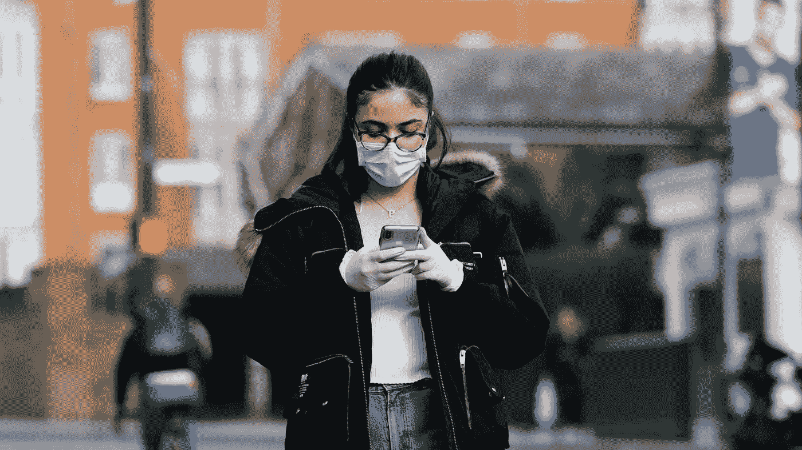
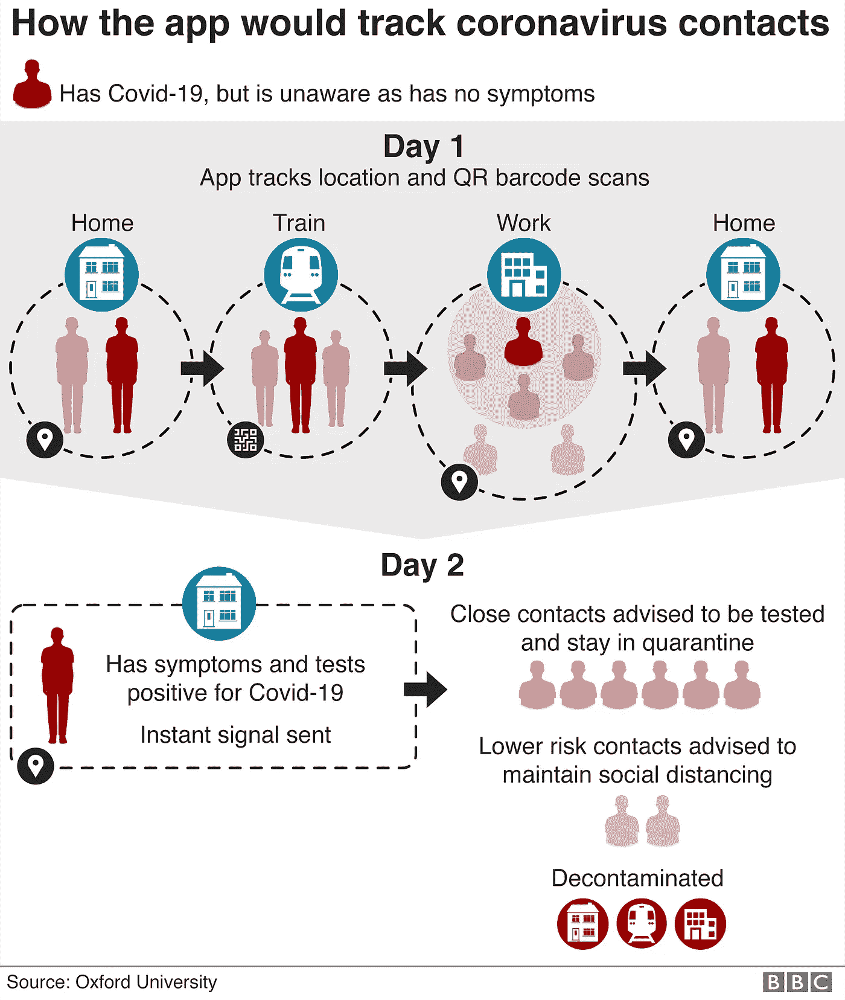

# 追踪数据以阻止冠状病毒

> 原文：<https://medium.datadriveninvestor.com/tracking-data-to-stop-coronavirus-2a056041b2a8?source=collection_archive---------22----------------------->

Source: [Sky news](https://news.sky.com/story/coronavirus-world-health-organisation-to-review-whether-masks-help-prevent-covid-19-spread-11967348)

我们生活在一个前所未有的时代。世界上三分之一的人口由于冠状病毒疫情而被封锁——这比第二次世界大战时的人口还多。全球三分之一的人口回到了他们祖父母的生活中:没有旅行，没有外出就餐，极少的社交生活，还要照顾自己的孩子。哦，还有互联网。

这种经历非常凄凉，尤其是如果你从更长远的角度考虑——不是几周，而是几个月。然而，与疫情的斗争展示了一些成功的封锁替代方案。首先在韩国使用的接触追踪技术就是这样一个例子。[南韩决定不走中国的老路，强迫所有人呆在家里。相反，公共当局史无前例地使用数据来跟踪感染者的所有接触者，并提醒公众注意这一威胁。底层技术非常简单:它结合了 GPS 跟踪、无线网络数据和手机之间的蓝牙连接。当手机的主人被检测为阳性时，与感染者](https://www.scmp.com/week-asia/health-environment/article/3074469/coronavirus-south-korea-cuts-infection-rate-without?fbclid=IwAR0o8rBXOgD65Tp0DS5HQxnlkKnPbWJPn0hPDLuLyuNcsoXhtK26FH4kd60)[的手机接近的其他手机的主人将收到警报](https://www.sciencemag.org/news/2020/03/cellphone-tracking-could-help-stem-spread-coronavirus-privacy-price)，并将不得不进行自我隔离。

 [## 认知计算——一套被广泛认为是……

### 作为它的用户，我们已经习惯了科技。这些天几乎没有什么是司空见惯的…

www.datadriveninvestor.com](https://www.datadriveninvestor.com/2020/02/19/cognitive-computing-a-skill-set-widely-considered-to-be-the-most-vital-manifestation-of-artificial-intelligence/) 

这带来了许多技术、社会和伦理方面的挑战。在这篇文章中，我想探讨三个问题。首先，病毒追踪应用程序在遏制疫情病毒传播方面是否有效？第二，政府可以使用这样的应用吗？最后，我们的社会准备好接受这项技术了吗？

**App 能救命吗？除非它像病毒一样传播！**

病毒追踪技术收集个人数据，如人们的位置和健康状况(无论他们是否冠状病毒阳性)。但如此大规模收集公民数据的决定需要一个坚实的理由。重要的是，该技术在阻止病毒传播方面应该比其他措施(如封锁)更有效或同等有效。

有人说，跟踪人们的运动不会阻止冠状病毒。例如，[电子前沿基金会(EFF)对跟踪人的功效提出了许多异议](https://www.eff.org/deeplinks/2020/03/governments-havent-shown-location-surveillance-would-help-contain-covid-19)。它认为，手机追踪不够细致，不足以检测到两个人在传输距离内，如果病毒已经广泛传播，这种解决方案将不起作用。EFF 指出，“政府不应被授予这些权力，除非它们能够向公众表明这些权力实际上会如何以显著的方式帮助遏制新冠肺炎”。那绝对是真的。另一方面，[牛津大学](https://github.com/BDI-pathogens/covid-19_instant_tracing/blob/master/Manuscript%20-%20Modelling%20instantaneous%20digital%20contact%20tracing.pdf)的学者在他们的数学模拟中证明，追踪系统在被检测为阳性的那一刻通知用户他们曾经或可能与感染者接触过，可以遏制疾病的传播。韩国或新加坡的例子也表明，病毒追踪应用程序在抗击冠状病毒方面非常有效。显然，追踪应该与广泛传播的病毒测试相结合，这样才能准确识别受感染的人。还有一个附加条件——应该有足够多的人使用。如果一些人选择加入，另一些人选择退出，那就行不通了。换句话说，它可能是由政府或强大的社会习俗强加的。

因为从长远来看，封锁不是一个可行的解决方案，政府寻求部署替代方案。我们现在可能面临选择:要么我们采取传统措施(比如封锁)，让我们的数据保密并呆在家里(潜在的失业和贫困)，要么我们为了公共利益允许更多的数据共享并回归正常生活。后者要求我们改变分享个人数据的方式。

**关于女王陛下的数据服务**

希望使用病毒追踪应用的民主政府必须解决隐私和公共利益之间的矛盾。总有这样的情况，比如国家紧急状态，公众利益压倒了个人权利。大多数人权都不是绝对的，当其他人的权利发挥作用时，人权会受到限制。然而，这种克减应当始终是必要的，并且与实现公共目标相称。

数据保护法规，如 GDPR，要求数据主体同意共享他或她的信息。然而，它们允许这一原则的某些例外，例如:

为了保护数据主体或另一自然人的重大利益，处理是必要的(《GDPR》第 6 条“d”款)；

为了公共利益执行任务，加工是必要的(《GDPR》第 6 条“e”款)。

乍一看，防止疾病传播属于这些理由中的任何一个:有必要保护可能被感染的人的切身利益，并拯救医疗系统免于崩溃。但是我们的社会已经形成了一种有趣的偏见。我们在更琐碎的场合与私人公司分享我们的数据——使用谷歌地图或观看猫的视频。然而，仅仅是与公共当局分享更少的数据这一事实就引起了恐惧和不信任。是的，有令人不快的爆料，比如斯诺登丑闻。在对政府信任度较低的社会中，强制广泛使用追踪应用程序将被视为严重侵犯人权，不管原因是什么。这并不合法，而是阻碍政府部署该应用的心理障碍。

接触追踪技术更容易在个人数据的感知价值较低、对政府信任度较高的国家实施(如韩国或新加坡)。但是，即使在意识到数据保护的国家，政府也试图用数据驱动的技术来测试抗击疾病的潜力。在欧洲，政府考虑通过法律来规定如何收集数据，以及跟踪个人敏感数据的保护措施和限制。例如，在德国，[联邦政府计划修改感染保护法案](https://www.faz.net/aktuell/wirtschaft/bundesregierung-will-laender-in-der-corona-bekaempfung-entmachten-16689784.html)，允许通过手机追踪感染者。英国考虑引入[病毒追踪应用](https://www.bbc.co.uk/news/technology-52095331?fbclid=IwAR0x6jF9IOKtrWjnIQkEaS45G9GHR3w8r7Hge_Wg8VpVHrFUrL0v2xM4P7E)作为让人们解除封锁的条件。官员们重申，参与这一计划将是完全自愿的，基于用户同意遵守 GDPR。

也就是说，如果大多数人没有采用这项技术，会发生什么呢？英国当局不排除强迫人们使用这款应用的可能性。这一措施似乎是前所未有的，但如果有适当的保障措施，并为保护公众利益所必需，它并不违反 GDPR 或欧洲人权公约。最有可能的是，病毒追踪应用程序在理论上将是自愿的，但将成为拥有正常生活、重返工作、外出的事实条件。但是我们，作为一个社会，将如何对此做出反应呢？

**给我你的数据或者呆在家里**

这场危机表明，健康数据不仅仅是个人的私有财产，比如一把椅子或一辆汽车。在困难时期，这成了公共政策的问题。公共政策要求在保护隐私这一人权和阻止传染之间保持谨慎的平衡。为了实现这一点，我们需要政府、公众、科学界和技术之间的无缝协调。如果你感染了病毒，同意分享你的匿名数据可能是很快恢复正常运行的一个条件。这是一个不愉快的选择，但应该这样做。

不特别重视数据的人会很容易做出这种选择。想要保持完全隐私的人将选择不使用该应用程序，但如果该应用程序是强制性的，他们将不得不放弃病毒测试和官方治疗。更大的人群是那些潜在关心自己个人数据的人，但他们只是没有意识到自己已经泄露了多少数据。没有阅读就点击“接受所有 Cookies”的人。使用谷歌地图的人。“喜欢”猫视频的人。对他们来说，保护个人数据的说辞应该改变。他们应该意识到，分享他们的一些数据以保护他人是一件好事，但将他们的数据交给商业公司可能就不是了。政府公开要求这样做(并对数据的使用施加限制)与私营公司偷偷摸摸地这样做是不同的情况，没有解释他们如何篡改我们的数据。

新冠肺炎表明，民主国家需要更加了解如何在紧急情况下收集和使用公民数据。另一方面，公民应该更愿意分享他们的数据，这是有充分理由的。也就是说，在保持封闭或订阅跟踪应用程序之间做出选择并不容易。可能在几个月内，即使是最铁杆的数据保护拥护者也会愿意用他们的数据与朋友在酒吧里喝一品脱啤酒。