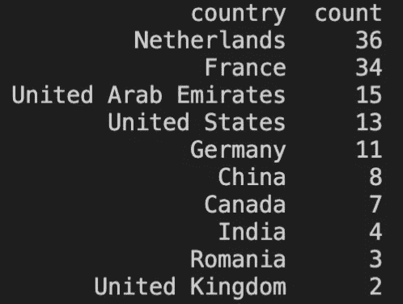

# 用橡皮筋追踪木兰种子下载

> 原文：<https://medium.datadriveninvestor.com/tracking-mulan-torrent-downloads-3277c28ae26b?source=collection_archive---------5----------------------->

## 有多少人从哪里下载了迪士尼的花木兰？

上周我公开发布了 torrentMonitor，我一直用它来追踪迪士尼+花木兰的下载量。迪士尼花木兰正在迪士尼+独家播放，许多用户都避免向迪士尼付费观看这部电影。

Disney Mulan inside Disney+

从 11 月 18 日到 11 月 30 日，我一直在追踪分享花木兰的三个最受欢迎的种子。所有收集到的数据都保存在 elasticsearch 集群中，以供进一步分析。我在 12 天内获得了超过 5 万个独特的 IP。需要考虑的一点是，这些统计数据是不完整的，有超过三个种子共享迪士尼的花木兰，但这可以给我们一些见解，并用作样本。

# IPs 和位置

在 12 天的时间里，总共有 **50，600 个 IP**被登录。平均每天有 4216 次不同的下载。这一下载量主要来自美国(5434 次)和菲律宾(4372 次)。

Number of downloads by country

## 每个国家的下载量

如果我们把这些 IP 绘制成地图，几乎所有的国家都下载了至少一本《花木兰》,我甚至从梵蒂冈城得到了一个结果。但是为了确定最“盗版”的国家，我们需要考虑人口而不仅仅是下载数量。

IPs geolocated and painted in a choropleth map

例如，美国有 331，002，651 万人口和 5434 个独立 IP，因此我们可以使用此数据计算更高的表示率。计算*盗版率*的一个可能函数是 IPs/人口 x 100。美国的*盗版率*为 **0.001%，(5434/331，002，651) x 100。**

考虑到人口因素，盗版率较高*且人口超过 50 万的国家如下:*

Top 10 countries, with a population greater than 500k, ordered by “pirate rate”

如果我们不按人口超过 50 万进行筛选，前 10 个国家是:

Top 10 countries ordered by “pirate rate”

## 顶级共享 IP

另一个有趣的数据是，在整个监控过程中出现了 1300 个 IP。2.56%的受监控 IP 始终在线并共享数据。如果我们按国家分组，用户分享内容最多的国家是:

Top 10 countries with top sharing IPs

## VPN 呢？

美国和荷兰是共享内容最多的国家，但是 VPN 呢？任何人都可以隐藏他们的 IP 地址，这看起来像是来自另一个国家的连接。

Comments published on [https://1337x.st/](https://1337x.st/) inside a Mulan torrent

有一些像 [getipintel](https://getipintel.net/) 或 [ipqualityscore](https://www.ipqualityscore.com/) 这样的服务可以让我们了解其中有多少是 VPN。尽管它们是非常有限的服务，但我扫描了使用这些服务的顶级共享 IP。

只有大约 20%的顶级共享 IP 在使用 VPN 或代理服务。我期望看到更多的 VPN 或代理服务的使用，人们似乎不在乎发布他们的 IP 信息。

Top countries offering VPN/Proxy IPs

# 客户

一些 BitTorrents 客户端在分享或从网络下载时会公布它们的客户端名称和版本。在花木兰案例中，明显的赢家是拥有 42.21%的μTorrent。接下来的是 qBittorrent 17.66%，libtorrent 13.87%。

任何人都有必要考虑到，只有 **13.85%** ，7011**的 IP，透露了他们的 BitTorrent 客户端和版本。有很多客户不公布这些信息。**

## 结论

这是一个收集局部图片的小实验。执行更大范围的监控将产生更多数据，但当前数据可以给我们一些见解。

1.  μTorrent 是最受欢迎的客户端

这是真的，还有其他消息来源也说了同样的话。我期望看到更多的客户端使用 BitTorrent 客户端，但很明显，首选是μTorrent。

2.人们很“慷慨”

通常，我只维护几天我下载的种子。看到很多人在更长的时间里分享内容是一件令人惊讶的事情。我不知道他们中的一些人是服务器还是霸占一堆电影的人，但我没想到会看到 1300 个 IP 总是在线。

3.大多数人不使用 VPN

我只查了排名靠前的分享 IP 但是 **20%** ，在我看来确实是一个很低的比率。IP 是可以泄露大量信息的个人数据，每个用户都应该尽力保护这些信息。

4.还有其他流行的盗版来源

我敢说 BitTorrent 不是现在最流行的盗版方法，或者至少不是唯一的方法。有像 [flixtor](https://flixtor.is/) 这样的盗版网站，确实很好用，而且免费。如果我是迪斯尼的话，我会先把这些网站关掉。

5.大多数海盗国家

很好奇像卢森堡或者以色列这些比较富裕的国家是怎么用 torrent 而不是在 Disney+里付费看电影的。同样，如果我是迪士尼，我会努力在这些国家投入更多的营销资源。他们正在消费迪士尼电影，并且有能力支付，或许有可能将他们变成付费消费者。

就这些，希望你喜欢这篇文章，如果你想看更多关于网络安全和机器学习的文章，可以关注我。现在，我正在准备一些曼达洛人第二季下载的数据，让我们看看进展如何。