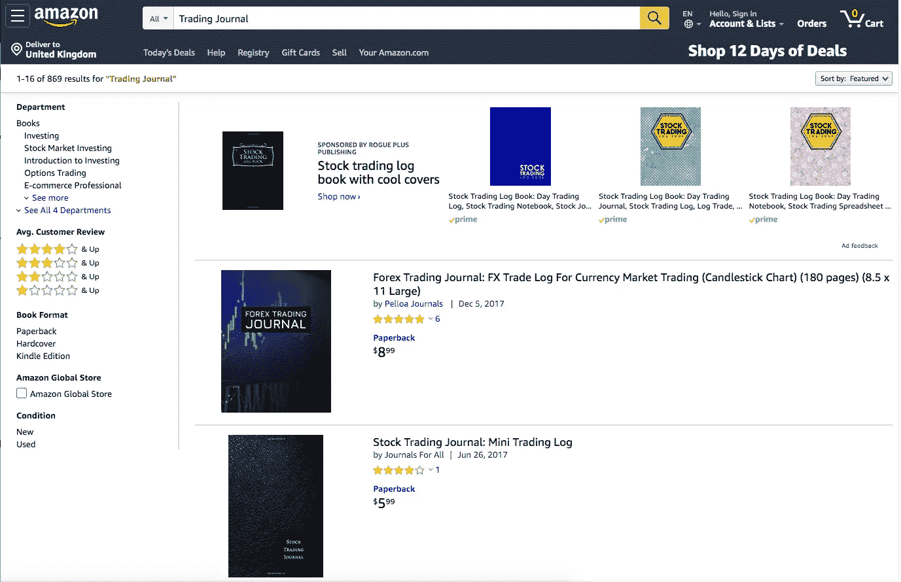

# 交易日志和绩效指标。

> 原文：<https://medium.datadriveninvestor.com/traders-log-journal-and-performance-indicators-d158bff919e?source=collection_archive---------3----------------------->

今天交易和一年后交易一样重要。一个交易者应该能够回头看看他或她以前的交易，从错误中学习，提高自己。这就是交易日志的用武之地。

Photo by [Jan Kahánek](https://unsplash.com/@honza_kahanek?utm_source=unsplash&utm_medium=referral&utm_content=creditCopyText) on [Unsplash](https://unsplash.com/s/photos/journal?utm_source=unsplash&utm_medium=referral&utm_content=creditCopyText)

交易日志是交易者最有价值的工具之一。回顾交易，分析哪些是对的，哪些是错的，将有助于防止未来的错误，并提高未来的回报。

有许多实物交易日志，也有许多软件交易日志。

# 软件期刊

我个人没有用过任何软件交易杂志，但它们值得一试。这些日志的问题在于，在实施之前有一个学习曲线。一些可能包括..

1.  [Tradervue.com](https://www.tradervue.com/)—每月不超过 100 笔交易。
2.  Stocktrader.com[—整体免费。](https://www.stocktrader.com/)
3.  Edgewonk.com——一次性费用 187 美元
4.  Trademetria.com——每月不超过 30 笔交易。

# 物理期刊

喜欢在交易日志上有个人风格，喜欢用钢笔和铅笔的交易者，可以从亚马逊购买实体交易日志。

Screenshot from Amazon.com

# 创造我们自己的

微软 Excel 是创建交易者日志的标准程序。另一方面，谷歌电子表格可以被多人共享和编辑。这有时会很有用，特别是对于想要分享日志以获得反馈的新手。

The trade entry section.

我们希望跟踪的一些内容包括:

*   商品编号
*   安全类型
*   标志
*   录入日期
*   进入时间
*   入帐价格
*   初始斯托尔损失
*   目标价格
*   战略
*   量
*   总成本
*   费用
*   方向
*   情况
*   结果

第一列是交易的数量。在我填充了蓝色的列之后，我将对我的图表进行截图，我将根据“贸易编号”对其进行重命名，并将它移动到带有月份和年份名称的文件夹中。这有助于我将来搜索和检查所有的交易细节。

Naming tabs according to months and having a yearly statistic tab to check my progress. The ‘MISC’ tab is a spreadsheet that holds data for development reasons.

The exit trade section.

在我结束交易后，我会用所有的细节填充紫色部分，但我也会对提示的错误进行评论，以供将来参考。

The yearly statistic tabs.

入口和出口都将有助于统计选项卡，以便审查我们的进展。

 [## 机器学习的外汇交易挑战|数据驱动的投资者

### 机器学习是人工智能的一个分支，之前占据了很多头条。人们是…

www.datadriveninvestor.com](https://www.datadriveninvestor.com/2019/02/18/the-challenge-of-forex-trading-for-machine-learning/) 

我们可以用你的数据做的另一个计算是你的交易系统的寿命。无论你的系统是否能产生长期利润。

方程式如下:

**期望值=(% of wide ses * avg win)—(% of loss trades * AvgLoss)**

# 结论

这是我的个人交易日志。每个交易日志都是一个个人案例。为了帮助大家集思广益，我向大家展示了我追踪的内容。利用上面的专栏，并根据您的需要扩展它们。

*消息来源*

1.  【https://www.forexpeacearmy.com/forex-books/24/introduction 
2.  [https://www . forexpeacearmy . com/forex-books/21/1-importance-trading-log](https://www.forexpeacearmy.com/forex-books/21/1-importance-trading-log)