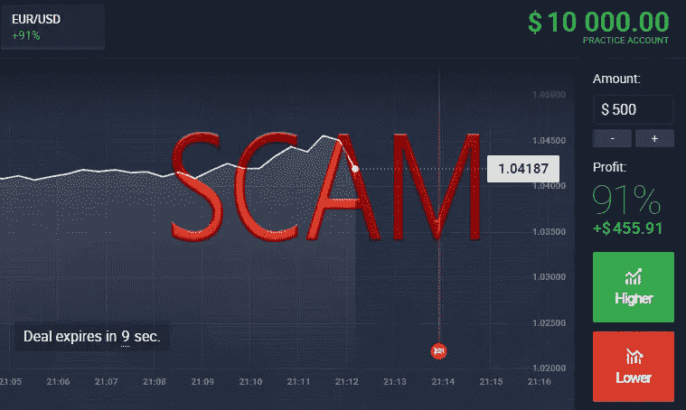
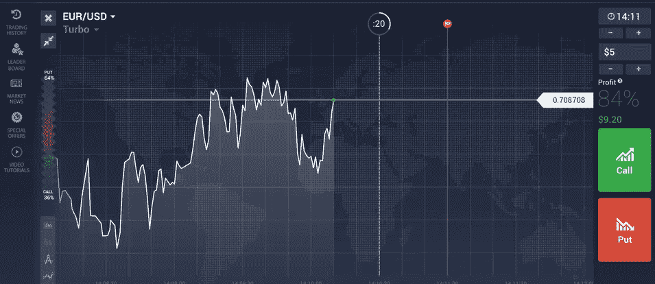
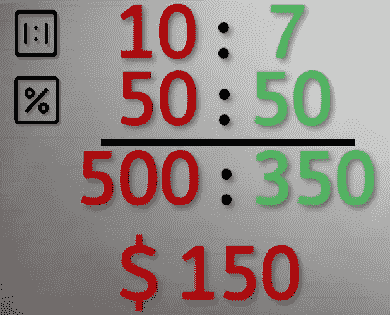
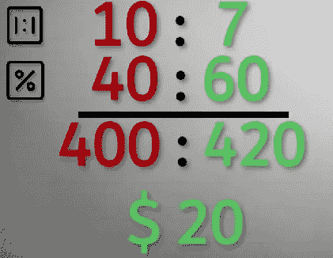

# 交易:二元期权是骗局

> 原文：<https://medium.datadriveninvestor.com/trading-binary-options-are-scam-fe1e2c535958?source=collection_archive---------9----------------------->

我们会讨论二元期权，以及为什么不应该交易这些期权。

每个人都应该见过它，我打赌你也见过，社交媒体和许多网站上的广告显示了一个漂亮而有吸引力的图表，有两个按钮，一个绿色的是“通话”，一个红色的是“上传”。点击这两个按钮叫做二元期权交易。如果你不知道这些是什么，可以看看下面的定义。否则，请随意跳过它。

# 什么是二元期权？

二元期权是市场上可用的衍生品之一，如 CFD、期货和期权。使用二元期权，你可以交易任何东西，因为你不是真的买那些东西，而只是推测价格方向。你可以用最简单的方法做到这一点，你只需要回答下面的问题“价格会上涨吗？”，如果是，那么你按绿色按钮，否则按红色按钮。这就是为什么它被称为“二进制”，因为你只能执行 2 个动作。

a screenshot from IQ Option broker

让我们来解释一下这张图片:我们有两个按钮，我们已经解释过了，上面你可以指定到期时间(用图表上的红线表示)和交易规模，并查看利润百分比。因此，如果你用 5 美元交易，利润设置为 84%，如果你回答正确，你会得到 9.2 美元，否则你会失去所有的钱。白色条显示了您可以追加买入期权的时间。

所以二元期权交易并不是一件很难做的事情，它实际上是如此简单，这就是为什么不知道如何交易的人和新交易者会被它吸引。

# 为什么二元期权是骗局？

要知道一个经纪人是不是在骗人，我们需要先问一个问题“经纪人是怎么赚钱的？”。

二元期权交易的风险回报比大于 1，这显然意味着风险大于回报。正如我们之前提到的，如果你回答正确，你会得到一个特定的利润百分比，但这个百分比总是小于 100%，这取决于你的交易:股票，外汇…另一方面，如果你回答错误，你会失去所有的钱，这是 100%。所以在这种情况下，无论你赢或输，经纪人都会赢，但如果你输了，他会得到更多。他希望你赢吗？

此外，利润百分比是由经纪人固定的，交易者根本无法控制，这是另一个黑幕问题。还有，通常一个好的交易者会分析图表，这样他可以做出更好的决定，但是有一条红线设定了结束交易的最后期限，如果你选择延长期限，利润百分比通常会减少。这意味着交易者没有足够的时间进行分析。

## 让我们更进一步

据我所知，大多数二元期权经纪商，如果不是全部的话，都不是 ECN 经纪商，但他们是做市商。这意味着他们可以对股票或其他任何东西采用不同于市场真实价格的另一个价格。

## 一些快速数学

假设你要进行 100 次交易操作，每次操作花费 10 美元，利润百分比设置为 70%。你赢的概率是 50%,如果你输了也是一样。

因此，你赢得了 50 项操作，获得了 350 美元的利润，但你失去了另外 50 项操作，损失了 500 美元，这意味着你损失了 150 美元。

好吧，假设你更聪明，而且能赢。在这种情况下，您需要将胜率提高到 60%，因此我们有:

首先，很难达到这个百分比(如果不是不可能的话)，尤其是我们之前谈到的问题，比如交易结束的时间等等..第二，利润仍然不好，我认为不值得。20 美元只代表你一开始投入的钱的 2%(10 美元*100)。

## 那么，为什么所有人都在谈论它，说他们从中赚了很多钱呢？

仅仅是因为他们得到了报酬。像 IQ Options 这样的经纪人会将他们从一个客户那里获得的收入的 70%支付给通过一个联盟项目带来这个客户的人。所以请不要相信这些混蛋！

就这样，我希望现在你明白为什么交易二元期权是危险的，如果你还有问题或者你不同意我的观点，请留下评论。感谢跟随😄

## PS:如果你喜欢我做的事情并且想要支持我，你可以通过使用这个[链接](https://oussemamiled.medium.com/membership)成为一个中等会员