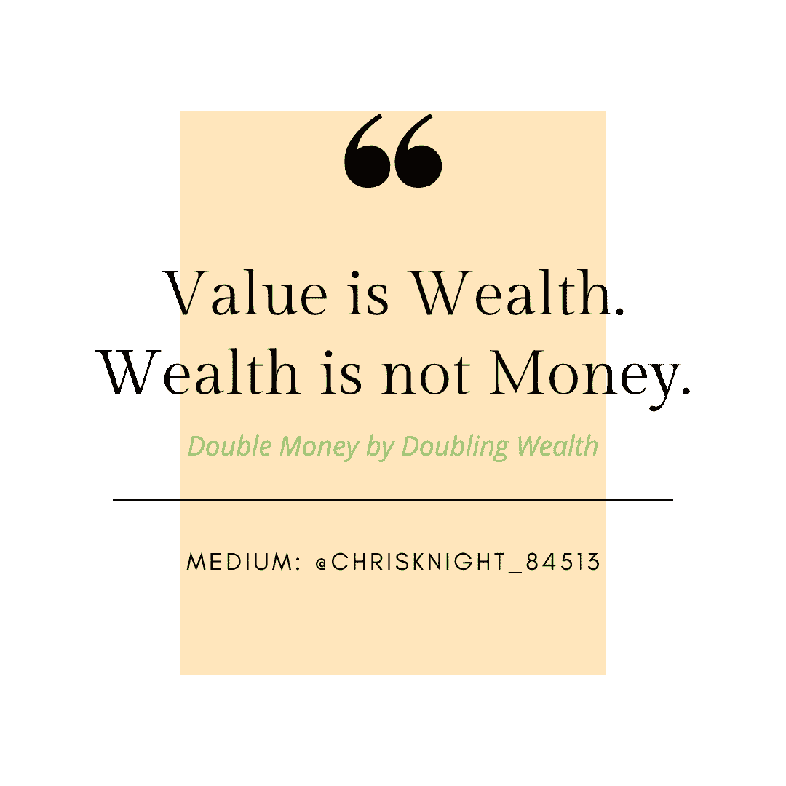
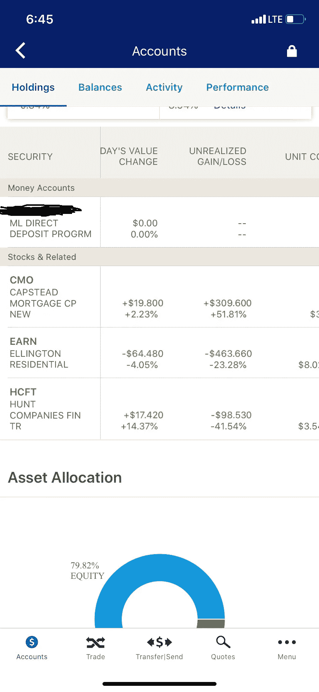

# 交易，一夜成功&追求在一次交易中赚双倍的钱

> 原文：<https://medium.datadriveninvestor.com/trading-overnight-successes-the-quest-to-double-money-on-a-single-trade-fb8dbdbf7481?source=collection_archive---------5----------------------->

Source: Self Created Image with Canva

幸运，不可理解，不真实，危险，骗局。有些人在分析双重货币概念时会用到这些词。当单词“ *double* ”与“ *money* ”一起使用时，风险是空前的高。不可能有“安全的”或“有保证的”交易试图使钱翻倍。

> 对于那些知道高收益交易价值的人来说，风险是经过计算的，成功的机会是经过计算的，回报大于损失。

风险是许多人避之不及的一个词。尽管我们胆怯地参与，但我们都想在生活中有所作为。每个人都想要美好的生活。许多人冒着一切风险追求他们心目中的美好。需要一点点的曝光才能看到伟大。

在大多数战斗形式中，除非格斗者能够同时被对手杀死，否则他的致命一击不会成功。赚钱永远是冲突。许多人以获得多少钱来衡量成功。在有限的供给中，每个人都不可能获得巨大的总和。因此，冲突只能通过一方多拿，一方不拿来解决。

**胜利只属于那些孤注一掷的人。**

当涉及到金钱的时候，人们谈论保守的行为，但是没有认识到他们在生活的其他方面的非常危险的行为。

 [## 算法交易的机器学习|数据驱动的投资者

### 当你的一个朋友在脸书上传你的新海滩照，平台建议给你的脸加上标签，这是…

www.datadriveninvestor.com](https://www.datadriveninvestor.com/2019/01/30/machine-learning-for-stock-market-investing/) 

**常见高风险活动的实例**

例如，今天你能做的最有风险的投资是恋爱和结婚。为了一个很少被证明会永久持续的事件，你会拿你所有收入的一半去冒险。许多人在离婚中失去了一生的积蓄、信贷和更多。

尽管有下面详述的统计数据支持，许多人还是结婚了。

你第一次尝试婚姻有 68%的成功机会(考虑到有利的+30 岁年龄，正规教育(大学)，婚姻幸福的父母，结婚至少 7 个月有一个孩子，并且不贫困)。

尽管有不利因素，四分之三的离婚人士会再婚，尽管第二次机会只有 40%的成功机会。

也许“风险不利”这几个字不是大多数人应该用的。人们应该使用“风险承受能力”这样的字眼。

在*中，布琳·布朗博士将脆弱定义为“不确定性、风险和情感暴露”根据这个定义，爱一个人并允许他们爱你的行为可能是最大的风险。约翰·戈特曼博士在[T5 写道，是什么让爱情长久？](https://www.gottman.com/product/what-makes-love-last/)***那些有勇气信任他人的人，生活往往会变得更好*** 。”*

*人们愿意相信高风险的活动。参与冒险活动是关于你选择应用这种行为的生活领域。许多人采取容易冒险的姿势。*

> *在有风险的位置上成功的关键是接受你的位置，选择正确的时机进场。*

***市场波动&波动***

*市场波动在危机中放大。强劲的基本面允许被低估的机会。成功的适当设置就像成功的关系。你的伴侣需要有强大的基础和对你环境条件的称赞行为。*

> *就像一个被低估的伙伴，被一个愿意在情感上买入的人所欣赏，一只表现出相似品质的股票将有很高的成功机会向你押注的方向摆动。*

*价值的基础必须与恰当的时机相匹配。就像一个人在他们的环境允许情感投入之前压倒了他的伴侣；过早购买会导致你投资的内爆，尽管你买的是完美的一对。**下面是一个活生生的例子，说明如何在大约一周的时间内实现 51.81%的实际收益**。*

**

*你必须认识到这是旧数据。任何人都不应该在没有仔细研究、分析趋势和做好基本面的情况下匆忙买入一支股票。这些都是个人决定。现在进场意味着你可能错过了最好的收益。你可以看到 23.28%的运行损耗和 41.54%的运行损耗。每个位置都有不同的总分配。每一个都没有相同的批量。最大的位置是 EARN。相当大的仓位在 CMO，很小的仓位在 HCFT。从技术上讲，这是净亏损。下周我会调整到另一个职位。*

*根据我对基本面、趋势、价值和图表的分析，我认为我的收入远低于价值，CMO 仍有增长空间。HCFT 将会亏损，并将被削减至适当的价值。*

***通过听不到的话语来容忍大幅波动***

*微型股的市场波动非常剧烈。微型股通常表现出剧烈的波动。蓝筹股和大盘股通常不会出现剧烈的波动。大型企业倾向于保持在一个确定的范围内。在最疯狂的环境下，这一区间往往会将上涨幅度限制在个位数。出于涨幅有限的原因，我更倾向于不买大盘股。大盘股市值超过 20 亿英镑。这包括中型股(20 亿-100 亿)和大型股(超过 100 亿)。就个人而言，我认为任何超过 20 亿英镑的股票都是大盘股，不管其定义是什么。*

*Microcap 股票的市值约为 5000 万-2500 万。小盘股起价超过 2.5 亿英镑，最高可达 20 亿英镑。*

*600 毫米以下的小盘股有时会表现得像小盘股。*

***追求双倍金钱***

**从统计数据来看，翻倍是一种低概率游戏*。本周活动的插图显示了一次重大胜利和两次连续失败。任何交易都没有绝对的预测。尽管缺乏确定性，但对预期结果有很高的信心。这不是我第一次参加竞技表演，当然也不是最后一次。*

*你正在阅读的这个机会是 1)市场，2)强劲的基本面，3)购买时机，以及 4)众多技术分析(Boilnger 波段、MACD、RSI、成交量指标、市值大小、浮存、账面价值分析等等)的结合。*

*不管市场看起来如何，所有的指标都为我指出了一条上升的道路。不管看起来如何，都不能保证。[美联储宣布](https://www.nytimes.com/2020/03/23/upshot/coronavirus-fed-extraordinary-response.html)印钞以对抗冠状病毒也支持长期通胀收益(即基础资产的价值将因货币贬值而升值)，这使我进一步重视多头头寸。*

*真正的翻倍之路在于你有能力容忍价值的大幅波动，尽管你知道事实。就像持久关系的成功一样，你必须应对伴侣的情绪起伏。*

> *不能容忍不同的市场条件，不理解基本面，不把自己放在一个脆弱的位置，将永远导致失败。*

***结案陈词***

*我的哲学适用于所有长期关系的投资。现在你知道我为什么说生意总是私人的了。财富是价值而不是金钱。价值与金钱无关。金钱总是被财富所吸引。富人是那些重视重要事物的人。注意这篇文章的价值不在于赚钱。如果那是你的外卖，再读一遍。*

*学会研究强劲的基本面，结合适当的环境，选择进场时机，关注指标。如果你失去了一切，正在重新尝试，请记住一些事情。 ***赢得二婚的 40%的人玩的是一个 80%成功几率的游戏，因为他们从第一次经历*** 中学到了东西。投资也是一样。不要因失败而气馁。让失败成为你第二座房子的基础。它可能会比你的第一个更好。*

*祝你知识成功！*

******

*关于 Christopher:Christopher Knight Lopez 是一名职业骗子，在他的职业生涯中，他与职业企业家进行了广泛的合作。在他 14 年的职业生涯中，Christopher 已经开了超过 7 家公司。克里斯托弗的目的是利用各种市场驱动的机会。Christopher 是注册项目经理(MPM)和认证财务分析师(AFA)。Christopher 之前通过了 65 系列证券执照考试。克里斯托弗也有他的总路线——人寿、意外、健康和健康维护组织。Christopher 已经管理了总计 2 . 86 亿美元的报告管理资产和建议资产。Christopher 在 29 个国家有工作经验，为各种业务筹集了超过 5000 万美元，在他的个人职业生涯中总收入超过 1300 万美元。Christopher 曾在高科技行业工作:生物技术、金融、证券、制造、房地产和住房抵押贷款。克里斯托弗是一名美国空军老兵。克里斯托弗热爱家庭、竞技体育、钓鱼、武术，并倡导企业家精神。克里斯托弗为崭露头角的企业家提供自助课程。克里斯托弗对导师的热情来自于企业家和骗子需要指导的信念。这个世界充满了关于企业家身份的相互矛盾的信息。在 www.christopherklopez.com[看更多。](http://www.christopherklopez.com.)*

*免责声明:这些信息并不意味着是一种投资建议或财务建议。不要把这种情况应用到你自己的个人环境中。各种风险包括:商业风险、投资风险、政治风险和其他风险。此信息仅用于信息和教育目的。请不要向作者寻求任何投资策略或哲学。针对自己的情况，请咨询自己的理财顾问或法律顾问。不是任何形式的推荐或认可。*