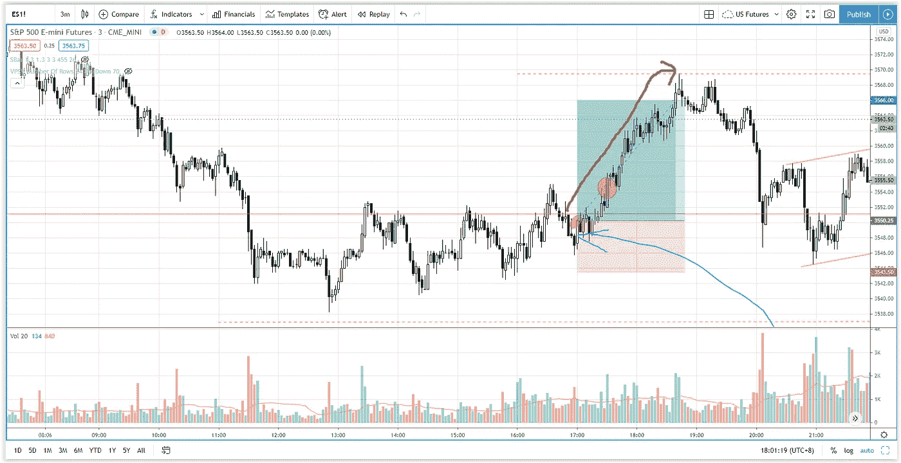

# 在突破获得最大收益之前交易——标准普尔 500 日交易

> 原文：<https://medium.datadriveninvestor.com/trading-the-breakout-before-it-makes-the-greatest-gains-s-p-500-day-trading-bbcd4403ec58?source=collection_archive---------15----------------------->

你有没有想过如何在突破交易发生之前进入它？在它获得最大收益之前找出这个突破策略。

观看视频，了解 2020 年 11 月 13 日交易时段标准普尔 500 指数期货的**每日市场分析。在这个视频中，你将看到最后一节的市场回顾和三分钟内的交易回顾(包括进场、出场和背后的原理)。展望未来，我将涵盖偏见，要注意的关键水平，我稍后的交易计划。**

## 时间戳

*   [1:08](https://www.youtube.com/watch?v=B_BzQePlcsE&t=68s) 市场回顾
*   [2:38](https://www.youtube.com/watch?v=B_BzQePlcsE&t=158s) 贸易回顾
*   [6:40](https://www.youtube.com/watch?v=B_BzQePlcsE&t=400s) 比较上行波和下行波
*   威科夫的努力与结果
*   [9:00](https://www.youtube.com/watch?v=B_BzQePlcsE&t=540s) 如何交易突破
*   [12:10](https://www.youtube.com/watch?v=B_BzQePlcsE&t=730s) 失去上升动力
*   [13:40](https://www.youtube.com/watch?v=B_BzQePlcsE&t=820s) 当前股市展望

如果你还没有看我的[每日市场分析视频](https://www.youtube.com/watch?v=jEFXVBlBwB0)，为了更好地了解市场回顾和交易回顾。

**偏向** —中性(日内交易)；看涨(长期)

**关键点位** —阻力:3587，3550；支持:3500、3480–3500

**潜在设置** —在关键级别寻找潜在反转。

# 资源

**每周市场展望&最佳交易建议**直达您的收件箱:[https://www.tradeprecise.com/](https://www.tradeprecise.com/)

**职业免费**制图平台:创建账户→[www.TradingView.com](https://bit.ly/2U2Femd)

**非美国居民？** ( **、新加波**、澳洲、纽西兰、欧洲等……):[点击此处，存款 2000 新币](https://ji.hn/sgtiger)即可获得**免费股票(价值 100++ &美元)老虎经纪公司的欢迎礼物**

美国居民？[点击此处，当您存入 1500 美元](https://ji.hn/ustradeup)时，就有机会在 TradeUP 上获得一份**免费的 AMZN 股票(价值 3000++美元** ) & **欢迎礼物**

**无限制访问媒体文章** —加入以下:[https://priceactiontrading.medium.com/membership](https://priceactiontrading.medium.com/membership)

# 进一步阅读

 [## 趋势反转交易策略(有效)——标准普尔 500 日交易

### 了解如何使用这种有利可图的趋势反转交易策略，以最小的风险抓住底部。

medium.com](https://medium.com/datadriveninvestor/a-trend-reversal-trading-strategy-that-works-s-p-500-day-trading-193443c731d2)  [## 抓住底部和上升趋势开始的 3 个简单步骤——标准普尔 500 日交易

### 找出如何使用这 3 个简单的步骤来抓住底部，并参与上升趋势的开始，当一天…

medium.com](https://medium.com/datadriveninvestor/3-simple-steps-to-catch-the-bottom-and-the-start-of-the-uptrend-s-p-500-day-trading-5b1097b081a0)  [## 凯西·伍德警告市场即将调整——标准普尔 500 价格走势分析

### 在 2020 年 12 月 18 日对彭博的采访中，方舟投资公司的首席执行官兼首席信息官凯西·伍德警告说…

medium.com](https://medium.com/datadriveninvestor/cathie-wood-warns-market-correction-soon-price-action-analysis-on-s-p-500-7e621e013310) 

Photo by Author — Ming Jong Tey

Photo by Author — Ming Jong Tey

披露:如果您点击本文中的链接进行购买或开立账户，并将所需金额存入推荐的经纪人账户，我们将免费为您赚取佣金。

免责声明:本演示中的信息仅用于教育目的，不应作为投资建议。