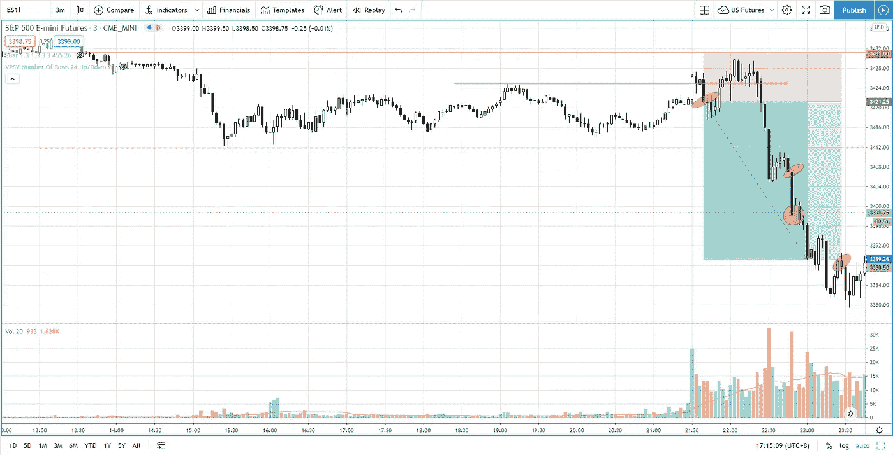

# 当交易突破下跌时，你必须寻找两个关键的东西

> 原文：<https://medium.datadriveninvestor.com/trading-the-breakout-to-the-downside-after-identifying-market-weakness-s-p-500-day-trading-f13e738f47fc?source=collection_archive---------29----------------------->

找出两个关键的方面，如果你想从这次交易中获利的话，你必须一直寻找。

观看视频，了解 2020 年 10 月 27 日交易时段标准普尔 500 指数期货的**每日市场分析。在这段视频中，你将看到上一个交易日的市场回顾，以及三分钟时间内的交易回顾(包括进场、出场和背后的理由)，内容是如何从阻力区的拒绝中获利。展望未来，我将涵盖偏见，要注意的关键水平，我稍后的交易计划。**

## 时间戳

*   [1:05](https://www.youtube.com/watch?v=_vgoas9BjEc&t=65s) 市场回顾
*   [3:15](https://www.youtube.com/watch?v=_vgoas9BjEc&t=195s) 贸易回顾
*   [5:10](https://www.youtube.com/watch?v=_vgoas9BjEc&t=310s) 提前进场
*   随着供应的增加，更好的进入
*   7:30[市场疲软](https://www.youtube.com/watch?v=_vgoas9BjEc&t=450s)
*   [11:45](https://www.youtube.com/watch?v=_vgoas9BjEc&t=705s) 当前市场前景

如果你还没有看我的[每日市场分析视频](https://www.youtube.com/watch?v=db8udFYU9ko)，为了更好地了解市场回顾和交易回顾。

**偏向** —中性(日内交易)；看涨(长期)

**关键点位** —阻力:3460，3400–3410；支持:3380–3400

**潜在设置** —在关键级别寻找潜在反转。

# 资源

**每周市场展望&最佳交易建议**直达您的收件箱:[https://www.tradeprecise.com/](https://www.tradeprecise.com/)

**职业免费**制图平台:创建账户→[www.TradingView.com](https://bit.ly/2U2Femd)

**非美国居民？** ( **马来西亚、新加坡**、澳大利亚、新西兰、欧洲等):[点击此处，存款 2000 新加坡元](https://ji.hn/sgtiger)即可获得**免费股票(价值 100++美元&老虎经纪**的欢迎礼物)

美国居民？[点击此处，存款 1500 美元](https://ji.hn/ustradeup)，就有机会在 TradeUP 获得**份免费的 AMZN(价值 3000++** ) & **份欢迎礼物**

**从媒体获取无限文章** —加入以下:[https://priceactiontrading.medium.com/membership](https://priceactiontrading.medium.com/membership)

# 进一步阅读

 [## 凯西·伍德警告市场即将调整——标准普尔 500 价格走势分析

### 在 2020 年 12 月 18 日对彭博的采访中，方舟投资公司的首席执行官兼首席信息官凯西·伍德警告说…

medium.com](https://medium.com/datadriveninvestor/cathie-wood-warns-market-correction-soon-price-action-analysis-on-s-p-500-7e621e013310)  [## DDOG、MDB、净价行为分析——大规模行动即将到来？[内部关键级别]

### 了解为什么会有潜在的大规模迁移，以及 DDOG、MDB 和 NET 的关键扩展级别。

medium.com](https://medium.com/datadriveninvestor/ddog-mdb-net-price-action-analysis-massive-move-coming-key-levels-inside-b229d18e65ec)  [## 市场修正，泡沫还是崩盘？标准普尔 500 价格行为分析

### 标准普尔 500 期货(es)昨日因供应激增下跌 2.5%，跌破上行通道。这是正常的…

medium.com](https://medium.com/datadriveninvestor/market-correction-bubble-or-crash-s-p-500-price-action-analysis-6f26e6698dbc) 

Photo by Author — Ming Jong Tey

Photo by Author — Ming Jong Tey

披露:如果您点击本文中的链接进行购买或开立账户，并将所需金额存入推荐的经纪人账户，我们将免费为您赚取佣金。

免责声明:本演示中的信息仅用于教育目的，不应作为投资建议。