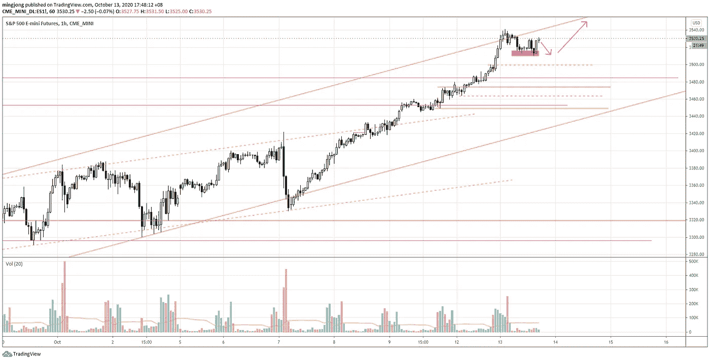
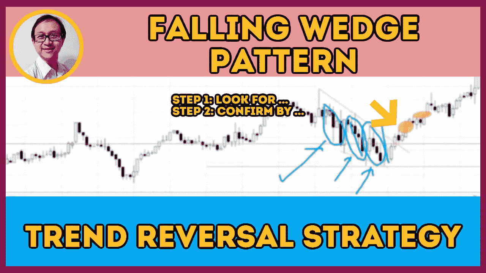

# 使用两步趋势反转技术交易下降楔形形态(有效)

> 原文：<https://medium.datadriveninvestor.com/trading-trend-reversal-from-descending-wedge-with-high-winning-rate-a9b9a5f27f91?source=collection_archive---------24----------------------->

在交易回顾部分，您将了解如何通过关注价格和交易量这两个关键方面，使用下降楔形模式进行趋势反转交易，以提高胜率。

观看视频，了解 2020 年 10 月 13 日交易时段标准普尔 500 指数期货的**每日市场分析。在这段视频中，我将向大家展示上一个交易日的市场回顾和三分钟内的交易回顾(包括进场、出场和背后的原理)。展望未来，我将涵盖偏见，要注意的关键水平，我稍后的交易计划。**

## 时间戳

*   [1:05](https://www.youtube.com/watch?v=_Pd6NBw9xZ4&t=65s) 市场回顾
*   [3:30](https://www.youtube.com/watch?v=_Pd6NBw9xZ4&t=210s) 通道超买，供应不足
*   [3:58](https://www.youtube.com/watch?v=_Pd6NBw9xZ4&t=238s) 打顶模式
*   [5:30](https://www.youtube.com/watch?v=_Pd6NBw9xZ4&t=330s) 行业回顾
*   [8.15](https://www.youtube.com/watch?v=_Pd6NBw9xZ4&t=495s)落楔
*   [9:10](https://www.youtube.com/watch?v=_Pd6NBw9xZ4&t=550s) 体积分析
*   [11:22](https://www.youtube.com/watch?v=_Pd6NBw9xZ4&t=682s) 回调确认
*   [15:00](https://www.youtube.com/watch?v=_Pd6NBw9xZ4&t=900s) 突破回调反转
*   [16:20](https://www.youtube.com/watch?v=_Pd6NBw9xZ4&t=980s) 楔形上升，体积增大
*   [17:10](https://www.youtube.com/watch?v=_Pd6NBw9xZ4&t=1030s) 当前市场展望
*   [17:35](https://www.youtube.com/watch?v=_Pd6NBw9xZ4&t=1055s) 通道超买

如果你还没有看我在上一次会议中的[每日市场分析视频](https://www.youtube.com/watch?v=5WnNJOJorLQ)，以便更好地了解市场回顾和交易回顾。

**偏向** —中性(日内交易)；看涨(长期)

**关键水平** —阻力:3450–3480；支持:3420–3430、3400、3300–3320

**潜在设置** —在关键级别寻找潜在反转。

# 资源

**每周市场展望&最佳交易建议**直达您的收件箱:【https://www.tradeprecise.com/】T2

【www.TradingView.com】专业免费制图平台:创建账户→ [制图平台](https://bit.ly/2U2Femd)

**非美国居民？** ( **马来西亚、新加坡**、澳大利亚、新西兰、欧洲等……):[点击此处，存款 2000 元](https://ji.hn/sgtiger)即可获得**免费股票(价值 100++ &美元)老虎经纪**的欢迎礼物

美国居民？[点击此处，当您存入 1500 美元](https://ji.hn/ustradeup)时，就有机会在 TradeUP 上获得一份**免费的 AMZN 股票(价值 3000++美元** ) & **欢迎礼物**

**从媒体获取无限文章** —加入以下:[https://priceactiontrading.medium.com/membership](https://priceactiontrading.medium.com/membership)

# 进一步阅读

 [## 大头针，快照，TWTR 跑赢市场-准备暴涨？

### 上周，当市场正在调整时，大多数股票都受到了重创。然而，大头针，快照和 TWTR…

medium.datadriveninvestor.com](/pins-snap-twtr-outperform-market-ready-to-skyrocket-ef8dddb6c025)  [## 市场修正，泡沫还是崩盘？标准普尔 500 价格行为分析

### 标准普尔 500 期货(es)昨日因供应激增下跌 2.5%，跌破上行通道。这是正常的…

medium.datadriveninvestor.com](/market-correction-bubble-or-crash-s-p-500-price-action-analysis-6f26e6698dbc)  [## 凯西·伍德警告市场即将调整——标准普尔 500 价格走势分析

### 在 2020 年 12 月 18 日对彭博的采访中，方舟投资公司的首席执行官兼首席信息官凯西·伍德警告说…

medium.datadriveninvestor.com](/cathie-wood-warns-market-correction-soon-price-action-analysis-on-s-p-500-7e621e013310) 

Photo by Author — Ming Jong Tey

Photo by Author — Ming Jong Tey

披露:如果您点击本文中的链接进行购买或开立账户，并将所需金额存入推荐的经纪人账户，我们将免费为您赚取佣金。

免责声明:本演示中的信息仅用于教育目的，不应作为投资建议。