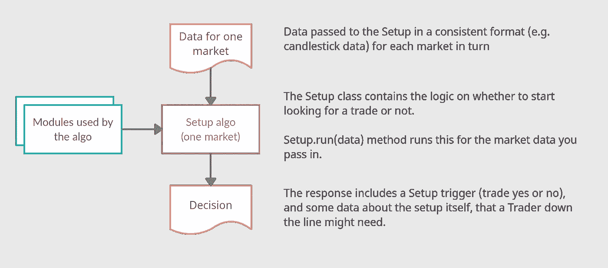
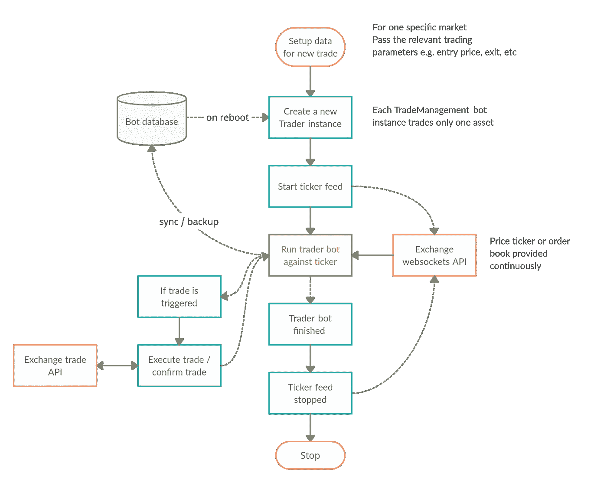
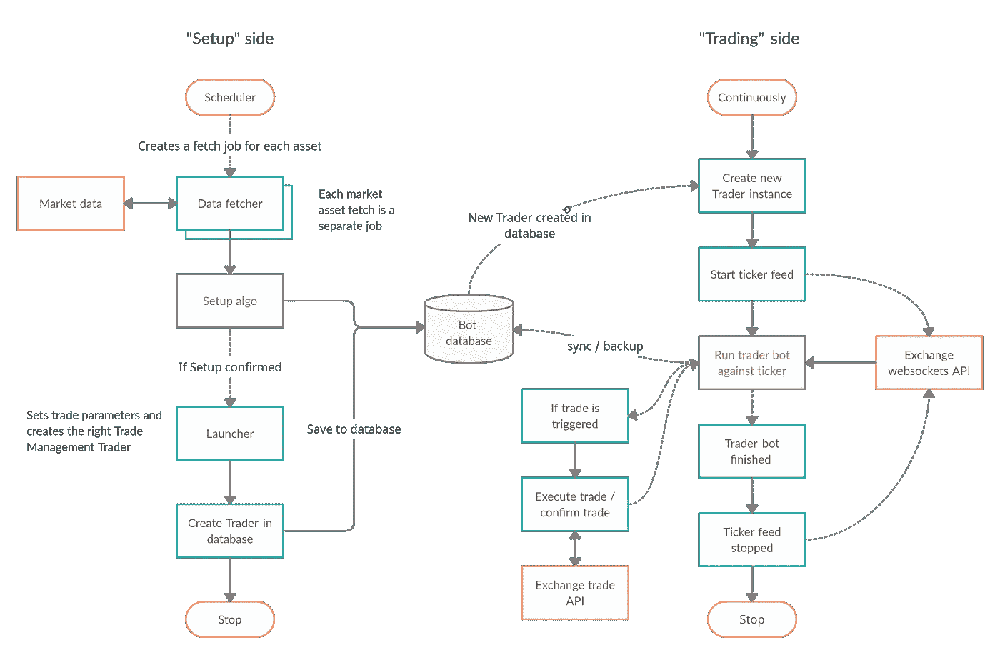

# TradingBot 系列—独立的设置和交易管理机器人

> 原文：<https://medium.datadriveninvestor.com/tradingbot-series-one-architecture-to-try-aabde70102b0?source=collection_archive---------2----------------------->

> 前一段时间，我们讨论了一个交易机器人的架构。在这篇文章中，我们将更详细地介绍这个机器人的体系结构，以及为什么你想把你的设置机器人和你的交易管理机器人分开。

# 安装机器人

首先，快速定义一下**设置**的含义:

> 一套系统是一套市场环境，触发器和数据模式，它们一起告诉我们应该交易。这可能是一个长期或短期的交易。
> 
> 对于技术分析交易，设置算法可能会在烛台数据上寻找某种指标组合。
> 
> 对于基本面分析交易，它可能是寻找股票基本面数据的触发因素和模式。
> 
> 当一个设置被触发时，我们说该设置被“确认”。

## 专注于一项工作

为了使安装机器人更容易构建、测试和信任，如果它尽可能简单会有所帮助。

在这个设置中，设置机器人一次只为一个市场运行它的算法。它不处理任何数据获取。它本身不做任何交易。这些由系统的其他部分处理。

它只是说一个设置是否被确认。

A ‘Setup’ class for running your algo

这种方法的好处:

*   寻找和优化好的设置算法可以说是最困难的部分，所以它有助于保持这部分代码的重点和简单
*   测试更简单
*   相同的设置类可用于开发、回溯测试和实时运行，因此您知道您在开发和生产中使用的是相同的算法。

# 贸易管理机器人

**贸易管理**的外部定义:

> 交易管理是一套一旦设置被确认后用于管理交易的规则。这些规则包括明确的进场价格、出场、止损和其他各种触发因素。
> 
> 交易管理机器人根据规则自己运行交易，没有任何人工干预。

## 做好一项工作

在我们的设置中，交易管理机器人只处理一项资产的实时交易。

确认设置后，将为该市场创建一个交易管理机器人实例，该实例具有自己特定的交易参数，如进场价格和止损价格。

交易管理机器人纯粹是为了管理它而存在的，一旦交易完成，交易管理机器人的实例就结束并被销毁。

如果是实时交易，重要的是交易管理机器人对任何问题、崩溃或服务器重启(这种情况时有发生)都具有鲁棒性。为了做到这一点，所有的交易管理机器人都被持久保存在一个简单的数据库中。

‘Trader’ — a Trade Management Bot setup

这种方法的好处:

*   使用一个消除所有人为干扰的交易管理机器人可以非常有助于消除交易中的情绪
*   错误在这里是至关重要的，因为如果交易管理机器人出现错误，并发布错误的交易，您可能会损失大量资金
*   安全变得非常重要，如果你是现场交易，因为你需要现场交易密钥。交易管理机器人可以放在非常安全的地方，关闭所有的输入端口，以减少攻击的可能性。

# 拼图的其他部分

一个完整的实时交易机器人还需要交易机器人设置的其他部分。其中包括:

1.  一个**数据提取器**为特定市场寻找并解析最新数据，并将其输入到**设置**机器人中。
2.  一个**调度器**，当我们想为每个有新数据的市场运行安装程序时，它会为每个市场启动一项新的工作
3.  一个**交易启动器**在确认设置后采取行动，并启动一个新的交易管理机器人
4.  各种**监控**和**错误跟踪**实用程序，以确保各种部件都启动并运行

除了发展，您还需要:

*   一个**回溯测试器**模块，使您能够针对许多市场和时间段运行您的设置。
*   一个**工作台环境**，在这里你可以快速调整你的设置和交易管理计划，找到运行良好和回溯测试良好的组合。我们发现 Jupyter 笔记本对我们的工作台非常有用。

# 把所有的放在一起

在我们的这个版本的机器人中，架构在两方面明显分开，即**设置**方面和**交易**方面。

Separation between the two sides — Setups and Trading

## 设置端—批量运行，寻找交易

**设置**端完成所有的公开市场扫描，并按批处理时间表运行。当新数据可用时，它会寻找新数据，并为我们包括所有市场在内的每项资产创建一个设置扫描作业。

有几分钟，它变得非常繁忙，因为它曲柄通过所有的工作寻找设置。

当找到一个确认的设置时，机器人不会自己进行交易，而是在数据库中创建一个交易者，这样交易方以后就可以拿起它进行实时交易。

## 交易方—持续运行，管理交易

**交易方**运行上述的交易管理交易机器人。

当一个新的交易者出现在数据库中时，它会识别出来并采取行动。

这样，如果其中一个交易机器人崩溃或重启，交易方也能设法恢复。灾难恢复在这里测试非常重要。

这是一篇关于算法交易机器人的一种架构的自以为是的文章。还有许多其他有效的方法。