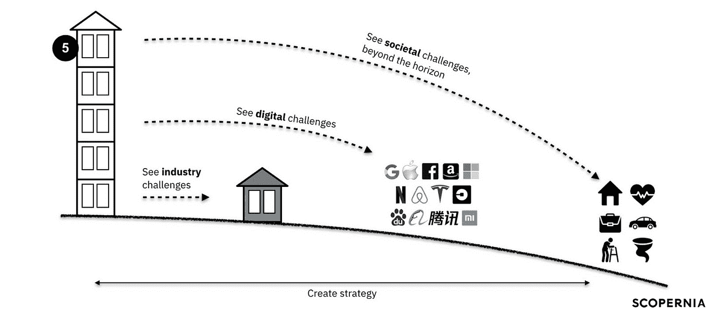

# 传统的市场调查已经死了，☠️

> 原文：<https://medium.datadriveninvestor.com/traditional-market-research-is-dead-f73e61f4d175?source=collection_archive---------23----------------------->

## 以下是如何在 2020 年进行市场调研

Photo by [Andrew Neel](https://unsplash.com/@andrewtneel?utm_source=unsplash&utm_medium=referral&utm_content=creditCopyText) on [Unsplash](https://unsplash.com/s/photos/research?utm_source=unsplash&utm_medium=referral&utm_content=creditCopyText)

历史上，市场研究一直关注商业智能的两个变量:**客户**和**竞争对手**。只要市场更简单，企业通过有限数量的渠道运营，这种方法就行之有效。

今天，社会的复杂化使得客户和竞争对手没有所有的答案。

因此，依赖传统市场研究模式的传统公司落后于形势。他们在大多数客户操作了交换机后才开始采用变更，这使得建立任何竞争优势变得困难。

> [介绍我们的商业智能即服务解决方案 PADI 模式](https://jeremy-denisty.medium.com/you-have-been-doing-business-intelligence-wrong-2a173887ec77)

你需要一种更全面的市场研究方法，这种方法可以提升你的视角，帮助你做出商业决策，让你的组织在未来几十年里经得起考验。

# 成为第五层的公司

如果你决策过程中的市场研究聚焦于**客户和竞争对手**，你就是我们所说的**一楼公司**，着眼于你所在行业的挑战。

一个第三层的公司从一个更高的角度看待跨行业的数字挑战。今天的技术玩家正在构建趋势，而不是对它们做出反应，创造新的市场，或破坏现有的市场。密切关注他们可以确保您的组织能够成为他们的一部分，而不是被抛在后面。

最终目标是成为一家关注行业挑战、数字挑战和社会挑战的第五层公司。社会挑战是在背景中发生的重大转变，但决定了工作、住房和流动性的未来。

这些转变可能会对企业产生重大影响，但也弥补了推动变革的巨大机遇，使您的组织经得起未来考验。

Image courtesy of the author

你在未来 10 年、20 年、50 年创造可持续发展业务的能力，首先取决于你看到变化、理解其影响并采取行动的能力。要做到这一点并成为第五层的公司，你需要提升你的公司雷达。

# 你在公司雷达上需要的 4 件(额外)事情

# 1-新的商业模式📑

大多数成功的新企业并不关注颠覆性的产品或服务，而是关注如何从中赚钱。看看新商业模式的 10 个驱动因素并深入探究对你的组织影响最大的驱动因素。

当前的社会变革加速了可持续商业模式的发展，打破了旧的商业教条。共享与所有权、解决方案与产品、循环与有限资源是三种商业模式，旨在引导组织走向可持续发展。

Image courtesy of the author

# 2-新的竞争对手👶

不要只关注那些直接竞争你的市场份额的玩家。找出新的玩家，15 到 20 家以不同方式颠覆你的行业的创业公司。

找出他们是谁(通过使用像 [Crunchbase](https://www.crunchbase.com/) 这样的工具)，他们使用的技术，他们声称什么，他们与谁交谈，以及他们如何与他们的客户互动。

# 3-新的伙伴关系🤝

> 未来来得太快，我们无法独自面对。**我们需要合作。**

关注新的竞争对手和初创公司并不一定意味着你需要竭尽全力去阻止他们。

把它视为机会而不是威胁:你能从他们身上学到什么？你如何改进你的操作？你如何与他们合作，互相帮助，共同成长？

除了创业公司，从过去 12 个月中披露的**不寻常的嫌疑人**之间的合作中寻找灵感。不寻常的嫌疑人是那些乍看起来似乎没有联系，但实际上可以互相帮助实现目标的公司([例如:宜家和乐高联手打造儿童储物盒](https://www.linkedin.com/posts/jeremydenisty_growth-business-ecosystem-activity-6706111065446588417-E1Fz))。)

# 4-🧭新的社会转变

我们正在经历的健康危机正在导致消费者行为的根本改变。其中一些将长期伴随我们。有些不会。

识别人们生活方式**的主要转变**、**工作方式**和**移动方式**。这些转变对您的业务有影响吗？哪些对您的活动构成威胁，哪些可以转化为机会？

— —

如果您正在寻求外部帮助，以便在您的组织内实现这一点，或者在某个特定主题上开展领先的研究，请不要犹豫。

是时候改变你的观点了🚀