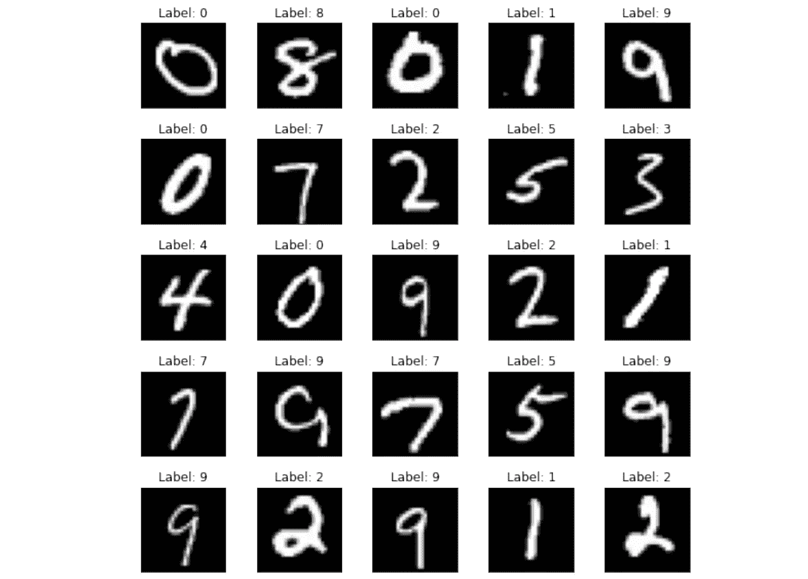
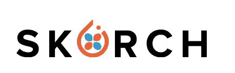
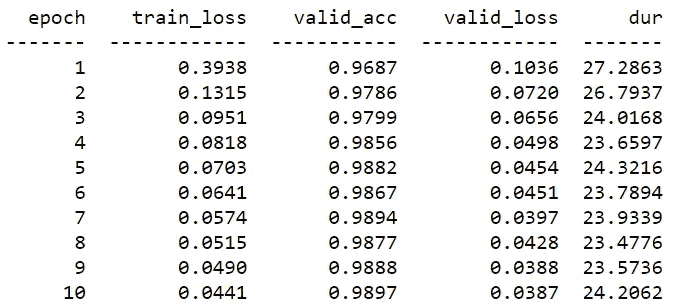
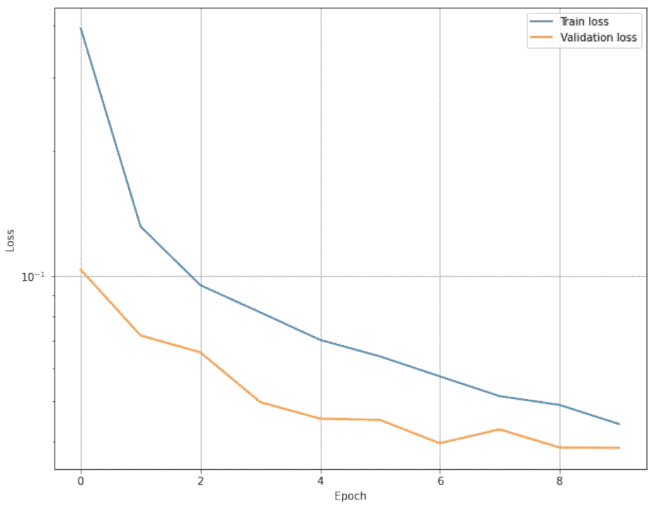
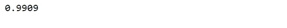
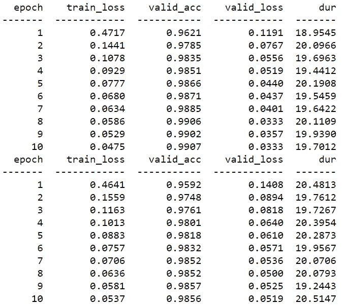
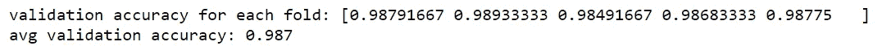

# 使用 MNIST 数字识别 Skorch 训练 CNN

> 原文：<https://medium.datadriveninvestor.com/train-a-cnn-using-skorch-for-mnist-digit-recognition-53d7d2f971c7?source=collection_archive---------5----------------------->

## 结合了 scikit-learn 的灵活性和 PyTorch 的强大功能的库

Image made by Author

这篇文章的目标是使用一个工具以简单的方式训练和评估 Pytorch 的模型。这个工具是 **Skorch，**那个是一个 scikit-learn 兼容的神经网络库，包装了 Pytorch。所以使得 Pytorch 配合 sklearn 使用成为可能。此外，它利用了 Scikit-learn 的功能，如 fit、predict 和 GridSearch [1]。这个工具应用在 **MNIST** 上，这是一个由手写数字图像组成的数据集:6 万个用于训练，1 万个用于测试。在卷积神经网络中，我们将手写数字(0-9)的图像作为输入，并将图像分类为适当的数字。

# 什么是斯科奇？

Credit: [Skorch](https://github.com/skorch-dev/skorch)

Skorch 是一个非常新的开源库，于 2017 年首次推出。简单来说，它结合了 **S** ci **K** it-Learn 和 python**ORCH**。因此，它允许用 SKlearn 轻松交换神经网络并提取 Pytorch 模块。这种开源的主要优势是减少了样板代码。如果您过去使用过 Pytorch，那么编写用于培训的可能会有问题，因为总是要编写相同的代码，并且很容易因为代码行过多而出错[2]。

**用 Pytorch 训练:**

**与 Skorch 一起训练**

比较这两个例子，您可以观察到 Skorch 允许使用更少的代码行。为了理解这个开源库的作品，我将遍历经典的 MNIST 分类问题。

# 步骤 1:导入库和数据集

让我们安装 Skorch，我们将在本教程中使用的库:

一旦安装了库，我们就可以导入库了。

**斯科奇。NeuralNetClassifier** 是一个用于分类任务的神经网络类。

# 步骤 2:训练前准备数据集

我们正在使用 **torch.device.** 创建一个对象，张量将被分配到这个设备对象中，它的设备类型是 cpu 或 cuda。要使用 gpu，需要指定“cuda”。

如果我们希望 skorch 为我们做一个验证分割，我们需要从训练数据集中检索`y_train`值，并在稍后将这些值传递给`net.fit`:

# 步骤 3:创建模型

我们的卷积神经网络具有两个卷积层，每个卷积层具有 5×5 核，以及两个完全连接的层。

# 第四步:训练模型

现在我们将初始化 **NeuralNetClassifier** 类，其中我们指定:

*   Pytorch 模块:在我们的例子中，我们的 CNN 模型。
*   **判据**(默认=nn。NLLLoss):我们需要指定我们使用的是 CrossEntropyLoss。
*   **优化器**(默认=optim。SGD):我们选择优化器 Adam。
*   **batch_size** (默认=128):我们使用 64 作为 batch_size。
*   **lr** (默认值=0.01):传递给优化器的学习率为 1e-3。
*   **max_epochs** (默认值=10)
*   **iterator_train** 和 **iterator_valid:** 默认 PyTorch `[**DataLoader**](https://pytorch.org/docs/stable/data.html#torch.utils.data.DataLoader)`用于训练和验证数据。
*   **train_split** (默认值=0.2):默认情况下，20%的训练数据被保留用于验证。

因此，默认情况下，训练数据将被 skorch 内部分成80%的训练和 20%的验证。

 [## 使用 Python |数据驱动投资者的名称匹配技术

### 我们确实面临很多情况，我们必须匹配一个有很多变体的单词。这可能是因为错别字…

www.datadriveninvestor.com](https://www.datadriveninvestor.com/2020/12/07/name-matching-techniques-with-python/) 

初始化后，我们将使用拟合方法训练 CNN 模型:

结果显示了训练损失、验证损失、验证准确度和每个历元的持续时间。该模型似乎工作得很好，因为在两个损失之间有微小的差异。通过模型“net”的属性 **history** 获得的下图也很明显。基本上，它是一个包含关于模型训练的信息的字典列表:对于每个时期，都有一个元素，同样包含每批的字典列表。

# 第五步:预测

我们将对测试数据进行预测，并使用 sklearn 库中的函数 predict 和 accuracy_score 来评估预测的准确性。

对于一个简单的网络来说，99%的准确率已经很不错了。另一种评估模型性能的方法是**混淆矩阵**，它将实际类别与预测类别进行比较。在对角线中，有预测标签等于真实标签的点的数量，而在非对角线中有错误分类的元素。

即使整体准确率达到 99%，仍然有很多分类错误的数据。特别是，4 级被错误地分类为 9 级达 9 次。出于这个原因，我们将尝试 K-Fold 交叉验证，以确保避免过度拟合和不松散的推广。

# 第六步:通过 K 倍交叉验证评估分数

在评估之前，我们需要使用类 **SliceDataset** 使训练集可切片，该类包装 torch 数据集以使其与 sklearn 一起工作。我们将使用 sklearn 库的函数`**cross_val_score**` ( *estimator* ， *X* ， *y=None* ， *cv=None* )来评估使用 K=5 倍进行 K 倍交叉验证所获得的验证精度。

结果与前两个折叠相关，但是您也应该看到像这样的其他三个表。

下面是每个折叠的平均精度和所有折叠的平均精度:

即使计算量很大，也需要 K 重交叉验证来评估模型而不会过度拟合。精度仍然很高，因此这意味着该模型在任何重采样过程中都工作良好。

恭喜你！您使用 Skorch 库构建了您的分类器。我希望你能更好地理解它是如何工作的。Skorch 是一个非常有用的工具，它以简单易行的方式训练和评估 Pytorch 模型。代码在 [Github](https://github.com/eugeniaring/Pytorch-tutorial/blob/main/mnist-skorch.ipynb) 里。

**参考文献:**

[1][https://skorch.readthedocs.io/en/stable/index.html](https://skorch.readthedocs.io/en/stable/index.html)

[https://www.youtube.com/watch?v=Qbu_DCBjVEk](https://www.youtube.com/watch?v=Qbu_DCBjVEk)

**访问专家视图—** [**订阅 DDI 英特尔**](https://datadriveninvestor.com/ddi-intel)