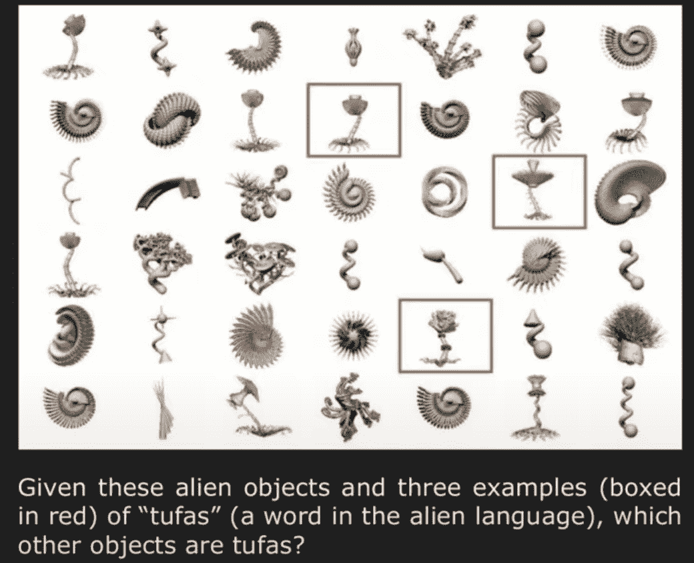
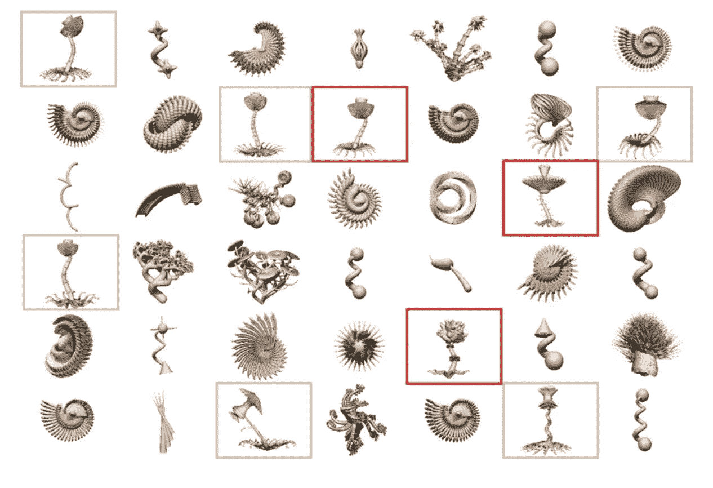

# 通过几个例子训练机器学习模型:少量学习—第 1 部分

> 原文：<https://medium.datadriveninvestor.com/training-a-machine-learning-model-from-a-few-examples-few-shot-learning-part-1-50402ab8dfa5?source=collection_archive---------2----------------------->

在机器学习时代，把“**数据**”视为驱动这个快速移动领域的燃料，一点也不为过。机器学习特别是深度学习在有大量训练数据的应用中非常成功。当数据集很小时，这些算法的性能会显著下降。**少拍学习** (FSL)是机器学习的一个分支，解决了这个缺点。利用先前的知识，FSL 可以从有限数量的例子中掌握新的任务。这篇文章介绍了各种 FSL 方法，适合初级到中级水平的机器学习爱好者。这篇文章分为两部分。这是第一部分，主要是对这个主题的概述，下一部分将深入探讨实现 FSL 的方法。

# **大纲第一部分:**

1.  少投学习的动机
2.  少数镜头学习简介
3.  结论和参考文献

# **大纲第二部分:**

1.  实现少量学习的方法
    —基于数据的方法
    —基于模型的方法
    —基于算法的方法

第二部分在此处[可用](https://medium.com/@nvarshney97/training-a-machine-learning-model-from-just-a-few-examples-few-shot-learning-part-2-f8659ece982b)。

# 少投学习的动机

让我们从论文 [*如何培养头脑:统计、结构和抽象*](https://www.semanticscholar.org/paper/How-to-grow-a-mind%3A-statistics%2C-structure%2C-and-Tenenbaum-Kemp/317794c81f54371dda5950a5ee7a41ed10298ab2) 中的一个 en 练习开始我们的旅程。在下图中，给出几个物体类别的例子，你能识别属于同一类别的其余物体吗？

Figure taken from the paper [*How to Grow a Mind: Statistics, Structure, and Abstraction*](https://www.semanticscholar.org/paper/How-to-grow-a-mind%3A-statistics%2C-structure%2C-and-Tenenbaum-Kemp/317794c81f54371dda5950a5ee7a41ed10298ab2)

几乎每个人都选择了如下所示的对象。

Figure taken from the paper [*How to Grow a Mind: Statistics, Structure, and Abstraction*](https://www.semanticscholar.org/paper/How-to-grow-a-mind%3A-statistics%2C-structure%2C-and-Tenenbaum-Kemp/317794c81f54371dda5950a5ee7a41ed10298ab2)

这证明了我们人类擅长**少投学习**。在上面的例子中，我们能够从有限数量的例子中进行归纳。目前的机器学习模型中缺少这一特性。为了弥合人工智能和人类之间的差距，FSL 是一个重要的研究领域。这激发了尝试使用先验知识从几个例子中进行归纳的少量学习领域。与 FSL 相关的另一个场景包括一组应用，其中数据收集或者由于隐私、安全问题而不可行，或者由于高成本、计算要求而不实用。属于这一范畴的一些例子包括从/到低资源语言的翻译、冷启动项目推荐问题等。此外，FSL 可以减轻建立庞大数据集来学习任务的负担。

> **研究少量学习的主要动机:**
> 
> 1.充当像人类一样学习的试验台(因为人类只能从少数几个例子中学习)。
> 
> 2.消除昂贵的数据收集工作(因为 FSL 方法只需要几个例子来学习一项任务)。

# 少数镜头学习简介

典型的机器学习(ML)模型需要数千个，有时甚至数万个例子来学习一项任务。少量学习方法试图消除这种对模型数据的渴求，只需要几个例子来学习一项任务。

FSL 可以基于分类、回归或强化学习场景。

*   **少数镜头分类** —它从每个类的一些标记样本中学习构建分类器。形式上它被称为“ **N 路 K 镜头分类**”(总共有 K*N 个例子，N 个类中的每一个都有 K 个例子)。当只有一个有监督的例子可用时，称为**单次学习**，当没有例子可用时，称为**零次学习。**
*   **少量回归** —它估计一个回归函数 *h* ，仅给出从该函数中采样的几个输入-输出示例对。
*   **少量强化学习** —它的目标是在只给定几个由状态-动作对组成的轨迹的情况下找到一个策略。

> 在本系列文章中，我们将主要关注**少镜头分类方法**。

用于评估少镜头学习算法的流行视觉数据集:

*   **Omniglot** —来自 20 个不同人的 50 种不同字母的 1623 个手写字符。
*   **幼崽数据集** — 200 种鸟类(类)和大约 6k 张图片
*   **迷你图像网**—100 个类别的子集(来自图像网的每个类别 600 个图像)。

在我们结束本系列的第 1 部分之前，让我们回答一个有趣的问题"**为什么 ML 算法需要大量数据？换句话说，为什么 FSL 是困难的—“**泛化**”&”**过拟合**”**

如果仅使用少数几个示例来训练算法，则该算法容易过度拟合，并且可能无法很好地推广到训练集中不存在的示例。

 [## 认知计算——一套被广泛认为是……

### 作为它的用户，我们已经习惯了科技。这些天几乎没有什么是司空见惯的…

www.datadriveninvestor.com](https://www.datadriveninvestor.com/2020/02/19/cognitive-computing-a-skill-set-widely-considered-to-be-the-most-vital-manifestation-of-artificial-intelligence/) 

# 结论和第二部分:

少镜头学习是机器学习研究的一个热点。本系列的第 2 部分介绍了实现 FSL 的方法，可在[这里](https://medium.com/@nvarshney97/training-a-machine-learning-model-from-just-a-few-examples-few-shot-learning-part-2-f8659ece982b)找到。

# 参考

1.  [*如何培养头脑:统计、结构和抽象*](https://www.semanticscholar.org/paper/How-to-grow-a-mind%3A-statistics%2C-structure%2C-and-Tenenbaum-Kemp/317794c81f54371dda5950a5ee7a41ed10298ab2)
2.  从几个例子中归纳总结:关于少投学习的调查

**访问专家视图—** [**订阅 DDI 英特尔**](https://datadriveninvestor.com/ddi-intel)