# 仅通过几个例子训练机器学习模型:少量学习—第 2 部分

> 原文：<https://medium.datadriveninvestor.com/training-a-machine-learning-model-from-just-a-few-examples-few-shot-learning-part-2-f8659ece982b?source=collection_archive---------2----------------------->

少数镜头学习 **(FSL)** 是机器学习的一个领域，旨在训练场景中的模型，这些场景中很少有例子可以作为监督。利用先前的知识，FSL 可以从有限数量的例子中掌握新的任务。本系列文章介绍了各种 FSL 方法，面向初级到中级机器学习爱好者。这是本系列的第 2 部分，涵盖了实现 FSL 的方法。第 1 部分主要介绍了这个主题。

第 1 部分可从[获得，通过几个例子训练机器学习模型:少量学习-第 1 部分。](https://medium.com/@nvarshney97/training-a-machine-learning-model-from-a-few-examples-few-shot-learning-part-1-50402ab8dfa5)

# 概述第 2 部分:

1.  实现少量学习的方法
    —基于数据的方法
    —基于模型的方法
    —基于算法的方法
2.  结论和参考文献

# 实现少投学习的途径

正如本系列第 1 部分[中提到的，FSL 利用先验知识来补偿小的训练数据集。可以通过三种方式利用先前的知识来实现少量的学习。](https://medium.com/@nvarshney97/training-a-machine-learning-model-from-a-few-examples-few-shot-learning-part-1-50402ab8dfa5)

1.  **数据** — *利用先验知识增加数据*(即**数据扩充**)。
2.  **模型** — *利用先验知识减少假设空间*的大小。
3.  **算法** —使用先验知识改变在给定假设空间中的最佳假设的*搜索。*

在深入探讨上述实现 FSL 的方法之前，我们先来回顾一些与 ML 相关的数学。这一部分只对那些对数学感兴趣的人有用。虽然您可以考虑跳过这一部分(阅读突出显示的部分就足够了)，但它将有助于理解本文中要跟进的部分。

 [## 认知计算——一套被广泛认为是……

### 作为它的用户，我们已经习惯了科技。这些天几乎没有什么是司空见惯的…

www.datadriveninvestor.com](https://www.datadriveninvestor.com/2020/02/19/cognitive-computing-a-skill-set-widely-considered-to-be-the-most-vital-manifestation-of-artificial-intelligence/) 

**预期风险与经验风险最小化:**

给定一个 ***假设 h*** ，我们要最小化它的 ***期望风险 R*** ，这是相对于输入 x 和输出 y 的地真联合概率分布所度量的损失， ***p(x，y)*** 。具体来说，

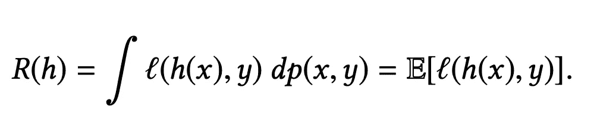

Expected Risk. Source: Generalizing from a Few Examples: A Survey on Few-Shot Learning

由于 ***p(x，y)*** 未知，因此**经验风险**(这是在 *I* 样本的训练集上样本损失的平均值)通常被用作 ***R(h)*** 的代理，导致**经验风险最小化**。

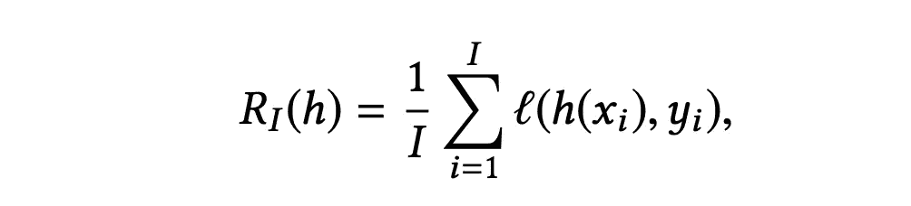

Empirical Risk. Source: Generalizing from a Few Examples: A Survey on Few-Shot Learning

现在，让我们再了解几个术语

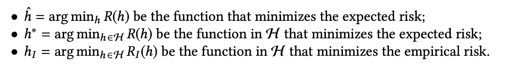

设假设空间为 **H.** 由于 **ĥ** 未知，算法试图用某个**h∈ht21】来近似它。 ***h**** 是在 ***H*** 中找不到的最佳近似。 ***hI*** 是通过经验风险最小化得到的*中的最佳假设。***

> *简单来说， **h*** 是找不到的最优假设(通过最小化期望风险得到的)。因此，我们的目标是在中找到**，这是通过最小化经验风险获得的一个近似值。***

*使用这些术语，我们可以强调在[第 1 部分](https://medium.com/@nvarshney97/training-a-machine-learning-model-from-a-few-examples-few-shot-learning-part-1-50402ab8dfa5)中讨论的问题，即在小训练数据集的情况下泛化能力差。*

*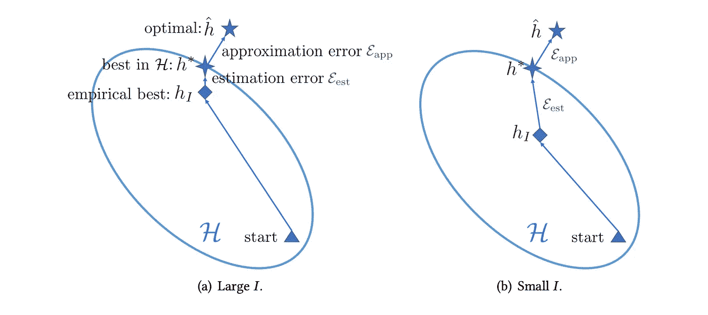*

*Comparison of learning with sufficient and few training samples. Source: Generalizing from a Few Examples: A Survey on Few-Shot Learning*

*左图显示了数据集较大时的假设空间。有足够的具有监督信息的训练数据(即，I 很大)，经验风险最小化器*可以提供到最佳可能 **R(h*)** 的良好近似***【R(hI)***。换句话说，假设非常接近最优假设。(即 ***hI*** 接近 ***h**** )。另一方面，在小数据集的情况下，经验风险 ***RI (h)*** 可能远不是预期风险 ***R(h)*** 的良好近似，并且所得的经验风险最小化器 ***hI*** 过拟合，即收敛假设显著远离最优假设(即**

***下图描述了不同的 FSL 方法是如何解决少数几个学习问题的。***

***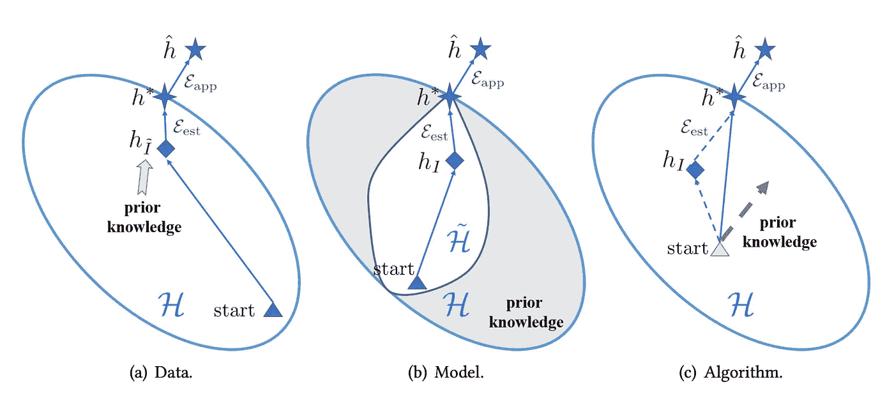***

***How FSL methods solve a few-shot problem. Source: Generalizing from a Few Examples: A Survey on Few-Shot Learning***

***接下来我们将尝试理解上图中的每一个情节。***

# *****数据—*****

***这些方法使用先验知识来扩充训练数据集(即增加训练数据集中的样本数量)。先验知识用于扩充数据集。然后，可以将标准的 ML 算法应用于这个扩展的数据集。为了举例说明这一点，让我们考虑图像，可以通过翻转、旋转、裁剪、镜像、缩放和各种其他变换对图像执行数据扩充。这些转换可以为模型引入不同种类的不变性。***

***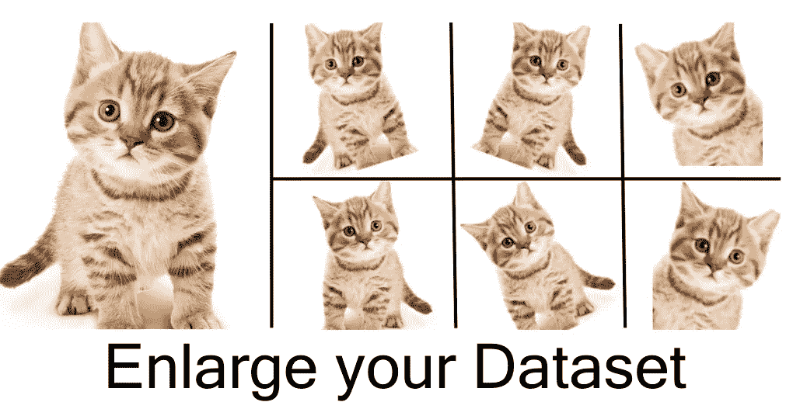***

***Data Augmentation by various transformations. Image Source: nanonets.com***

***有关图像中数据增强的更多详细信息，请参见[数据增强:用几行 Python 代码增强您的图像数据集](https://www.google.com/url?sa=i&url=https%3A%2F%2Fmedium.com%2F%40thimblot%2Fdata-augmentation-boost-your-image-dataset-with-few-lines-of-python-155c2dc1baec&psig=AOvVaw0SQ4ELnz7C-NvvfRCnouDL&ust=1592175870311000&source=images&cd=vfe&ved=0CA0QjhxqFwoTCLDCsbvz_-kCFQAAAAAdAAAAABBF)。***

***属于这一类别的另一种方法是基于通过来自其他数据集的示例来扩展训练数据集。本质上，使用可用的训练数据来训练模型(由于小训练集的可用性，该模型将非常糟糕)，并用于标记其他数据集的示例(这种标记被称为“**伪标记**”)。然后添加这些带有伪标签的示例来扩展实际的训练数据集。伪标签可能不准确，但有助于克服数据量小的问题。***

> ***这里，我们通过对示例进行一些转换或添加来自其他数据集的数据来扩展训练集，然后使用标准的 ML 算法来找到最佳假设。***

***由于数据扩充取决于扩展数据集的规则(手工制作或自动学习),因此它存在一些问题。这些规则需要领域专业知识，并且很难创建。此外，不可能列举所有可能的不变性。此外，这些规则可能特定于数据集，可能不适用于其他数据集。***

***最后，正如您可能已经注意到的，这种方法实际上并没有解决真正的少量学习问题，因为它只是增强了数据集，并依赖于标准的 ML 算法进行泛化。***

# *****型号—*****

***这些方法利用先验知识来约束 ***H*** 的复杂度，导致假设空间小得多。如图所示，不考虑优化灰色区域，因为根据现有知识，该区域不太可能包含最佳的 **h*** 。对于这个较小的 **H** ，训练数据足以学习一个可靠的 ***hI*** 并降低过拟合的风险。***

**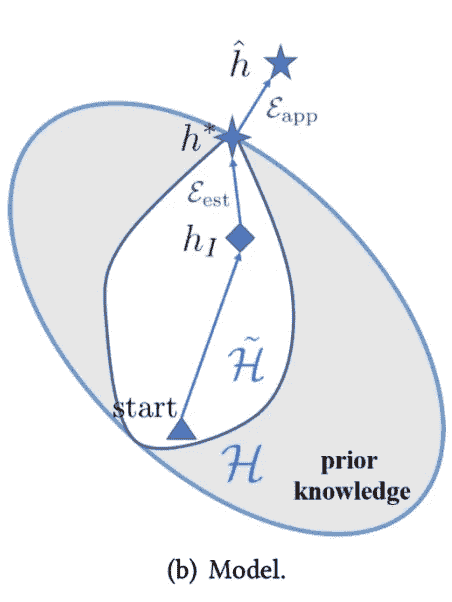**

**Reducing the hypothesis space for model-based approaches.**

> **这里，我们通过使用先验知识从搜索中消除假设空间的非最优部分来缩小假设空间。**

**根据使用什么先验知识来约束假设空间，方法可以分为四种类型。**

**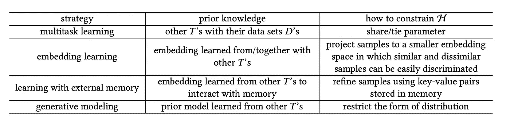**

**FSL methods pertinent to Model perspective. Source: Generalizing from a Few Examples: A Survey on Few-Shot Learning**

## ****多任务学习:****

**这种方法学习联合解决多个相关任务，因此一个任务的参数(即假设空间 **H** )受到其他任务的约束。**

**考虑以下设置:**

> **有与“C”相关的任务 T1，T2，…，TC。**
> 
> **有的例子很少(姑且称之为**目标任务**)有的例子很多(**源任务**)。**
> 
> **多任务学习从“C”个任务的训练集中学习，以获得每个任务 Tc 的参数θC。如前所述，任务是共同学习的，taks Tc 的参数θc 受其他任务的约束。**

**根据约束参数**θc**的方式，方法可以分为两类:**

1.  ****参数共享** —有些参数直接在任务间共享。在大多数情况下，前几个组件是跨任务共享的，而最后一个组件是特定于任务的。例如，考虑三个任务，第一个预测图像中汽车的存在，第二个预测动物的存在，第三个预测人的存在。该模型有一些共享层，它们捕捉图像的基本特征。这些共享层之后是特定于任务的层，这些层学习各自任务的参数。
    这些共享参数可以从源任务(具有大量训练数据的任务)中学习。对于目标任务(我们需要对其进行 FSL)，只需要学习特定于任务的参数，并且可以直接使用学习到的共享参数。因此，使用先验知识(即相关任务的训练数据)来约束假设空间。**

> **这里，我们通过允许跨任务共享参数来约束假设空间。**

**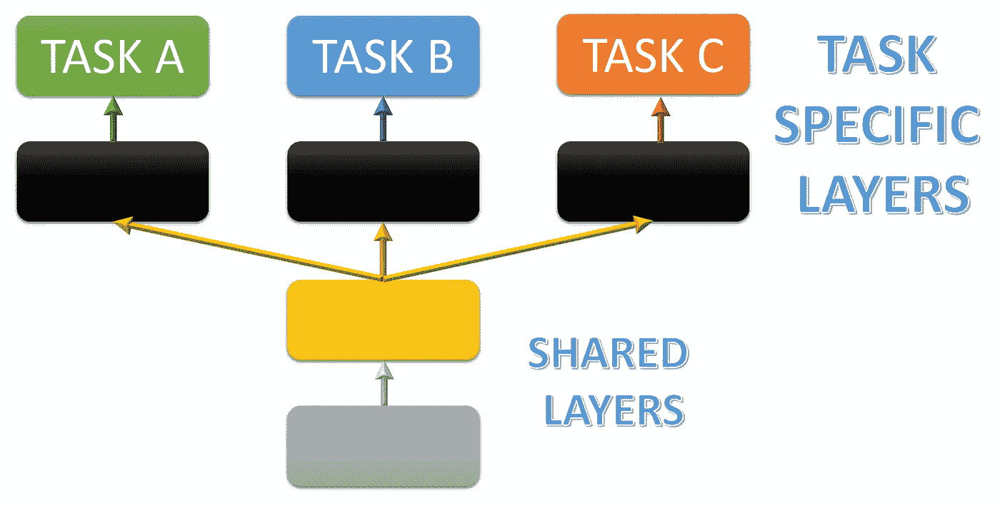**

**Multitask Learning with parameter sharing.**

****2。参数绑定** —这种方法鼓励不同任务(θc)的参数**相似，而**不像参数共享那样直接共享参数。实现这一点的一个方法是调整参数，即迫使不同任务的参数足够接近。例如，假设您有一个在任务 1(源任务)上训练的模型，现在我们将使用相同的模型，并在为少数任务训练它时允许参数的最小变化。这样我们就约束了假设空间，实现了 FSL。**

> **这里，我们通过最小化学习参数的变化来约束假设空间。**

**这种方法有一个限制，即需要联合训练，即当需要学习一个新的少量任务时，必须再次训练整个多任务模型，这可能是昂贵和缓慢的。**

## ****嵌入学习:****

**这种方法将每个样本嵌入到一个低维空间中，使得相似的样本靠得很近，不相似的样本离得很远。在这样的空间中，需要较小的假设空间，因为来自不同类别的样本被很好地分开。因此，假设空间由于嵌入空间的较低维度而受到约束。这意味着现在需要更少的样本来逼近最优假设函数(对 FSL 来说是完美的)。嵌入函数从先验知识中学习，并且可以另外使用来自 FSL 任务的训练数据的任务特定信息。基于这种方法有多种方法，例如原型网络、匹配网络、关系网络等。**

**该方法的组成部分:**

*   **将训练样本映射到低维空间 z 的**嵌入函数‘g’****
*   **一个**嵌入函数‘f’**，它将一个测试实例映射到一个低维空间 z**
*   **一个**相似性函数‘s’**,用于查找训练和测试示例嵌入之间的相似性。测试示例被分配给在嵌入空间中与其最相似的类。**

**在大多数方法中，这三个函数是使用先验知识(即在有足够监督的情况下其他任务的数据)学习的，并直接用于少量发射任务(即，无需在少量发射任务上重新训练)。**

****注意**:有些方法使用相同的‘g’和‘f’函数。**

**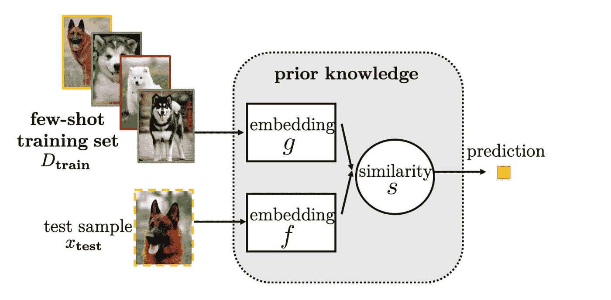**

**FSL using Embedding Learning.**

> **这里，我们通过将数据嵌入到一个低维空间来降低数据的维数，在这个低维空间中，不同类别的样本被很好地分开。由于低维空间，假设空间受到限制。**

**这种方法要求少数镜头任务和其他任务有很好的相关性。关于嵌入学习方法的更多细节可以在这篇文章中找到。**

## ****使用外部存储器学习:****

**这种方法从训练数据集中提取知识，并将其作为键-值对存储在外部内存中。使用嵌入函数“f”来嵌入一个示例，以形成该示例的密钥。然后，测试集中的每个新样本由从存储器中提取的内容的加权平均值来表示(权重基于测试示例与存储器中的密钥的嵌入的相似性)。这限制了由存储器中的内容表示的新样本，从而实质上减小了假设空间 **H** 的大小。**

**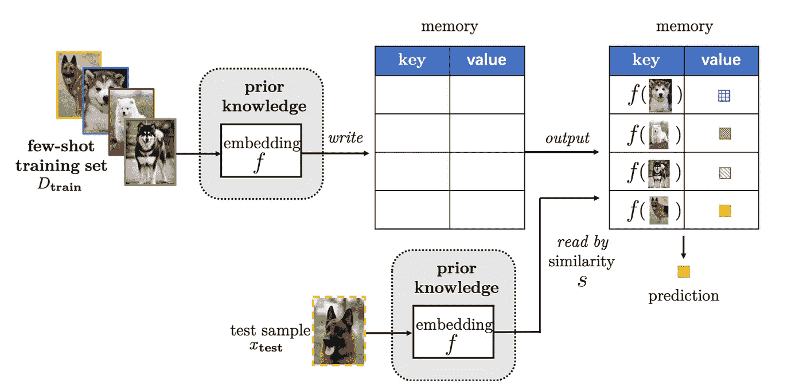**

**FSL with External Memory.**

**来自训练集的数据首先使用函数**‘f’**嵌入，然后以键值格式存储在存储器中。在测试时，首先使用**‘f’**嵌入样本，然后基于相似性函数**‘S’**，选择最相似的关键字。提取并组合对应于所选键的值，以形成测试样本的表示。这然后被传递到分类器(简单地说是 softmax 函数),该分类器进行分类预测。这种方法使用额外的内存空间。**

# **算法—**

**该策略在假设空间 **H** 中搜索最佳假设 **h*** 的参数 **θ** 。本节中的方法使用先验知识来影响如何获得参数。先验知识通过提供良好的初始化(下图中的灰色三角形)或指导搜索步骤来改变搜索策略。因此，减少了 h。**

**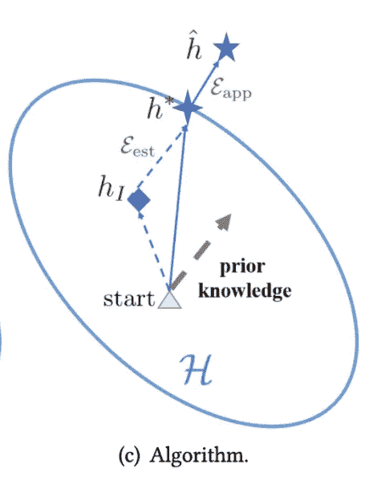**

**Search for the best hypothesis using algorithm-based approaches.**

**实现这一点有三种主要方法:**

1.  ****细化现有参数** —从其他任务学习到的初始参数(θo)(这些参数用作先验知识)使用少发任务的训练数据进行细化。**
2.  ****细化元学习参数** —初始化参数(θo)是从一组任务(即这些元学习参数作为先验知识)中元学习的，这些任务从与少量任务相同的任务分布中提取，然后使用少量任务的训练数据进一步细化**
3.  ****学习优化器** —它学习一个元学习器作为优化器，直接输出每个学习器的搜索步骤，如改变搜索方向或步长。**

# **结论和参考:**

**本系列文章涵盖了少镜头学习，这是一个相对较少开发的机器学习领域。讨论了各种方法及其利弊的简要概述。如果你打算进一步探索这里提到的算法，你可以访问[这个](https://towardsdatascience.com/advances-in-few-shot-learning-a-guided-tour-36bc10a68b77)链接。**

****参考文献**:**

1.  **从几个例子中归纳:一个关于少投学习的调查。**
2.  **[少镜头学习的进步:一次有指导的旅行](https://towardsdatascience.com/advances-in-few-shot-learning-a-guided-tour-36bc10a68b77)。**

****访问专家视图—** [**订阅 DDI 英特尔**](https://datadriveninvestor.com/ddi-intel)**