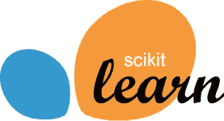
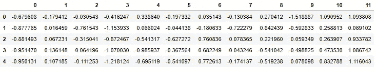

# 机器学习中的变形金刚

> 原文：<https://medium.datadriveninvestor.com/transformers-in-machine-learning-1f268fadb4c2?source=collection_archive---------6----------------------->

Photo by [Omar Gattis](https://unsplash.com/@sp_studio_10?utm_source=medium&utm_medium=referral) on [Unsplash](https://unsplash.com?utm_source=medium&utm_medium=referral)

上面的车看起来不错吧！这就是变形金刚对我们的原始数据所做的。顾名思义，转换器是用来转换对象的。在机器学习中，转换器用于将数据转换成所需的格式。你是机器学习新手吗，可以看看这篇[文章](https://medium.com/ai-in-plain-english/introduction-to-machine-learning-7697477a5e40)。转换器是处理和转换数据集的模型。这些转换器非常有用，因为我们的数据很少以直接输入机器学习模型的形式进行训练和预测。例如，当特征具有相似的尺度时，许多机器学习模型工作得最好。所有变压器都有相同的接口:

*   fit(X):将对象训练/拟合到特征矩阵 X。
*   transform(X):使用学习到的任何参数对 X 应用变换
*   fit_transform(X):同时应用 fit(X)和 transform(X)。

转换器可能会也可能不会创建额外的要素，有些转换器甚至可以减少数据中的要素数量。机器学习中的转换器的例子是标准标量或规格化器、矢量器和记号化器、PCA 等。标准标量、Mim-Max 标量等变换不会改变要素的数量，而多项式要素是创建新要素的变换的一个示例，RFE、选择 K 最佳等可减少要素的数量。

**目标**

在本文结束时，您将能够:

1.  在 sklearn 中使用变压器
2.  在单个管道中使用多个变压器
3.  建立自己的自定义变形金刚 mimmicks sklearn 变形金刚。

在我们继续之前，我想简单解释一下什么是 Scikit Learn 和。Scikit Learn 是一个机器学习库，它由许多用于浅层学习问题的算法组成，如回归、分类、聚类等。Scikit Learn 因其易于使用的结构而非常受欢迎。

现在让我们开始吧。

**首先**，让我们把原始数据转换成数据帧，为了简单起见，我将使用 sklearn 中的数据。

在第一幅图中，我首先导入我将用来从 sklearn 获取数据并将其转换为 dataframe 的库。然后我把数据转换成数据帧。查看数据，要素处于不同的比例，需要通过将所有要素转换为相同的比例来更改数据。因此，我将使用 Scikit Learn 的标准标量将数据转换为单位方差和零均值数据。请注意，方差可能不完全是 1，平均值也可能不完全是 0，但它们将分别接近 1 和 0。

这样，我们就能够扩展我们的数据。

 [## 在脑机接口中使用机器学习|数据驱动的投资者

### 神经技术是一个刚刚开始大步前进的前沿领域。有了所有的技术…

www.datadriveninvestor.com](https://www.datadriveninvestor.com/2020/07/31/using-machine-learning-in-brain-computer-interfaces/) 

**使用多个变压器**

预处理是机器学习的一个关键特征，因为真实世界的数据不会干净，因此我们需要多个转换器。在这些数据中，我们可能需要执行以下操作:

1.  创建多项式特征，
2.  缩放数据，
3.  并使用 PCA(主成分分析)降低数据的维度。你可以在这里阅读 PCA。为了实现这一目标，我们可能需要:

这种技术是不可取的，因为我们需要跟踪以前的变量，而且也容易出错。如果我们要对数据进行多次转换，那么做这样的事情会很麻烦。

**管道救援**。随着我们的分析和工作流程变得越来越复杂，我们需要一个工具来帮助扩大规模。例如，您可能需要在数据准备好用于监督机器学习模型之前对其应用多种变换。您可以显式地应用转换，为转换后的数据创建中间变量。管道是一种方法，有助于避免跟踪中间转换，并有助于扩展我们的代码以进行更复杂的分析。管道由管道类构成。本质上，管道是一个估计器对象，它保存一系列带有或不带有最终估计器的转换器。除了管道之外，Scikit Learn 还有列转换器和联合功能，它们完成类似的任务，只是不是按顺序完成的。

*   管线之于串联，如同特征联合之于并联。

让我们用管道实现上面的转换:

从上面的代码中，我们将一个元组列表传递给管道对象。每个元组有两个值一个字符串和一个 transformer 对象，字符串可以是任何东西，但必须是描述性的。我还使用了 pipeline 对象的 ***named_steps*** 方法来检查多项式特性对象。

**打造定制变形金刚**我们已经在 Scikit Learn 中看到了如何使用变形金刚。虽然 scikit-learn 提供了大量的机器学习模型和转换器，但它有时可能不会为我们提供我们的工作流程所需的特定模型或转换器。然而，通过继承的概念，我们可以构建一个与 scikit-learn 的基础设施兼容的定制估计器。例如，我们希望我们的定制模型具有适应性，并预测或转换方法。如果我们想在 Pipeline 和 GridSearchCV 类中使用我们的定制模型，那么遵从 scikit-learn 是必不可少的。在下面的例子中，我们将创建一个定制的转换器来选择我们想要使用的特性

该类从两个对象 **BaseEstimator 和 TransformerMixin** 继承而来，这就是为什么我们在使用 fit_transform 方法之前不需要定义它，我们也可以在管道、特征联合等中使用该对象。在上面的例子中，我们在对象中创建了 3 个函数:

1.  **init** 用于初始化对象，因为我们正在使用 OOP
2.  **适合**也就是算法学习的地方，我们总是返回 **self** 。请注意，即使我没有在那里添加任何东西(因为没有学习)，我仍然定义了它。
3.  **转换**转换发生的地方。注意:如果我们的任务需要的话，我们可以添加帮助函数，但是它们需要在 transform 方法中被调用，因为那是转换发生的地方。回到上面的第一个管道，我们将使用 **DataframeSelector** 对象来选择一些列，这就是我们要转换的内容。

**结论**

本文向您介绍了如何在 Scikit Learn 中使用转换器，如何在管道中实现转换器，以及如何在 Scikit Learn 中构建自定义转换器。

**快乐数据科学**

**访问专家视图—** [**订阅 DDI 英特尔**](https://datadriveninvestor.com/ddi-intel)