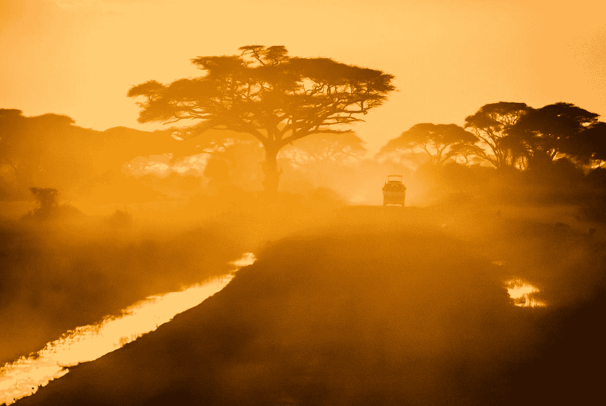
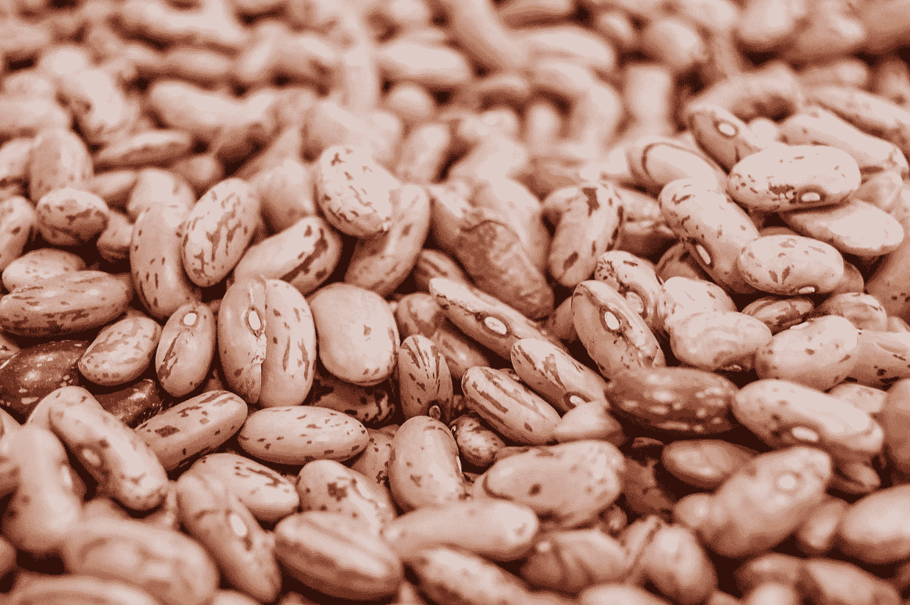
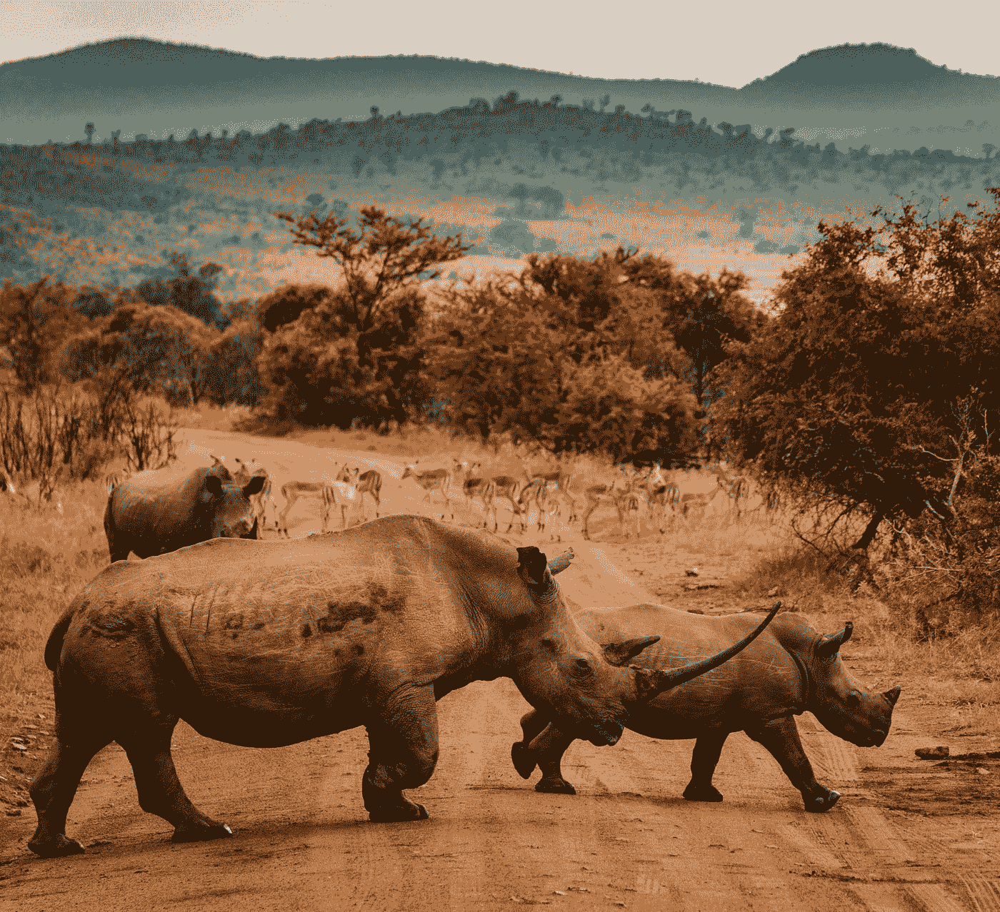

# 肯尼亚农业转型/未来转型

> 原文：<https://medium.datadriveninvestor.com/transforming-farming-transforming-futures-in-kenya-b2a1930cc25?source=collection_archive---------16----------------------->

Photo by [Sergey Pesterev](https://unsplash.com/@sickle?utm_source=medium&utm_medium=referral) on [Unsplash](https://unsplash.com?utm_source=medium&utm_medium=referral)

## 犀牛保护组织正在重新构想人类和野生动物如何更好地和谐相处

基亚马很兴奋。这个身材苗条的基库尤人为 Ol Pejeta 工作，他的能量很有感染力。他告诉我肯尼亚邻近城镇 Nanyuki 的一些当地学校和许多周边社区是如何从他们的项目中受益的。这些社区散布在非洲第二大山脉肯尼亚山的阴影下。

Ol Pejeta 位于一大片土地上，该地区有大量的白人。离开内罗毕大约需要四个小时(考虑到现代交通状况)。该组织正在开发创造性的、通常非常成功的方法，以确保他们与牧场和农场邻居的关系不仅友好，而且对所有相关方都非常有利。在环境保护领域，这是必须的。因为如果野生动物要在非洲生存，留给它们的有限的土地就必须与不断增长的人口及其食物需求相适应。

Ol Pejeta 的模型是一个标准制定者，因为在保护之后，它最大的花费是社区。对于太多的组织来说，社区得到了一切之后剩下的东西。在这种情况下，给当地利益相关者的信息是，他们不是高优先级的。在这里，如果你住在 Ol Pejeta 附近，你会的。因为 Ol Pejeta 的人民明白，非洲野生动物要有未来，其人民不能将这些宏伟的动物视为竞争对手，也不能将游客视为害虫。伙伴关系是关键。

 [## 气候变化、环境、社会和治理以及对更好数据的追求

### 在地球上许多地方经历了另一个令人难以置信的炎热夏季后，来自 S&P 的最新发现…

www.datadriveninvestor.com](https://www.datadriveninvestor.com/2018/08/24/climate-change-esg-and-the-quest-for-better-data/) 

基亚马和在市场部工作的朱迪把我送到了当地的一所女子学校，在那里，一个长长的精心建造的温室保护着高大芳香的西红柿免受暴雨和暴风雨的侵袭。外面，有叶脉的卷心菜已经轮种在胡萝卜之后，旁边是玉米和大葱。灰色的云，表明雨(这在一年的这个时候是非常罕见的)聚集在远处。

虽然温室为学校提供食物，但它们做的远不止这些。额外蔬菜的销售收入可以用来支付学费和住宿费，甚至可以资助那些选择留级以提高成绩的学生。我了解到两个成绩为 C 的年轻人。温室收益支持他们努力做得更好。他们做到了。他们以 B+的平均成绩毕业，参加了考试，现在都是大学生。

温室改变了围绕传统农业的对话，当孩子们看到农产品如何不仅仅是一顿午餐时，他们会对使用更现代的技术进行农业生产感到兴奋。

但这还不是全部。

Kiama 和 Judy 开车带我去了 Chuma 社区附近的一个农场。卡曼德，一个高个子的基库尤人，圆脸，笑容可掬，和一个精力充沛的妻子迎接了我们。他们正在监督四个当地人对他们的房子进行的装修。

Kamande 告诉我们，他已经就改良作物的问题与 Kiama 进行了接触。简而言之，基亚马提供了一种更好的土豆，卡曼德想让我们看看结果。

简而言之，在一个生长季节内，这位农民看到了每株植物更多的块茎，而且正如他和 Kiama 都强调的，土豆也大得多。这种收益率引起了关注。没过多久，其他农民也感兴趣了，因为这种消息传播得很快。

Kiama 解释了一个涉及鸡的“向前支付”项目。卡曼德和像他一样的农民会得到四只母鸡和一只小公鸡。假设有孵出来的蛋，在某个时候，那个农民会从他给另一个农民的赏金中拿出同样的数目给 Kiama。以此类推，不断向前。

但是还有更多。

Photo by [Monkgogi Samson](https://unsplash.com/@m_samson?utm_source=medium&utm_medium=referral) on [Unsplash](https://unsplash.com?utm_source=medium&utm_medium=referral)

在房子后面一个又小又黑的小屋里，卡曼达拿出两个沉重的包让我检查。其中一个装满了凉爽的暗红色的芸豆，它们从我的手指间顺利地滑过。另一个装满了杂色的斑豆。两者都获得了丰收，这也是优质种子和植物的结果。

这些只是当地农民不仅从与 Ol Pejeta 的互动中受益，而且还一起学习的许多方式中的几个例子。他们土地的每英亩价值也相应上涨。

或许从中得到的关键信息是，如果农民可以使用更好的种子、更好的植物和更好的方法，从他们的小块土地上获得更大的生产力和利润，那么 Ol Pejeta 和其他野生动物保护区就不会有太大的压力来占用土地进行耕作(或放牧，视情况而定)。

但是还有更多。当 Kamande 向我们展示他的鸡(和一只火鸡，它被赋予了相当大的照看几只毛茸茸的小鸡的工作)时，他的妻子从房子前面绕了回来，年轻人正在那里把水泥台阶漆成深红色。

这些房屋的改善也是更好的收成的结果。这四个年轻人的工作也是这些作物的结果。

它几乎没有停止。连带效应是无止境的，从为当地商人销售更多的食品杂货、服装和其他商品，到更多的父母能够支付学费，这意味着这些孩子有更好的机会获得 Ol Pejeta 的奖学金。

当一个社区能够衡量与 Ol Pejeta 这样的大型野生动物保护组织密切合作和互动的好处，比如肥土豆、大袋豆、健康的鸡群和足够的钱，人们就会注意到这一点。每个人都在谈论他们的生活是如何改善的，以及农场如何变得更好的所有其他好处。

我在 Ol Pejeta 看到的，对于我的保护资金来说，是一个最好的例子，一个组织知道它的未来与当地居民紧密相连。当动物和当地人繁荣发展时，他们会相互投资。

对于犀牛、大象、大型猫科动物以及更多非洲的精华来说，这是一缕慷慨的希望之光。

Photo by [redcharlie](https://unsplash.com/@redcharlie?utm_source=medium&utm_medium=referral) on [Unsplash](https://unsplash.com?utm_source=medium&utm_medium=referral)