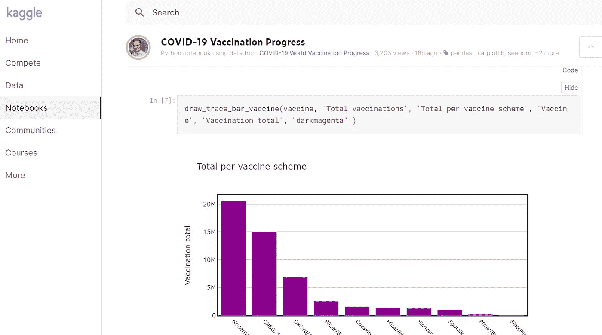
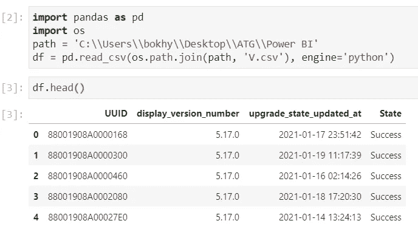
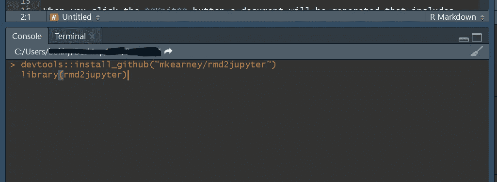
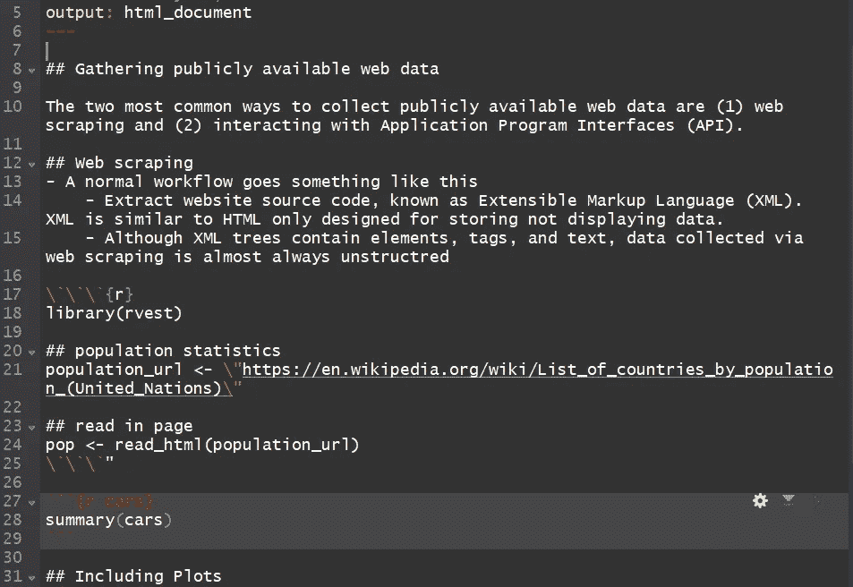
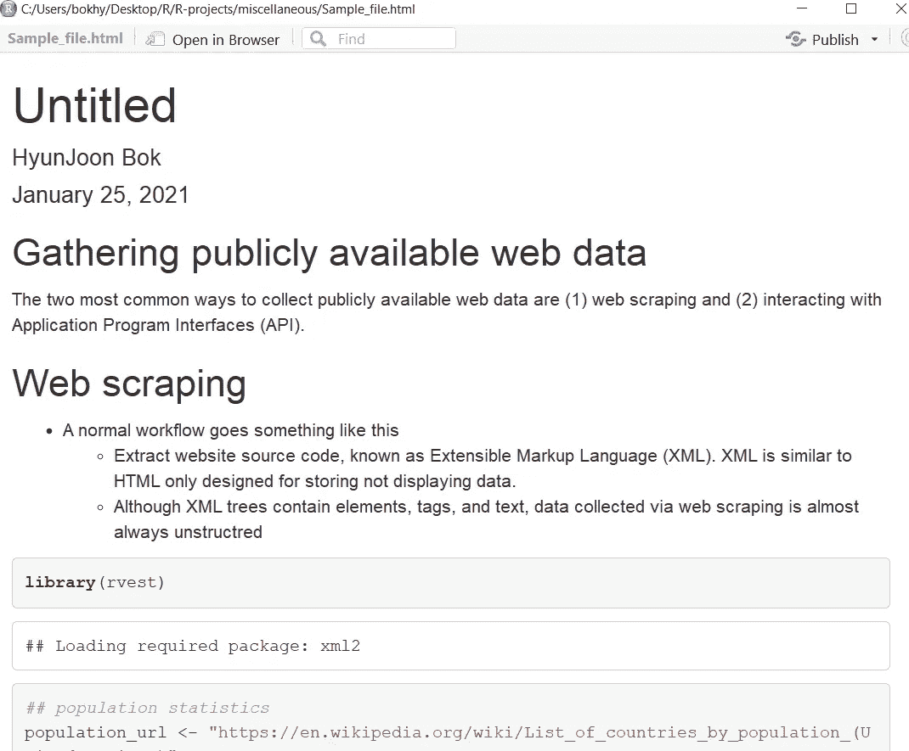
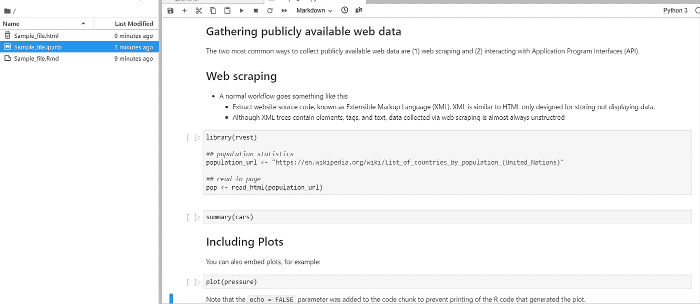

# 转变你的。Rmd 至。ipynb 文件(R Markdown to Python Jupyter)

> 原文：<https://medium.datadriveninvestor.com/transforming-your-rmd-to-ipynb-file-r-markdown-to-python-jupyter-b1306646f50b?source=collection_archive---------1----------------------->

## 帮助您将文件从 R 转换到 Python 的指南


Photo by [Franki Chamaki](https://unsplash.com/@franki?utm_source=medium&utm_medium=referral) on [Unsplash](https://unsplash.com?utm_source=medium&utm_medium=referral)

作为一名数据专家，我敢说您至少已经用 R 和 Python 构建了自己的工作空间。毫无疑问。我保证每个自称为数据分析师/业务分析师/数据科学家的人都至少接触过其中一种。对我来说，大学四年都是 R。我过去(现在仍然)更熟悉 R 语言语法和数据处理工作流(例如，在什么情况下使用哪个包)。

当您查看 Kaggle 以完善您的数据分析/数据科学技能时，您可能已经注意到许多常见的共享项目及其代码块都是以 Jupyter Notebook 的格式上传的。ipynb)。



[https://www.kaggle.com/gpreda/covid-19-vaccination-progress](https://www.kaggle.com/gpreda/covid-19-vaccination-progress)

这是因为 Kaggle 网站(www.kaggle.com)支持 Jupyter 笔记本(。ipynb)格式，所以你在自己的笔记本电脑上运行的代码、图表或图形可以在上传到这些网站时准确地显示在任何其他人的浏览器中。大多数其他网站也是如此。这有很大的不同，因为理解和执行结果应该与代码集一起，以充分理解 ceratin 代码生成的内容。

例如，假设您在 Python 中使用 Pandas 库，并且使用“df.head()”显示数据集不会在您的笔记本上生成任何可视化内容。你将很难理解这些数据及其形状。


Bad example

下面的例子是你在运行代码时想要看到的。



Good example

我再给你举个例子。

上传自己的 R 文件时(要么。r 或。Rmd)到 Github，

它没有以视觉上令人愉快的方式呈现 R Markdown，因此更难检查代码和结果。
**简单来说，Github 中不支持 Markdown 语法。**


在 R 中，有一个名为“reticulate”的包，它为 python 和 R 之间的互操作性提供了一套全面的工具。这基本上可以帮助 Python 用户在 R 控制台中编写 Python 代码，以便查询可以在 R 项目中运行。

然而，这篇文章并不适合那些编写 Python 代码的人。它面向那些更习惯 R 语法和用法，但对 Python 或 Jupyter notebook 不太熟悉的人。在这里，您将学习如何将. Rmd (R markdown)文件转换成。ipynb (Jupyter Notebook)文件，以便在分析和可视化方面为您提供更多功能。


[http://web.humoruniv.com/board/humor/read.html?table=pds&number=890081](http://web.humoruniv.com/board/humor/read.html?table=pds&number=890081)

# 问题陈述

每当你查看一个有代码的数据科学文件时，它很可能是用 Markdown online 编写的(要么是 kaggle，要么是 github)

**Markdown** 是一种[轻量级标记语言](https://en.wikipedia.org/wiki/Lightweight_markup_language)，用于使用[纯文本编辑器](https://en.wikipedia.org/wiki/Text_editor)创建[格式化文本](https://en.wikipedia.org/wiki/Formatted_text)。更多信息，请看这里([https://en.wikipedia.org/wiki/Markdown](https://en.wikipedia.org/wiki/Markdown))

R 支持将 R 代码包装成 Markdown 文件的特性，这样我就可以显示并生成高质量的报告，与观众分享。

# 步伐

# 1.安装软件包

从 R studio 控制台中的 devtools 安装包，如下所示。(如果没有 devtools，请先安装)

```
devtools::install_github("mkearney/rmd2jupyter")
library(rmd2jupyter)
```



# 2.准备或创建. Rmd (R Markdown)文件

然后你需要准备一个 R markdown 文件，你想转换成 Jupyter 笔记本。
这里我准备了一个 Rmd 示例文件，其中有足够的 Markdown 语法，用于演示目的。



如果您将这个文件编织成 HTML(最初以 HTML 的形式查看文件的格式)，您将会看到以下内容。



# 3.转换文件

如果您运行`rmd2jupyter("sample_file.Rmd")`，您应该看到在您的工作目录中创建了相同的 Jupyter 笔记本文件，标题为**“Sample _ file . ipynb”**

*注意:文件名需要用引号(" ")括起来


# 4.检查它是否真的转换了

好的。现在我们看到 R Markdown 文件被转换成 Python 文件。让我们看看它看起来怎么样。

在 Jupyter 笔记本或 Jupyter 实验室打开文件，可以看到文件被正确转换！多么神奇！！！

所有代码块都在代码单元中，文本放在降价单元中。



非常感谢你阅读这篇文章！如果你认为内容是富有成效的，我会感谢任何支持(分享/喜欢)或鼓掌(👏🏼)按钮很下面。

# 关于作者

贤俊是一名数据分析师。他拥有加州大学洛杉矶分校的统计学学位。他是一名数据爱好者，喜欢分享数据科学/分析知识。
在 [LinkedIn](https://www.linkedin.com/in/hyunjoonbok/) 上联系他或者在 [Github](https://github.com/hyunjoonbok) 上查看他的工作。

# 参考

[](https://laptrinhx.com/convert-rmd-rmarkdown-to-ipynb-jupyter-notebook-574451390/) [## 将 Rmd (rmarkdown)转换为 ipynb (Jupyter 笔记本)

### 转换 Rmd (rmarkdown)为 ipynb (Jupyter notebook)用户星级:13 用户分叉:2 用户观看:13 更新于…

laptrinhx.com](https://laptrinhx.com/convert-rmd-rmarkdown-to-ipynb-jupyter-notebook-574451390/)  [## Rmd 파일을 ipynb파일로 변환시켜보자 - 미완성의신

### 한국의 대이터 분석 경연대회인 Dacon이라는 곳이 있다.Dacon에서의 제출 방식은 현재。태블로이고이중ipynb。ipynb는 R/Python모두를 지원하고 있다.기존에r을쓰는사람에게서…그러나

un finished good . net lify . app](https://unfinishedgod.netlify.app/2020/12/27/r-rmd-%ED%8C%8C%EC%9D%BC%EC%9D%84-ipynb%ED%8C%8C%EC%9D%BC%EB%A1%9C-%EB%B3%80%ED%99%98%EC%8B%9C%EC%BC%9C%EB%B3%B4%EC%9E%90/)