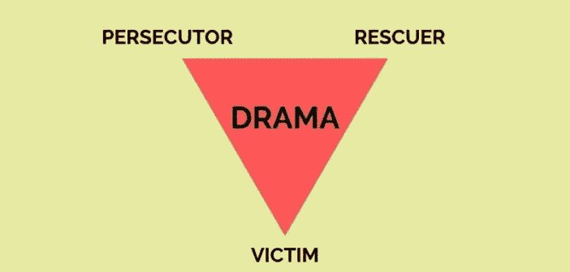

# 被困在戏剧三角里？需要识别和避免的 3 个角色

> 原文：<https://medium.datadriveninvestor.com/trapped-in-a-drama-triangle-three-roles-to-recognise-and-avoid-a2d1d911e998?source=collection_archive---------2----------------------->

## 运用这些关键原则，让你的工作生活更加平静

Photo by [Jonathan Borba](https://unsplash.com/@jonathanborba?utm_source=medium&utm_medium=referral) on [Unsplash](https://unsplash.com?utm_source=medium&utm_medium=referral)

你是否觉得自己被拖入工作场所的争论、争执和对抗比你认为的健康要多？

如果你有一种不安的感觉，觉得你的工作生活中总会发生某种戏剧，或者你被冲突和“情况”所包围——这可能不是因为你运气不好，或者是环境的受害者，或者碰巧被不合理的人所包围。

讽刺的是，你可能无意中制造了一场戏剧，只是努力避免而已。

我知道，因为这正是我以前做的。这也是我第一次被介绍给卡普曼经常引用的“戏剧三角”的原因。几年前，当我在工作场所讨论一个让我焦虑和恼怒的情况时，一位顾问告诉了我这件事。我想在谈到我的一位同事时，我甚至用了“扮演受害者”这个词。

我的辅导员耐心地听完了我的话，然后她告诉了我下图所示的戏剧三角。在那次咨询中，我的“家庭作业”是思考我抱怨过的具体冲突，并让我的同事们适应他们的角色——此外，重要的是，不要回避确定我自己在这一场景中的位置，并助长了戏剧性的火焰。

【aconstantrethink.com】(图片来源:T2)

自从那次介绍之后，我发现斯蒂芬·卡普曼的简单图表(他[大约 40 年前在研究交易分析](https://lindagraham-mft.net/triangle-victim-rescuer-persecutor-get/)时创建的)在我生活的许多领域都非常有用。一旦认识到这一点，就可以清楚地看到它无处不在。

理解人类行为在冲突情况下的可预测性，以及如何打破这种循环，已经成为一种非常有用的分析技能。当我在冲突的情况下考虑和改变自己的行为时，我用它产生了很大的效果。

那么它是如何工作的呢？

# 1.定义你的戏剧

很明显，卡普曼三角中的关键词是图上最大的一个:“戏剧”。

迫害者**、**受害者**和**营救者**角色之间的联系将会完全瓦解，而没有某种“场景”作为其核心。这种戏剧性事件通常以无效冲突的形式出现，这种冲突会很快对各方造成破坏性影响，并通常会形成恶性循环。**

这种戏剧可以有多种形式。这可能是一连串消极攻击的电子邮件，也可能是面对面的争论。例如，可能是在办公室厨房或聚会的角落里的一次安静的谈话。

# 2.找出这三个角色

这里没有一个角色是逐字描述的。这些标题被故意夸大了。这个三角关系不能用来降低真正的虐待或欺凌的受害者的经历的有效性，也不能用来为肇事者开脱。

没有人真正“迫害”受害者，也没有真正的“救援者”伸出救命稻草。这些描述指的是三角动态中的每个参与者*如何看待他们自己的位置*。(因此，短语“扮演受害者”的真正有效性)。

此外，值得注意的是，卡普曼本人明确表示，他的工作和话语与**过度**、**破坏性**戏剧有关，这些戏剧对参与者来说是**破坏性**。没有人建议我们都应该回避健康的冲突或互动。

 [## 成功人生的 25 种自我提升方式|数据驱动的投资者

### “我活得越久，学到的就越多。学的越多，体会的越多，知道的越少。”―米切尔·莱格兰德时间到…

www.datadriveninvestor.com](https://www.datadriveninvestor.com/2019/03/12/25-self-improvement-ways-for-a-successful-life/) 

讨论、分歧和解决冲突是至关重要的技能，它们对于我们如何以令人满意的方式一起生活是必要的。但持续的攀比心理、“玩指责游戏”和“扮演受害者”可能会形成对任何人都没有好处的恶性循环。这些剧的爆发，令人耳目一新，自由自在。

话虽如此，以下是描述:

## **迫害者**

迫害者是传统的“反派”。通常，迫害者有一种自以为是的神情，并且坚信他或她自己是对的。他或她会固执己见，真的害怕被视为“让步”或“成为受害者”。因为迫害者讨厌被视为弱者，这种不妥协的态度可以为这场戏剧的展开定下基调。

迫害者可能会批评、斥责他们的同事、朋友或伴侣，并最终因他们的僵化而疏远他们。

## **受害者**

受害者的默认信念是他们被挑出来攻击，或者他们在面对迫害者的一心一意时无能为力。这可能会增加他们以典型的受害者方式做出反应的倾向。

他们可能会形容自己“超级敏感”；他们可能会说，他们无法控制对事物的深刻感受，他们情绪化，感情过于强烈，他们无法承受冲突。他们认为自己无能为力。

## **救人者**

救援人员*需要受害者救援*。这是他们最好的工作方式。他们喜欢介入并提供帮助——有时是以牺牲自己的福祉为代价——但他们也喜欢被人看到提供帮助。此外，如果他们帮助的人实际上有所改善或不再需要他们的帮助，这也不符合他们的叙述。

于是，救援者可能下意识地让受害者保持他们的角色，以便对他们自己的救援者姿态和它如何“帮助”感觉更好。与此同时，他们可能会抱怨工作过度和不受重视。

对这些角色的赤裸裸的描述听起来过于戏剧化，当然没有什么像职位的简洁标题所暗示的那样清晰，但大多数破坏性的关系冲突都会涉及一种沿着卡普曼确定的路线移动的三角关系。

角色可以相互转换和循环。它们不是固定的。参与者可以螺旋式上升，随着剧情的展开交换角色。在我自己的生活中，我一次又一次地观察到当根本不需要我参与的时候，我试图成为一个救援者的倾向。我来帮你吧！”然后，当我的求爱被拒绝后，我重新扮演受害者的角色。(*“但我只是想帮忙！”*)

然而，当戏剧中的参与者陷入循环时，真正的解决是不可能的。

Photo by [Tim Gouw](https://unsplash.com/@punttim?utm_source=medium&utm_medium=referral) on [Unsplash](https://unsplash.com?utm_source=medium&utm_medium=referral)

# 3.打破锁链

> [一个人可以通过理解他们正在参与，他们适合什么角色，他们为什么参与，以及他们可以采取什么措施来改变他们在这种动态中的看法和行动，来摆脱戏剧三角的循环。](https://www.aconsciousrethink.com/9667/karpman-drama-triangle/) —杰克·诺兰

然而，如何结束这出徒劳无功的戏剧，并从其中明确定义的角色中走出来呢？

通常，打破这个循环最简单的方法就是*打破*。静止不动，在你站立的地方折断链子。如果我剧中的迫害者对我说“你怎么敢质疑我的权威？我的路是对的！”然后，而不是成为受害者“没有人听我的！”我可以-别说了。“好吧。你最了解这个案子。这次我们要按你的方式做事。”

作为一名律师，我管理着一个由其他法律人员组成的小团队，我们分散在不同的分支机构。因此，我们最常通过电子邮件交流，我们都不陌生“回复所有人”。

学习卡普曼三角及其典型角色最有效的副产品之一是，当我收到一封我认为是对我领导能力的攻击或对我所做工作的批评的群发邮件时，我现在会强迫自己后退一步，喘口气。

在过去，我可能很快就进入了迫害者的角色。我是你的老板！我的路才是正道！”)或者受害者(*“你完全误解了我的观点。我不知道如果你打算完全无视这些政策，我为什么还要费心去实施它们。*

我甚至可能会站出来为我的同事辩护，说我是一个被误导的救援者，因为我渴望被视为有所帮助而削弱了他们自己的地位，并卷入了一场与我无关的戏剧。

成为休息是解除循环中其他参与者的武装。它停止了破坏性的谈话。它结束了这场戏剧。它创造了一个停顿。

***不是每一次对话都必须是冲突；不是所有的冲突都是对抗。***

而这往往就是所需要的一切。喘口气，退一步，花点时间思考一下形势的发展。这看似简单，但具有欺骗性，因为在最激烈的时刻，这非常困难。感觉就是投降。

我的建议是关闭邮箱或文本框；或者从面对面的谈话中抽出一分钟，也许是去泡一杯茶，或者拉上窗帘，或者做一些这样的无意义的小事。

这可能会让人觉得不自然和可笑，但就像写作中的休息可以让你以全新的视角回到文章中时有更好的草稿一样，一部不断升级的戏剧中最小的休息也可以创造空间，让你看得更清楚。

此外，它允许其他人确立他们的角色，在你不在的时候给他们回应的空间。这意味着你可以选择**而不是**来代替你在第三个角色中的位置:然后，就没有三角形了。

在你自己的生活中，可能需要一段时间来研究这些模式。五年过去了，我仍在观察和努力在我的任何一部戏剧中扮演我自己的角色。不舒服！但是没有多少有价值的改变是真正令人舒服的。

我们中的许多人，通过我们的成长或我们的生活经历，有一种根深蒂固的倾向，很快转向戏剧三角的要点，甚至下意识地认为戏剧是话语的必要部分。它几乎让人上瘾，即使我们声称厌恶它。

但是通过吸一口气，保持静止，停留在三角形的中心而不选择它的一个点，这个不健康的三角形就不会形成。相反，它变成了一条线。这是一个开始。因此，这条线可以被塑造成未来更健康的图表。

少一些戏剧性的工作生活总是会更快乐、更有成效。

## 访问专家视图— [订阅 DDI 英特尔](https://datadriveninvestor.com/ddi-intel)